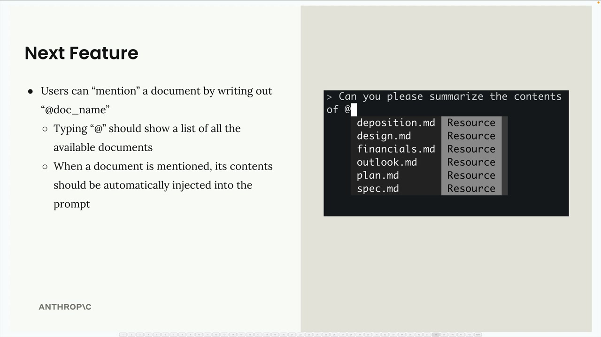
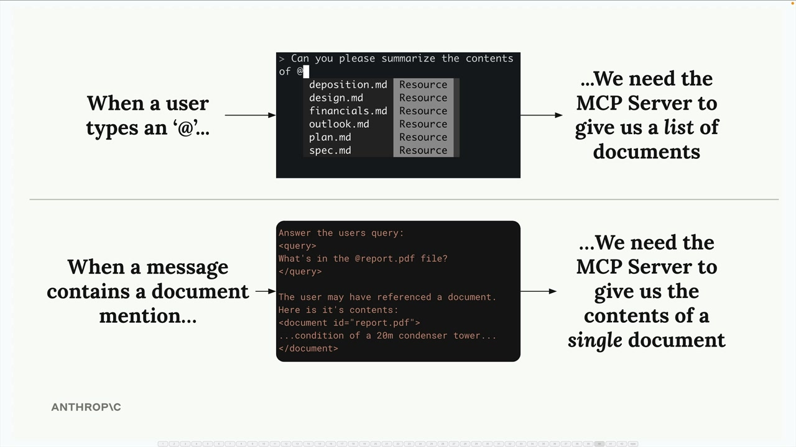
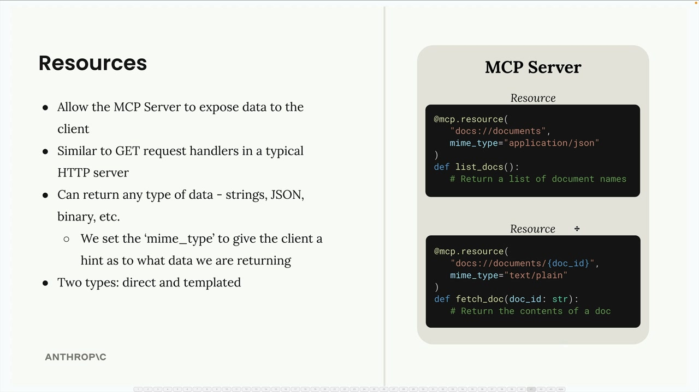
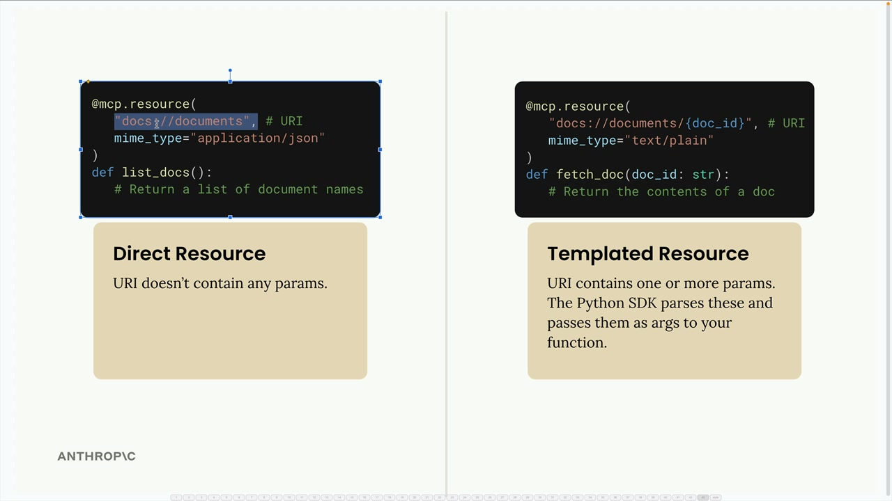
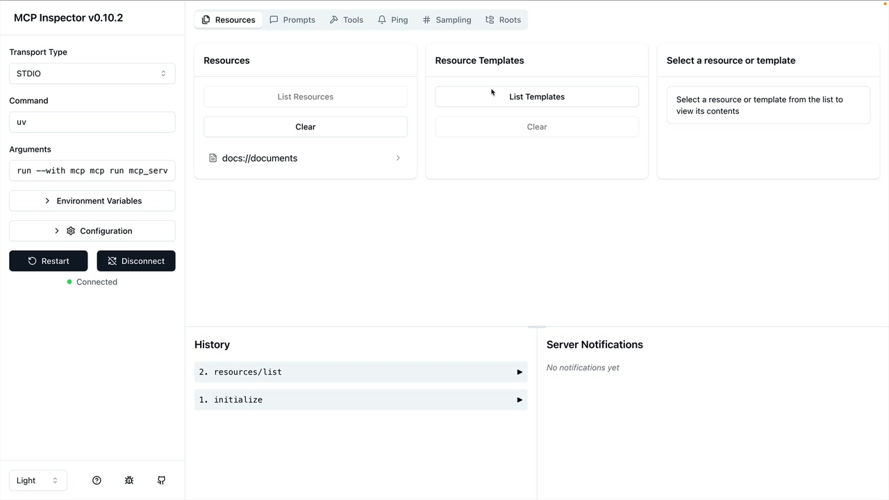
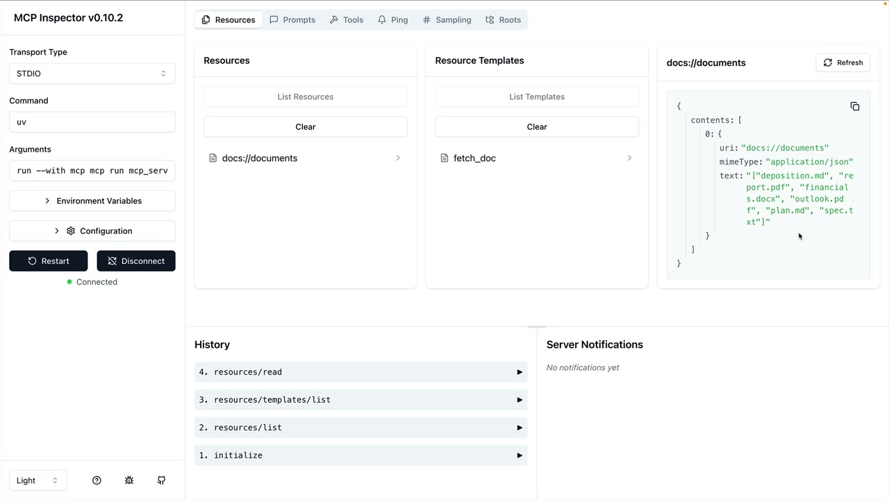

# Defining resources

> Source: https://anthropic.skilljar.com/claude-with-the-anthropic-api/287782

#### Summary


                            
                                

Resources in MCP servers allow you to expose data to clients, similar to GET request handlers in a typical HTTP server. They're perfect for scenarios where you need to fetch information rather than perform actions.


## Understanding Resources Through an Example


Let's say you want to build a document mention feature where users can type `@document_name` to reference files. This requires two operations:


- Getting a list of all available documents (for autocomplete)

- Fetching the contents of a specific document (when mentioned)





When a user types `@`, you need to show available documents. When they submit a message with a mention, you automatically inject that document's content into the prompt sent to Claude.





## How Resources Work


Resources follow a request-response pattern. Your client sends a `ReadResourceRequest` with a URI, and the MCP server responds with the data. The URI acts like an address for the resource you want to access.





## Types of Resources


There are two types of resources:





- **Direct Resources:** Static URIs that don't change, like `docs://documents`

- **Templated Resources:** URIs with parameters, like `docs://documents/{doc_id}`


For templated resources, the Python SDK automatically parses parameters from the URI and passes them as keyword arguments to your function.


## Implementing Resources


Resources are defined using the `@mcp.resource()` decorator. Here's how to create both types:


### Direct Resource (List Documents)


```
@mcp.resource(
    "docs://documents",
    mime_type="application/json"
)
def list_docs() -> list[str]:
    return list(docs.keys())
```


### Templated Resource (Fetch Document)


```
@mcp.resource(
    "docs://documents/{doc_id}",
    mime_type="text/plain"
)
def fetch_doc(doc_id: str) -> str:
    if doc_id not in docs:
        raise ValueError(f"Doc with id {doc_id} not found")
    return docs[doc_id]
```


## MIME Types


Resources can return any type of data - strings, JSON, binary, etc. The `mime_type` parameter gives clients a hint about what kind of data you're returning:


- `application/json` - Structured JSON data

- `text/plain` - Plain text content

- Any other valid MIME type for different data formats


The MCP Python SDK automatically serializes your return values. You don't need to manually convert to JSON strings.


## Testing Resources


You can test your resources using the MCP Inspector. Run your server with:


```
uv run mcp dev mcp_server.py
```


Then connect to the inspector in your browser. You'll see:





- **Resources:** Lists your direct/static resources

- **Resource Templates:** Shows templated resources that accept parameters


Click on any resource to test it and see the exact response structure your client will receive.





## Key Points


- Resources expose data, tools perform actions

- Use direct resources for static data, templated resources for parameterized queries

- MIME types help clients understand response format

- The SDK handles serialization automatically

- Parameter names in templated URIs become function arguments


Resources provide a clean way to make data available to MCP clients, enabling features like document mentions, file browsing, or any scenario where you need to fetch information from your server.