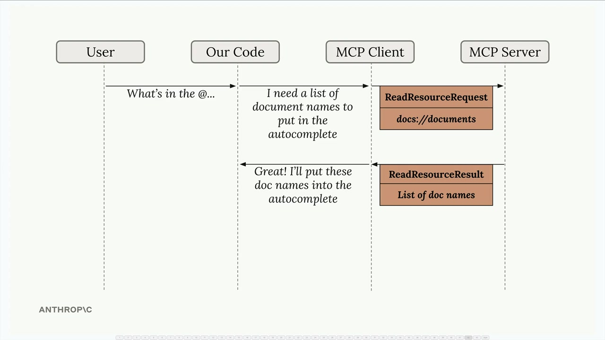
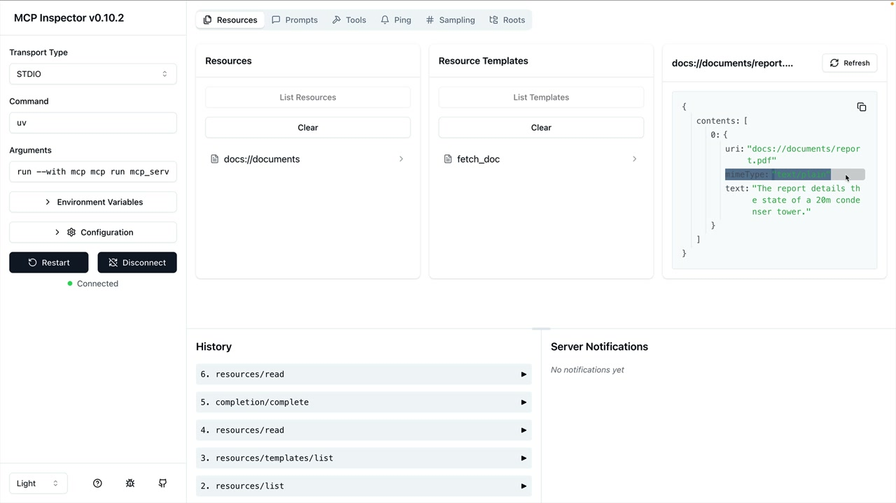

# Accessing resources

> Source: https://anthropic.skilljar.com/claude-with-the-anthropic-api/287783

#### Summary


                            
                                

Resources in MCP allow your server to expose data that can be directly included in prompts, rather than requiring tool calls to access information. This creates a more efficient way to provide context to AI models like Claude.


## Understanding Resource Requests


When you've defined resources on your MCP server, your client needs a way to request and use them. The client acts as a bridge between your application and the MCP server, handling the communication and data parsing automatically.





The flow is straightforward: when a user wants to reference a document (like typing "@report.pdf"), your application uses the MCP client to fetch that resource from the server and include its contents directly in the prompt sent to Claude.


## Implementing Resource Reading


The core functionality requires a `read_resource` function in your MCP client. This function takes a URI parameter identifying which resource to fetch:


```
async def read_resource(self, uri: str) -> Any:
    result = await self.session().read_resource(AnyUrl(uri))
    resource = result.contents[0]
```


The response from the MCP server contains a `contents` list. You typically only need the first element, which contains the actual resource data along with metadata like the MIME type.


## Handling Different Content Types


Resources can return different types of content, so your client needs to parse them appropriately. The MIME type tells you how to handle the data:


```
if isinstance(resource, types.TextResourceContents):
    if resource.mimeType == "application/json":
        return json.loads(resource.text)
    
    return resource.text
```


This approach ensures that JSON resources are properly parsed into Python objects, while plain text resources are returned as strings. The MIME type acts as your hint for determining the correct parsing strategy.


## Required Imports


To make this work properly, you'll need these imports in your MCP client:


```
import json
from pydantic import AnyUrl
```


The `json` module handles parsing JSON responses, while `AnyUrl` ensures proper type handling for the URI parameter.


## Testing Resource Access


Once implemented, you can test the functionality through your CLI application. When you type something like "What's in the @report.pdf document?", the system should:


- Show available resources in an autocomplete list

- Allow you to select a resource

- Fetch the resource content automatically

- Include that content in the prompt to Claude





The key advantage is that Claude receives the document content directly in the prompt, eliminating the need for tool calls to access the information. This makes interactions faster and more efficient.


## Integration with Your Application


Remember that the MCP client code you write gets used by other parts of your application. The `read_resource` function becomes a building block that other components can call to fetch document contents, list available resources, or integrate resource data into prompts.


This separation of concerns keeps your code clean: the MCP client handles communication with the server, while your application logic focuses on how to use that data effectively.