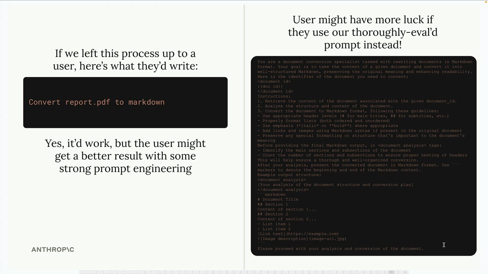
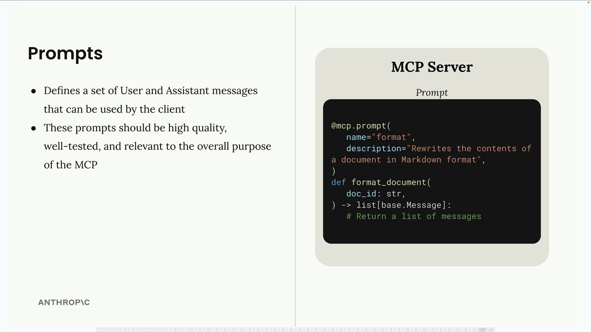
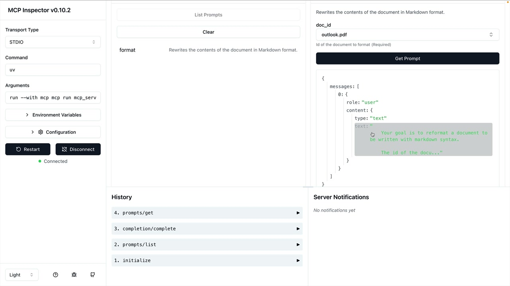

# Defining prompts

> Source: https://anthropic.skilljar.com/claude-with-the-anthropic-api/287784

#### Summary


                            
                                

Prompts in MCP servers let you define pre-built, high-quality instructions that clients can use instead of writing their own prompts from scratch. Think of them as carefully crafted templates that give better results than what users might come up with on their own.


## Why Use Prompts?


Let's say you want Claude to reformat a document into markdown. A user could just type "convert report.pdf to markdown" and it would work fine. But they'd probably get much better results with a thoroughly tested prompt that includes specific instructions about formatting, structure, and output requirements.





The key insight is that while users can accomplish these tasks on their own, they'll get more consistent and higher-quality results when using prompts that have been carefully developed and tested by the MCP server authors.


## How Prompts Work


Prompts define a set of user and assistant messages that clients can use directly. When a client requests a prompt, your server returns a list of messages that can be sent straight to Claude.





The basic structure looks like this:


- Define prompts using the `@mcp.prompt()` decorator

- Add a name and description for each prompt

- Return a list of messages that form the complete prompt

- These prompts should be high quality, well-tested, and relevant to your MCP server's purpose


## Building a Format Command


Here's how to implement a document formatting prompt. First, you'll need to import the base message types:


```
from mcp.server.fastmcp import base
```


Then define your prompt function:


```
@mcp.prompt(
    name="format",
    description="Rewrites the contents of the document in Markdown format."
)
def format_document(
    doc_id: str = Field(description="Id of the document to format")
) -> list[base.Message]:
    prompt = f"""
Your goal is to reformat a document to be written with markdown syntax.

The id of the document you need to reformat is:

{doc_id}


Add in headers, bullet points, tables, etc as necessary. Feel free to add in extra formatting.
Use the 'edit_document' tool to edit the document. After the document has been reformatted...
"""
    
    return [
        base.UserMessage(prompt)
    ]
```


## Testing Your Prompts


You can test prompts using the MCP Inspector. Navigate to the Prompts section, select your prompt, and provide any required parameters. The inspector will show you the generated messages that would be sent to Claude.





This lets you verify that your prompt interpolates variables correctly and produces the expected message structure before using it in a real application.


## Best Practices


When creating prompts for your MCP server:


- Focus on tasks that are central to your server's purpose

- Write detailed, specific instructions rather than vague requests

- Test your prompts thoroughly with different inputs

- Include clear descriptions so users understand what each prompt does

- Consider how the prompt will work with your server's tools and resources


Remember that prompts are meant to provide value that users couldn't easily get on their own - they should represent your expertise in the domain your MCP server covers.