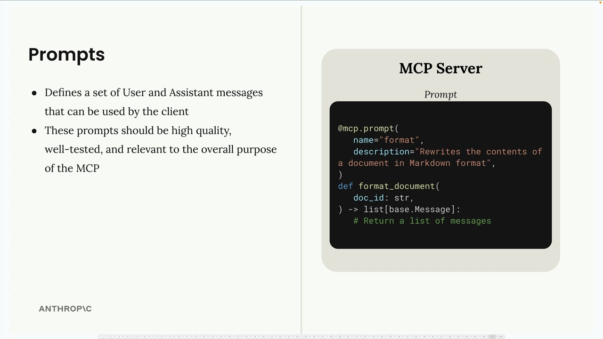
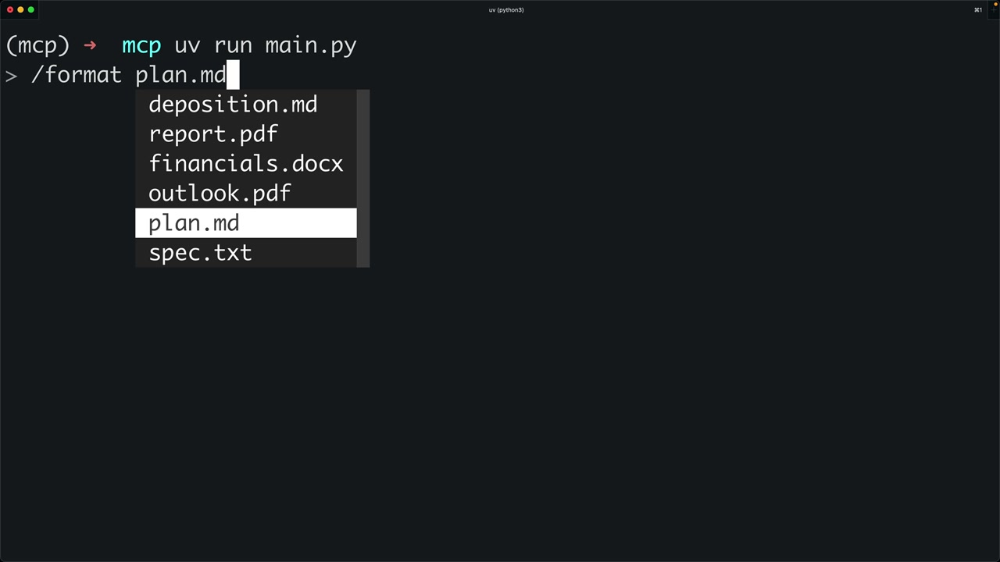
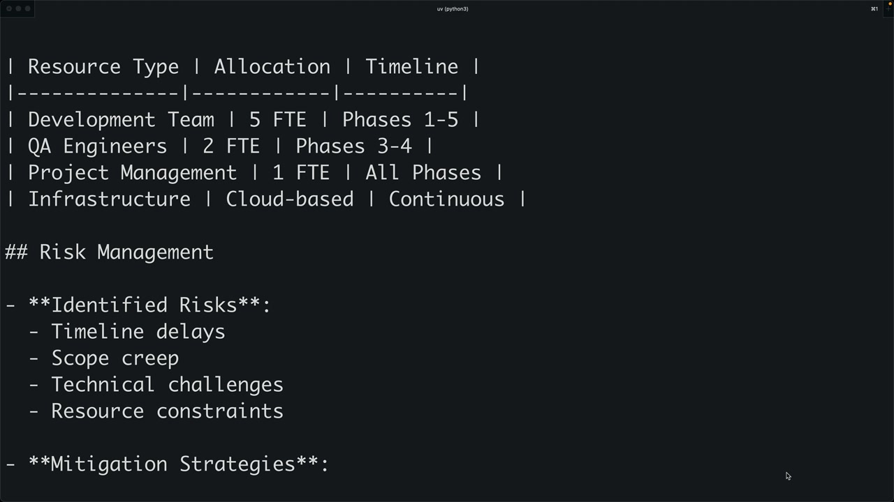

# Prompts in the client

> Source: https://anthropic.skilljar.com/claude-with-the-anthropic-api/287786

#### Summary


                            
                                

Prompts in MCP define a set of user and assistant messages that can be used by the client. These prompts should be high quality, well-tested, and relevant to the overall purpose of the MCP server.





## Implementing List Prompts


The first step is implementing the `list_prompts` method in your MCP client. This method retrieves all available prompts from the server:


```
async def list_prompts(self) -> list[types.Prompt]:
    result = await self.session().list_prompts()
    return result.prompts
```


This simple implementation calls the session's `list_prompts` method and returns the prompts array from the result.


## Getting Individual Prompts


The `get_prompt` method retrieves a specific prompt with arguments interpolated into it. When you request a prompt, you provide arguments that get passed to the prompt function as keyword arguments:


```
async def get_prompt(self, prompt_name, args: dict[str, str]):
    result = await self.session().get_prompt(prompt_name, args)
    return result.messages
```


The method returns the messages from the result, which form a conversation that can be fed directly into Claude.


## How Prompt Arguments Work


When you define a prompt function on the server side, it can accept parameters. For example, a document formatting prompt might expect a `doc_id` parameter:


```
def format_document(doc_id: str):
    # The doc_id gets interpolated into the prompt
```


When the client calls `get_prompt`, the arguments dictionary should contain the expected keys. The MCP server will pass these as keyword arguments to the prompt function, allowing dynamic content to be inserted into the prompt template.


## Testing Prompts in the CLI


Once implemented, you can test prompts through the command-line interface. When you type a forward slash, available prompts appear as commands. Selecting a prompt may prompt you to choose from available options (like document IDs), and then the complete prompt gets sent to Claude.





The workflow looks like this:


1. User selects a prompt (like "format")

1. System prompts for required arguments (like which document to format)

1. The prompt gets sent to Claude with the interpolated values

1. Claude can then use tools to fetch additional data and complete the task





## Prompt Best Practices


When creating prompts for your MCP server:


- Make them relevant to your server's purpose

- Test them thoroughly before deployment

- Use clear, specific instructions

- Design them to work well with your available tools

- Consider what arguments users will need to provide


Prompts bridge the gap between predefined functionality and dynamic user needs, giving Claude structured starting points for complex tasks while maintaining flexibility through parameterization.