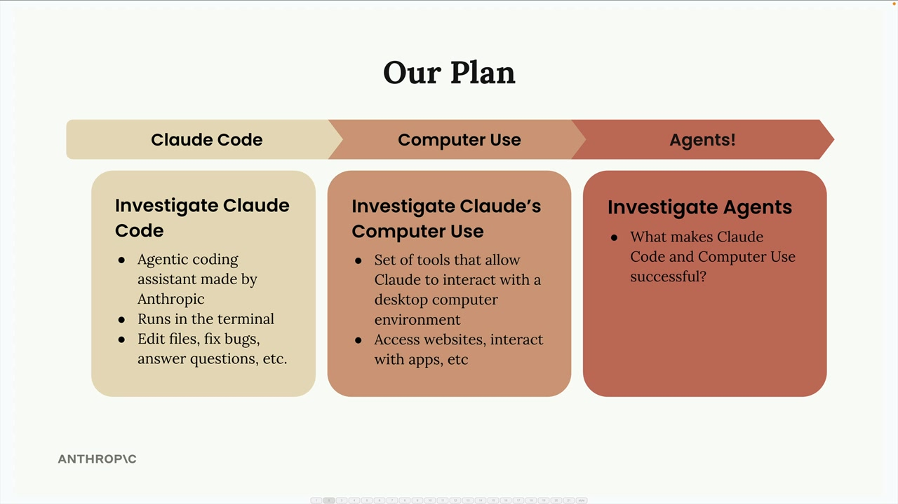

# Anthropic apps

> Source: https://anthropic.skilljar.com/claude-with-the-anthropic-api/287787

#### Summary

                            
                                

In this module, we'll explore two powerful applications built by Anthropic: Claude Code and Computer Use. These aren't just useful tools on their own - they're perfect examples of AI agents in action. By understanding how they work, you'll get a solid foundation for building your own agents later.

## Our Plan

We'll follow a progression that builds your understanding step by step:

- **Claude Code** - Start with this agentic coding assistant that runs in your terminal

- **Computer Use** - Explore this set of tools that lets Claude interact with desktop applications

- **Agents** - Understand what makes these applications successful as agents

## Claude Code

Claude Code is a terminal-based coding assistant that can help you with various programming tasks. Think of it as having Claude available right in your command line, ready to:

- Edit files and fix bugs

- Answer coding questions

- Help with development workflows

We'll walk through the complete setup process and then use Claude Code on a small sample project so you can see exactly how it operates in practice.

## Computer Use

Computer Use takes Claude's capabilities much further. It's a collection of tools that allow Claude to interact with a full desktop computer environment. This means Claude can:

- Access websites and browse the internet

- Interact with desktop applications

- Perform tasks that require visual interface navigation

This dramatically expands what's possible compared to text-only interactions.

## Why These Matter for Agents

Both Claude Code and Computer Use serve as excellent case studies for understanding agents. They demonstrate key principles that make agents effective:

- Tool integration and usage

- Multi-step task execution

- Environmental interaction

- Autonomous problem-solving

By examining these real-world implementations, you'll gain insights into what makes Claude Code and Computer Use successful, which will inform your own agent development work.

Let's start with the setup process for Claude Code in the next section.