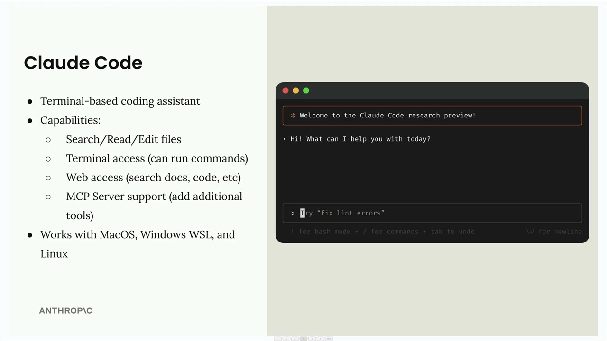
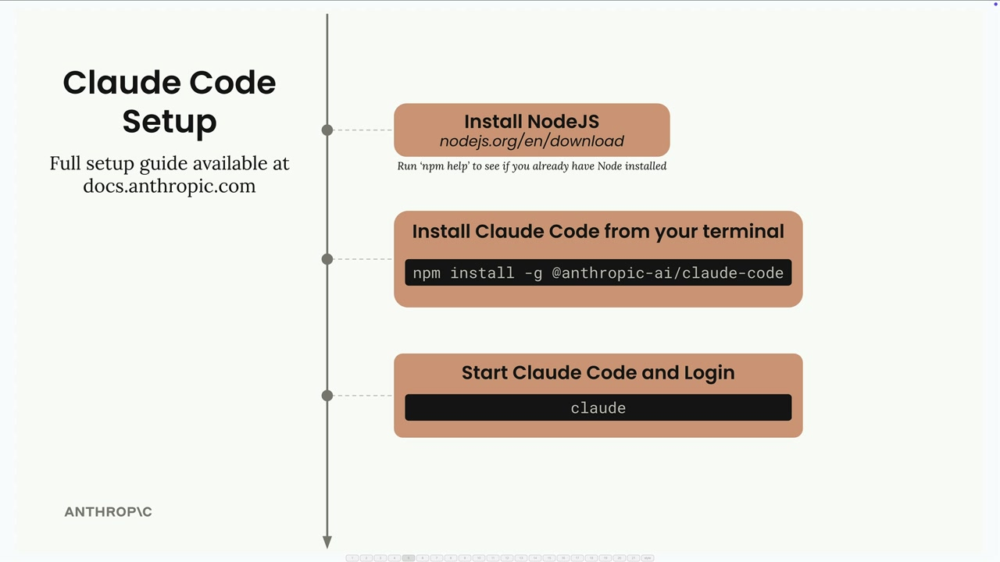

# Claude Code setup

> Source: https://anthropic.skilljar.com/claude-with-the-anthropic-api/287788

#### Summary

                            
                                

Claude Code is a terminal-based coding assistant that runs directly in your command line. Think of it as having Claude available right in your terminal to help with any coding task you're working on.

## What Claude Code Can Do

Claude Code comes with a comprehensive set of tools to help with your development workflow:

- **File operations** - Search, read, and edit files in your project

- **Terminal access** - Run commands directly from the conversation

- **Web access** - Search documentation, fetch code examples, and more

- **MCP Server support** - Add additional tools by connecting MCP servers

The MCP integration is particularly powerful because it means you can extend Claude Code's capabilities by adding specialized tools for databases, APIs, or any other services you work with.

Claude Code works across MacOS, Windows WSL, and Linux, so you can use it regardless of your development environment.

## Installation

Getting Claude Code set up takes just three steps:

1. **Install Node.js** from nodejs.org/en/download (check if you already have it by running `npm help` in your terminal)

1. **Install Claude Code** with the command: `npm install -g @anthropic-ai/claude-code`

1. **Start and login** by running `claude` in your terminal

When you run the `claude` command for the first time, it will prompt you to log in to your Anthropic account. The full setup guide is available at docs.anthropic.com if you need more detailed instructions.

Once you're set up, you'll have Claude available directly in your terminal, ready to help with any coding project or task you're working on.