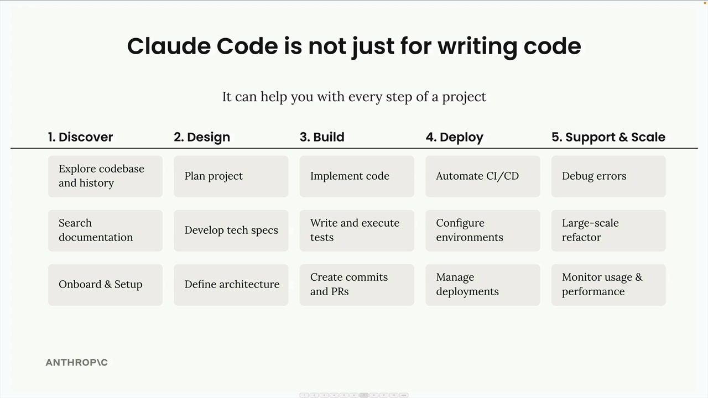
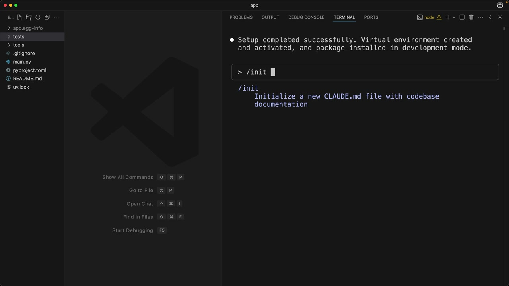
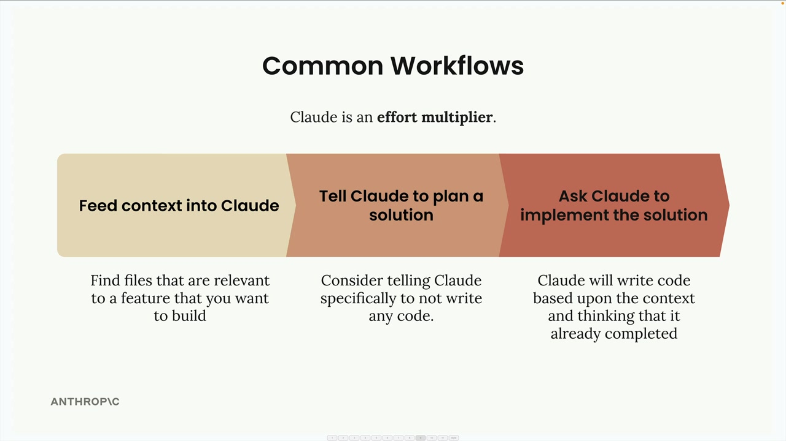
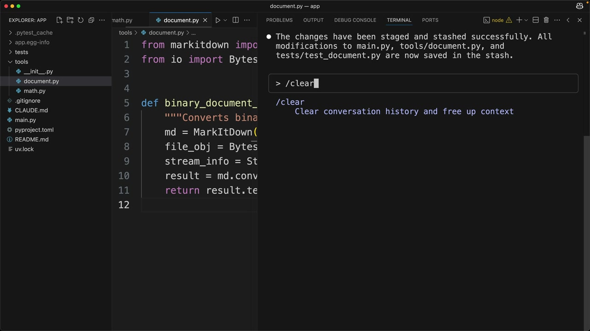

# Claude Code in action

> Source: https://anthropic.skilljar.com/claude-with-the-anthropic-api/287805

#### Summary


                            
                                

Claude Code isn't just a tool for writing code - it's designed to work alongside you throughout every phase of a software project. Think of it as another engineer on your team who can handle everything from initial setup to deployment and support.





## The /init Command


When you start working with Claude Code on a project, the first thing you'll want to do is run the `/init` command. This tells Claude to scan your entire codebase and understand your project's structure, dependencies, coding style, and architecture.


Claude summarizes everything it learns in a special file called `CLAUDE.md`. This file automatically gets included as context in all future conversations, so Claude remembers important details about your project.


You can have multiple CLAUDE.md files for different scopes:


- **Project** - Shared between all engineers working on the project

- **Local** - Your personal notes that aren't checked into git

- **User** - Used across all your projects


When running `/init`, you can add special directions for areas you want Claude to focus on. The generated file will include build commands, coding guidelines, and project-specific patterns that Claude should follow.





You can also quickly add notes to your CLAUDE.md file using the `#` command. For example, typing `# Always use descriptive variable names` will prompt you to add this guideline to your project, local, or user memory.


## Common Workflows


Claude works best when you approach it as an effort multiplier. The more context and structure you provide, the better results you'll get. Here's the most effective workflow:





### Step 1: Feed Context into Claude


Before asking Claude to build something, identify files in your codebase that are relevant to the feature you want to create. Ask Claude to read and analyze these files first. This gives Claude examples of your coding patterns and existing functionality it can build upon.


### Step 2: Tell Claude to Plan a Solution


Instead of jumping straight to implementation, ask Claude to think through the problem and create a plan. Tell Claude specifically not to write any code yet - just focus on the approach and steps needed.


### Step 3: Ask Claude to Implement the Solution


Once you have a solid plan, ask Claude to implement it. Claude will write code based on the context and planning work you've already done together.


## Test-Driven Development Workflow


For even better results, you can use a test-driven approach:





1. **Feed context into Claude** - Same as before, show Claude relevant files

1. **Ask Claude to think of test cases** - Have Claude brainstorm what tests would validate your new feature

1. **Ask Claude to implement those tests** - Select the most relevant tests and have Claude write them

1. **Ask Claude to write code that passes the tests** - Claude will iterate on the implementation until all tests pass


This approach often produces more robust code because Claude has clear success criteria to work toward.


## Practical Example


Here's how these workflows look in practice. Let's say you want to add a document conversion tool to an existing project:


```
// First, ask Claude to read relevant files
> Read the math.py and document.py files

// Then ask for planning (not implementation)
> Plan to implement document_path_to_markdown tool:
1. Create a function that:
   - Takes a file path parameter
   - Validates the file exists  
   - Determines file type from extension
   - Reads binary data from file
   - Leverages existing binary_document_to_markdown function
   - Returns markdown string
2. Add appropriate documentation
3. Register the tool with MCP server
4. Add tests

// Finally, ask for implementation
> Implement the plan
```


Claude will then create the function, update the necessary files, write tests, and even run the test suite to verify everything works correctly.


## Additional Commands


Claude Code includes several helpful commands:


- `/clear` - Clears conversation history and resets context

- `/init` - Scans codebase and creates CLAUDE.md documentation

- `#` - Adds notes to your CLAUDE.md file


Claude can also handle routine development tasks like staging and committing changes to git, running tests, and managing dependencies. Instead of switching between your editor and terminal, you can ask Claude to handle these tasks while you focus on the bigger picture.


The key to success with Claude Code is remembering that it's designed to be a collaborative partner, not just a code generator. The more context and structure you provide, the more effectively Claude can help you build and maintain your projects.


                            
                        
                    

                    
                        
                            

#### Downloads


                            


                                
                                    
                                        - [**app_starter.zip](https://cc.sj-cdn.net/instructor/4hdejjwplbrm-anthropic-poc/assets/1748559261/app_starter.zip?response-content-disposition=attachment&Expires=1774882206&Signature=KBVxqhdHo2itqXYa67OiKEAtHxLCvJJ9mhfmJrX-qOt2os5873B90S89MfyWGYRINhUnX74cqw8M-Z1jy0BwXesTsMHmBPRCPzRfXTIol5i9s5ohOk7zpOM4bNuWQPg~VHuutG0wvTG6yz4C~RerxRS2ZES-FVJlbrL8Avyt4-FccD05u8qQmduYHCcVuxttrI3iiioIEVlCYqsR3uWQ9a3gDn4RKVgi7NWPJTt~vNkmE~mZVIae5TMVYvD8Kh5HqajbOpP9BIlkwOoyIjpl6EnNXnZ7lG-NaYeRGtErQvogC6RZPfSMnfT6Y2GIkxyPDJKpo4UlqmMavCpSI9RP-w__&Key-Pair-Id=APKAI3B7HFD2VYJQK4MQ)