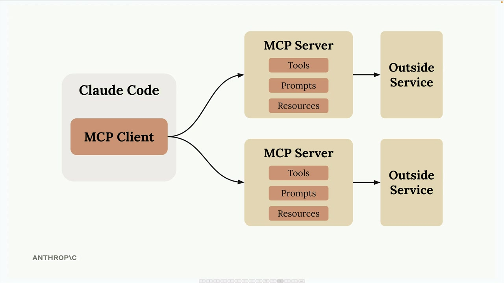
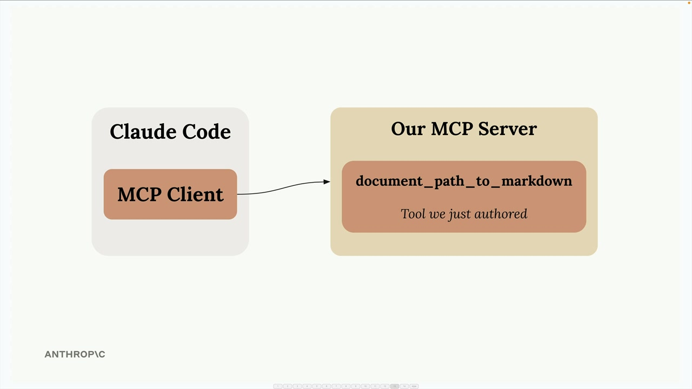
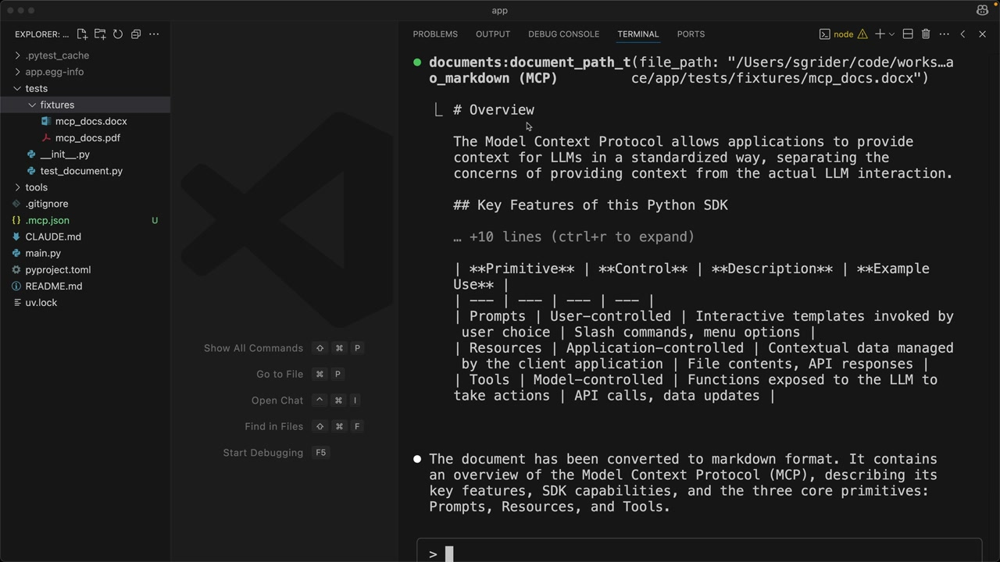
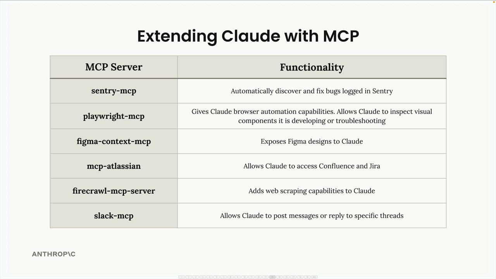

# Enhancements with MCP servers

> Source: https://anthropic.skilljar.com/claude-with-the-anthropic-api/287792

#### Summary


                            
                                

Claude Code has an MCP client built right into it, which means you can connect MCP servers to dramatically expand what Claude can do. This opens up some really powerful possibilities for customizing your development workflow.


## How MCP Extends Claude


The Model Context Protocol allows Claude Code to connect to external services and tools through MCP servers. Instead of being limited to Claude's built-in capabilities, you can add custom functionality by connecting servers that provide specific tools, resources, or integrations.





Each MCP server can expose different types of functionality to Claude through three main components: Tools (for taking actions), Prompts (for templates), and Resources (for accessing data).


## Setting Up an MCP Server


Adding an MCP server to Claude Code is straightforward. You use the command line to register your server:


```
claude mcp add [server-name] [command-to-start-server]
```


For example, if you have a document processing server that starts with `uv run main.py`, you'd run:


```
claude mcp add documents uv run main.py
```


Once registered, Claude Code will automatically connect to your server when it starts up.


## Example: Document Processing


A practical example is creating a tool that lets Claude read PDF and Word documents. By building an MCP server with a "document_path_to_markdown" tool, you can ask Claude to convert document contents to markdown format.





When you ask Claude to "Convert the tests/fixtures/mcp_docs.docx file to markdown", it will automatically use your custom tool to read the document and return the converted content.





## Popular MCP Integrations


The MCP ecosystem includes servers for many common development tools and services:





- **sentry-mcp** - Automatically discover and fix bugs logged in Sentry

- **playwright-mcp** - Gives Claude browser automation capabilities for testing and troubleshooting

- **figma-context-mcp** - Exposes Figma designs to Claude

- **mcp-atlassian** - Allows Claude to access Confluence and Jira

- **firecrawl-mcp-server** - Adds web scraping capabilities to Claude

- **slack-mcp** - Allows Claude to post messages or reply to specific threads


## Building Your Development Workflow


The real power comes from combining multiple MCP servers that match your specific development process. You might set up:


- A Sentry server to fetch production error details

- A Jira server to read ticket requirements

- A Slack server to notify your team when work is complete

- Custom servers for your internal tools and APIs


This creates a development environment where Claude can seamlessly work with all the tools and services you already use, making it a much more powerful coding assistant tailored to your specific workflow.