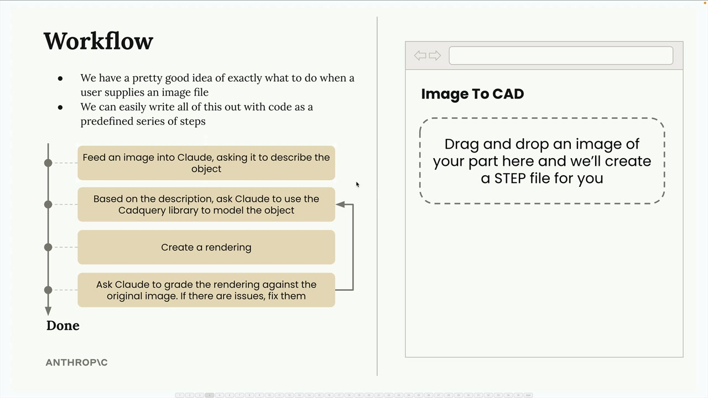
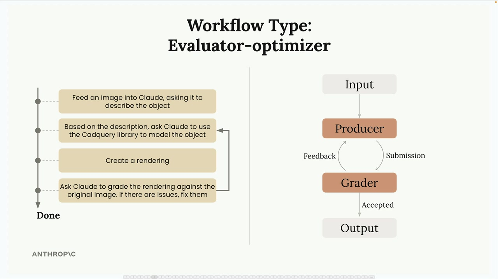

# Agents and workflows

> Source: https://anthropic.skilljar.com/claude-with-the-anthropic-api/287796

#### Summary

                            
                                

Workflows and agents are strategies for handling user tasks that can't be completed by Claude in a single request. You've actually been creating both throughout this course - when you used tools and let Claude figure out how to complete tasks, that was an agent.

## When to Use Workflows vs Agents

The decision comes down to how well you understand the task:

- **Use workflows** when you can picture the exact flow or steps that Claude should go through to solve a problem, or when your app's UX constrains users to a set of tasks

- **Use agents** when you're not sure exactly what task or task parameters you'll give to Claude

Workflows are a series of calls to Claude meant to solve a specific problem through a predetermined series of steps. Agents give Claude a goal and a set of tools, expecting Claude to figure out how to complete the goal through the provided tools.

## Example: Image to CAD Workflow

Let's look at a practical workflow example. Imagine building a web app where users drag and drop an image of a metal part, and you create a STEP file (an industry standard for 3D models) from it.

Since we have a pretty good idea of exactly what to do when a user supplies an image file, and we can easily write all of this out with code as a predefined series of steps, this makes a perfect workflow candidate.

Here's how the workflow breaks down:

1. Feed an image into Claude, asking it to describe the object

1. Based on the description, ask Claude to use the CadQuery library to model the object

1. Create a rendering

1. Ask Claude to grade the rendering against the original image. If there are issues, fix them

## The Evaluator-Optimizer Pattern

This modeling workflow is an example of an evaluator-optimizer pattern. Here's how it works:

- **Producer**: Takes input and creates output (Claude using CadQuery to model the part and create a rendering)

- **Grader**: Evaluates the output against some criteria

- **Feedback loop**: If the grader doesn't accept the output, feedback goes back to the producer for improvement

- **Iteration**: The cycle repeats until the grader accepts the output

## Why Learn Workflow Patterns

The goal of identifying different workflows is to give you a set of repeatable recipes for implementing your own features. The Evaluator-Optimizer is one workflow pattern that has worked well for other engineers - consider using it in your own app!

Remember, identifying workflows doesn't inherently do anything for us - we still have to write the actual code to implement them. But these patterns have proven successful for many engineers, so they're worth understanding and applying to your own projects.