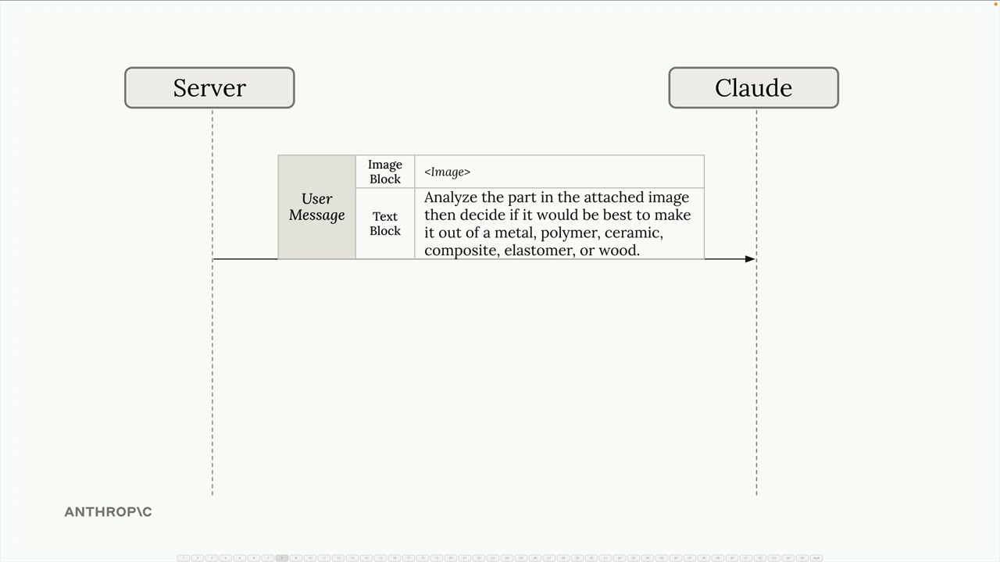
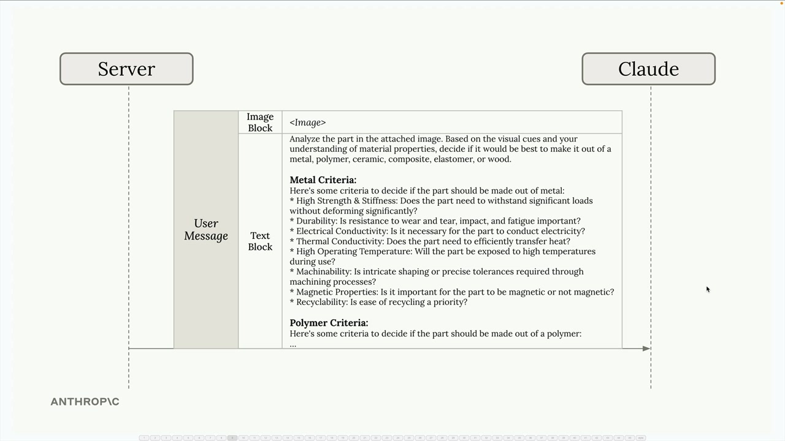
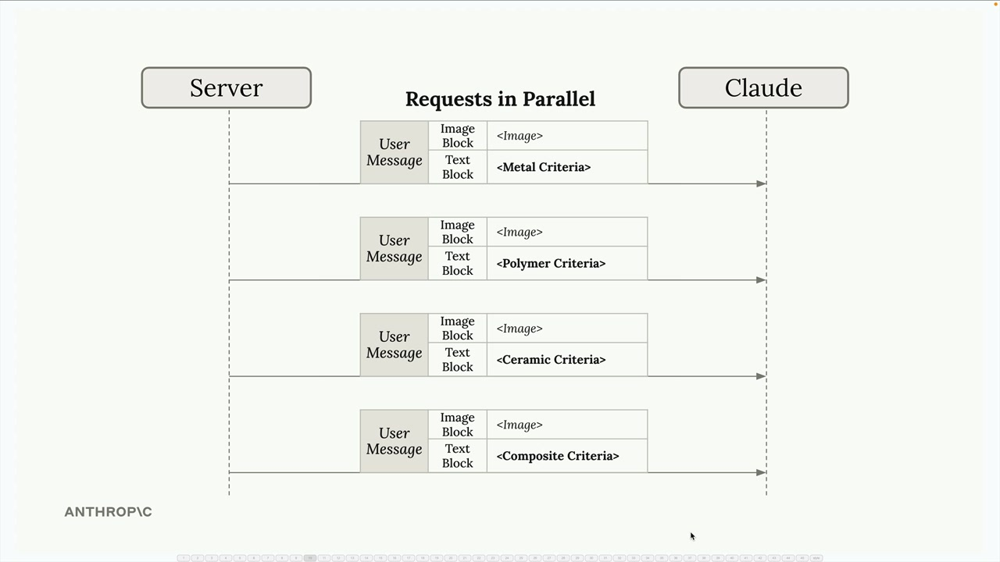

# Parallelization workflows

> Source: https://anthropic.skilljar.com/claude-with-the-anthropic-api/287804

#### Summary

                            
                                

When building AI applications, you'll often encounter tasks that seem simple on the surface but become complex when you try to implement them effectively. Let's explore a powerful pattern called parallelization workflows that can help you break down complex tasks into manageable, focused pieces.

## The Problem with Complex Single Prompts

Imagine you're building a material designer application where users upload images of parts and receive recommendations for the best material to use. Your first instinct might be to send the image to Claude with a simple prompt asking it to choose between metal, polymer, ceramic, composite, elastomer, or wood.

While this approach might work, you're asking Claude to do a lot of heavy lifting in a single request. Without specific criteria for each material type, the results won't be as reliable as they could be.

You might think to improve this by adding detailed criteria for each material into one massive prompt. But this creates a new problem - Claude has to juggle all these different considerations simultaneously, which can lead to confusion and suboptimal results.

## A Better Approach: Parallelization

Instead of cramming everything into one request, you can split the task into multiple parallel requests. Each request focuses on evaluating the part for a single material type with specialized criteria.

Here's how it works:

- Send the same image to Claude multiple times simultaneously

- Each request includes specialized criteria for one material (metal criteria, polymer criteria, ceramic criteria, etc.)

- Claude evaluates the part's suitability for each material independently

- Collect all the analysis results and feed them into a final aggregation step

The final step sends all the individual analysis results back to Claude with a request to compare them and make a final material recommendation.

## How Parallelization Workflows Work

The parallelization pattern follows a simple structure:

- **Split a single task into multiple sub-tasks** - Break down the complex decision into focused, specialized evaluations

- **Run the sub-tasks in parallel** - Execute all evaluations simultaneously for faster processing

- **Aggregate the results together** - Combine the specialized analyses into a final decision

- **The parallelized sub-tasks don't need to be identical** - Each can have a specialized prompt, set of tools, or evaluation criteria

## Benefits of This Approach

Parallelization workflows offer several key advantages:

**Focused attention:** Claude can concentrate on one specific aspect at a time rather than trying to balance multiple competing considerations simultaneously. This leads to more thorough and accurate analysis for each material type.

**Easier optimization:** You can improve and test the prompts for each material evaluation independently. If your metal analysis isn't working well, you can refine just that prompt without affecting the others.

**Better scalability:** Adding new materials to evaluate is straightforward - just add another parallel request. You don't need to rewrite existing prompts or worry about how the new criteria might interfere with existing ones.

**Improved reliability:** By breaking down the complex task, you reduce the cognitive load on the AI model and get more consistent, reliable results.

## When to Use Parallelization

This pattern works well when you have a complex decision that can be broken down into independent evaluations. Look for situations where you're asking an AI to consider multiple criteria, compare several options, or make decisions that involve different domains of expertise.

The key is identifying tasks that can be meaningfully separated - each parallel sub-task should be able to operate independently and contribute a distinct piece of analysis to the final decision.