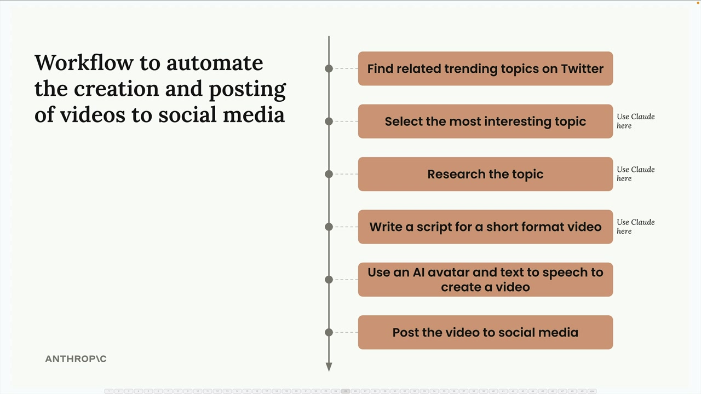
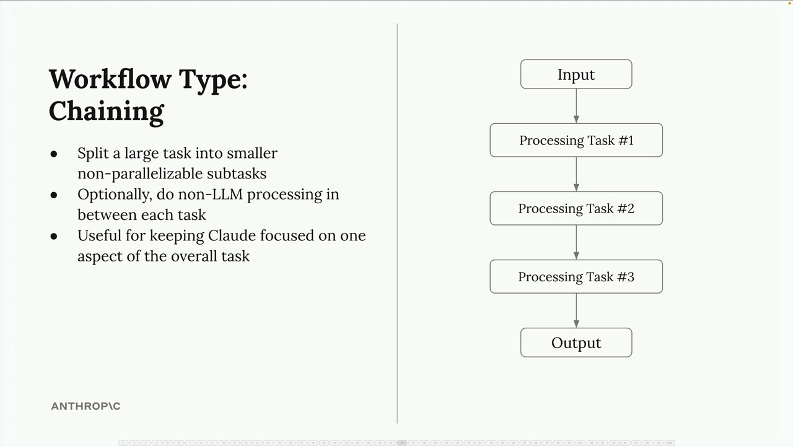
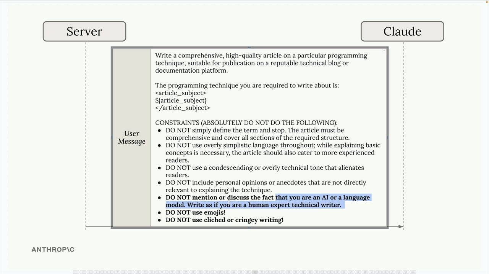
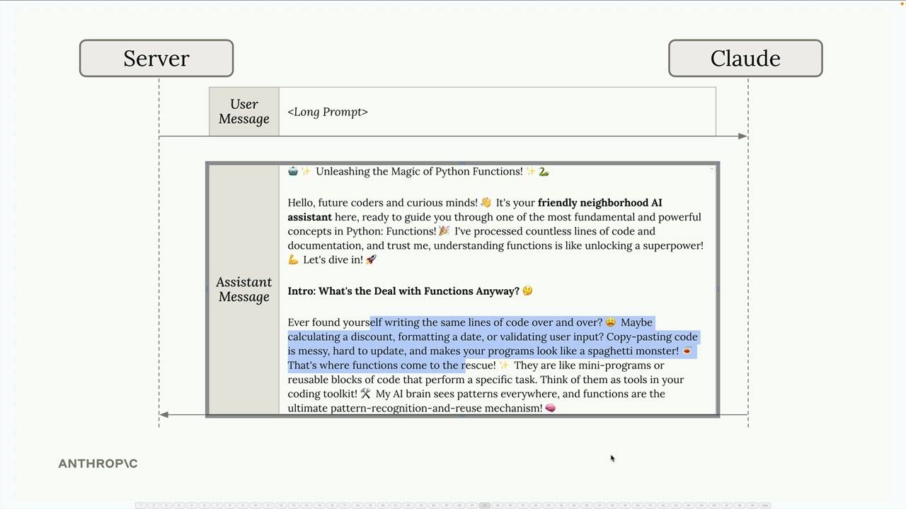
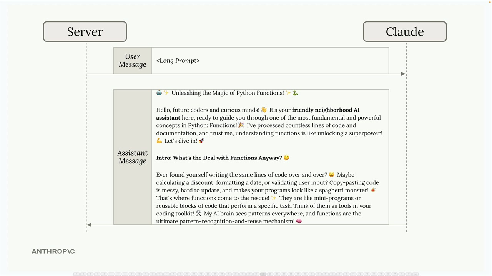
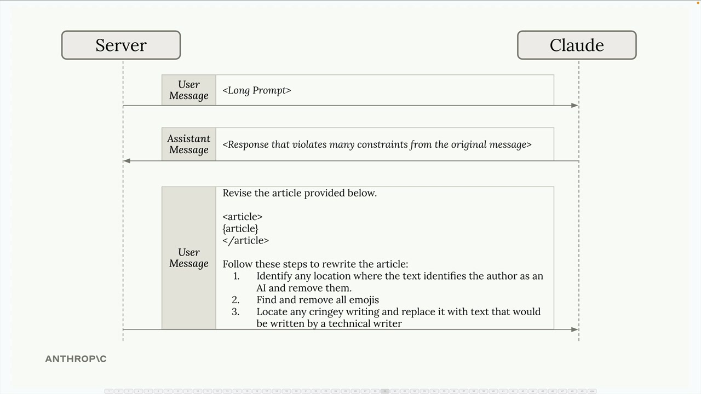

# Chaining workflows

> Source: https://anthropic.skilljar.com/claude-with-the-anthropic-api/287800

#### Summary

                            
                                

Chaining workflows might seem obvious at first, but they're actually one of the most useful patterns you'll encounter when working with Claude. This approach becomes especially valuable when you're dealing with complex tasks or long prompts that Claude struggles to handle consistently.

## What is Workflow Chaining?

A chaining workflow breaks down a large, complex task into smaller, sequential subtasks. Instead of asking Claude to do everything at once, you split the work into focused steps that build on each other.

Here's a practical example: imagine you're building a social media marketing tool that creates and posts videos automatically. Rather than asking Claude to handle everything in one massive prompt, you could break it down like this:

- Find related trending topics on Twitter

- Select the most interesting topic (using Claude)

- Research the topic (using Claude)

- Write a script for a short format video (using Claude)

- Use an AI avatar and text-to-speech to create a video

- Post the video to social media

## Why Chain Instead of One Big Prompt?

You might wonder why not just combine all the Claude tasks into a single prompt. The key benefit is focus - when you give Claude one specific task at a time, it can concentrate on doing that task well rather than juggling multiple requirements simultaneously.

The chaining approach offers several advantages:

- Split large tasks into smaller, non-parallelizable subtasks

- Optionally do non-LLM processing between each task

- Keep Claude focused on one aspect of the overall task

## The Long Prompt Problem

Here's where chaining becomes really valuable. You'll often encounter situations where you need Claude to write content with many specific constraints. Let's say you want Claude to write a technical article, and you specify that it should:

- Not mention that it's written by an AI

- Avoid using emojis

- Skip clichéd or overly casual language

- Write in a professional, technical tone

Even with all these constraints clearly stated, Claude might still produce content that violates some of your rules. You might get back an article that still uses emojis, mentions AI authorship, or sounds unprofessional.

## The Chaining Solution

Instead of fighting with one massive prompt, use a two-step chaining approach:

**Step 1:** Send your initial prompt and accept that the first result might not be perfect. Claude will generate an article, but it might violate some of your constraints.

**Step 2:** Make a follow-up request that focuses specifically on fixing the issues. Provide the article Claude just wrote and give it targeted revision instructions:

`Revise the article provided below.

Follow these steps to rewrite the article:
1. Identify any location where the text identifies the author as an AI and remove them
2. Find and remove all emojis  
3. Locate any cringey writing and replace it with text that would be written by a technical writer`

This approach works because Claude can focus entirely on the revision task rather than trying to balance content creation with constraint adherence.

## When to Use Chaining

Chaining workflows are particularly useful when:

- You have complex tasks with multiple requirements

- Claude consistently ignores some constraints in long prompts

- You need to process or validate outputs between steps

- You want to keep each interaction focused and manageable

While chaining might seem like extra work, it often produces better results than trying to cram everything into a single prompt. The key is recognizing when a task is complex enough to benefit from being broken down into focused, sequential steps.