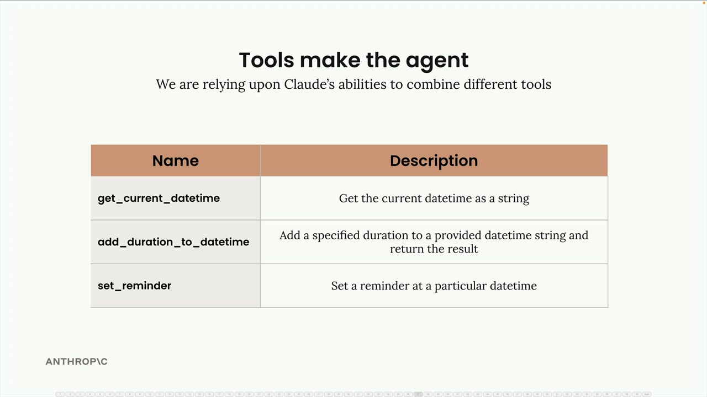
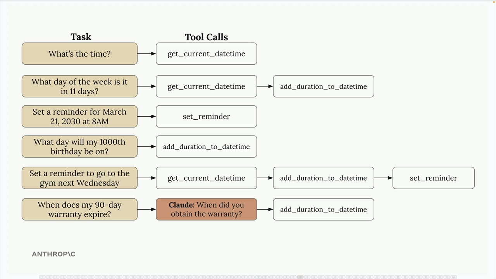
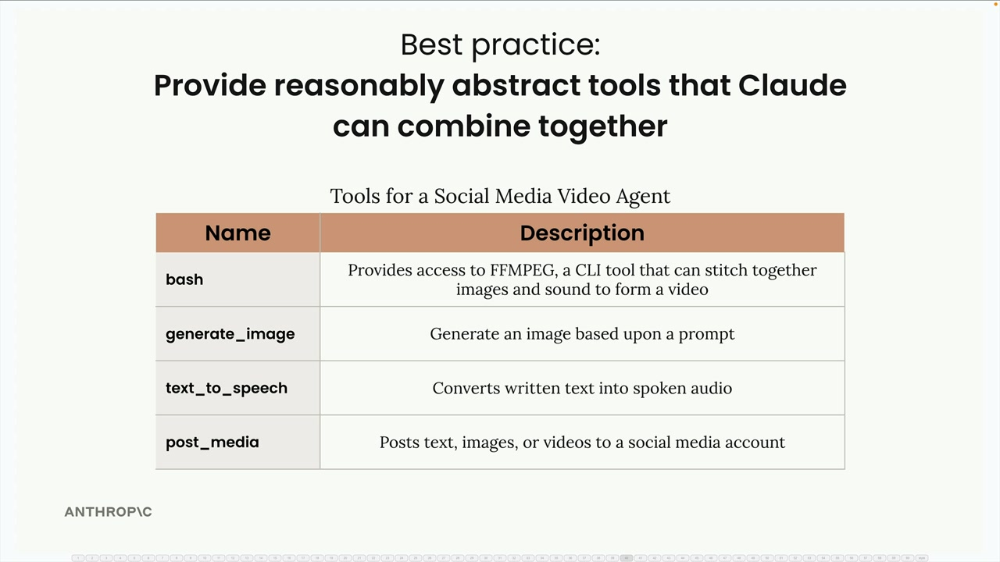
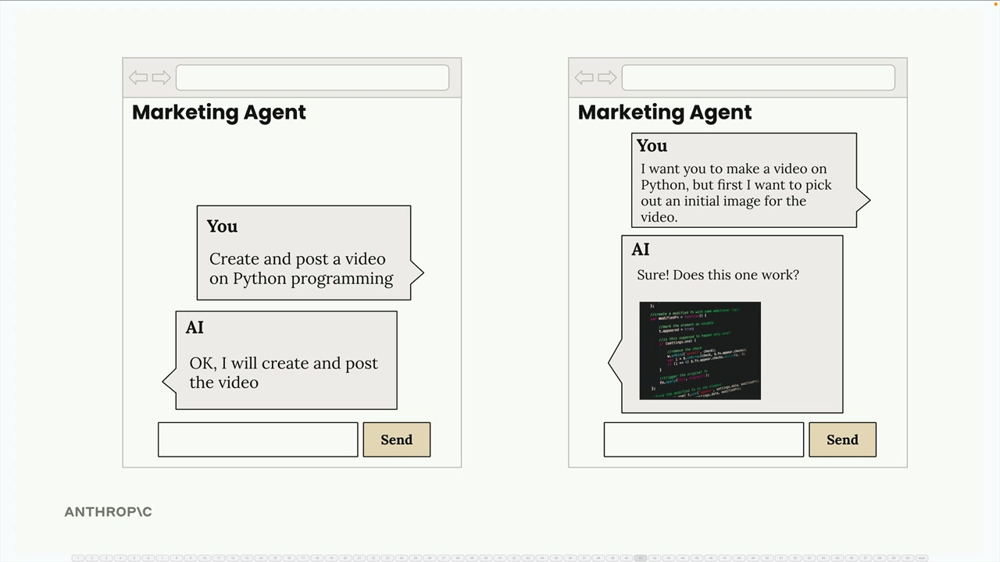

# Agents and tools

> Source: https://anthropic.skilljar.com/claude-with-the-anthropic-api/287803

#### Summary

                            
                                

Agents represent a shift from the structured workflows we've been working with. While workflows are perfect when you know the exact steps needed to complete a task, agents shine when you're not sure what those steps should be. Instead of defining a rigid sequence, you give Claude a goal and a set of tools, then let it figure out how to combine those tools to achieve the objective.

This flexibility makes agents attractive for building applications that need to handle varied, unpredictable tasks. You can create an agent once, ensure it works reasonably well, and then deploy it to solve a wide range of problems. However, this flexibility comes with trade-offs in reliability and cost that we'll explore later.

## How Tools Make the Agent

The real power of agents lies in their ability to combine simple tools in unexpected ways. Consider a basic set of datetime tools:

- `get_current_datetime` - Gets the current date and time

- `add_duration_to_datetime` - Adds time to a given date

- `set_reminder` - Creates a reminder for a specific time

These tools seem simple individually, but Claude can chain them together to handle surprisingly complex requests:

For "What's the time?", Claude simply calls `get_current_datetime`. But for "What day of the week is it in 11 days?", it chains `get_current_datetime` followed by `add_duration_to_datetime`. For setting a gym reminder next Wednesday, it might use all three tools in sequence.

Claude can even recognize when it needs more information. If you ask "When does my 90-day warranty expire?", it knows to ask when you purchased the item before calculating the expiration date.

## Tools Should Be Abstract

The key insight for building effective agents is providing reasonably abstract tools rather than hyper-specialized ones. Claude Code demonstrates this principle perfectly.

Claude Code has access to generic, flexible tools like:

- `bash` - Run any command

- `read` - Read any file

- `write` - Create any file

- `edit` - Modify files

- `glob` - Find files

- `grep` - Search file contents

It notably doesn't have specialized tools like "refactor code" or "install dependencies." Instead, Claude figures out how to use the basic tools to accomplish these complex tasks. This abstraction allows it to handle countless programming scenarios that the developers never explicitly planned for.

## Best Practice: Combinable Tools

When designing agents, provide tools that Claude can combine in creative ways. For example, a social media video agent might include:

- `bash` - Access to FFMPEG for video processing

- `generate_image` - Create images from prompts

- `text_to_speech` - Convert text to audio

- `post_media` - Upload content to social platforms

This tool set enables both simple workflows (create and post a video) and more interactive experiences where the agent might generate a sample image first, get user approval, then proceed with video creation.

The agent can adapt its approach based on user feedback and preferences, something that would be difficult to achieve with a rigid workflow. This flexibility is what makes agents powerful for building dynamic, user-responsive applications.