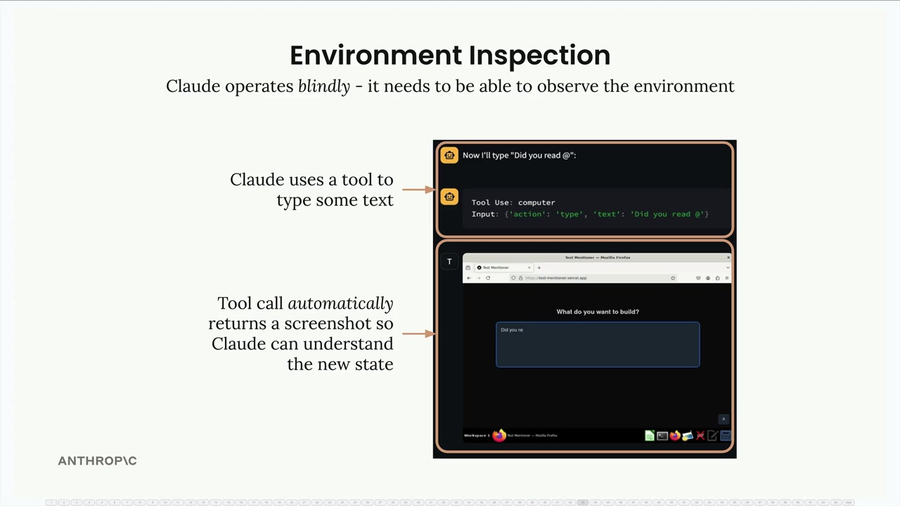
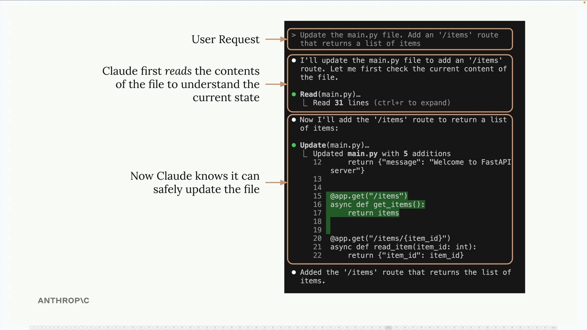
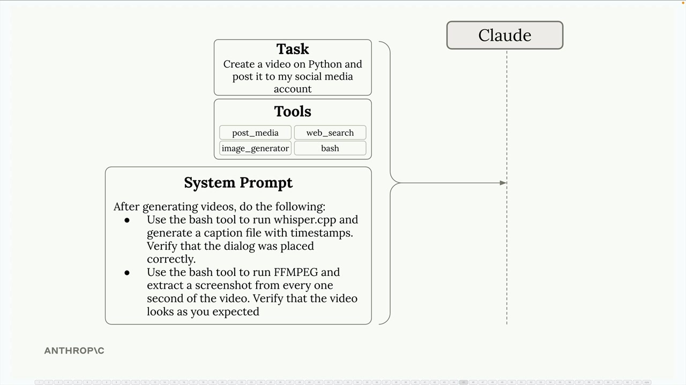

# Environment inspection

> Source: https://anthropic.skilljar.com/claude-with-the-anthropic-api/287798

#### Summary

                            
                                

When building AI agents, one crucial concept often gets overlooked: environment inspection. Claude operates blindly - it needs to be able to observe and understand the results of its actions to work effectively.

## Why Environment Inspection Matters

Think about how Claude works with computer use. Every time Claude performs an action like typing text or clicking a button, it immediately receives a screenshot to understand what happened. This isn't just a nice-to-have feature - it's essential.

From Claude's perspective, clicking a button could navigate to a new page, open a menu, or trigger any number of changes. Without being able to see the results, Claude has no way to understand whether its action succeeded or what the new state of the environment looks like.

## Reading Before Writing

This same principle applies to file operations. Before Claude can modify any file, it needs to understand the current contents. This might seem obvious, but it's a pattern you should always follow when building agents.

In the example above, when asked to add a new route to a Python file, Claude first reads the existing code to understand the current structure. Only then can it safely make the requested changes without breaking existing functionality.

## System Prompts for Environment Inspection

You can guide Claude to inspect its environment through system prompts. For complex tasks like video generation, this becomes especially important.

Consider a video creation agent that needs to:

- Generate video content using tools like FFmpeg

- Verify that audio dialogue is placed correctly

- Check that visual elements appear as expected

You might include system prompt instructions like:

- Use the bash tool to run whisper.cpp and generate caption files with timestamps to verify dialogue placement

- Use FFmpeg to extract screenshots from the video at regular intervals to visually inspect the output

- Compare the generated content against the original requirements

## Benefits of Environment Inspection

When Claude can inspect its environment, several things improve:

- **Better progress tracking** - Claude can gauge how close it is to completing a task

- **Error handling** - Unexpected results can be detected and corrected

- **Quality assurance** - Output can be verified before considering a task complete

- **Adaptive behavior** - Claude can adjust its approach based on what it observes

## Practical Implementation

When designing your own agents, always ask: "How will Claude know if this action worked?" Whether you're working with files, APIs, or user interfaces, provide tools and instructions that let Claude observe the results of its actions.

This might mean:

- Reading file contents before modifications

- Taking screenshots after UI interactions

- Checking API responses for expected data

- Validating generated content against requirements

Environment inspection transforms Claude from a blind executor of commands into an agent that can truly understand and adapt to its working environment.