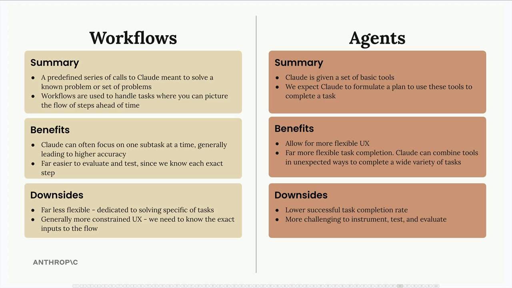

# Workflows vs agents

> Source: https://anthropic.skilljar.com/claude-with-the-anthropic-api/287794

#### Summary

                            
                                

When building AI-powered applications, you'll often need to choose between two different architectural approaches: workflows and agents. Each has distinct advantages and trade-offs that make them suitable for different scenarios.

## What Are Workflows?

Workflows are a predefined series of calls to Claude designed to solve a known problem or set of problems. You use workflows when you can picture the flow of steps ahead of time - essentially when you know the exact sequence needed to complete a task.

Think of workflows as breaking down a big task into much smaller, more specific subtasks. Each step focuses on a single area, which allows Claude to work more precisely.

## What Are Agents?

With agents, Claude gets a set of basic tools and is expected to formulate a plan to use these tools to complete a task. Unlike workflows, you don't know exactly what tasks will be provided, so the system needs to be more adaptive.

Agents can creatively figure out how to handle a wide variety of challenges by combining tools in unexpected ways.

## Benefits of Workflows

- Claude can focus on one subtask at a time, generally leading to higher accuracy

- Far easier to evaluate and test, since you know each exact step

- More predictable and reliable execution

- Better suited for solving specific, well-defined problems

## Benefits of Agents

- Allow for more flexible user experience

- Far more flexible task completion - Claude can combine tools in unexpected ways to complete a wide variety of tasks

- Can handle novel situations that weren't anticipated during development

- Can ask users for additional input when needed

## Downsides of Workflows

- Far less flexible - dedicated to solving specific types of tasks

- Generally more constrained user experience - you need to know the exact inputs to the flow

- Require more upfront planning and design work

## Downsides of Agents

- Lower successful task completion rate compared to workflows

- More challenging to instrument, test, and evaluate since you often don't know what series of steps an agent will execute

- Less predictable behavior

## When to Use Each Approach

Your primary goal as an engineer is to solve problems reliably. Users probably don't care that you've built a fancy agent - they want a product that works consistently.

The general recommendation is to always focus on implementing workflows where possible, and only resort to agents when they are truly required. Workflows provide the reliability and predictability that most production applications need, while agents offer flexibility for scenarios where the exact requirements can't be predetermined.

Consider workflows when you have well-defined processes and agents when you need to handle unpredictable, varied user requests that require creative problem-solving.