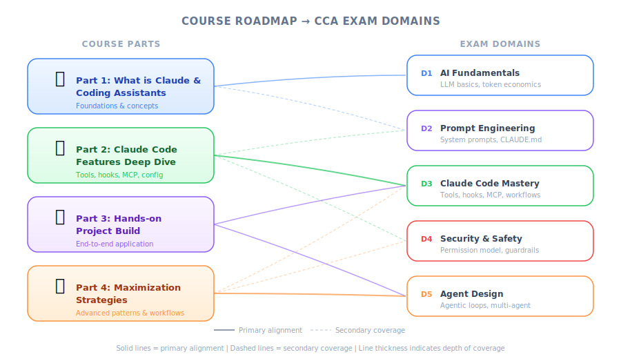

# Introduction — PM Perspective

| Item | Details |
|------|---------|
| Exam Coverage | General — Course roadmap for all 5 domains |
| Task Statements | Overview (no specific deep coverage) |
| Course Source | claude-code-in-action / 01-intro / Lesson 02 |

---

## TL;DR

Steven Greider from Anthropic outlines a 4-part course that progressively moves from "what are coding assistants" to "how to maximize Claude Code in your projects." For PMs, this course provides the technical vocabulary and mental models needed to write better PRDs, evaluate AI-assisted development workflows, and communicate effectively with engineering teams.

---

## Course Roadmap — PM Lens

*Figure: Course roadmap mapped to CCA exam domains.*

| Part | Topic | Why PMs Should Care |
|------|-------|---------------------|
| 1 | What is a coding assistant | Understand the product category you're building with/around |
| 2 | What makes Claude Code special | Know the capabilities and constraints when scoping features |
| 3 | Hands-on with Claude Code | See the actual developer experience your team uses daily |
| 4 | Maximizing Claude Code | Learn optimization patterns to include in team best practices |

---

## What to Expect

- A framework for understanding **where AI coding assistants fit** in the development lifecycle
- Clarity on Claude Code's **unique value proposition** vs. other tools
- Practical exposure to how engineers interact with Claude Code — helpful for writing realistic acceptance criteria
- Strategies for team-wide adoption and workflow optimization

---

## Exam Focus

> 💡 **PM takeaway**
>
> This lesson is a course overview with no directly testable content. Use it as a mental map: Parts 1-2 build conceptual understanding (D1-D3), Parts 3-4 build practical skills (D3-D5). The exam tests both — knowing what a feature does AND when to use it.

The instructor is **Steven Greider** from Anthropic. As a PM, knowing that this course comes directly from the product's creator means the guidance reflects intended usage patterns, not community workarounds.
