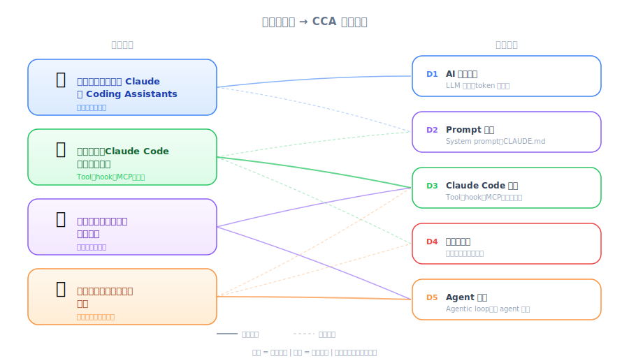

# Introduction — PM 视角

| 项目 | 内容 |
|------|------|
| 考试对应 | 总览 — 涵盖全部 5 个 domain 的课程路线图 |
| Task Statements | 总览（无特定深入内容） |
| 课程来源 | claude-code-in-action / 01-intro / Lesson 02 |

---

*圖：課程路線圖對應 CCA 考試領域。*

## TL;DR

Anthropic 的 Steven Greider 介绍这门 4 部分的课程，从「什么是 coding assistant」到「如何在项目中最大化 Claude Code」。对 PM 来说，这门课提供了撰写更好的 PRD、评估 AI 辅助开发 workflow、以及与工程团队有效沟通所需的技术词汇和心智模型。

---

## 课程路线图 — PM 视角

| 部分 | 主题 | PM 为什么要关心 |
|------|------|-----------------|
| 1 | 什么是 coding assistant | 了解你正在使用/围绕的产品类别 |
| 2 | Claude Code 有什么特别的 | 规划功能范围时要知道工具的能力与限制 |
| 3 | 实际操作 Claude Code | 看到工程师每天使用的实际开发体验 |
| 4 | 最大化 Claude Code | 学习可以纳入团队最佳实践的优化模式 |

---

## 你会学到什么

- 理解 **AI coding assistant 在开发生命周期中的定位**
- 厘清 Claude Code 相比其他工具的**独特价值主张**
- 实际接触工程师如何与 Claude Code 互动——有助于撰写合理的 acceptance criteria
- 团队层级的导入与 workflow 优化策略

---

## 考试重点

> 💡 **PM 重点提醒**
>
> 这堂课是课程总览，没有直接可考的内容。把它当作 mental map：Parts 1-2 建立概念理解（D1-D3），Parts 3-4 建立实操技能（D3-D5）。考试两者都考——既要知道功能做什么，也要知道什么时候该用。

讲师是 Anthropic 的 **Steven Greider**。身为 PM，知道这门课直接来自产品开发者，代表这里的指导反映的是官方设计意图，而不是社区的变通方法。
