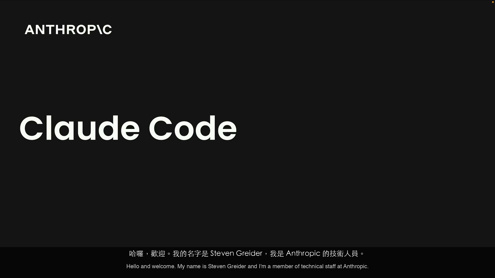
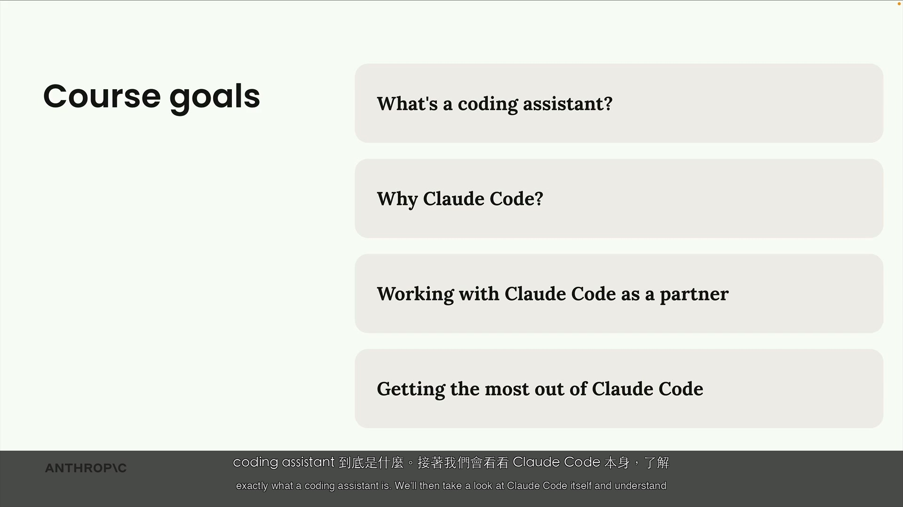
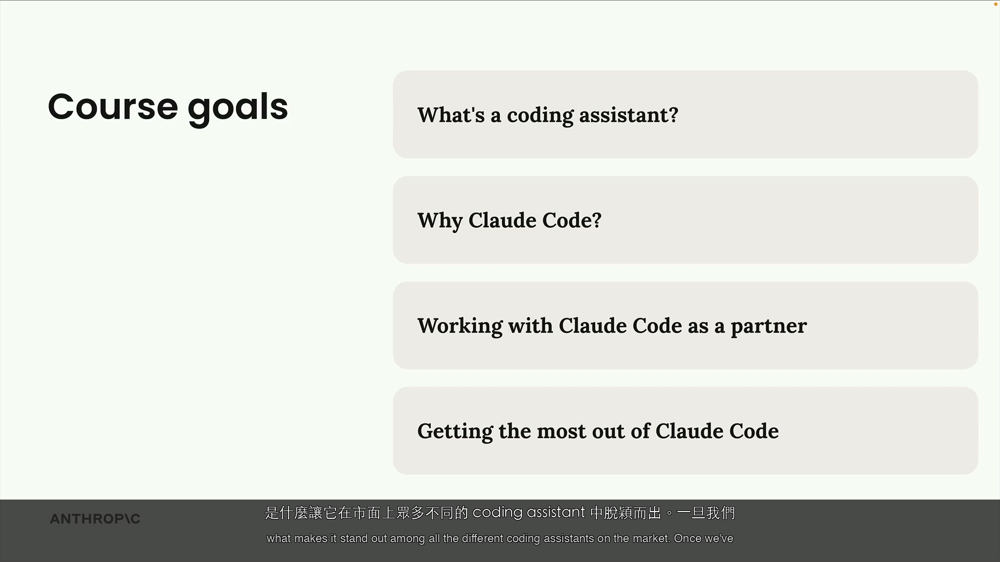

# Introduction — 課程介紹 — 影片逐幀學習指南

| 項目 | 內容 |
|------|------|
| 課程 | claude-code-in-action / 01-intro / 02-introduction |
| 影片 | Introduction |
| 字幕數 | 9 段 |
| 格式 | 每段字幕一張截圖 + 雙語字幕（英/中） |

---

### [00:00:00] 第 1 段

> **EN:** Hello and welcome. My name is Steven Greider and I'm a member of technical staff at Anthropic.
>
> **ZH:** 哈囉，歡迎。我的名字是 Steven Greider，我是 Anthropic 的技術人員。

---

### [00:00:05] 第 2 段

> **EN:** In this course, we're going to get you up to speed with Claude Code. And before we get into
>
> **ZH:** 在這門課程中，我們要帶你快速上手 Claude Code。在我們深入

---

### [00:00:09] 第 3 段

> **EN:** anything too technical, I want to give you a quick overview on what we'll be learning.
>
> **ZH:** 任何太技術的東西之前，我想先給你一個快速的課程大綱。

---

### [00:00:13] 第 4 段

> **EN:** This course is organized into four sections. We're going to first spend some time to understand
>
> **ZH:** 這門課程分成四個部分。我們首先會花一些時間了解

---

### [00:00:18] 第 5 段

> **EN:** exactly what a coding assistant is. We'll then take a look at Claude Code itself and understand
>
> **ZH:** coding assistant 到底是什麼。接著我們會看看 Claude Code 本身，了解

---

### [00:00:23] 第 6 段

> **EN:** what makes it stand out among all the different coding assistants on the market. Once we've
>
> **ZH:** 是什麼讓它在市面上眾多不同的 coding assistant 中脫穎而出。一旦我們

---

### [00:00:27] 第 7 段

> **EN:** established that, we'll walk through the use of Claude Code on a typical project and get some
>
> **ZH:** 建立了這些基礎，我們會在一個典型的專案中實際使用 Claude Code，並獲得一些

---

### [00:00:31] 第 8 段

> **EN:** hands-on experience. Finally, we'll wrap things up by seeing how you can get the most out of Claude
>
> **ZH:** 實際操作的經驗。最後，我們會總結一下，看看如何在你自己的專案中

---

### [00:00:36] 第 9 段

> **EN:** Code on your own projects.
>
> **ZH:** 把 Claude Code 發揮到最大效用。

---
