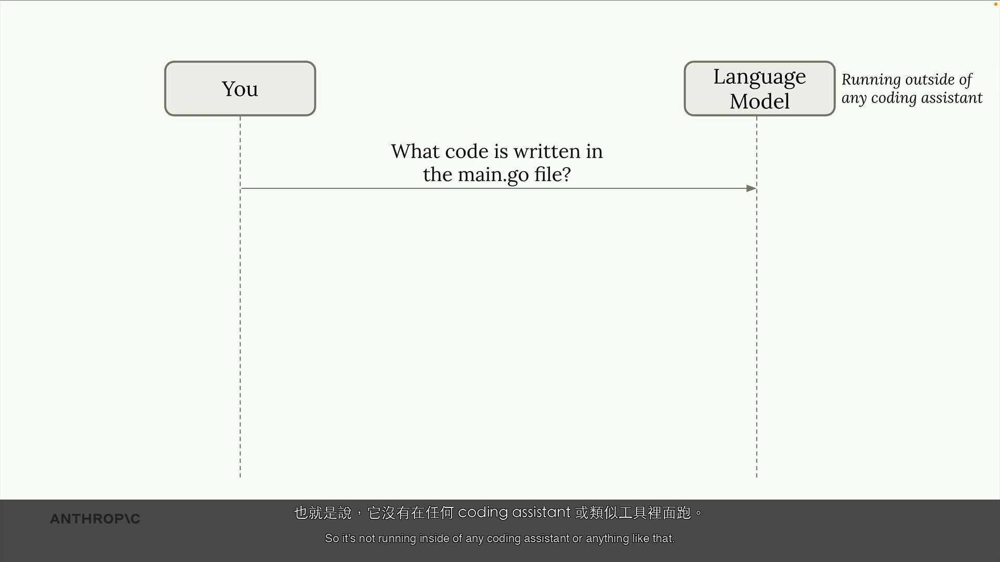
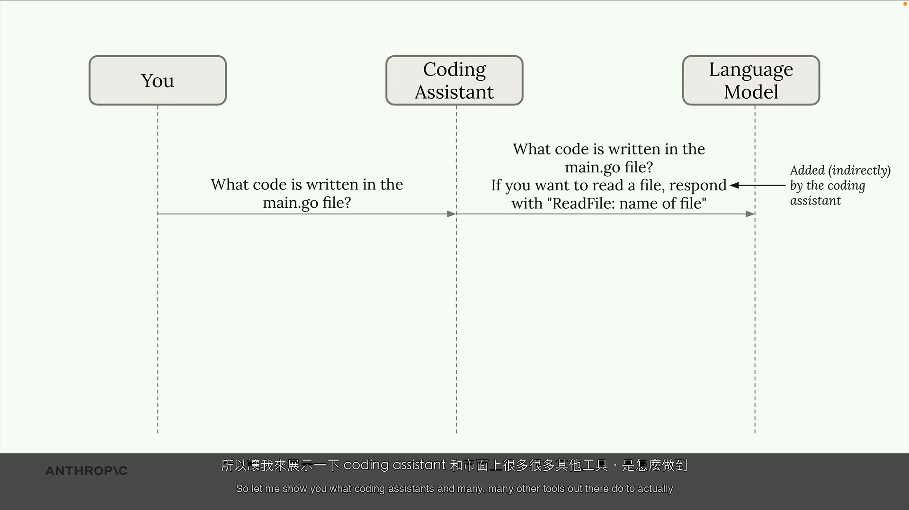
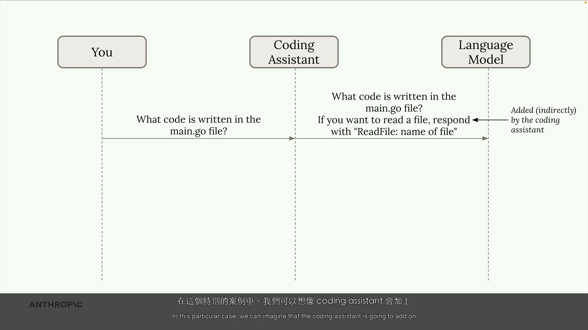
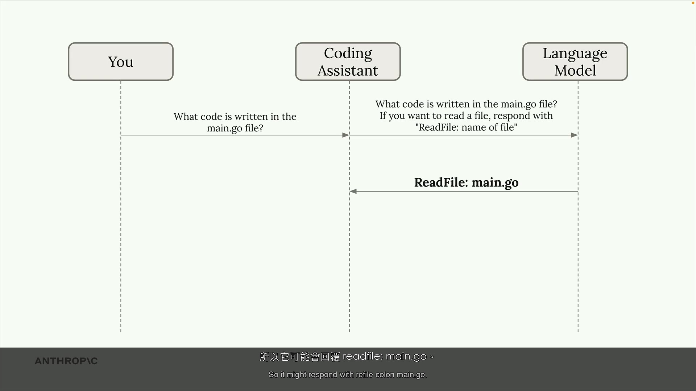
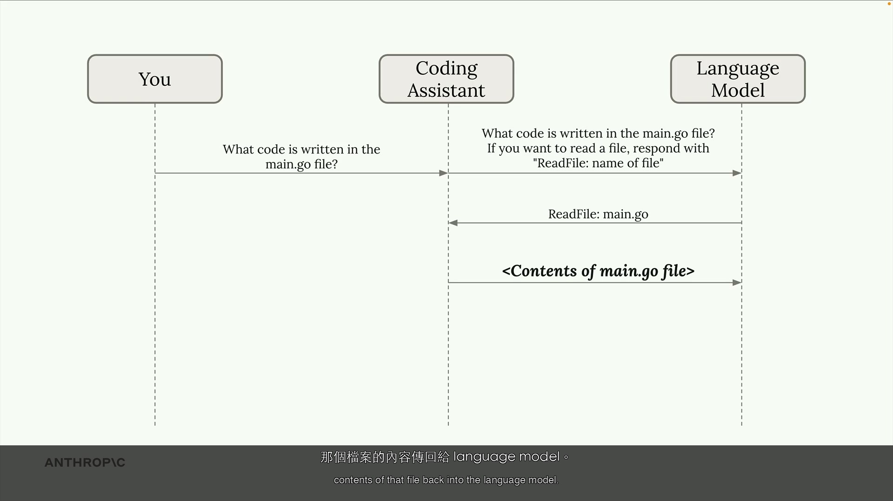

# What is a Coding Assistant? — PM / Non-Engineer Track

| Item | Detail |
|------|--------|
| Exam Domain | D1: Agentic Architecture & Orchestration, D2: Tool Design & MCP Integration |
| Task Statements | 1.1 (agentic loops), 2.1 (tool interfaces), 2.5 (built-in tools) |
| Source | Anthropic Skilljar — Claude Code in Action |

---

# PART 1: Official Course Content

> [!NOTE]
> All content in this section comes directly from official course materials (video transcript + instructor slides).

## One-Liner / TL;DR

A coding assistant is like a skilled contractor who can think through problems AND use real tools to get the job done — not just give advice from the sidelines.

## Core Concepts

### What a Coding Assistant Actually Is

A coding assistant is more than just a tool that writes code. Think of it as a complete problem-solving system: it understands your request, figures out what information it needs, makes a plan, and then carries it out. The "assistant" part is key — it acts on your behalf, much like a human assistant who can both think and do.

### How Coding Assistants Work — The Three-Step Cycle

When you give a coding assistant a task (like "fix this bug based on this error message"), it follows a repeatable process:

| Step | What It Does | Workplace Analogy |
|------|-------------|-------------------|
| 1 | **Gather context** — Understand the error, find relevant files, read related code | Like a new team member reading through Slack threads and docs before jumping into a problem |
| 2 | **Formulate a plan** — Decide the best approach to fix the issue | Like a senior engineer sketching out a solution on a whiteboard before writing code |
| 3 | **Take action** — Implement the fix by editing files, running commands | Like the engineer actually opening the codebase and making the changes |

> [!IMPORTANT]
> Steps 1 and 3 require **interacting with the outside world** — reading files, running commands. This is where the magic (and the challenge) lies. Like giving your assistant a Swiss Army knife — each tool lets it interact with the real world in a different way.

### The Tool Use Challenge

Here is the fundamental limitation: a language model (the AI "brain") can only process text and return text. It cannot:
- Open and read files on your computer
- Run terminal commands
- Write or edit code files
- Browse the internet

If you ask a plain language model "what's in the main.go file?", it will tell you it cannot access your files. It only works with the text you give it — like an expert consultant who can only communicate by letter.

### How Tool Use Works — The Complete Flow

This is how a coding assistant bridges the gap. The `ReadFile: main.go` example from the course walks through exactly what happens:

| Step | What Happens | Plain English |
|------|-------------|---------------|
| 1 | **You ask**: "What code is written in the main.go file?" | You send a question to the coding assistant |
| 2 | **The coding assistant** adds tool instructions to your request | The assistant tells the AI brain: "Hey, you have these tools available — here's how to use them" |
| 3 | **The language model responds**: `ReadFile: main.go` | The AI brain says: "I need to read that file — please use the ReadFile tool on main.go" |
| 4 | **The coding assistant** reads the actual file and sends contents back | The assistant goes and reads the real file, then hands the contents back to the AI brain |
| 5 | **The language model** provides its final answer based on file contents | Now the AI brain can give you a real answer because it has seen the actual code |

> [!NOTE]
> This is called **"tool use"** — the standard term across the industry. Every coding assistant works this way, but some AI models are much better at it than others.

### Why Claude's Tool Use Matters

Claude (the AI models: Opus, Sonnet, Haiku) are particularly strong at tool use. Three concrete benefits:

| Benefit | What It Means for Your Team |
|---------|----------------------------|
| **Tackles harder tasks** | Claude can combine tools in creative, unexpected ways and can use tools it has never encountered before — like a resourceful employee who figures out new software without training |
| **Extensible platform** | Easy to add new capabilities — Claude adapts without needing to be retrained. If your team needs a new integration, just add the tool |
| **Better security** | No need to index (pre-scan) your entire codebase or send it to external servers. Claude reads files on-demand, only when needed — your code stays local |

## Demo Walkthrough: Tool Use Flow — How a Coding Assistant Reads a File

> [!NOTE]
> The following walkthrough recreates the instructor's demonstration from the video (SRT 33-63).

| Step | What Happens | Screenshot |
|------|-------------|------------|
| 1 | A plain language model is asked to read a file — it responds that it simply cannot do this |  |
| 2 | The coding assistant adds tool instructions ("here are the tools you can use") to the request |  |
| 3 | The model responds with a structured request: `ReadFile: main.go` — asking the assistant to use a tool |  |
| 4 | The assistant reads the actual file from disk and sends the contents back to the model |  |
| 5 | The model now gives a real answer based on the actual file contents |  |

**Result**: The model can now effectively "read files" — not because it gained new abilities, but because the coding assistant acts as its hands, fetching what it needs.

## Instructor Tips

> [!TIP]
> "A coding assistant is more than just a tool that writes code" — the instructor emphasizes that understanding what happens under the hood helps you use these tools more effectively and make better decisions about when and how to deploy them.

> [!TIP]
> The step-by-step demo makes clear that the AI model never actually "reads" a file — the coding assistant (the software wrapper around the model) does the real-world work. The model just communicates what it needs.

## Key Takeaways

1. Coding assistants use language models (AI brains) to complete complex programming tasks
2. Language models need tools to do real-world work — they cannot read files or run commands on their own
3. Not all language models use tools equally well — this is a key differentiator
4. Claude's strong tool use enables better security (code stays local), easy customization (add new tools), and the ability to tackle harder problems

---

# PART 2: Study Aids

> [!NOTE]
> Supplementary learning materials, not from official course.

## Familiar Analogies

- **The executive assistant analogy** — A language model without tools is like a brilliant executive assistant who is locked in a room with no phone, no computer, and no access to files. They can give great advice if you bring them information, but they cannot look anything up themselves. Tool use gives them their phone and computer back.
- **The recipe vs. the kitchen** — Knowing a recipe (the model's knowledge) is useless without a kitchen (tools). The coding assistant is the kitchen that lets the chef (model) actually cook.
- **App integrations** — Just like Slack becomes more powerful with integrations (Google Drive, Jira, GitHub), a language model becomes more powerful with tools. Each tool is like an integration that lets it do something new.

## CCA Exam Connection

> [!TIP]
> **Exam tip**: This unit teaches the foundational architecture behind every coding assistant. Key concepts to remember:
> - The three-step cycle: gather context, formulate plan, take action
> - Language models CANNOT directly access files or run commands — tool use is required
> - The five-step tool use flow (especially: who does what at each step)
> - Claude's three advantages: harder tasks, extensibility, security
> - The distinction between the language model (thinks) and the coding assistant (acts)

## Anti-Patterns

| Common Misconception | Why It's Wrong | Reality |
|---------------------|---------------|---------|
| "The AI reads my files directly" | The language model only processes text — it has no filesystem access | The coding assistant reads the file and passes the text content to the model |
| "All AI coding tools are basically the same" | Tool use quality varies dramatically between models | Claude is specifically called out as particularly strong at tool use |
| "My code gets uploaded to the cloud" | This assumes indexing-based architecture | Claude's tool-use approach reads files on-demand — your code stays on your machine |
| "A coding assistant is just fancy autocomplete" | Autocomplete is a single, narrow action | A coding assistant runs a full cycle: understand the problem, plan, execute — potentially over many rounds |

## Practice Questions

**Q1.** During a tool use interaction, the language model responds with `ReadFile: main.go`. What happens next?

- A) The language model opens the file directly from the computer's filesystem
- B) The coding assistant intercepts the response, reads the file from disk, and sends the contents back to the model
- C) The user must manually copy-paste the file contents into the chat
- D) The model downloads the file from a cloud repository

> [!NOTE]
> **Answer: B.** The language model cannot access the filesystem. The coding assistant (the software wrapper) intercepts the structured tool call, reads the actual file, and sends the contents back as text for the model to work with.

**Q2.** A product manager is evaluating coding assistants. Which of the following is a stated benefit of Claude's strong tool use capabilities?

- A) It processes code faster than other language models
- B) It requires pre-indexing the entire codebase for best results
- C) It can combine tools in creative ways to tackle harder tasks
- D) It only works with tools it was specifically trained on

> [!NOTE]
> **Answer: C.** Claude can combine tools in interesting and unexpected ways, and can even use tools it has never seen before. Speed (A) is not mentioned, pre-indexing (B) is the opposite of what's stated, and (D) contradicts the extensibility benefit.
