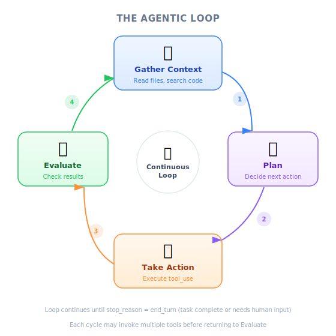
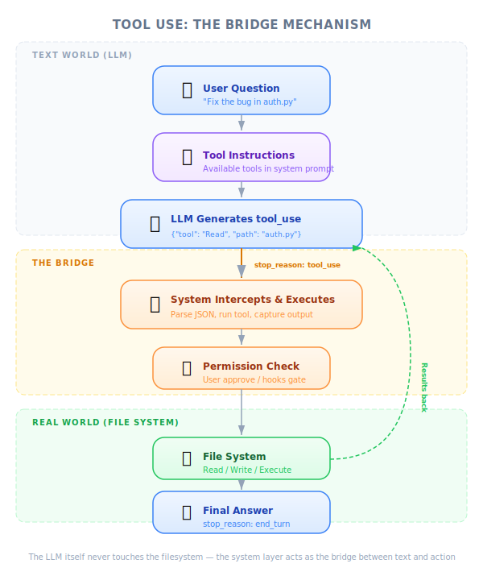

# What Is a Coding Assistant — Engineering Deep Dive

| Item | Detail |
|------|--------|
| Exam Domain | D2 — Tool Design & MCP Integration (18%) |
| Task Statements | 2.1 (tool interfaces), 2.5 (built-in tools), 1.1 (agentic loops) |
| Source | claude-code-in-action / 01-intro / Lesson 03 |

---

## One-Liner

A coding assistant is a language model wrapped in an agentic loop that gathers context, plans, and takes action through tools — because LMs alone can only process text.

---

## The Agentic Loop: How Assistants Think



*Figure: The agentic loop — gather context, plan, act, evaluate, repeat.*

Every coding assistant follows the same fundamental cycle:

<!-- diagram: agentic-loop — Task → Gather Context (read files, search code) → Plan (break into steps) → Take Action (edit files, run commands) → Evaluate → Loop or Finish -->

1. **Gather context** — Read files, search the codebase, understand the current state
2. **Plan** — Break the task into steps, decide which actions to take
3. **Take action** — Execute tools (read, write, run commands)
4. **Evaluate** — Check if the task is complete; if not, loop back

This is not a single prompt-response. It is a **multi-turn loop** where the assistant iteratively refines its approach based on tool results.

> 💡 **Key Insight**
>
> The agentic loop is what separates a coding assistant from a chatbot. A chatbot gives you one response. An assistant keeps working until the task is done.

---

## Tool Use: Bridging Text and Action

Here is the core problem: **language models can only process and generate text**. They cannot read files, run commands, or modify code on their own. They are pure text-in, text-out functions.

Tool use is the mechanism that bridges this gap. Here is how it works:

<!-- diagram: tool-use-flow — User asks question → Coding assistant adds tool instructions to LM context → LM responds with structured request (e.g., "ReadFile: main.go") → Assistant intercepts and executes → Sends file contents back to LM → LM generates final answer -->

**Step-by-step with the ReadFile example:**

1. You ask: "What does the main function do?"
2. The coding assistant adds tool descriptions to the LM's context
3. The LM responds with a structured format: `ReadFile: main.go`
4. The assistant intercepts this, reads the actual file from disk
5. The file contents are sent back to the LM
6. The LM now has the real code and generates an informed answer

The LM never touches the filesystem. The assistant is the intermediary that translates text requests into real actions.

```
User: "What does main.go do?"
     │
     ▼
┌─────────────────────────┐
│  Coding Assistant adds   │
│  tool descriptions to    │
│  LM context             │
└────────┬────────────────┘
         ▼
┌─────────────────────────┐
│  LM responds:           │
│  "ReadFile: main.go"    │
└────────┬────────────────┘
         ▼
┌─────────────────────────┐
│  Assistant executes:     │
│  reads main.go from     │
│  disk                   │
└────────┬────────────────┘
         ▼
┌─────────────────────────┐
│  File contents sent      │
│  back to LM             │
└────────┬────────────────┘
         ▼
┌─────────────────────────┐
│  LM generates final     │
│  answer with real code   │
│  context                │
└─────────────────────────┘
```

> 🎬 **Instructor insight from the video**
>
> The instructor emphasizes that the coding assistant "adds instructions to the context" telling the LM how to request tools. The LM does not inherently know how to call tools — it must be taught through the prompt/context to respond in a structured format that the assistant can parse and execute.

---

## Why Claude's Tool Use Is Different

Not all language models are equally capable at tool use. Claude models (Opus, Sonnet, Haiku) are **particularly strong** at this capability. This matters because:

| Benefit | Explanation |
|---------|-------------|
| **Handles complex tasks** | Strong tool use means Claude can chain multiple tools reliably across many turns without losing track of its plan |
| **Extensible platform** | Because Claude is good at understanding tool descriptions, you can add new tools and Claude will use them correctly with minimal configuration |
| **Better security** | Claude Code does not need to pre-index your codebase. It reads files on-demand through tools, meaning your code is not stored in any external system |

> 💡 **Key Insight**
>
> Tool use quality is what enables Claude Code to exist as a product. If Claude were mediocre at tool use, wrapping it in an agentic loop would produce unreliable results. The model's strength at structured tool calling is the foundation.

---

## Familiar Analogies

| Concept | Analogy | Why It Fits |
|---------|---------|-------------|
| Tool use | API middleware that intercepts and executes structured requests | The assistant intercepts LM "requests" and translates them to real actions |
| LM without tools | A consultant who can advise but cannot log into your systems | Smart but physically unable to do anything |
| Agentic loop | A REPL (Read-Eval-Print Loop) for AI actions | Continuous cycle of input, execution, output, repeat |
| Tool descriptions | OpenAPI spec / Swagger docs | Tell the consumer what endpoints exist, what they accept, what they return |
| LM tool response | An HTTP request — structured format with method and parameters | `ReadFile: main.go` is like `GET /files/main.go` |

---

## Exam Focus: Tool Use Fundamentals

This lesson establishes the **foundational mental model** tested across D1 and D2:

| Exam Concept | What This Lesson Teaches |
|-------------|-------------------------|
| **Tool interface design (2.1)** | Tools need clear descriptions so the LM knows when and how to use them |
| **Built-in tool selection (2.5)** | Claude Code ships with tools like ReadFile, Write, Bash — choose the right one for the task |
| **Agentic loop (1.1)** | The gather-plan-act cycle is the architecture of every coding assistant |

Key distinctions the exam tests:

- **LM vs. coding assistant** — The LM is the brain; the coding assistant is the full system (brain + tools + loop)
- **Tool description quality matters** — A tool with a vague description will be misused; a tool with a clear description will be used correctly
- **No indexing = better security** — Claude Code reads on-demand, not from a pre-built index

> 🎯 **Exam note**
>
> When a question asks about "how coding assistants work internally," the answer centers on the agentic loop + tool use mechanism. Do not confuse this with prompt engineering — tool use is an **architectural** pattern, not a prompting technique.

---

## Practice Questions

### Q1: Tool Use Mechanism



*Figure: Tool use bridges the gap between text generation and real-world actions.*

A junior developer asks: "How does Claude Code read files if language models can only process text?" Which explanation is most accurate?

- A. Claude Code pre-indexes the entire codebase into the model's training data
- B. The language model generates a structured tool request, which the coding assistant intercepts, executes on the filesystem, and returns the result to the model
- C. Claude Code uses a separate smaller model specifically trained to read files
- D. The language model directly accesses the filesystem through a built-in API

<details><summary>Answer</summary>

**B** — This is the exact mechanism described in the lesson. The LM produces a structured request (e.g., `ReadFile: main.go`), the assistant executes it, and sends the contents back.

- A is wrong — Claude Code does not pre-index; this is explicitly called out as a security advantage
- C is wrong — there is no separate file-reading model
- D is wrong — LMs cannot directly access anything; they are text-in, text-out

Exam philosophy: **Architecture > Prompt** — tool use is a structural mechanism, not a prompt trick
</details>

### Q2: Extensibility Through Tool Use

Your team wants to add a custom database query tool to Claude Code. Based on the tool use mechanism described in this lesson, what is the most critical factor for success?

- A. Fine-tuning the model on database query examples
- B. Writing a clear tool description so the model knows when and how to request database queries
- C. Pre-loading all database schemas into the model's context window
- D. Creating few-shot examples of every possible query pattern

<details><summary>Answer</summary>

**B** — The lesson explains that the coding assistant adds tool descriptions to the LM's context, and the LM learns to use tools based on those descriptions. A clear description is the key to correct tool use.

- A is unnecessary — Claude already handles tool use well without fine-tuning
- C is impractical and wastes context window
- D does not scale and is less effective than a good tool description

Exam philosophy: **Tool description > Few-shot** — a well-described tool interface is more effective than examples
</details>

### Q3: Security Architecture

A security-conscious organization is evaluating Claude Code. They are concerned about code exposure. Based on this lesson, which statement about Claude Code's architecture is correct?

- A. Claude Code requires uploading the entire codebase to Anthropic's servers for indexing
- B. Claude Code builds a local vector database of the codebase for semantic search
- C. Claude Code reads files on-demand through tool use, so no pre-indexing or external storage is needed
- D. Claude Code only works with code that has been explicitly shared in the conversation

<details><summary>Answer</summary>

**C** — The lesson explicitly highlights that Claude Code's tool-based architecture means no pre-indexing is needed. Files are read on-demand when the model requests them through the tool use mechanism.

- A is the opposite of how Claude Code works
- B describes a RAG-based approach, which is not how Claude Code operates
- D is too restrictive — Claude Code can read any file through tools, not just what is in the conversation

Exam philosophy: **Proportionate response** — understand the actual architecture before making security assessments
</details>
