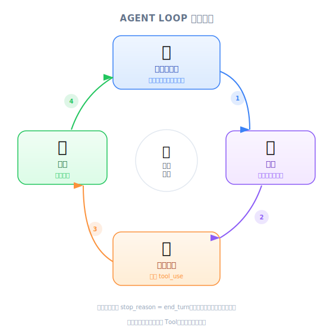
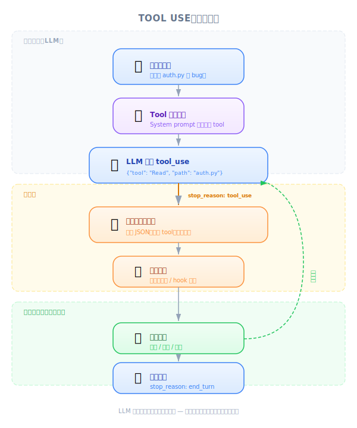

# What Is a Coding Assistant — 工程师深度解析

| 项目 | 内容 |
|------|------|
| 考试领域 | D2 — Tool Design & MCP Integration (18%) |
| Task Statements | 2.1 (tool interfaces), 2.5 (built-in tools), 1.1 (agentic loops) |
| 来源 | claude-code-in-action / 01-intro / Lesson 03 |

---

## 一句话摘要

Coding assistant 是一个包在 agentic loop 里的 language model — 它通过 tool use 机制收集上下文、规划步骤、执行动作，因为 LM 本身只能处理文字。

---

## Agentic Loop：助手如何思考



*圖：Agent 迴圈 — 蒐集上下文、規劃、執行、評估、重複。*

每个 coding assistant 都遵循同一个基本循环：

<!-- diagram: agentic-loop — Task → Gather Context (读文件、搜索代码) → Plan (拆解步骤) → Take Action (编辑文件、执行命令) → Evaluate → Loop or Finish -->

1. **收集上下文 (Gather context)** — 读取文件、搜索代码库、理解当前状态
2. **规划 (Plan)** — 把任务拆成步骤，决定执行哪些动作
3. **执行动作 (Take action)** — 执行工具（读取、写入、跑命令）
4. **评估 (Evaluate)** — 检查任务是否完成；若否，回到步骤一

这不是单次问答。它是一个 **多轮循环**，助手会根据工具返回的结果持续调整策略。

> 💡 **核心概念**
>
> Agentic loop 是 coding assistant 与 chatbot 的根本差异。Chatbot 给你一次回应；coding assistant 会持续工作直到任务完成。

---

## Tool Use：连接文字与行动



*圖：工具使用如何連接文本生成與真實世界動作。*

核心问题：**language model 只能处理和生成文字**。它无法读文件、跑命令或修改代码。它是纯粹的 text-in, text-out 函数。

Tool use 是弥补这个缺口的机制：

<!-- diagram: tool-use-flow — 用户提问 → Coding assistant 把工具说明加入 LM context → LM 用结构化格式回应 (e.g., "ReadFile: main.go") → 助手拦截并执行 → 把文件内容送回 LM → LM 生成最终回答 -->

**以 ReadFile 为例的完整流程：**

1. 你问："main function 做了什么？"
2. Coding assistant 把工具描述加入 LM 的 context
3. LM 用结构化格式回应：`ReadFile: main.go`
4. 助手拦截这个请求，从磁盘读取实际文件
5. 文件内容被送回 LM
6. LM 现在有了真实代码，生成有根据的回答

LM 从未接触过文件系统。助手是将文字请求转换为真实动作的中介者。

```
User: "main.go 做了什么？"
     │
     ▼
┌─────────────────────────┐
│  Coding assistant 把     │
│  工具描述加入 LM context  │
└────────┬────────────────┘
         ▼
┌─────────────────────────┐
│  LM 回应：               │
│  "ReadFile: main.go"    │
└────────┬────────────────┘
         ▼
┌─────────────────────────┐
│  助手执行：              │
│  从磁盘读取 main.go      │
└────────┬────────────────┘
         ▼
┌─────────────────────────┐
│  文件内容送回 LM          │
└────────┬────────────────┘
         ▼
┌─────────────────────────┐
│  LM 根据真实代码          │
│  生成最终回答             │
└─────────────────────────┘
```

> 🎬 **讲师视频观点**
>
> 讲师强调 coding assistant 会"把指令加入 context"告诉 LM 如何请求工具。LM 并非天生知道怎么调用工具 — 它必须通过 prompt/context 学会用助手能解析并执行的结构化格式回应。

---

## 为什么 Claude 的 Tool Use 不同

并非所有 language model 的 tool use 能力都一样。Claude 系列（Opus、Sonnet、Haiku）在这项能力上 **特别强**。这很重要，因为：

| 优势 | 说明 |
|------|------|
| **处理复杂任务** | 强大的 tool use 意味着 Claude 能在多轮对话中可靠地串联多个工具，不会迷失方向 |
| **可扩展平台** | 因为 Claude 擅长理解工具描述，你可以添加自定义工具，Claude 只需最少配置就能正确使用 |
| **更好的安全性** | Claude Code 不需要预先索引你的代码库。它通过工具按需读取文件，你的代码不会存储在任何外部系统 |

> 💡 **核心概念**
>
> Tool use 的质量是 Claude Code 能作为产品存在的基础。如果 Claude 的 tool use 平庸，把它包在 agentic loop 里只会产生不可靠的结果。模型在结构化工具调用上的强项才是根基。

---

## 熟悉的类比

| 概念 | 类比 | 为什么适合 |
|------|------|-----------|
| Tool use | API middleware — 拦截并执行结构化请求 | 助手拦截 LM 的"请求"并转换为真实动作 |
| 没有工具的 LM | 顾问能给建议但无法登录你的系统 | 聪明但物理上无法执行任何事 |
| Agentic loop | REPL (Read-Eval-Print Loop) | 持续的输入、执行、输出、重复循环 |
| 工具描述 | OpenAPI spec / Swagger 文档 | 告诉消费者有哪些 endpoint、接受什么、返回什么 |
| LM 的工具回应 | HTTP 请求 — 有 method 和 parameters 的结构化格式 | `ReadFile: main.go` 就像 `GET /files/main.go` |

---

## 考试重点：Tool Use 基础

本课建立了 D1 和 D2 考试的 **基础心智模型**：

| 考试概念 | 本课教了什么 |
|---------|------------|
| **Tool interface 设计 (2.1)** | 工具需要清楚的描述，LM 才知道何时、如何使用 |
| **内置工具选择 (2.5)** | Claude Code 内置 ReadFile、Write、Bash 等工具 — 针对任务选择正确的工具 |
| **Agentic loop (1.1)** | 收集-规划-执行循环是每个 coding assistant 的架构 |

考试测试的关键区别：

- **LM vs. coding assistant** — LM 是大脑；coding assistant 是完整系统（大脑 + 工具 + 循环）
- **工具描述质量很重要** — 描述模糊的工具会被误用；描述清楚的工具会被正确使用
- **不需索引 = 更好的安全性** — Claude Code 按需读取，不是从预建索引读取

> 🎯 **考试提醒**
>
> 当题目问"coding assistant 内部如何运作"，答案围绕 agentic loop + tool use 机制。不要与 prompt engineering 混淆 — tool use 是一个 **架构** 模式，不是 prompting 技巧。

---

## 练习题

### Q1: Tool Use 机制

一位初级工程师问："如果 language model 只能处理文字，Claude Code 怎么读取文件？"哪个解释最准确？

- A. Claude Code 会预先把整个代码库索引到模型的训练数据中
- B. Language model 生成结构化的工具请求，coding assistant 拦截、在文件系统上执行，再把结果返回给模型
- C. Claude Code 使用另一个专门训练来读文件的较小模型
- D. Language model 通过内置 API 直接访问文件系统

<details><summary>答案</summary>

**B** — 这正是课程描述的机制。LM 生成结构化请求（如 `ReadFile: main.go`），助手执行它，再把内容送回。

- A 错误 — Claude Code 不做预先索引；这被明确指出是安全优势
- C 错误 — 没有独立的读文件模型
- D 错误 — LM 无法直接访问任何东西；它们是 text-in, text-out

考试哲学：**Architecture > Prompt** — tool use 是结构性机制，不是 prompt 技巧
</details>

### Q2: 通过 Tool Use 实现可扩展性

你的团队想为 Claude Code 增加一个自定义的数据库查询工具。根据本课描述的 tool use 机制，成功的最关键因素是什么？

- A. 用数据库查询示例微调模型
- B. 撰写清楚的工具描述，让模型知道何时以及如何请求数据库查询
- C. 预先加载所有数据库 schema 到模型的 context window
- D. 为每种可能的查询模式创建 few-shot 示例

<details><summary>答案</summary>

**B** — 课程解释 coding assistant 把工具描述加入 LM 的 context，LM 根据这些描述学会使用工具。清楚的描述是正确使用工具的关键。

- A 不必要 — Claude 不需微调就能处理 tool use
- C 不切实际且浪费 context window
- D 无法扩展，效果也不如好的工具描述

考试哲学：**Tool description > Few-shot** — 好的工具接口描述比示例更有效
</details>

### Q3: 安全架构

一个重视安全的组织正在评估 Claude Code，他们担心代码泄露。根据本课，关于 Claude Code 架构的哪个说法正确？

- A. Claude Code 需要把整个代码库上传到 Anthropic 的服务器进行索引
- B. Claude Code 建立本地向量数据库进行语义搜索
- C. Claude Code 通过 tool use 按需读取文件，不需要预先索引或外部存储
- D. Claude Code 只能处理在对话中明确分享的代码

<details><summary>答案</summary>

**C** — 课程明确指出 Claude Code 基于工具的架构不需要预先索引。文件在模型通过 tool use 机制请求时按需读取。

- A 与 Claude Code 的运作方式相反
- B 描述的是 RAG 方法，不是 Claude Code 的运作方式
- D 过于限制 — Claude Code 可以通过工具读取任何文件，不只是对话中的内容

考试哲学：**Proportionate response** — 在做安全评估前先理解实际架构
</details>
