# What Is a Coding Assistant — 什麼是 Coding Assistant — 影片逐幀學習指南

| 項目 | 內容 |
|------|------|
| 課程 | claude-code-in-action / 01-intro / 03-what-is-a-coding-assistant |
| 影片 | What Is a Coding Assistant |
| 字幕數 | 93 段 |
| 格式 | 每段字幕一張截圖 + 雙語字幕（英/中） |

---

### [00:00:00] 第 1 段

> **EN:** In this video, we're going to get a better understanding of what a coding assistant is.
>
> **ZH:** 在這支影片中，我們要更深入了解 coding assistant 到底是什麼。

---

### [00:00:04] 第 2 段

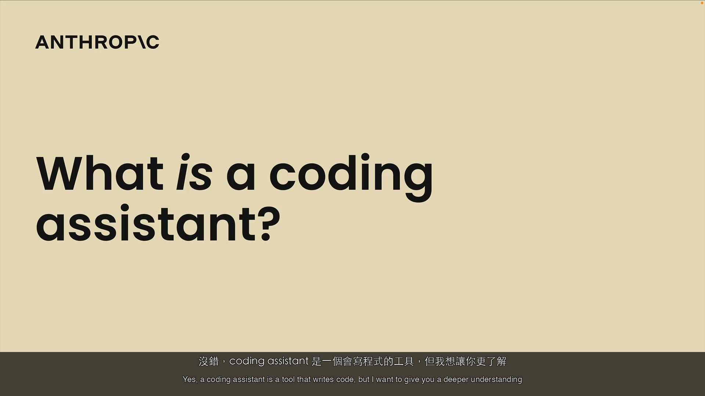

> **EN:** Yes, a coding assistant is a tool that writes code, but I want to give you a deeper understanding
>
> **ZH:** 沒錯，coding assistant 是一個會寫程式的工具，但我想讓你更了解

---

### [00:00:09] 第 3 段

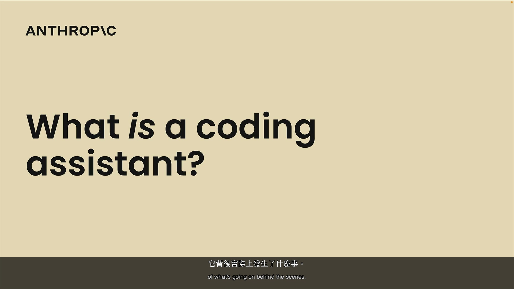

> **EN:** of what's going on behind the scenes.
>
> **ZH:** 它背後實際上發生了什麼事。

---

### [00:00:11] 第 4 段

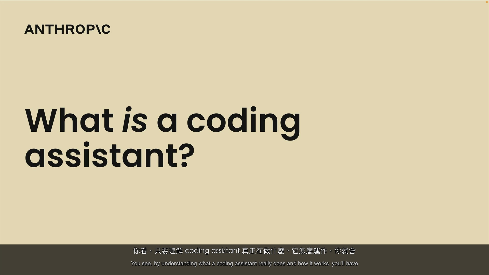

> **EN:** You see, by understanding what a coding assistant really does and how it works, you'll have
>
> **ZH:** 你看，只要理解 coding assistant 真正在做什麼、它怎麼運作，你就會

---

### [00:00:16] 第 5 段

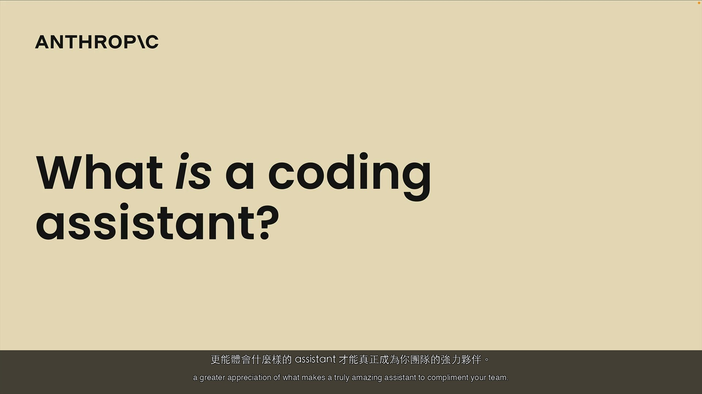

> **EN:** a greater appreciation of what makes a truly amazing assistant to compliment your team.
>
> **ZH:** 更能體會什麼樣的 assistant 才能真正成為你團隊的強力夥伴。

---

### [00:00:22] 第 6 段

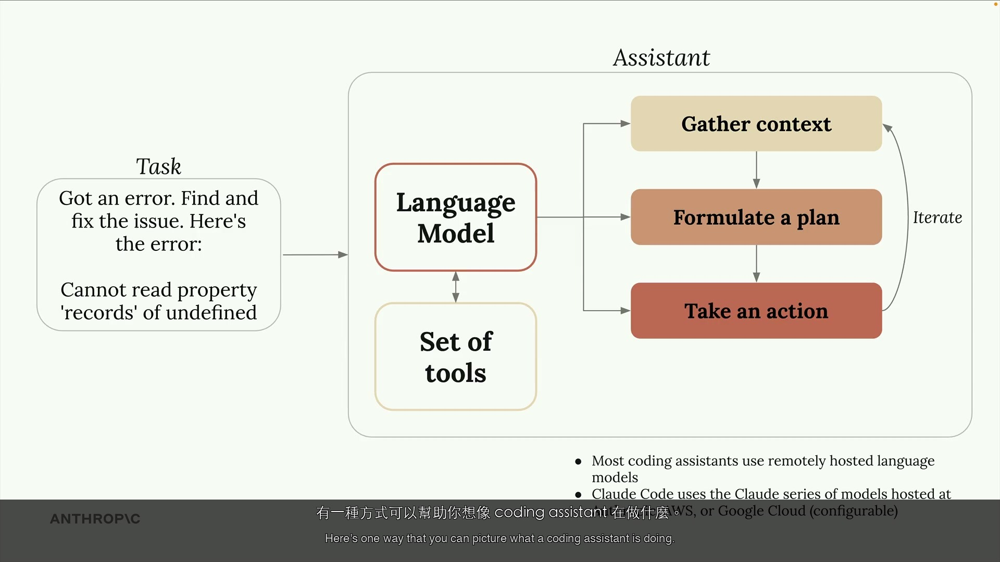

> **EN:** Here's one way that you can picture what a coding assistant is doing.
>
> **ZH:** 有一種方式可以幫助你想像 coding assistant 在做什麼。

---

### [00:00:25] 第 7 段

> **EN:** An assistant is first given a task.
>
> **ZH:** assistant 首先會收到一個任務。

---

### [00:00:27] 第 8 段

> **EN:** In this case, maybe the assistant needs to fix a bug based upon some kind of error message.
>
> **ZH:** 比如說，assistant 可能需要根據某個錯誤訊息來修一個 bug。

---

### [00:00:32] 第 9 段

> **EN:** This task is passed off internally to a language model, which needs to figure out how to solve
>
> **ZH:** 這個任務會在內部傳給一個 language model，它需要想辦法

---

### [00:00:36] 第 10 段

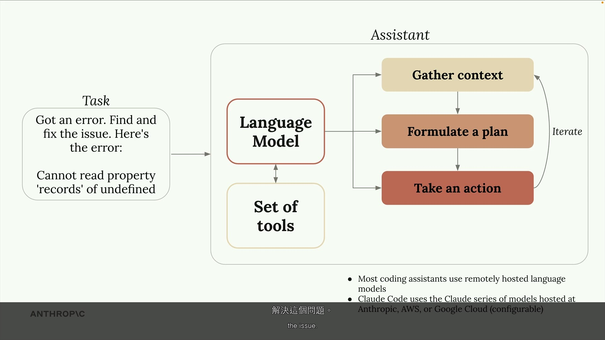

> **EN:** the issue.
>
> **ZH:** 解決這個問題。

---

### [00:00:37] 第 11 段

> **EN:** Now, different language models solve problems in very different styles depending upon the
>
> **ZH:** 不同的 language model 會用非常不同的方式解題，取決於

---

### [00:00:40] 第 12 段

> **EN:** complexity of the task, but in many cases, they work very much like how a human would
>
> **ZH:** 任務的複雜程度，但在很多情況下，它的運作方式其實跟人類

---

### [00:00:45] 第 13 段

> **EN:** work.
>
> **ZH:** 很像。

---

### [00:00:46] 第 14 段

> **EN:** It first might need to gather context by understanding what the error is referring to, what area in
>
> **ZH:** 它首先可能需要收集背景資訊，了解這個錯誤指的是什麼、是哪個部分的

---

### [00:00:50] 第 15 段

> **EN:** the code base is thrown in the error, and what files seem to be relevant.
>
> **ZH:** 程式碼丟出這個錯誤，以及哪些檔案看起來是相關的。

---

### [00:00:54] 第 16 段

> **EN:** Once it has gathered that information, it then needs to formulate a plan on how it will actually
>
> **ZH:** 收集完這些資訊之後，它就需要擬定一個計畫，決定要怎麼

---

### [00:00:58] 第 17 段

> **EN:** accomplish the task.
>
> **ZH:** 完成這個任務。

---

### [00:01:00] 第 18 段

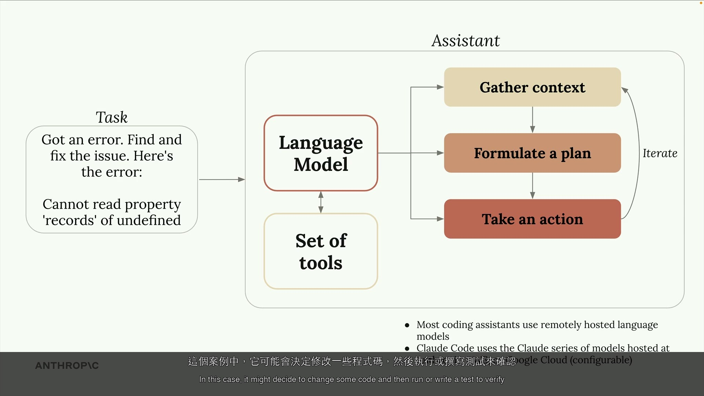

> **EN:** In this case, it might decide to change some code and then run or write a test to verify
>
> **ZH:** 這個案例中，它可能會決定修改一些程式碼，然後執行或撰寫測試來確認

---

### [00:01:04] 第 19 段

> **EN:** that the issue is actually fixed.
>
> **ZH:** 問題是否真的修好了。

---

### [00:01:06] 第 20 段

> **EN:** Finally, it will take an action.
>
> **ZH:** 最後，它會採取行動。

---

### [00:01:08] 第 21 段

> **EN:** In this case, that might be updating a file and running the tests.
>
> **ZH:** 在這個案例中，可能就是更新檔案並執行測試。

---

### [00:01:11] 第 22 段

> **EN:** Now, I want to give you some more information on this entire process.
>
> **ZH:** 現在，我想給你更多關於這整個過程的說明。

---

### [00:01:15] 第 23 段

> **EN:** In particular, I'd like you to notice that the first and last steps here require the coding
>
> **ZH:** 特別是，我希望你注意到這裡的第一步和最後一步都需要 coding

---

### [00:01:20] 第 24 段

> **EN:** assistant to actually do something.
>
> **ZH:** assistant 實際去做一些事情。

---

### [00:01:22] 第 25 段

> **EN:** In other words, to actually gather information from the outside world or affect the outside
>
> **ZH:** 換句話說，就是要從外部世界獲取資訊，或者以某種方式

---

### [00:01:26] 第 26 段

> **EN:** world in some way.
>
> **ZH:** 影響外部世界。

---

### [00:01:28] 第 27 段

> **EN:** For example, to gather context, the assistant needs to maybe read a file or fetch some documentation
>
> **ZH:** 比如說，要收集背景資訊，assistant 可能需要讀取一個檔案，或是抓取一些線上的

---

### [00:01:33] 第 28 段

> **EN:** online.
>
> **ZH:** 文件。

---

### [00:01:34] 第 29 段

> **EN:** And for taking an action, the assistant might need to actually run a command or edit a file.
>
> **ZH:** 而執行行動時，assistant 可能需要實際執行一個指令或編輯一個檔案。

---

### [00:01:40] 第 30 段

> **EN:** Now having a language model actually do these things is a little bit trickier than it actually
>
> **ZH:** 要讓 language model 真正做到這些事，其實比聽起來

---

### [00:01:44] 第 31 段

> **EN:** sounds.
>
> **ZH:** 要複雜一些。

---

### [00:01:46] 第 32 段

> **EN:** Let me help you understand why that is.
>
> **ZH:** 讓我來幫你理解為什麼會這樣。

---

### [00:01:48] 第 33 段

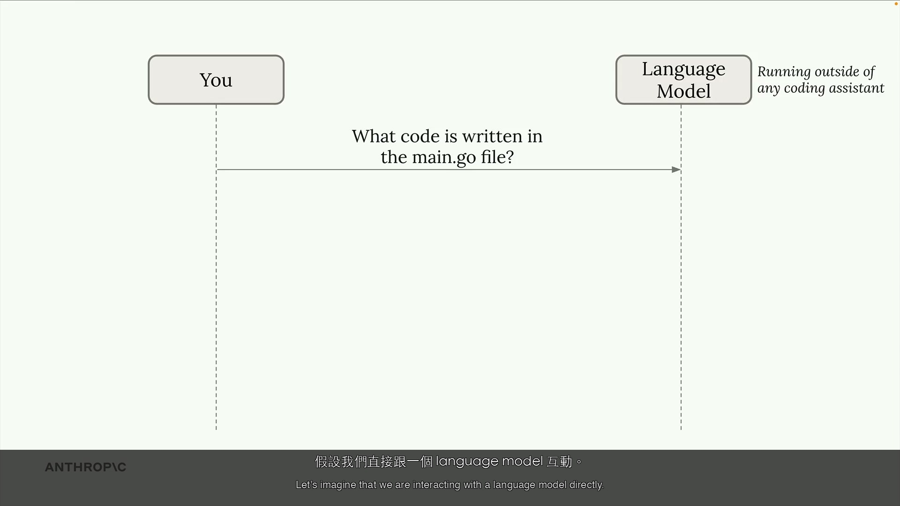

> **EN:** Let's imagine that we are interacting with a language model directly.
>
> **ZH:** 假設我們直接跟一個 language model 互動。

---

### [00:01:51] 第 34 段

> **EN:** So it's not running inside of any coding assistant or anything like that.
>
> **ZH:** 也就是說，它沒有在任何 coding assistant 或類似工具裡面跑。

---

### [00:01:56] 第 35 段

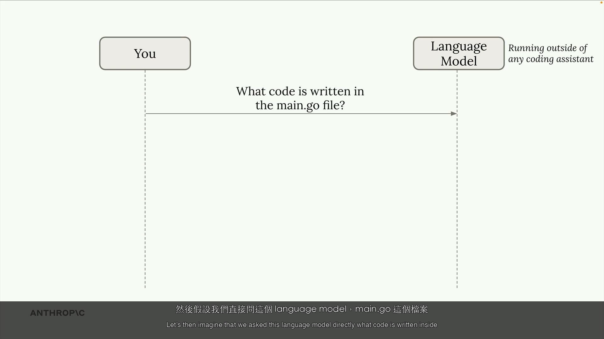

> **EN:** Let's then imagine that we asked this language model directly what code is written inside
>
> **ZH:** 然後假設我們直接問這個 language model，main.go 這個檔案

---

### [00:02:00] 第 36 段

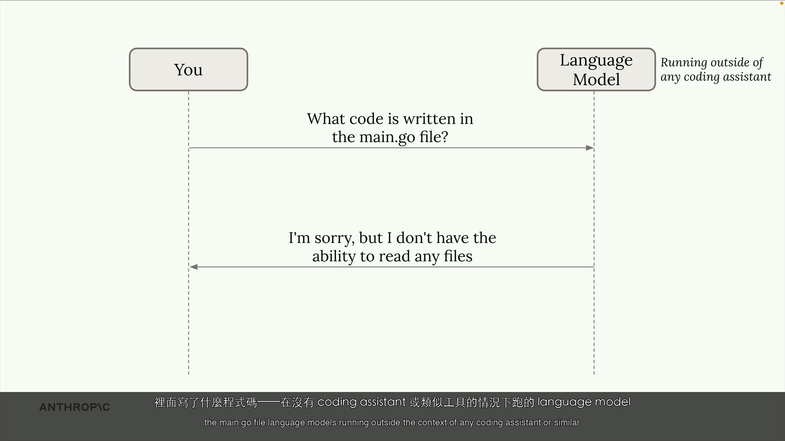

> **EN:** the main.go file language models running outside the context of any coding assistant or similar
>
> **ZH:** 裡面寫了什麼程式碼——在沒有 coding assistant 或類似工具的情況下跑的 language model

---

### [00:02:06] 第 37 段

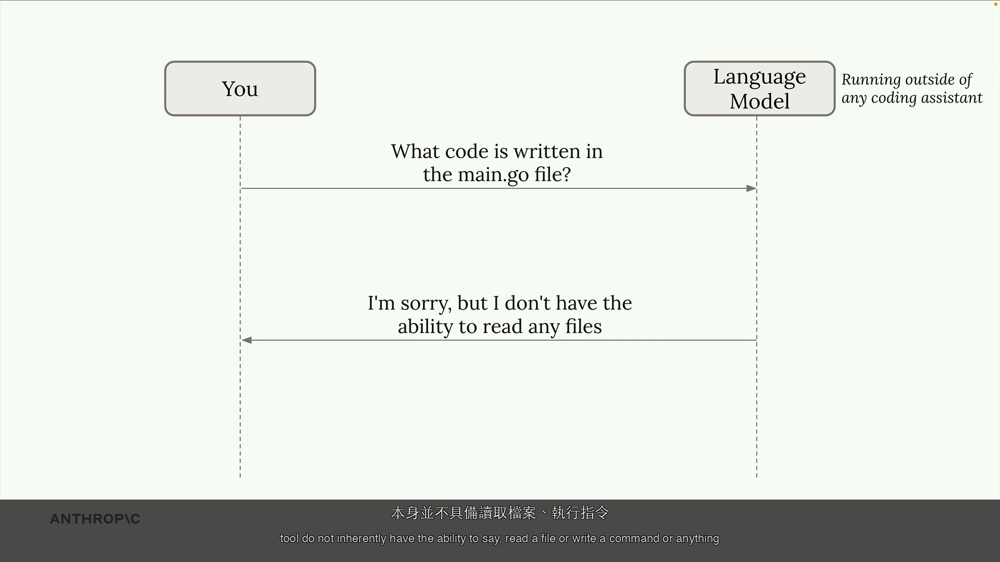

> **EN:** tool do not inherently have the ability to say, read a file or write a command or anything
>
> **ZH:** 本身並不具備讀取檔案、執行指令

---

### [00:02:12] 第 38 段

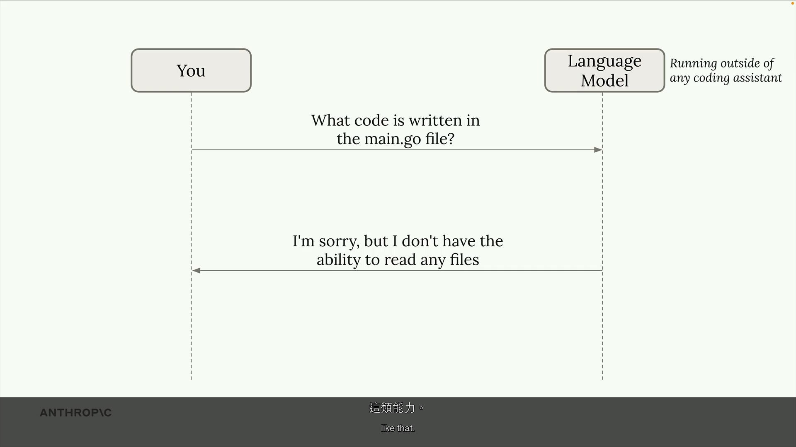

> **EN:** like that.
>
> **ZH:** 這類能力。

---

### [00:02:13] 第 39 段

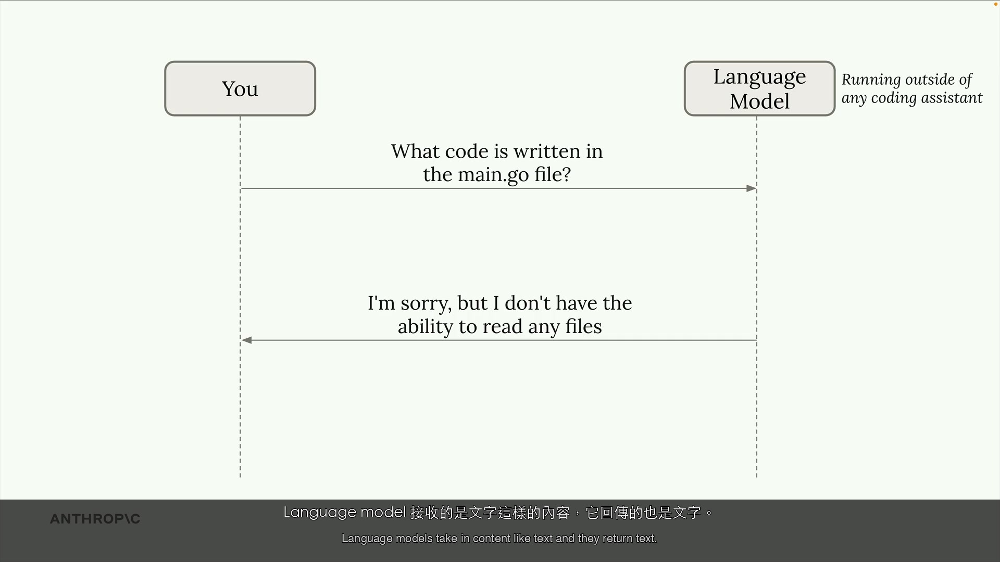

> **EN:** Language models take in content like text and they return text.
>
> **ZH:** Language model 接收的是文字這樣的內容，它回傳的也是文字。

---

### [00:02:17] 第 40 段

> **EN:** That's it.
>
> **ZH:** 就這樣。

---

### [00:02:18] 第 41 段

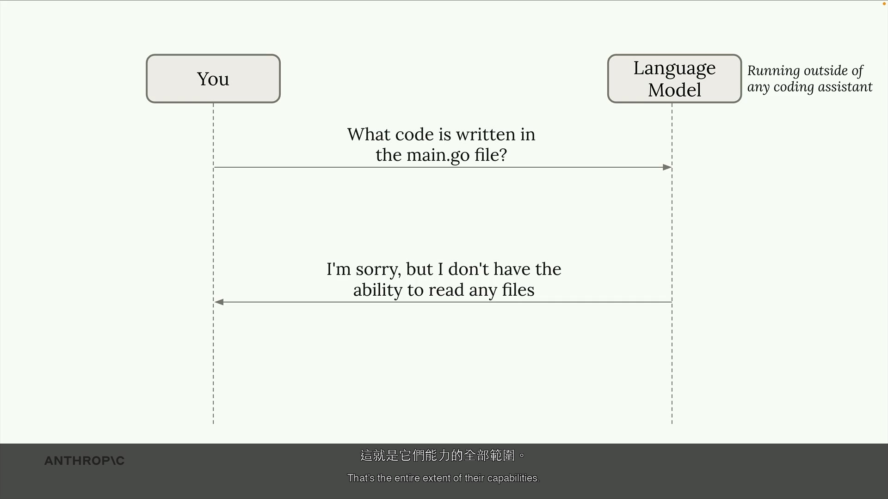

> **EN:** That's the entire extent of their capabilities.
>
> **ZH:** 這就是它們能力的全部範圍。

---

### [00:02:20] 第 42 段

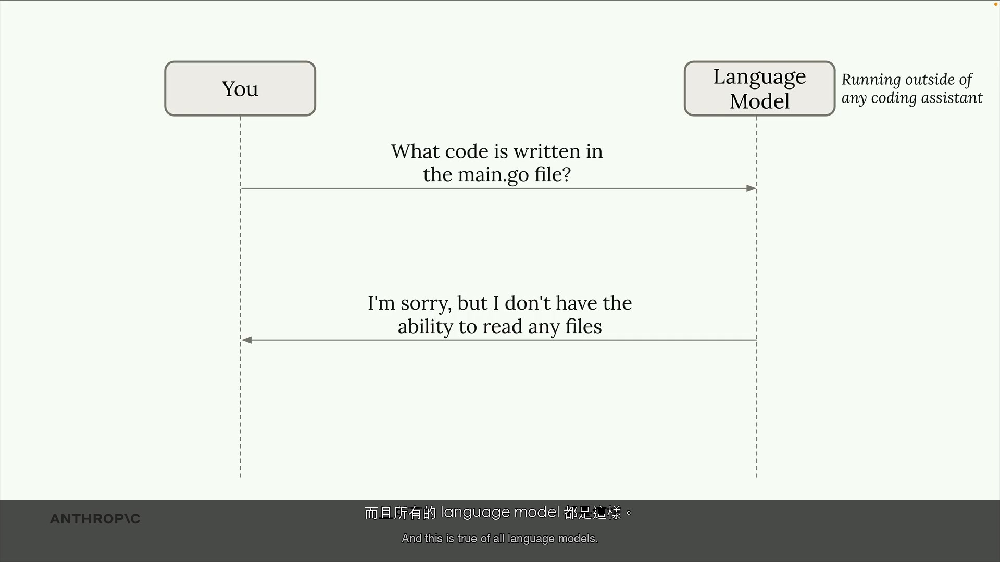

> **EN:** And this is true of all language models.
>
> **ZH:** 而且所有的 language model 都是這樣。

---

### [00:02:22] 第 43 段

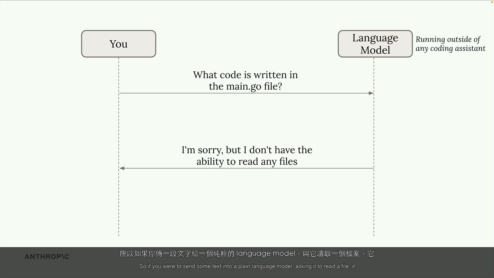

> **EN:** So if you were to send some text into a plain language model, asking it to read a file, it
>
> **ZH:** 所以如果你傳一段文字給一個純粹的 language model，叫它讀取一個檔案，它

---

### [00:02:27] 第 44 段

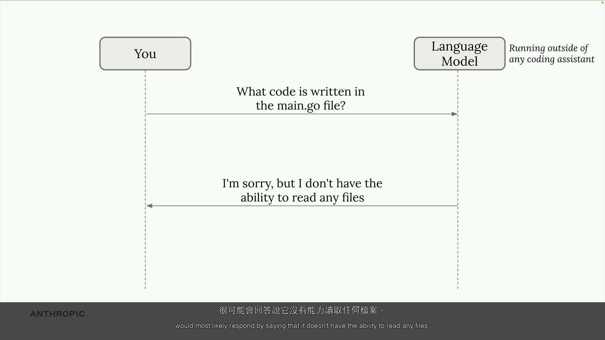

> **EN:** would most likely respond by saying that it doesn't have the ability to read any files.
>
> **ZH:** 很可能會回答說它沒有能力讀取任何檔案。

---

### [00:02:32] 第 45 段

> **EN:** So let me show you what coding assistants and many, many other tools out there do to actually
>
> **ZH:** 所以讓我來展示一下 coding assistant 和市面上很多很多其他工具，是怎麼做到

---

### [00:02:37] 第 46 段

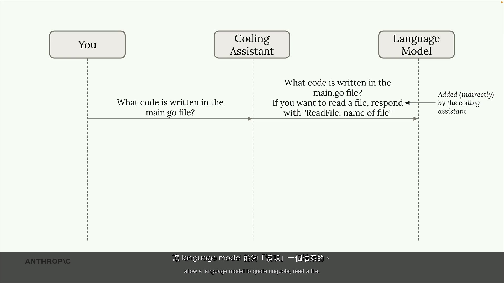

> **EN:** allow a language model to quote unquote, read a file.
>
> **ZH:** 讓 language model 能夠「讀取」一個檔案的。

---

### [00:02:40] 第 47 段

> **EN:** So here's what happens.
>
> **ZH:** 是這樣運作的。

---

### [00:02:42] 第 48 段

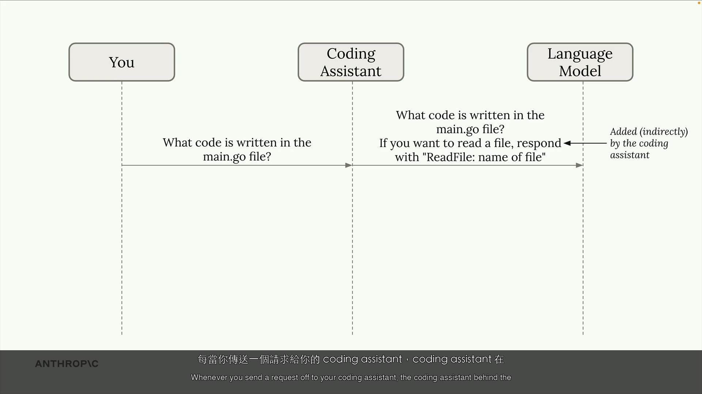

> **EN:** Whenever you send a request off to your coding assistant, the coding assistant behind the
>
> **ZH:** 每當你傳送一個請求給你的 coding assistant，coding assistant 在

---

### [00:02:45] 第 49 段

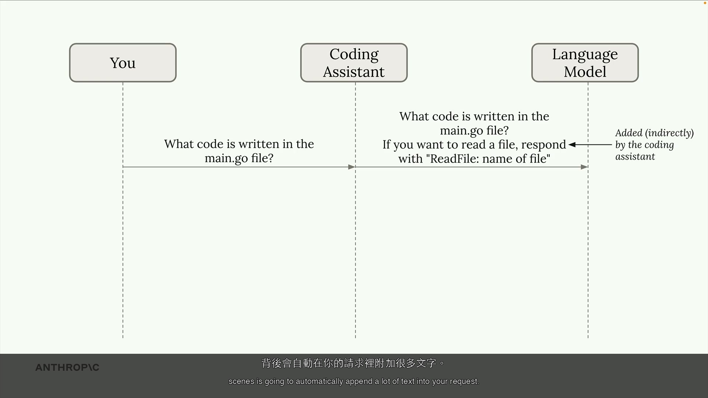

> **EN:** scenes is going to automatically append a lot of text into your request.
>
> **ZH:** 背後會自動在你的請求裡附加很多文字。

---

### [00:02:51] 第 50 段

> **EN:** In this particular case, we can imagine that the coding assistant is going to add on
>
> **ZH:** 在這個特別的案例中，我們可以想像 coding assistant 會加上

---

### [00:02:54] 第 51 段

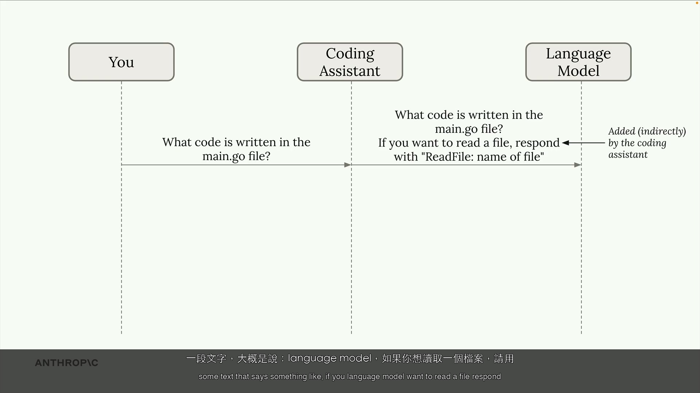

> **EN:** some text that says something like, if you language model want to read a file respond
>
> **ZH:** 一段文字，大概是說：language model，如果你想讀取一個檔案，請用

---

### [00:02:59] 第 52 段

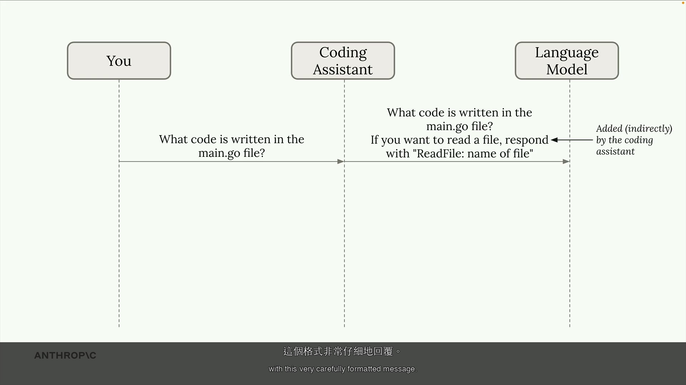

> **EN:** with this very carefully formatted message.
>
> **ZH:** 這個格式非常仔細地回覆。

---

### [00:03:01] 第 53 段

> **EN:** For example, maybe something like refile colon, and then the name of a file to read.
>
> **ZH:** 比如說，可能是像 readfile 加上冒號，再加上要讀取的檔案名稱。

---

### [00:03:06] 第 54 段

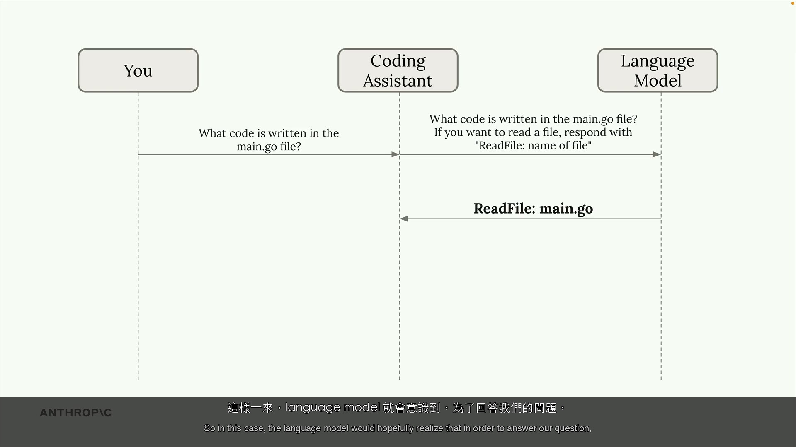

> **EN:** So in this case, the language model would hopefully realize that in order to answer our question,
>
> **ZH:** 這樣一來，language model 就會意識到，為了回答我們的問題，

---

### [00:03:11] 第 55 段

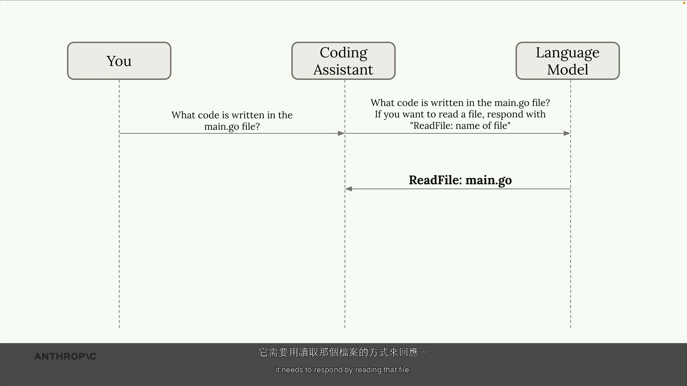

> **EN:** it needs to respond by reading that file.
>
> **ZH:** 它需要用讀取那個檔案的方式來回應。

---

### [00:03:14] 第 56 段

> **EN:** So it might respond with refile colon main.go.
>
> **ZH:** 所以它可能會回覆 readfile: main.go。

---

### [00:03:17] 第 57 段

> **EN:** Now the coding assistant would be in charge of receiving this very carefully formatted message
>
> **ZH:** 接下來 coding assistant 就負責接收這個格式非常仔細的訊息，

---

### [00:03:22] 第 58 段

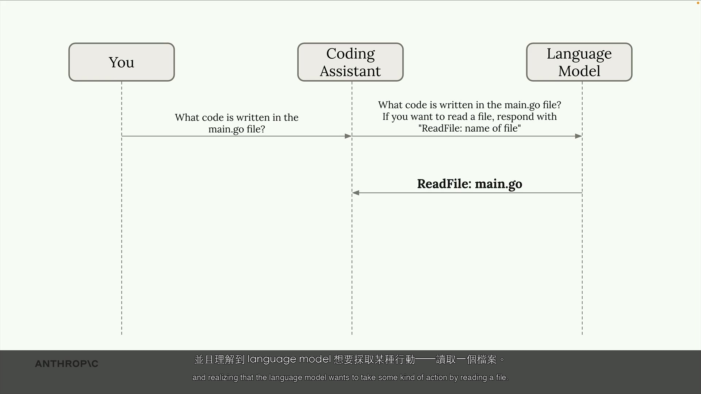

> **EN:** and realizing that the language model wants to take some kind of action by reading a file.
>
> **ZH:** 並且理解到 language model 想要採取某種行動——讀取一個檔案。

---

### [00:03:26] 第 59 段

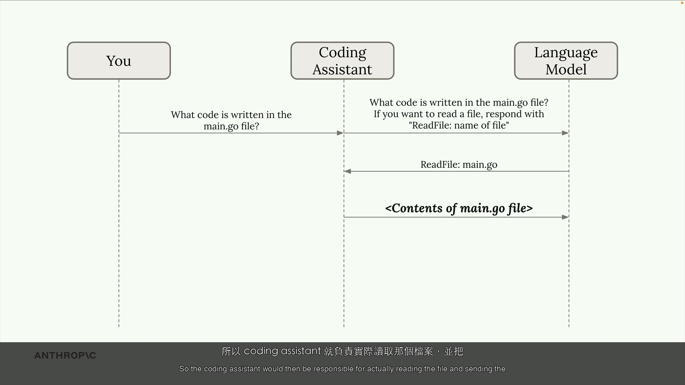

> **EN:** So the coding assistant would then be responsible for actually reading the file and sending the
>
> **ZH:** 所以 coding assistant 就負責實際讀取那個檔案，並把

---

### [00:03:31] 第 60 段

> **EN:** contents of that file back into the language model.
>
> **ZH:** 那個檔案的內容傳回給 language model。

---

### [00:03:34] 第 61 段

> **EN:** Now that the language model has received the actual contents of that file, it can write a
>
> **ZH:** 現在 language model 已經拿到那個檔案的實際內容，它就能寫出一個

---

### [00:03:38] 第 62 段

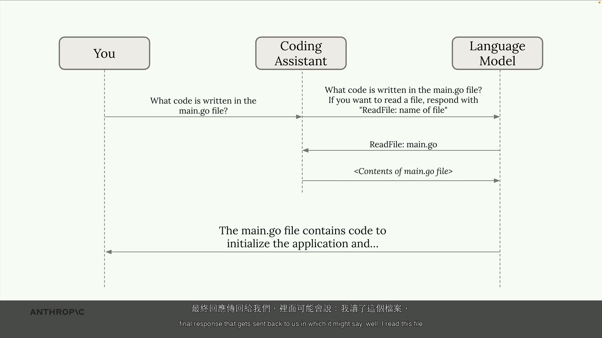

> **EN:** final response that gets sent back to us in which it might say, well, I read this file
>
> **ZH:** 最終回應傳回給我們，裡面可能會說：我讀了這個檔案，

---

### [00:03:43] 第 63 段

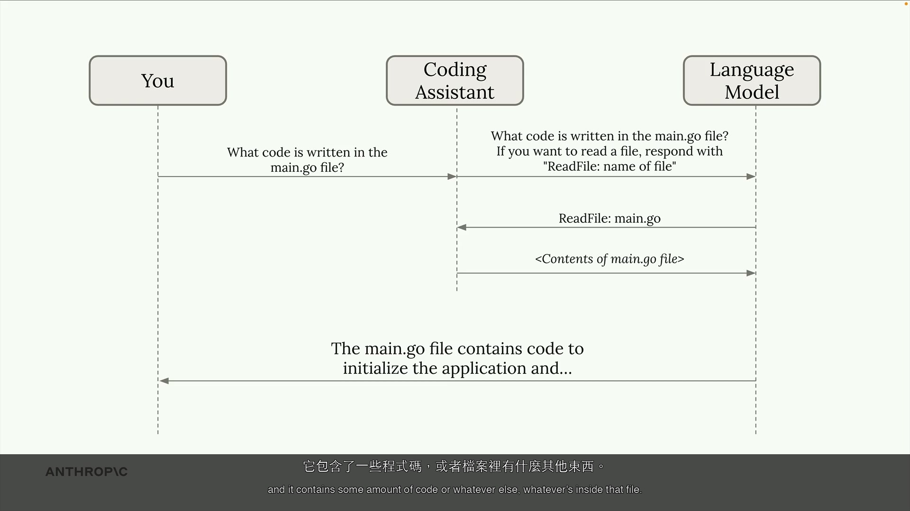

> **EN:** and it contains some amount of code or whatever else, whatever's inside that file.
>
> **ZH:** 它包含了一些程式碼，或者檔案裡有什麼其他東西。

---

### [00:03:47] 第 64 段

> **EN:** This entire system of giving a language model, these extra little instructions, asking it to respond
>
> **ZH:** 這整個系統——給 language model 這些額外的小指令，要求它用

---

### [00:03:52] 第 65 段

> **EN:** in a very well formatted or carefully formatted way is referred to as tool use.
>
> **ZH:** 非常規範的格式回應——就叫做 tool use。

---

### [00:03:57] 第 66 段

> **EN:** So tools are used to give models extra capabilities.
>
> **ZH:** 所以 tools 是用來給 model 額外的能力的。

---

### [00:04:00] 第 67 段

> **EN:** The model is responsible for responding in a very particular way.
>
> **ZH:** model 負責以非常特定的方式回應。

---

### [00:04:04] 第 68 段

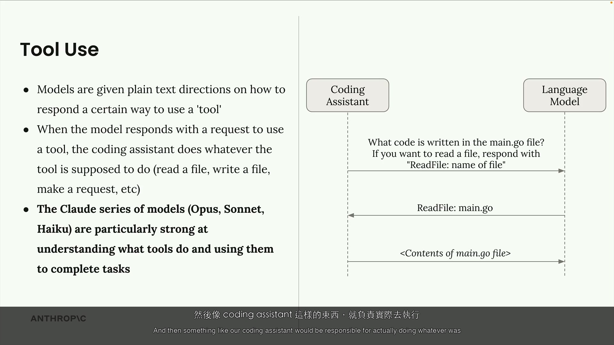

> **EN:** And then something like our coding assistant would be responsible for actually doing whatever was
>
> **ZH:** 然後像 coding assistant 這樣的東西，就負責實際去執行

---

### [00:04:08] 第 69 段

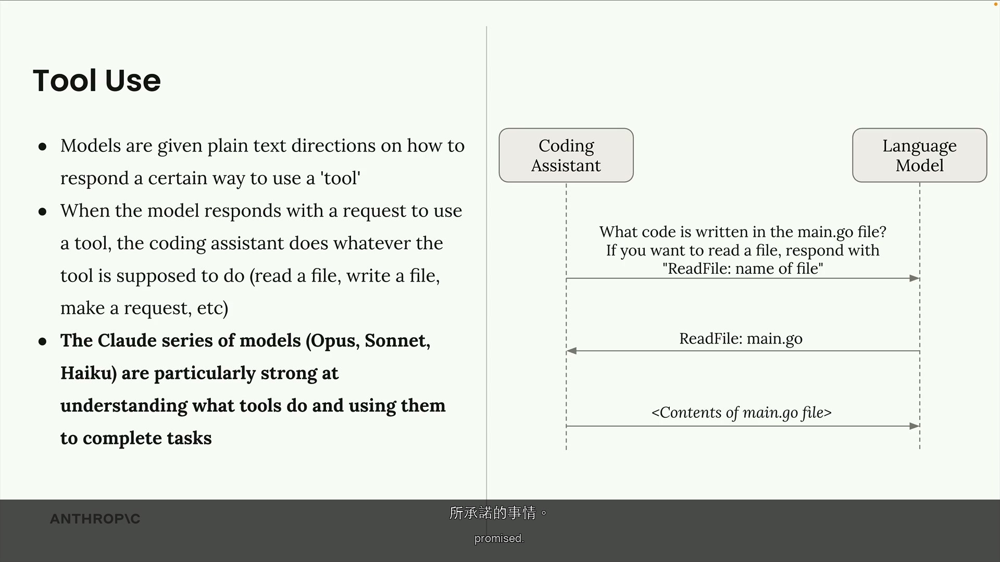

> **EN:** promised.
>
> **ZH:** 所承諾的事情。

---

### [00:04:09] 第 70 段

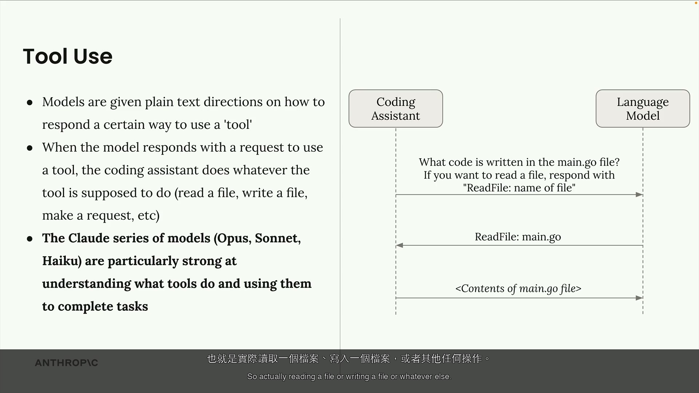

> **EN:** So actually reading a file or writing a file or whatever else.
>
> **ZH:** 也就是實際讀取一個檔案、寫入一個檔案，或者其他任何操作。

---

### [00:04:12] 第 71 段

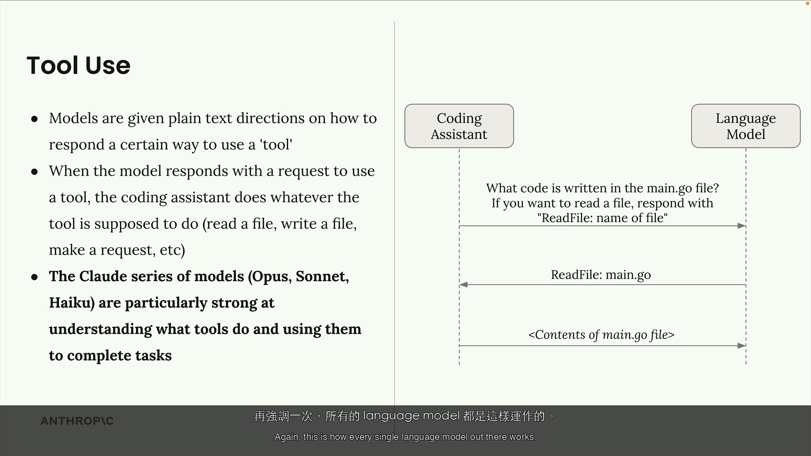

> **EN:** Again, this is how every single language model out there works.
>
> **ZH:** 再強調一次，所有的 language model 都是這樣運作的。

---

### [00:04:16] 第 72 段

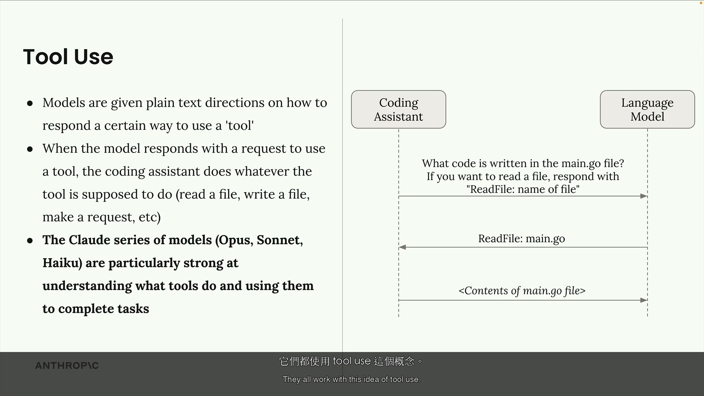

> **EN:** They all work with this idea of tool use.
>
> **ZH:** 它們都使用 tool use 這個概念。

---

### [00:04:18] 第 73 段

> **EN:** Now here's the critical part to understand the Claude series of models.
>
> **ZH:** 現在有一個關鍵點，是關於 Claude 這個系列的 model。

---

### [00:04:22] 第 74 段

> **EN:** So Opus, Sonnet and Haiku are particularly strong at understanding what tools do when they're called
>
> **ZH:** Opus、Sonnet 和 Haiku 在理解 tools 被呼叫時的作用這方面特別強，

---

### [00:04:29] 第 75 段

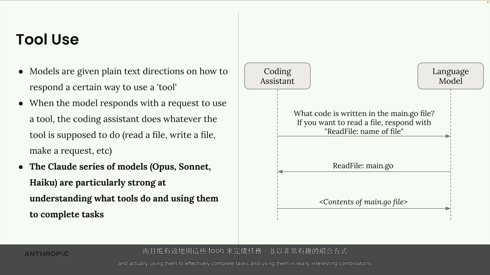

> **EN:** and actually using them to effectively complete tasks and using them in really interesting combinations
>
> **ZH:** 而且能有效地用這些 tools 來完成任務，並以非常有趣的組合方式

---

### [00:04:34] 第 76 段

> **EN:** to complete more advanced or complex tasks.
>
> **ZH:** 來完成更進階或更複雜的任務。

---

### [00:04:38] 第 77 段

> **EN:** Claude strong tool use is the absolute core strength of Claude code as a coding assistant.
>
> **ZH:** Claude 強大的 tool use 能力，是 Claude Code 作為 coding assistant 的絕對核心優勢。

---

### [00:04:42] 第 78 段

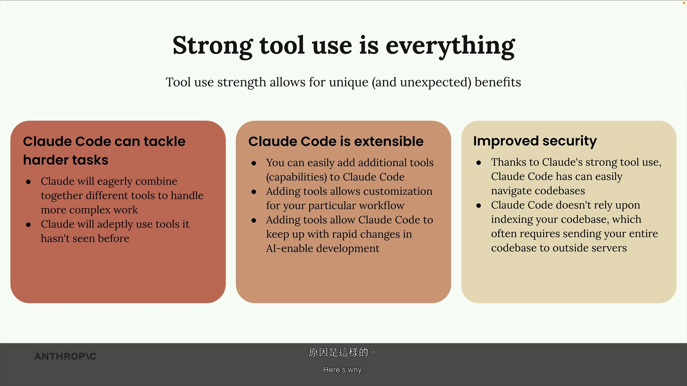

> **EN:** Here's why.
>
> **ZH:** 原因是這樣的。

---

### [00:04:44] 第 79 段

> **EN:** First, as I just mentioned, with better tool use, Claude can handle more complex tasks.
>
> **ZH:** 首先，就像我剛才提到的，有了更好的 tool use，Claude 能處理更複雜的任務。

---

### [00:04:49] 第 80 段

> **EN:** Second, Claude code itself is extensible.
>
> **ZH:** 其次，Claude Code 本身是可以擴充的。

---

### [00:04:51] 第 81 段

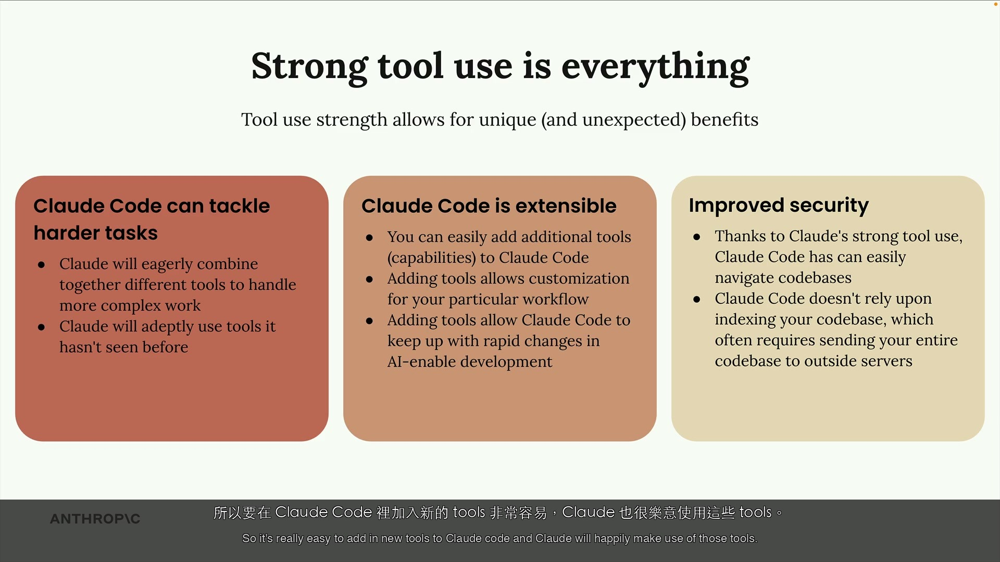

> **EN:** So it's really easy to add in new tools to Claude code and Claude will happily make use of those tools.
>
> **ZH:** 所以要在 Claude Code 裡加入新的 tools 非常容易，Claude 也很樂意使用這些 tools。

---

### [00:04:58] 第 82 段

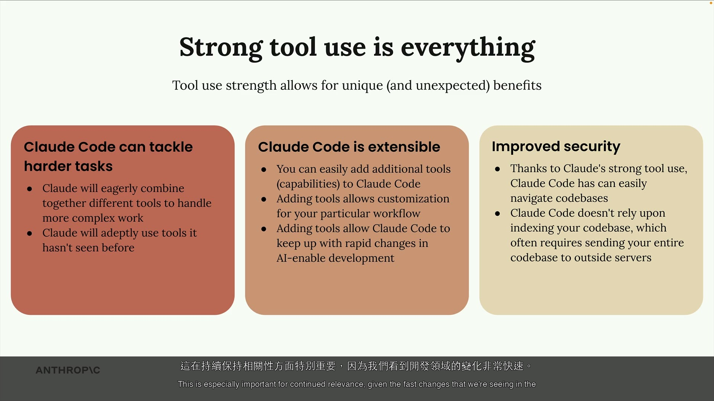

> **EN:** This is especially important for continued relevance, given the fast changes that we're seeing in the
>
> **ZH:** 這在持續保持相關性方面特別重要，因為我們看到開發領域的變化非常快速。

---

### [00:05:03] 第 83 段

> **EN:** world of development.
>
> **ZH:** 換句話說，Claude Code 是一個會在未來幾年跟著你一起進化的 assistant。

---

### [00:05:04] 第 84 段

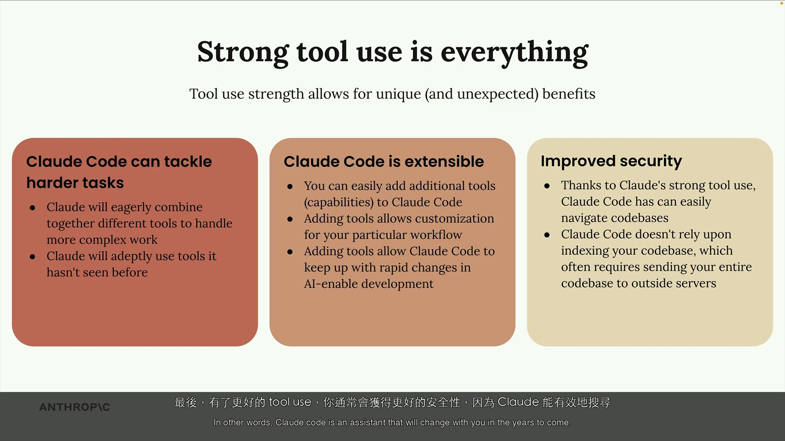

> **EN:** In other words, Claude code is an assistant that will change with you in the years to come.
>
> **ZH:** 最後，有了更好的 tool use，你通常會獲得更好的安全性，因為 Claude 能有效地搜尋

---

### [00:05:08] 第 85 段

> **EN:** And finally, with improved tool use, you often get better security because Claude can effectively search
>
> **ZH:** 你的程式碼庫來找到相關的程式碼，而不需要依賴索引——索引通常需要把你

---

### [00:05:15] 第 86 段

> **EN:** your code base to find relevant code without relying upon indexing, which often relies upon sending your
>
> **ZH:** 整個程式碼庫傳送到外部伺服器。

---

### [00:05:20] 第 87 段

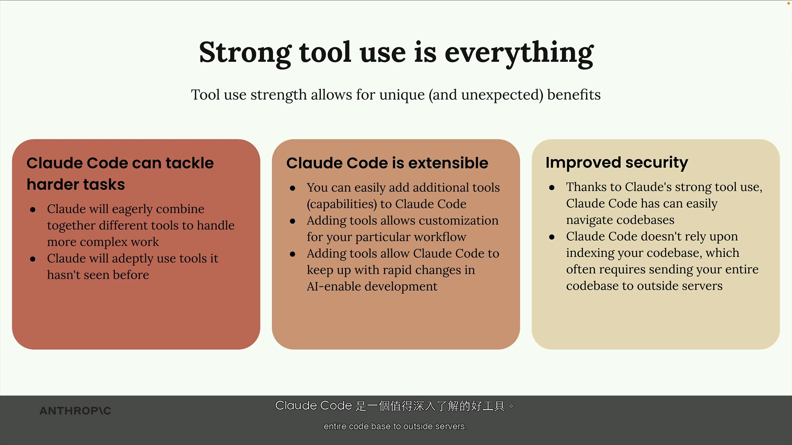

> **EN:** entire code base to outside servers.
>
> **ZH:** Claude Code 是一個值得深入了解的好工具。

---

### [00:05:22] 第 88 段

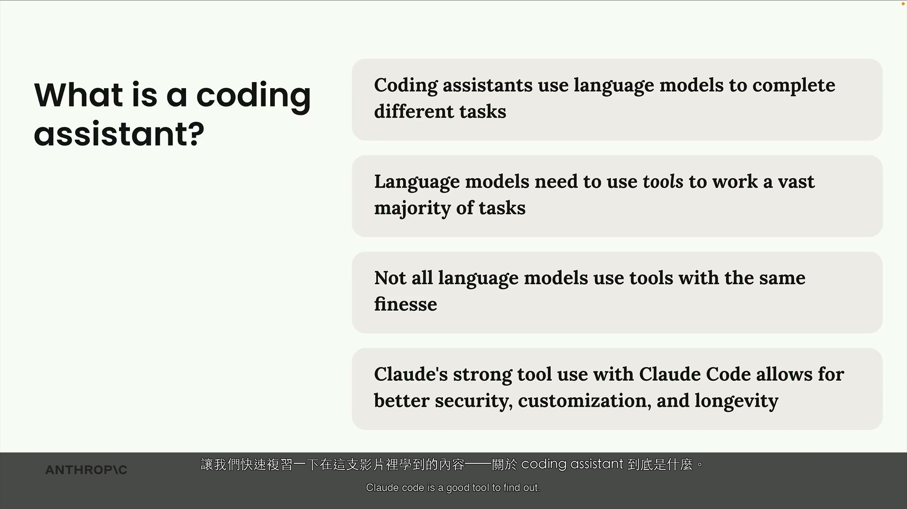

> **EN:** Claude code is a good tool to find out.
>
> **ZH:** 讓我們快速複習一下在這支影片裡學到的內容——關於 coding assistant 到底是什麼。

---

### [00:05:23] 第 89 段

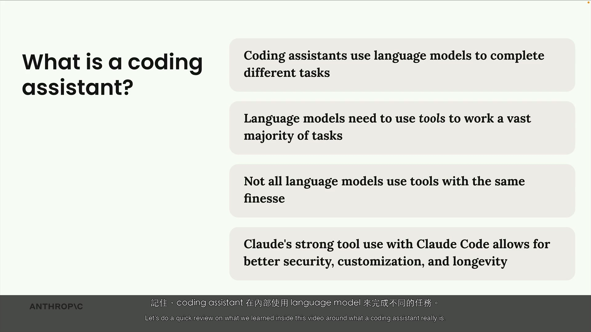

> **EN:** Let's do a quick review on what we learned inside this video around what a coding assistant really is.
>
> **ZH:** 記住，coding assistant 在內部使用 language model 來完成不同的任務。

---

### [00:05:27] 第 90 段

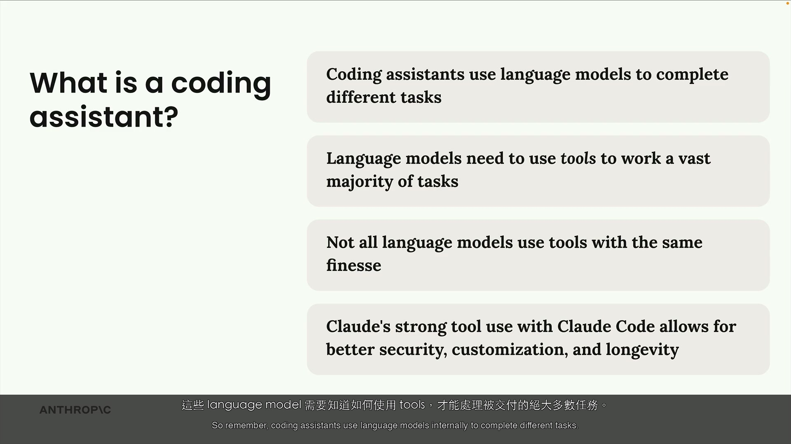

> **EN:** So remember, coding assistants use language models internally to complete different tasks.
>
> **ZH:** 這些 language model 需要知道如何使用 tools，才能處理被交付的絕大多數任務。

---

### [00:05:32] 第 91 段

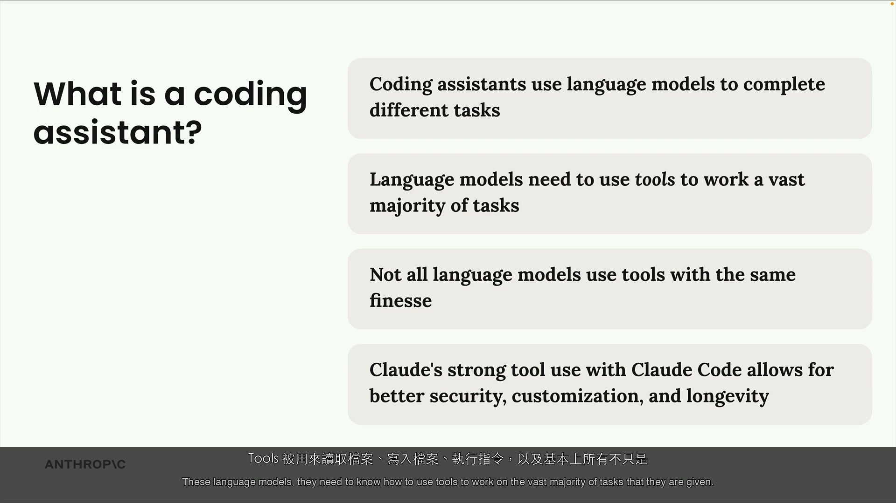

> **EN:** These language models, they need to know how to use tools to work on the vast majority of tasks that they are given.
>
> **ZH:** Tools 被用來讀取檔案、寫入檔案、執行指令，以及基本上所有不只是

---

### [00:05:38] 第 92 段

> **EN:** Tools are used to read files, write files, run commands, and essentially everything else that doesn't just
>
> **ZH:** 生成文字的操作。

---

### [00:05:43] 第 93 段

> **EN:** involve generating some text.
>
> **ZH:** 並不是所有的 language model 都在同一個水準上使用 tools，這對 coding assistant 整體的效率有很大的影響。

---
