# Claude Code in Action — 工程师深度解析

| Item | Detail |
|------|--------|
| Exam Domain | D2: Tool Design & MCP Integration (18%), D3: Claude Code Configuration & Workflows (20%) |
| Task Statements | 2.4 (MCP integration), 2.5 (built-in tools), 3.6 (CI/CD integration), 1.1 (agentic loops) |
| Source | Anthropic Skilljar — Claude Code in Action |

---

# PART 1: Official Course Content

> [!NOTE]
> 本节所有内容均直接来自官方课程教材。

## One-Liner / TL;DR

Claude Code 的威力来自智能化串接内置工具、通过 MCP 服务器扩展能力、以及集成 CI/CD 流水线——而非任何单一工具。

## Core Concepts

### Claude 是工具使用专家

课程强调 Claude 本质上是一个专业的工具使用者。Claude Code 设计为**可扩展**的——除了内置工具外，你可以通过 MCP 服务器和自定义集成来添加功能。

### 内置工具

Claude Code 内置一组用于文件 I/O、执行和搜索的默认工具：

| 工具 | 用途 |
|------|------|
| Read | 读取文件内容（支持图片、PDF、notebook） |
| Write | 创建或覆写文件 |
| Edit | 对现有文件进行精准、局部的编辑 |
| Bash | 执行 shell 命令 |
| Grep | 使用 regex 搜索文件内容（基于 ripgrep） |
| Glob | 按文件名/模式查找文件 |
| NotebookEdit | 编辑 Jupyter notebook 单元格 |
| WebFetch | 获取并分析网页内容 |
| WebSearch | 搜索网络上的实时信息 |

### 智能工具组合

让 Claude Code 真正强大的是它如何**组合**这些工具来处理复杂的多步骤问题。本课每个 demo 都展示了不同的串接模式——从 profiling 和 benchmarking 到执行 notebook 单元格和控制浏览器。

---

## Demo 演练：性能优化 — chalk 库

> [!NOTE]
> 讲师实机演示的逐步演练。截图取自实际课程视频。

**背景**：chalk 是 npm 第 5 大下载量包，每周约 4.29 亿次下载。即使是微小的性能改善都会对整个生态系统产生巨大影响。

| 步骤 | 发生了什么 | 截图 |
|------|-----------|------|
| 1 | 讲师介绍 chalk——npm 第 5 大下载量包，用于终端彩色文本 | 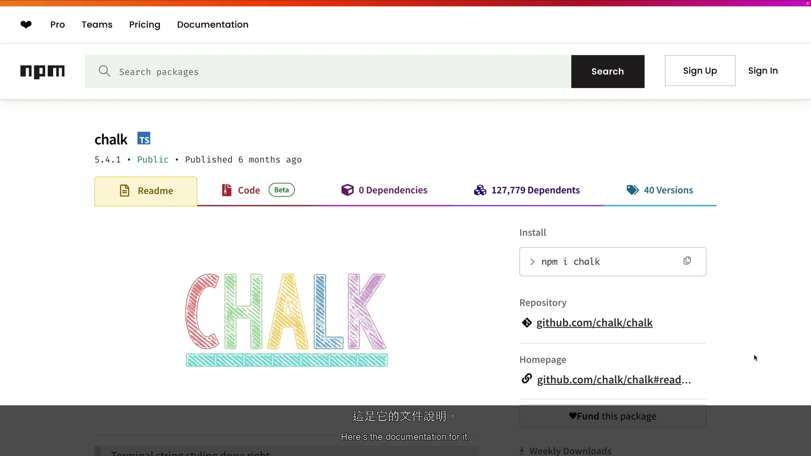 |
| 2 | 展示下载统计：每周 4.29 亿次下载 | 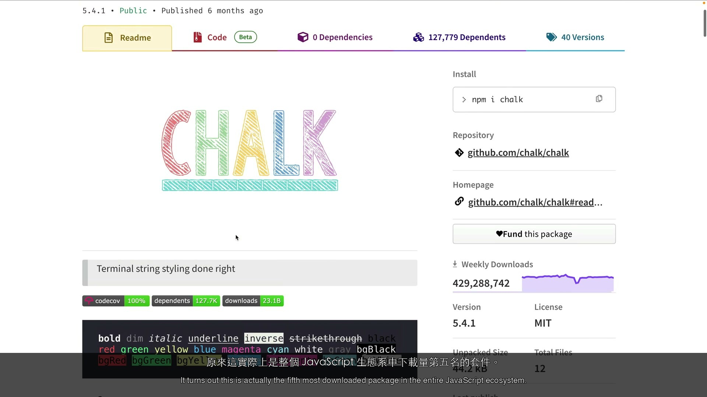 |
| 3 | 要求 Claude 找出并优化性能问题。Claude 创建 todo 列表跟踪进度，然后运行 benchmark 找出最差的情况 | 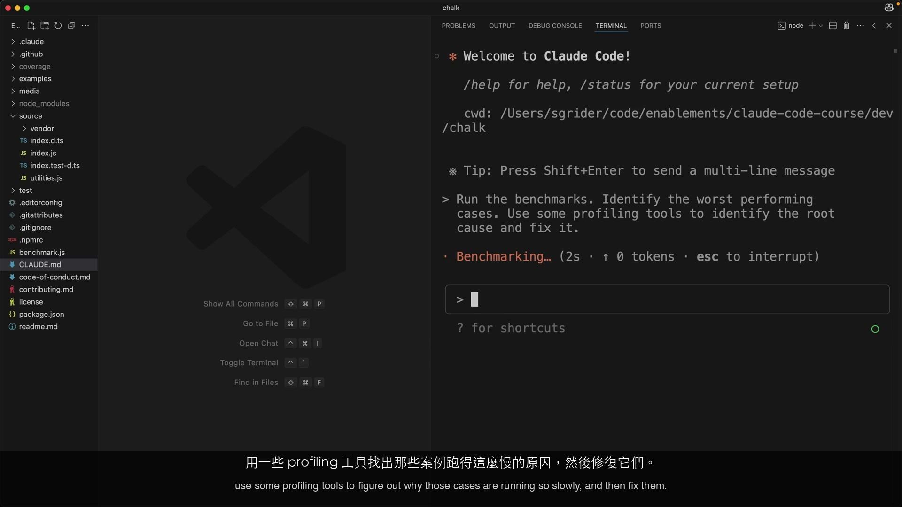 |
| 4 | Claude 编写文件聚焦在一个特定案例，然后使用 CPU profiler 了解为何缓慢 | 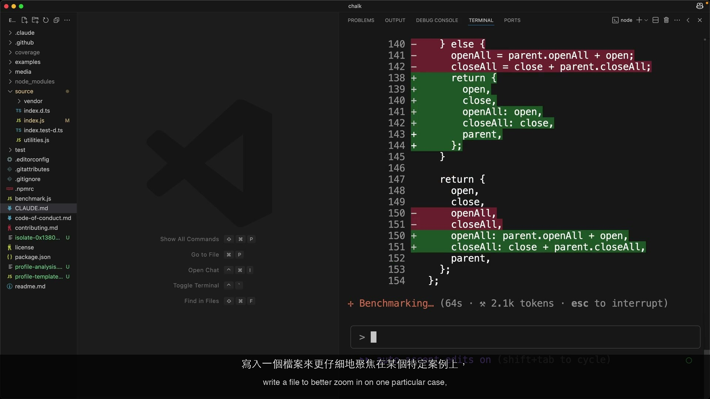 |
| 5 | Claude 实现优化并验证结果 | 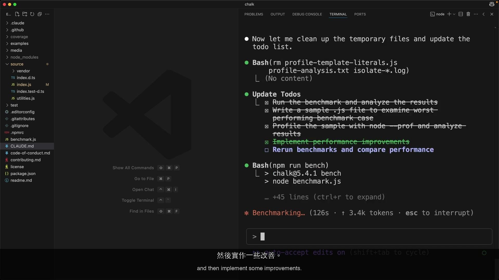 |

**结果**：目标操作达到 **3.9 倍吞吐量提升**。

> [!TIP]
> Claude 自行创建 todo 列表并跟踪复杂任务的进度。这种自我管理行为是 agentic loop 在多步骤中维持连贯性的方式——计划 → 执行 → 观察 → 优化。

---

## Demo 演练：Jupyter Notebook CSV 流失分析

> [!NOTE]
> Claude 不只是写代码——它会执行、读取结果、然后调整。

**背景**：视频流媒体平台用户的 CSV 数据集。目标：分析用户流失模式。

| 步骤 | 发生了什么 | 截图 |
|------|-----------|------|
| 1 | 讲师提供视频流媒体平台用户 CSV 数据，要求 Claude 在 Jupyter notebook 中分析流失原因 | 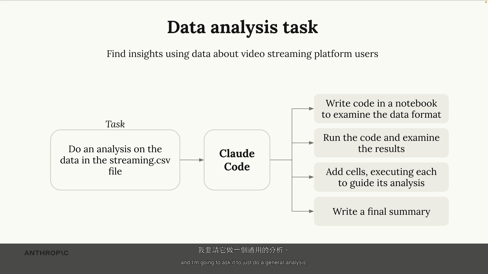 |
| 2 | Claude 将分析代码写入 notebook 单元格、执行并查看输出结果 | 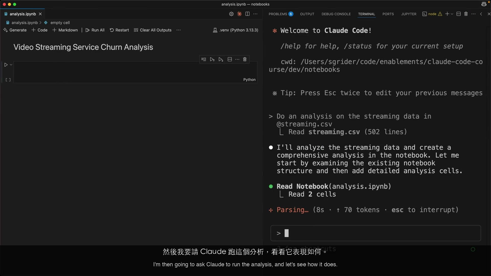 |
| 3 | Claude 根据前一次的执行结果定制后续单元格——逐步深入分析 | 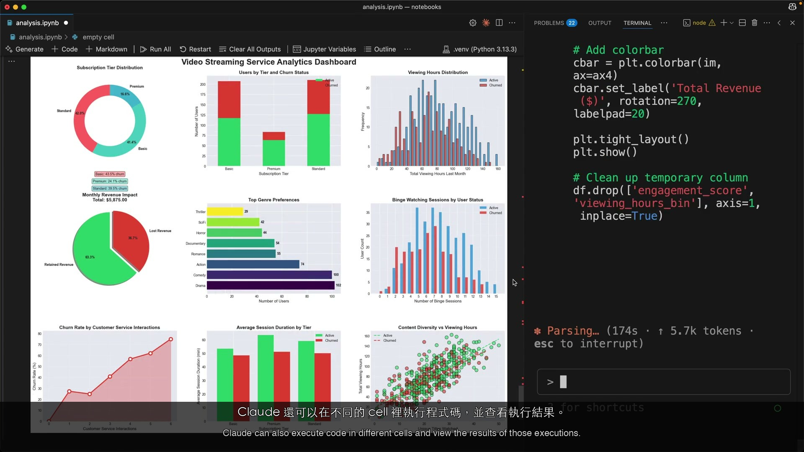 |

**结果**：Claude 通过执行、观察和优化产生完整的流失分析——不只是生成代码。

> [!TIP]
> 关键差异在于「执行-观察-优化」循环。Claude 执行单元格、读取实际输出，然后决定下一步分析什么。这比「只生成代码」的方法产生出明显更好的分析结果。

---

## Demo 演练：使用 Playwright MCP 调整 UI 样式

> [!NOTE]
> 展示 MCP 服务器如何将 Claude Code 的能力扩展到内置工具之外。

**背景**：一个 UI 生成应用程序，其聊天界面和标题栏需要样式修正。

| 步骤 | 发生了什么 | 截图 |
|------|-----------|------|
| 1 | 讲师展示 UI 应用程序——聊天界面和标题栏看起来未经设计、很粗糙 | 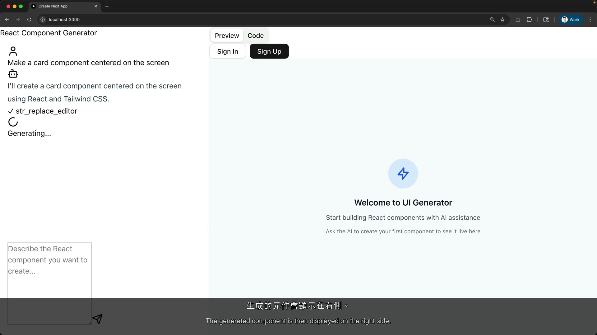 |
| 2 | 给予 Claude Code Playwright MCP 服务器的访问权——添加浏览器控制工具 | 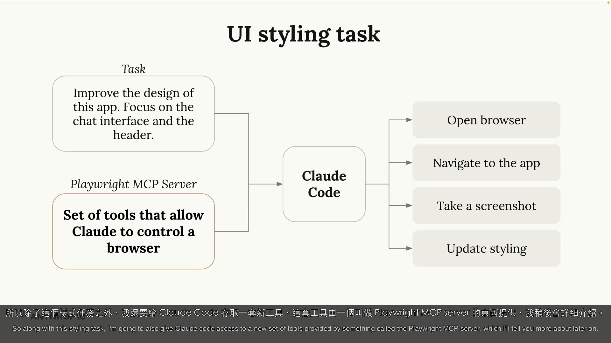 |
| 3 | Claude 打开浏览器、导航到应用程序、截图查看当前状态 | 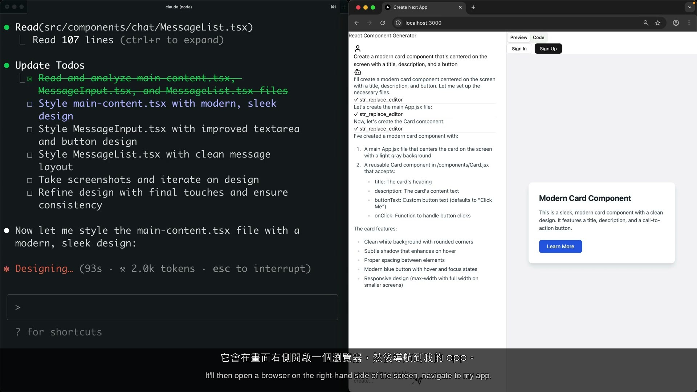 |
| 4 | Claude 更新样式、再次截图验证，反复迭代直到结果精致 | 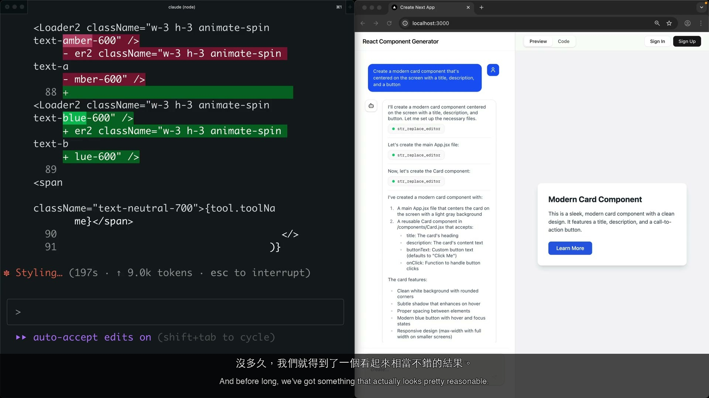 |

**结果**：通过视觉反馈循环达成精致、专业的界面。

> [!TIP]
> MCP 工具通过配置文件加入——不需要重新训练或修改代码。Claude 仅根据工具描述就能适应新工具。这就是扩展性的故事：当内置工具不够用时，MCP 来补足。

---

## Demo 演练：GitHub PR Review——拦截 PII 泄露

> [!IMPORTANT]
> 本课最长的 demo。展示 Claude Code 在 CI/CD 中运行以拦截人工审查会遗漏的安全问题。

**背景**：Claude Code 在 GitHub Actions 内运行，由 PR 创建或在评论中 `@claude` 触发。

**情境设置**：
- AWS 基础架构：**DynamoDB** 数据表 → **Lambda** 函数 → **S3 bucket**
- 该 S3 bucket 与**外部营销合作伙伴**共享
- 数月后，内部团队要求将用户 email 加入导出数据
- 开发者在 Lambda 函数中添加一行——忘了这个 bucket 是对外共享的
- 这导致 **PII（用户 email）** 泄露给外部合作伙伴——严重的安全/合规风险

| 步骤 | 发生了什么 | 截图 |
|------|-----------|------|
| 1 | 讲师说明 Claude Code 可在 GitHub Actions 中运行——由 PR 或 `@claude` 提及触发 | 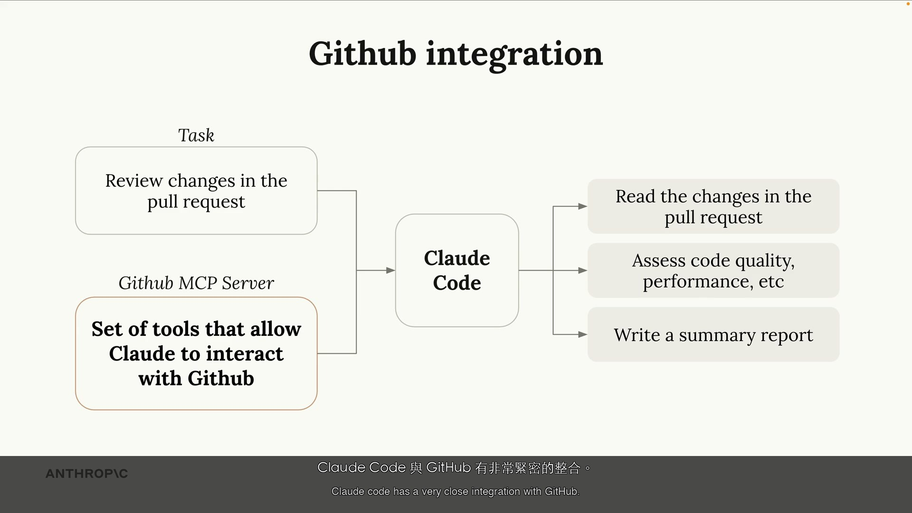 |
| 2 | 设置 AWS 情境：DynamoDB → Lambda → 与外部合作伙伴共享的 S3 bucket | 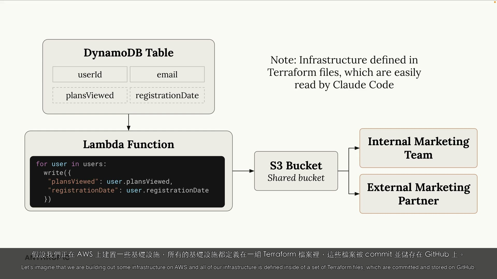 |
| 3 | 开发者添加一行——用户 email 现在包含在 Lambda 导出到共享 S3 bucket 的数据中 | 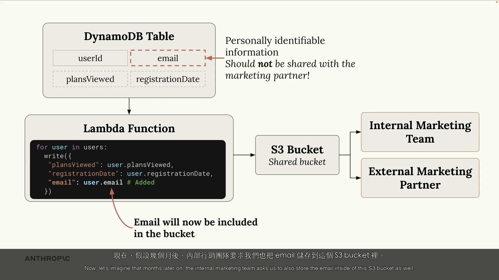 |
| 4 | 创建包含 email 添加变更的 Pull Request | 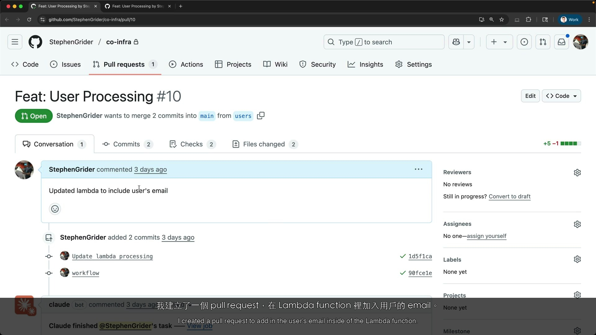 |
| 5 | Claude Code 自动审查拦截 PII 泄露——显示完整数据流并解释外部合作伙伴风险 | 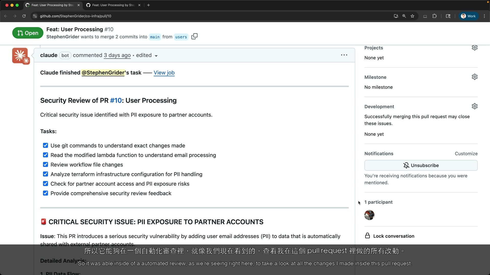 |

**结果**：Claude 通过理解基础架构流程拦截了 PII 泄露——不是因为被告知「检查 PII」，而是因为它追踪了从 DynamoDB 经过 Lambda 到共享 S3 bucket 的数据流。

> [!WARNING]
> 这直接对应 Task 3.6（CI/CD 集成）。Claude 以结构化方式理解 infrastructure-as-code，能拦截规则扫描器会遗漏的问题。这体现了 **Architecture > Prompt** 的理念。

---

## 讲师提示

1. **通过 todo 列表自我管理** — Claude 为复杂工作创建结构化任务列表，不需要人要求就会跟踪进度
2. **从内置工具开始** — 大多数任务不需要 MCP 扩展；只在内置功能真的不够时才添加
3. **执行，不只是生成** — 「写代码」和「写、执行、读取输出、调整」之间的质量差异很大
4. **MCP 是配置，不是代码** — 添加工具能力只需要修改配置文件，不需要重新训练
5. **CI/CD 能拦截人工遗漏的问题** — 自动审查能理解跨文件的数据流，这在人工审查中容易被忽略

## Key Takeaways

1. **内置工具很强大** — Read、Write、Edit、Bash、Grep、Glob 涵盖大部分开发任务
2. **工具串接是乘数** — 顺序和组合比单一工具更重要
3. **MCP 扩展而非替代** — MCP 服务器添加内置工具无法涵盖的功能（浏览器、API）
4. **CI/CD 集成是一级功能** — Claude Code 在 GitHub Actions 中进行自动审查是生产环境的用例
5. **架构理解 > 明确指令** — Claude 对代码结构、数据流和基础架构进行推理

---

# PART 2: Study Aids

> [!NOTE]
> 补充学习资料，非官方课程内容。

## Familiar Analogies

- **工具串接 = Unix 管道** — 就像 `cat file | grep pattern | sort | uniq`，Claude 串接 Read → Bash（profiling）→ Edit（修正）→ Bash（验证）。每个工具做好一件事；串接创造价值。
- **MCP = USB 接口** — 你的笔记本有内置功能（屏幕、键盘）。USB 接口让你插入新设备（相机、外接硬盘）。MCP 服务器就是 Claude Code 的 USB 接口——按需插入浏览器控制、API 访问、数据库工具。
- **Claude 的 todo 列表 = 资深工程师的草稿纸** — 资深工程师处理复杂问题时会先写下步骤。Claude 也一样，但用结构化格式来跟踪和打勾。
- **CI/CD 审查 = 机场安检 X 光** — 扫描所有通过的东西（每个 PR），拦截人类可能遗漏的东西（数据流中的 PII），而且不会疲倦或分心。

## CCA Exam Connection

> [!TIP]
> 本课涵盖跨三个 domain 的**四个考试相关模式**：

| 模式 | Demo | Task Statement | 考试相关性 |
|------|------|----------------|-----------|
| 计划 → 执行 → 验证 | Demo 1（chalk） | 1.1: Agentic loops | Claude 如何自主管理多步骤任务 |
| 执行 → 观察 → 优化 | Demo 2（Jupyter） | 3.5: Iterative refinement | 「只生成」vs「执行-迭代」的质量差异 |
| MCP 工具采用 | Demo 3（Playwright） | 2.4: MCP integration | 何时及如何扩展 Claude Code 的能力 |
| 自动化 CI/CD 审查 | Demo 4（GitHub Actions） | 3.6: CI/CD pipelines | 具备基础架构感知的自动审查 |

> [!TIP]
> **考试理念：相称回应** — 从内置工具开始。只在内置功能真的不够时才添加 MCP 或自定义工具。考试测试的是你知道「何时」扩展，而不只是「如何」扩展。

## Anti-Patterns

| Anti-Pattern | 为何错误 | 正确做法 |
|-------------|---------|---------|
| 在尝试内置工具前就添加 MCP 服务器 | 过度工程化；内置工具能处理大多数任务 | 先用 Read/Write/Edit/Bash/Grep，需要时再扩展 |
| 写代码但不执行 | 「只生成」的方法会遗漏运行时错误和数据相关问题 | 执行、观察输出、优化（Demo 2 模式） |
| 仅依赖人工 PR 审查处理安全问题 | 人工会遗漏跨文件数据流问题，尤其在 infra-as-code | 用 Claude Code 在 CI/CD 中自动化初步审查（Demo 4） |
| 期望 Claude 通过关键字匹配来拦截问题 | 规则扫描器会遗漏架构层面的问题 | Claude 以结构化方式理解基础架构——Architecture > Prompt |
| 给 Claude 单一的大型 prompt 处理复杂任务 | 压垮上下文、降低质量 | 让 Claude 用自己的 todo 列表分解步骤（Demo 1） |

## Practice Questions

**Q1.** 你的团队使用 Terraform 管理 AWS 基础架构。有位开发者提交 PR，将 `user_phone` 添加到一个写入与第三方分析伙伴共享的 S3 bucket 的 Lambda 函数中。Claude Code 应如何配置来拦截这个问题？

- A) 添加 regex 规则扫描 PR 中的 PII 字段名称
- B) 将 Claude Code 配置为 PR 创建时触发的 GitHub Actions workflow
- C) 编写自定义 MCP 服务器来扫描 PII 模式
- D) 在 CLAUDE.md 中列出所有要监控的 PII 字段

> [!NOTE]
> **答案：B。** 在 GitHub Actions 中配置 Claude Code（Task 3.6）。Claude 读取 Terraform 文件、追踪数据流（Lambda → 共享 S3 bucket），并标记对外部合作伙伴的 PII 泄露。不需要明确的「检查 PII」提示——Claude 以结构化方式理解基础架构。这就是 Architecture > Prompt 的实践。

**Q2.** 你需要 Claude Code 优化一个 Python 函数的性能。哪个工具序列代表最佳方法？

- A) 直接用已知的优化模式 Edit 代码
- B) Read → Bash（运行 profiler）→ Read profiler 输出 → Edit（应用修正）→ Bash（重新运行 benchmark）
- C) 从头 Write 一个全新的实现
- D) Grep 搜索代码库中类似的优化然后复制

> [!NOTE]
> **答案：B。** 这遵循 Demo 1 的「计划 → Profiling → 修正 → 验证」模式。Claude 应该在优化前先测量，然后验证改善结果。选项 A 跳过测量。选项 C 不成比例。选项 D 无法解决特定瓶颈。测试 Task 2.5（内置工具）和 1.1（agentic loops）。

**Q3.** 你想让 Claude Code 在 CSS 变更后验证 web 应用程序登录页面的渲染是否正确。哪种方法最合适？

- A) 让 Claude Read CSS 文件并推理视觉呈现
- B) 添加 Playwright MCP 服务器让 Claude 能截图并视觉验证
- C) 为每个 CSS 属性编写单元测试
- D) 用 Bash 运行 headless 浏览器并保存截图供人工检视

> [!NOTE]
> **答案：B。** 与 Demo 3 完全相符。Playwright MCP 给予 Claude 浏览器控制能力来截图和视觉验证——建立紧密的反馈循环。选项 A 无法验证视觉渲染。选项 C 太脆弱。选项 D 需要人工审查。测试 Task 2.4（MCP integration）。

**Q4.** Claude Code 的 Jupyter notebook 分析（Demo 2）与标准代码生成方法有何不同？

- A) Claude 使用专门的数据科学模型
- B) Claude 写代码、执行单元格、读取实际输出，并根据结果定制下一步
- C) Claude 有访问预建分析模板的权限
- D) Claude 直接通过 API 连接数据源

> [!NOTE]
> **答案：B。** 「执行-观察-优化」循环是关键差异。Claude 不只是生成代码——它执行单元格、读取结果、并调整分析。这比「只生成」的方法产生明显更好的洞察。测试 Task 3.5（iterative refinement）。
