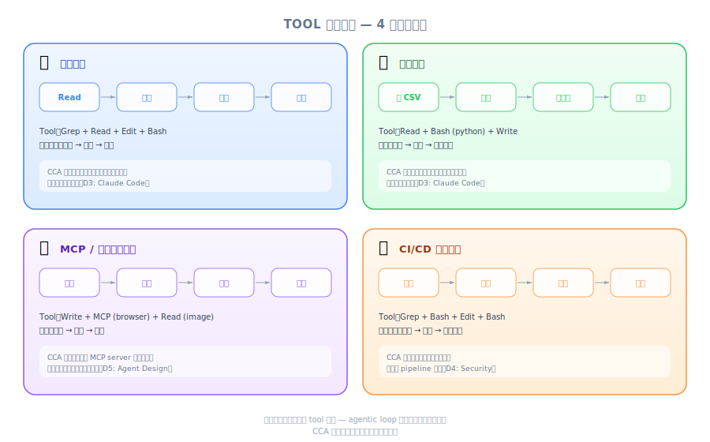
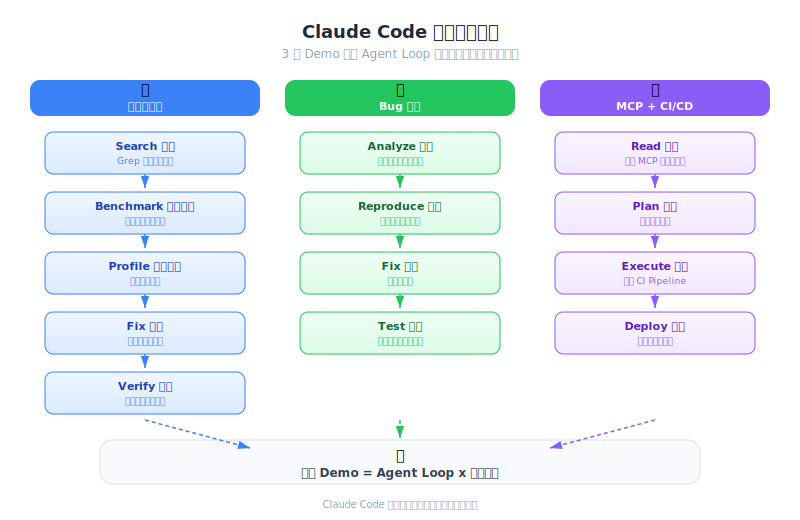
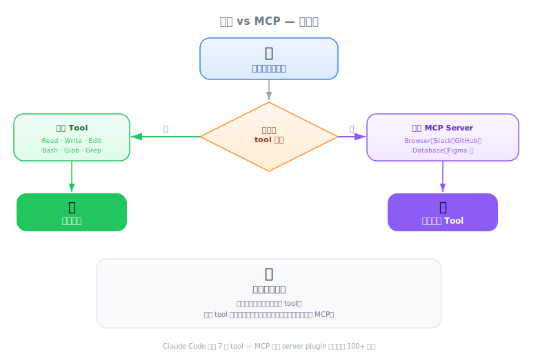

# Claude Code in Action — 工程深度解析

| 項目 | 細節 |
|------|--------|
| 考試領域 | D2 — Tool Design & MCP Integration (18%), D3 — Claude Code Configuration & Workflows (20%) |
| 任務聲明 | 2.5 (built-in tools), 2.4 (MCP integration), 3.6 (CI/CD), 1.1 (agentic loops) |
| 來源 | claude-code-in-action / 01-intro / Lesson 04 |

---

*圖：四個 Demo 的工具鏈接模式矩陣。*

*圖：Claude Code 中三種工具鏈接模式。*

*圖：決策樹 — 內建工具 vs MCP Server。*

## 一句話摘要

Claude Code 的威力來自內建工具的智慧串連、透過 MCP 輕鬆擴展能力、以及無縫的 CI/CD 整合 — 而非單一工具的能力。

---

## 內建工具總覽

Claude Code 預設搭載涵蓋檔案 I/O、執行與搜尋的工具組：

| 工具 | 用途 | 類別 |
|------|---------|----------|
| Read | 讀取檔案內容（支援圖片、PDF、notebook） | 檔案 I/O |
| Write | 建立或覆寫檔案 | 檔案 I/O |
| Edit | 對既有檔案做精準修改 | 檔案 I/O |
| Bash | 執行 shell 命令 | 執行 |
| Grep | 用正則搜尋檔案內容（基於 ripgrep） | 搜尋 |
| Glob | 依名稱/模式尋找檔案 | 搜尋 |
| NotebookEdit | 編輯 Jupyter notebook 儲存格 | Notebook |
| WebFetch | 擷取與分析網頁內容 | 網路 |
| WebSearch | 搜尋網路上的最新資訊 | 網路 |

> [!TIP]
> **關鍵洞察**
> 威力不在任何單一工具 — 而在 Claude 如何智慧地將它們串連起來。本課每個 Demo 展示不同的串連模式。

---

## Demo 1：效能優化 — 智慧工具串連

**情境**：chalk 是 npm 第五大熱門套件（每週約 4.29 億次下載）。即使微小的效能改善也會對整個生態系產生巨大影響。

**Claude 的工具鏈**：
1. **規劃** — 建立結構化待辦清單追蹤多步驟工作
2. **搜尋** — 用 Grep/Glob 找到效能相關的程式碼路徑
3. **benchmark** — 透過 Bash 執行既有 benchmark 建立基線
4. **聚焦** — 撰寫針對性測試檔案隔離熱點路徑
5. **profiler** — 透過 Bash 執行 CPU profiler，Read 讀取輸出
6. **修復** — 用 Edit 實作優化
7. **驗證** — 重跑 benchmark 確認改善

**成果**：目標操作的吞吐量提升 3.9 倍。

> [!NOTE]
> **講師洞察**
> Claude 會建立待辦清單來追蹤自己在複雜任務中的進度。這種自我管理行為是自然湧現的 — 這就是 agentic loops 如何在多步驟中維持一致性。

> [!IMPORTANT]
> **考試重點**
> 這是 Task 1.1（agentic loops）的經典範例：Claude 自主規劃、執行、觀察、改進，步驟之間無需人類介入。

---

## Demo 2：資料分析 — 執行與迭代

**情境**：影音串流平台用戶的 CSV 資料集。目標：分析用戶流失模式。

**Claude 的做法**：
1. Read 讀取 CSV 了解結構
2. 在 Jupyter notebook 中撰寫分析程式碼
3. **執行儲存格並讀取輸出** — 這是關鍵差異
4. 根據實際結果，客製化下一步分析
5. 反覆改進視覺化與統計檢定

> [!TIP]
> **關鍵洞察**
> Claude 不只是產生程式碼然後期待它能跑。它執行、觀察結果、然後調整。這個「執行→觀察→改進」迴圈產出的分析品質遠優於純生成方式。

---

## Demo 3：MCP 擴展性 — Playwright 瀏覽器控制

**情境**：一個從文字描述生成 UI 元件的小應用。Claude 需要調整輸出的視覺樣式。

**Claude 的做法**：
1. 透過 Playwright MCP server 獲得瀏覽器控制工具
2. 開啟瀏覽器，截圖查看當前狀態
3. 透過 Edit 修改 CSS/樣式
4. 重新截圖驗證視覺結果
5. 反覆迭代直到樣式符合預期

**關鍵技術要點**：
- MCP 工具透過設定檔新增 — 不需重新訓練
- Claude 僅憑工具描述就能適應新工具
- 工具描述的品質決定 Claude 使用該工具的效果

> [!TIP]
> **考試關聯**
> 這示範了 Task 2.4：將 MCP servers 整合到 Claude Code 與 agent 工作流。考試哲學：**Tool description > Few-shot** — 清晰的工具描述比範例更重要。

---

## Demo 4：CI/CD 整合 — 自動化 PR 安全審查

**情境**：Claude Code 在 GitHub Actions 中執行，由 PR 建立或 `@claude` 提及觸發。

**場景**：
- AWS 基礎設施用 Terraform 定義
- 架構：DynamoDB table -> Lambda function -> S3 bucket
- 該 S3 bucket 與外部合作夥伴共享
- 一個 PR 將用戶 email 加入資料流
- 將 PII（email）送入共享 bucket = **安全/合規風險**

**Claude 的發現**：偵測到 PII 曝露風險 — 不是因為被告知「檢查 PII」，而是因為它理解了 Terraform 基礎設施流程，識別出用戶 email 最終會出現在共享的 S3 bucket 中。

> [!IMPORTANT]
> **考試重點**
> 直接對應 Task 3.6（CI/CD integration），體現考試哲學：**Architecture > Prompt**。Claude 透過結構性理解基礎設施程式碼來發現問題，而非被告知要找什麼。

---

## 工具串連模式（考試重點）

| 模式 | Demo 範例 | 任務聲明 | 適用場景 |
|---------|-------------------|----------------|---------------|
| 規劃 -> 執行 -> 驗證 | chalk 優化 (D1) | 1.1: Agentic loops | 複雜多步驟任務 |
| 執行 -> 觀察 -> 改進 | Jupyter 分析 (D2) | 3.5: 迭代改進 | 資料分析、除錯 |
| 透過 MCP 採用新工具 | Playwright 瀏覽器 (D3) | 2.4: MCP integration | 內建工具不足時 |
| CI 中的自動審查 | GitHub PR 審查 (D4) | 3.6: CI/CD pipelines | 程式碼審查、合規 |
| 適度的工具選擇 | 所有 Demo | 2.5: Built-in tools | 先簡單，需要時再擴展 |

> [!TIP]
> **考試哲學：適度回應**
> 從內建工具開始。只在內建能力真的不足時才加入 MCP servers 或自訂工具。考試測的是你知道「何時」該擴展，而非只是「如何」擴展。

---

## 練習題

### Q1：CI/CD 安全審查
你的團隊使用 Terraform 管理 AWS 基礎設施。一位初級工程師提交的 PR 將 `user_phone` 欄位加入一個 Lambda function，該 function 會寫入與第三方分析夥伴共享的 S3 bucket。你該如何設定 Claude Code 來攔截此問題？

答案

設定 Claude Code 為 PR 建立時觸發的 GitHub Actions workflow。Claude 會讀取 Terraform 檔案，理解資料流（Lambda -> 共享 S3 bucket），並標記 `user_phone` 是被送往外部夥伴的 PII。關鍵洞察：你不需要寫 prompt 說「檢查 PII」— Claude 理解 infrastructure-as-code 並能追蹤資料流。這就是 Architecture > Prompt 的實踐（Task 3.6）。

### Q2：工具選擇
你需要 Claude Code 優化一個 Python 函式的效能。以下哪個內建工具序列是最佳做法？

A) 直接用已知的優化模式 Edit 程式碼
B) Read 程式碼 -> Bash（執行 profiler）-> Read profiler 輸出 -> Edit（套用修復）-> Bash（重跑 benchmark）
C) 從頭 Write 一個全新實作
D) Grep 搜尋程式碼庫中類似的優化然後複製

答案

**B**。這遵循 Demo 1 的「規劃 -> profiler -> 修復 -> 驗證」模式。關鍵在於 Claude 應在優化前先測量（執行 profiler），然後驗證改善（重跑 benchmark）。選項 A 跳過測量。選項 C 不成比例。選項 D 未針對特定瓶頸。測試 Task 2.5（有效使用內建工具）和 Task 1.1（agentic loop 設計）。

### Q3：MCP 擴展性
你希望 Claude Code 驗證網頁應用程式的登入頁面在 CSS 變更後是否正確渲染。哪種方式最合適？

A) 讓 Claude Read CSS 檔案並推理視覺外觀
B) 加入 Playwright MCP server 讓 Claude 可以截圖並視覺驗證
C) 為每個 CSS 屬性撰寫單元測試
D) 用 Bash 執行 headless 瀏覽器並儲存截圖供人工審查

答案

**B**。這完全符合 Demo 3。Playwright MCP 賦予 Claude 開啟瀏覽器、截圖、視覺驗證的能力 — 建立緊密的回饋迴圈。選項 A 無法驗證視覺渲染。選項 C 脆弱且不測試視覺外觀。選項 D 需要人工審查，失去自動化的好處。測試 Task 2.4（MCP integration）和「內建工具不足時才用 MCP 擴展」的原則。

