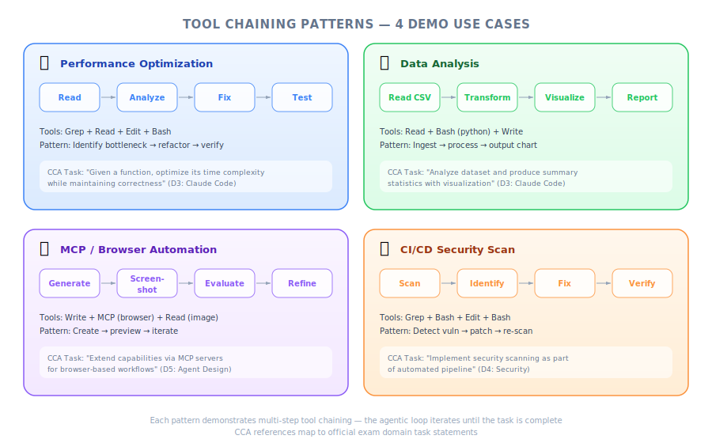
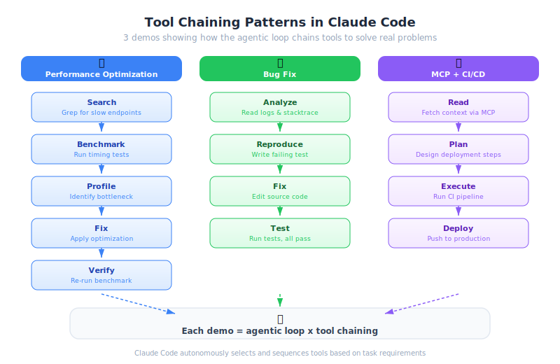
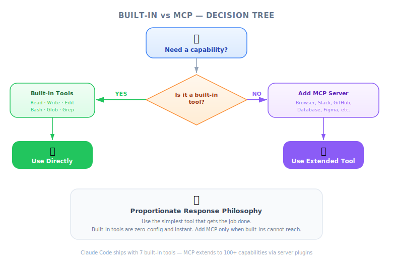

# Claude Code in Action — PM Strategic Overview

| Item | Detail |
|------|--------|
| Exam Domain | D2 — Tool Design & MCP Integration (18%), D3 — Claude Code Configuration & Workflows (20%) |
| Task Statements | 2.5 (built-in tools), 2.4 (MCP integration), 3.6 (CI/CD), 1.1 (agentic loops) |
| Source | claude-code-in-action / 01-intro / Lesson 04 |

---

## One-Liner

Claude Code delivers business value through autonomous multi-step task execution, extensible tooling via MCP, and automated quality gates in CI/CD — reducing engineering bottlenecks across performance, analysis, design, and compliance.

---

## Built-in Tools: What PMs Need to Know

*Figure: Tool chaining patterns across four demo use cases.*

*Figure: Three tool chaining patterns demonstrated in Claude Code.*

Claude Code comes with default tools for reading/writing files, running commands, and searching codebases. The key PM insight: **you don't need to provision special tooling for most tasks**. Claude chains these built-in tools intelligently.

| Capability | Business Impact |
|------------|----------------|
| File I/O (Read, Write, Edit) | Autonomous code changes without human handholding |
| Execution (Bash) | Run tests, benchmarks, builds automatically |
| Search (Grep, Glob) | Navigate large codebases to understand context |
| Notebooks (NotebookEdit) | Data analysis with execution, not just code generation |

> 💡 **Why PMs Care**
> When scoping Claude Code adoption, start with built-in tools. Most engineering tasks are covered without additional setup cost.

---

## Demo 1: Automated Performance Audit

**Business problem**: Performance optimization requires senior engineers, is time-consuming, and is often deprioritized.

**What happened**: Claude autonomously profiled the chalk library (429M downloads/week), identified the bottleneck, implemented a fix, and verified a 3.9x throughput improvement — all without human intervention between steps.

**Business impact**:
- Senior engineer time freed from routine optimization work
- Performance improvements happen proactively, not reactively
- Measurable results (3.9x improvement) with audit trail

> 🎬 **Instructor Insight**
> Claude creates its own task list and tracks progress. This self-management capability means it handles complex multi-step work that would normally require task decomposition by a tech lead.

---

## Demo 2: Data-Driven Insights Without a Data Team

**Business problem**: Getting insights from data requires data analysts or data scientists. Bottleneck when the data team is at capacity.

**What happened**: Claude analyzed a video streaming platform's user churn data in a Jupyter notebook. Critically, it executed its own analysis code, read the results, and customized follow-up analysis based on what it found.

**Business impact**:
- Product teams can get preliminary data insights without waiting for the data team
- Analysis quality is higher because Claude iterates based on actual results
- Reduces time-to-insight for product decisions

> 💡 **Why PMs Care**
> The difference between "write analysis code" and "write, execute, read results, refine" is the difference between a template and an actual insight. Claude Code does the latter.

---

## Demo 3: Rapid UI Iteration Without Designer Bottleneck

**Business problem**: UI styling iterations create back-and-forth between developers and designers. Each cycle takes hours or days.

**What happened**: Claude was given browser control tools via Playwright MCP. It opened the app, screenshotted the current state, made style changes, re-screenshotted to verify, and iterated until the result was correct.

**Business impact**:
- Faster design iteration cycles (minutes instead of hours)
- Developers can handle styling refinements autonomously
- MCP extensibility means new capabilities without retraining

> 💡 **Why PMs Care**
> MCP is the extensibility story. When stakeholders ask "can Claude do X?" the answer is often "yes, with the right MCP server." This is a capability you can plan around.

---

## Demo 4: Automated Compliance Checking in Code Review

**Business problem**: Manual code review misses cross-cutting concerns like PII exposure, especially in infrastructure-as-code where data flows span multiple files.

**What happened**: Claude Code ran in GitHub Actions as an automated PR reviewer. It caught that a code change would expose user email (PII) through an S3 bucket shared with an external partner — by understanding the Terraform infrastructure flow.

**Business impact**:
- Compliance risks caught before merge, not in production
- Scales review capacity without hiring more senior engineers
- Understands infrastructure context, not just code syntax

> 🎯 **Exam Note**
> This is Architecture > Prompt: Claude understands infrastructure structurally. PMs should know that Claude Code's CI/CD integration provides compliance value, not just code quality.

---

## Decision Framework for PMs

*Figure: Decision tree — built-in tools vs MCP servers.*

| Question | Guidance |
|----------|----------|
| "Do we need MCP servers?" | Start without them. Add only when built-in tools can't cover a specific need (e.g., browser testing, API integration) |
| "Where does Claude Code fit in our workflow?" | CI/CD for automated review (Demo 4), developer productivity for ad-hoc tasks (Demos 1-3) |
| "How do we measure ROI?" | Time saved per task, issues caught pre-merge, reduction in specialist bottlenecks |
| "What's the adoption risk?" | Low for built-in tools (no setup). Medium for MCP (requires configuration). Low for CI/CD (standard GitHub Actions) |

---

## Practice Questions

### Q1: Adoption Strategy
Your engineering team wants to adopt Claude Code. The CTO asks you to propose a phased rollout. Based on the demos in this lesson, what is the most effective ordering?

Answer

**Phase 1**: Built-in tools for developer productivity (Demos 1-2 — performance optimization, data analysis). Zero additional setup, immediate value. **Phase 2**: CI/CD integration for automated PR review (Demo 4 — compliance/security). Requires GitHub Actions configuration but delivers organization-wide value. **Phase 3**: MCP extensions for specialized workflows (Demo 3 — browser testing, external APIs). Only when specific needs arise. This follows the exam principle of proportionate response — start simple, extend when needed.

### Q2: Stakeholder Communication
A security-conscious VP asks: "How can we ensure Claude Code catches PII exposure in our infrastructure?" What is the best response?

Answer

Claude Code can be integrated into your CI/CD pipeline as an automated PR reviewer. It reads infrastructure-as-code (like Terraform) and traces data flows across resources. It caught PII exposure in Demo 4 not because it was told to look for PII, but because it understood that user data was flowing to a shared external bucket. The key advantage: it understands architecture, so it catches issues that rule-based scanners miss. This is the Architecture > Prompt philosophy.

### Q3: ROI Justification
Your team spends 20 hours/week on code review. How would you frame Claude Code's CI/CD integration to justify the setup investment?

Answer

Frame it as augmentation, not replacement. Claude Code handles the first pass of review — catching structural issues, security concerns, and compliance risks automatically. Human reviewers then focus on business logic and architecture decisions. Expected impact: 30-50% reduction in review cycle time, near-zero PII/compliance escapes, and consistent review quality regardless of reviewer availability. The setup cost is a standard GitHub Actions workflow — typically a few hours of engineering time.

