# Claude Code in Action — Claude Code 實戰展示 — 影片逐幀學習指南

| 項目 | 內容 |
|------|------|
| 課程 | claude-code-in-action / 01-intro / 04-claude-code-in-action |
| 影片 | Claude Code in Action |
| 字幕數 | 106 段 |
| 格式 | 每段字幕一張截圖 + 雙語字幕（英/中） |

---

### [00:00:00] 第 1 段

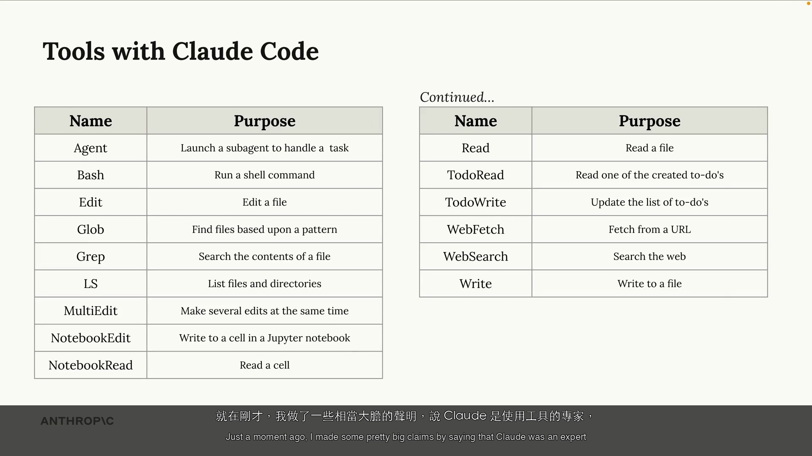

> **EN:** Just a moment ago, I made some pretty big claims by saying that Claude was an expert
>
> **ZH:** 就在剛才，我做了一些相當大膽的聲明，說 Claude 是使用工具的專家，

---

### [00:00:04] 第 2 段

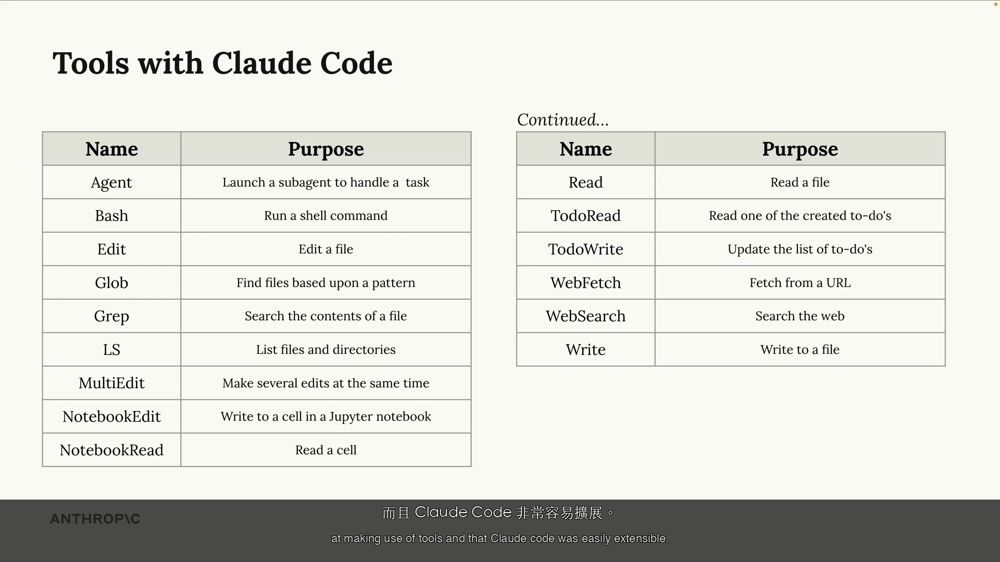

> **EN:** at making use of tools and that Claude code was easily extensible.
>
> **ZH:** 而且 Claude Code 非常容易擴展。

---

### [00:00:08] 第 3 段

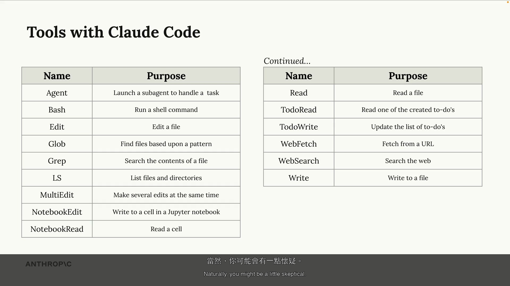

> **EN:** Naturally, you might be a little skeptical.
>
> **ZH:** 當然，你可能會有一點懷疑。

---

### [00:00:10] 第 4 段

> **EN:** So I'd like to give you a few quick demonstrations on this table are the
>
> **ZH:** 所以我想給你幾個快速的示範，這張表上列出的是

---

### [00:00:14] 第 5 段

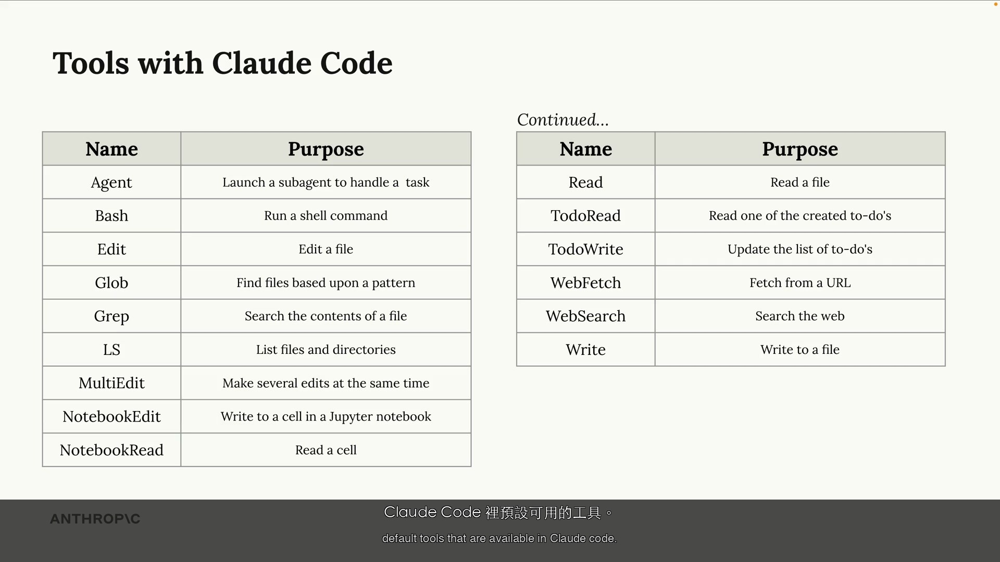

> **EN:** default tools that are available in Claude code.
>
> **ZH:** Claude Code 裡預設可用的工具。

---

### [00:00:16] 第 6 段

> **EN:** It has all the abilities you would expect like reading files, writing files,
>
> **ZH:** 它具備你所期待的所有功能，像是讀取檔案、寫入檔案、

---

### [00:00:20] 第 7 段

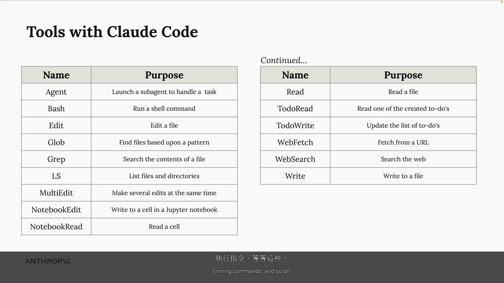

> **EN:** running commands, and so on.
>
> **ZH:** 執行指令，等等這些。

---

### [00:00:21] 第 8 段

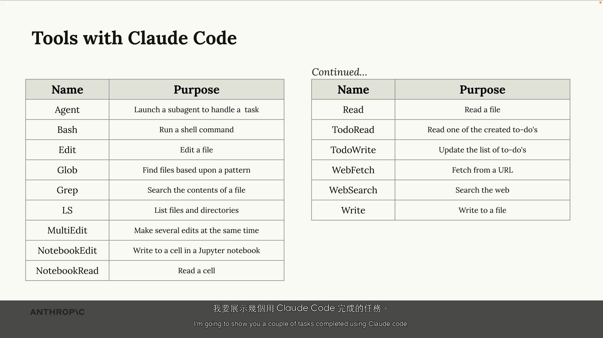

> **EN:** I'm going to show you a couple of tasks completed using Claude code.
>
> **ZH:** 我要展示幾個用 Claude Code 完成的任務。

---

### [00:00:25] 第 9 段

> **EN:** And in each case, it will use this set of tools in rather intelligent ways.
>
> **ZH:** 在每個案例中，它都會以相當聰明的方式使用這套工具。

---

### [00:00:30] 第 10 段

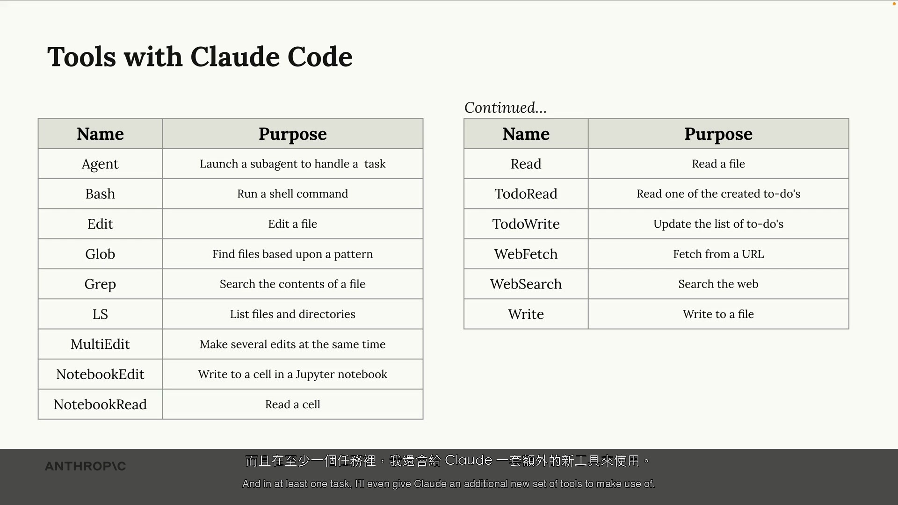

> **EN:** And in at least one task, I'll even give Claude an additional new set of tools to make use of.
>
> **ZH:** 而且在至少一個任務裡，我還會給 Claude 一套額外的新工具來使用。

---

### [00:00:35] 第 11 段

> **EN:** Not only will this process give you a good idea of what Claude code can do right out of the box,
>
> **ZH:** 這個過程不只能讓你了解 Claude Code 開箱即用能做什麼，

---

### [00:00:40] 第 12 段

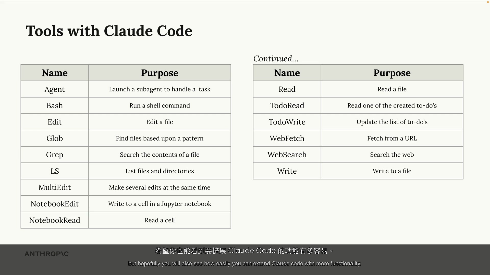

> **EN:** but hopefully you will also see how easily you can extend Claude code with more functionality.
>
> **ZH:** 希望你也能看到要擴展 Claude Code 的功能有多容易。

---

### [00:00:46] 第 13 段

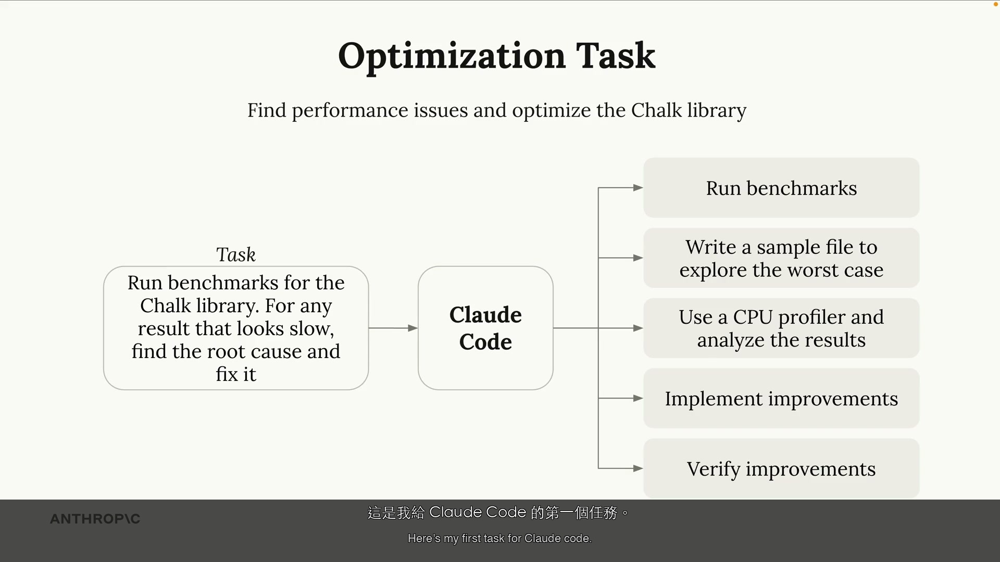

> **EN:** Here's my first task for Claude code.
>
> **ZH:** 這是我給 Claude Code 的第一個任務。

---

### [00:00:48] 第 14 段

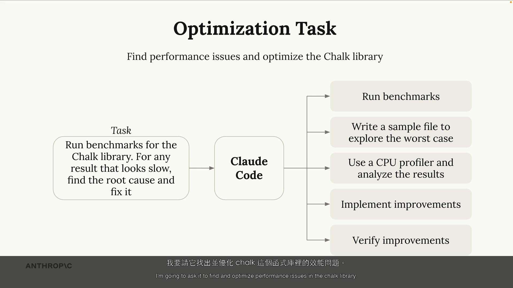

> **EN:** I'm going to ask it to find and optimize performance issues in the chalk library.
>
> **ZH:** 我要請它找出並優化 chalk 這個函式庫裡的效能問題。

---

### [00:00:52] 第 15 段

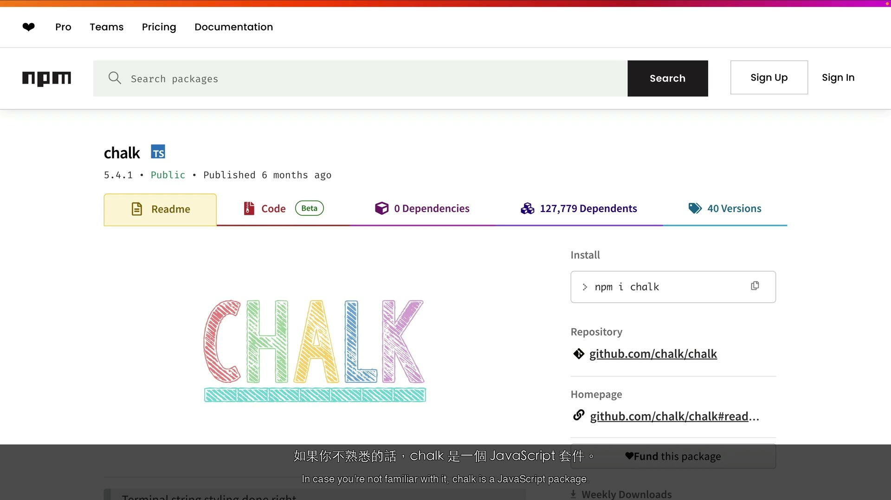

> **EN:** In case you're not familiar with it, chalk is a JavaScript package.
>
> **ZH:** 如果你不熟悉的話，chalk 是一個 JavaScript 套件。

---

### [00:00:56] 第 16 段

> **EN:** Here's the documentation for it.
>
> **ZH:** 這是它的文件說明。

---

### [00:00:57] 第 17 段

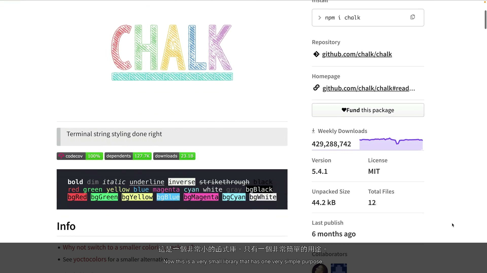

> **EN:** Now this is a very small library that has one very simple purpose.
>
> **ZH:** 這是一個非常小的函式庫，只有一個非常簡單的用途。

---

### [00:01:02] 第 18 段

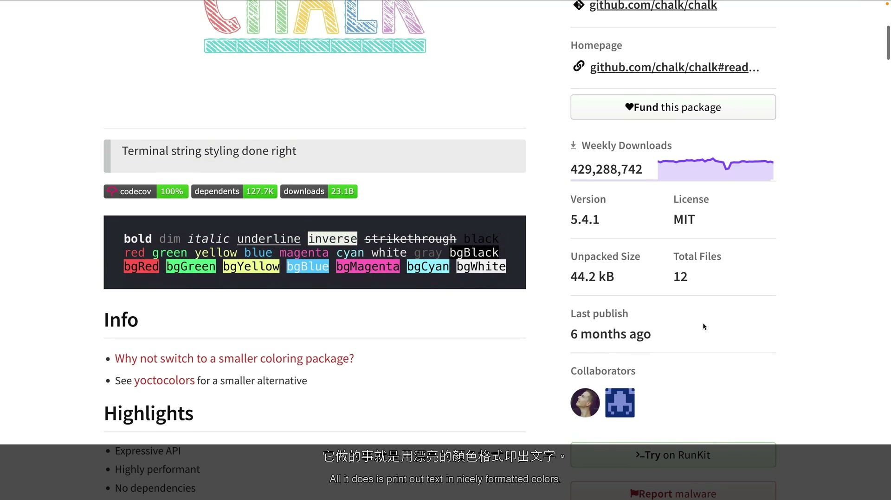

> **EN:** All it does is print out text in nicely formatted colors.
>
> **ZH:** 它做的事就是用漂亮的顏色格式印出文字。

---

### [00:01:05] 第 19 段

> **EN:** So like exactly as you see in this example screenshot right here.
>
> **ZH:** 就像你在這張範例截圖裡看到的這樣。

---

### [00:01:08] 第 20 段

> **EN:** So you can give the text colors or backgrounds and formatting, all that kind of stuff.
>
> **ZH:** 你可以給文字加上顏色、背景和各種格式，諸如此類的東西。

---

### [00:01:12] 第 21 段

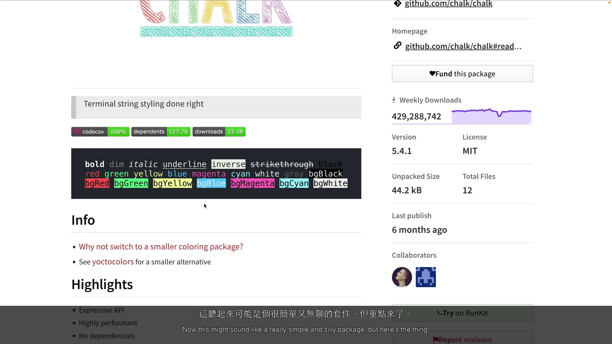

> **EN:** Now this might sound like a really simple and silly package, but here's the thing.
>
> **ZH:** 這聽起來可能是個很簡單又無聊的套件，但重點來了。

---

### [00:01:17] 第 22 段

> **EN:** It turns out this is actually the fifth most downloaded package in the entire JavaScript ecosystem.
>
> **ZH:** 原來這實際上是整個 JavaScript 生態系中下載量第五名的套件。

---

### [00:01:22] 第 23 段

> **EN:** Last week in particular, it had 429 million downloads.
>
> **ZH:** 光是上週，它就有 4 億 2900 萬次下載。

---

### [00:01:27] 第 24 段

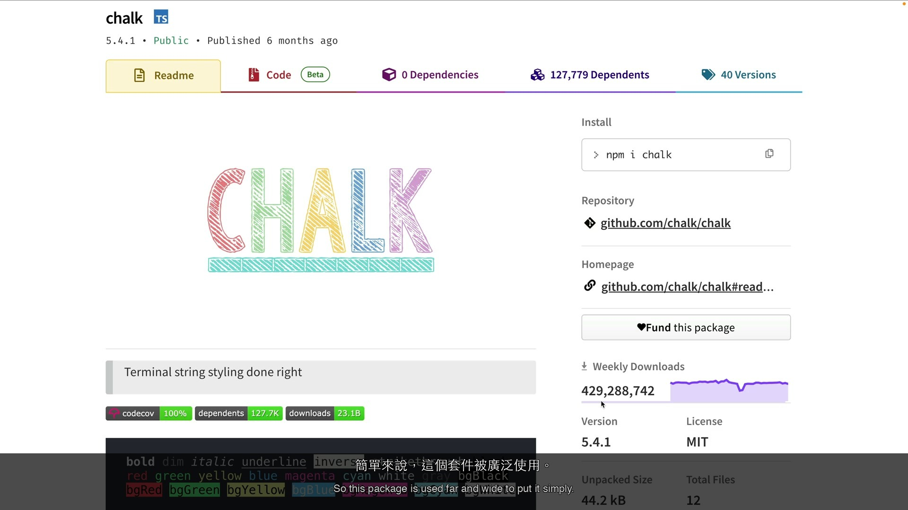

> **EN:** So this package is used far and wide to put it simply.
>
> **ZH:** 簡單來說，這個套件被廣泛使用。

---

### [00:01:31] 第 25 段

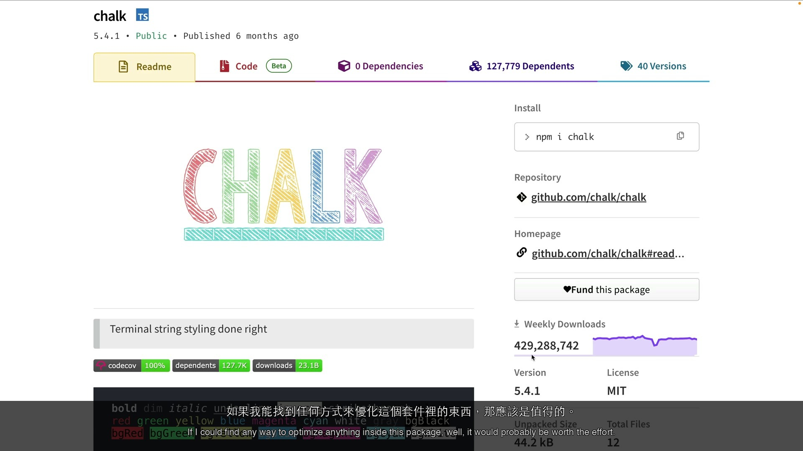

> **EN:** If I could find any way to optimize anything inside this package, well, it would probably be worth the effort.
>
> **ZH:** 如果我能找到任何方式來優化這個套件裡的東西，那應該是值得的。

---

### [00:01:37] 第 26 段

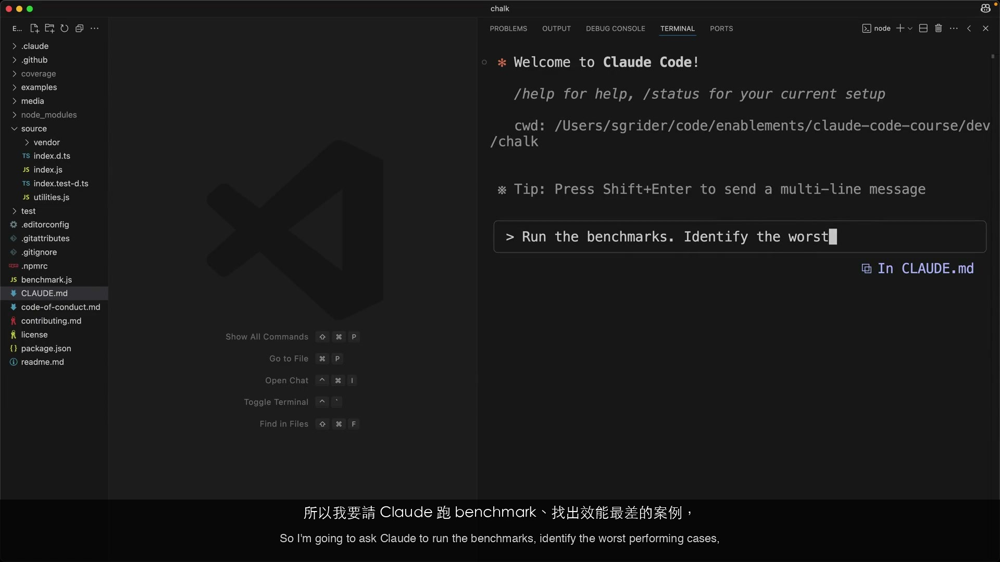

> **EN:** So I'm going to ask Claude to run the benchmarks, identify the worst performing cases,
>
> **ZH:** 所以我要請 Claude 跑 benchmark、找出效能最差的案例，

---

### [00:01:42] 第 27 段

> **EN:** use some profiling tools to figure out why those cases are running so slowly, and then fix them.
>
> **ZH:** 用一些 profiling 工具找出那些案例跑得這麼慢的原因，然後修復它們。

---

### [00:01:46] 第 28 段

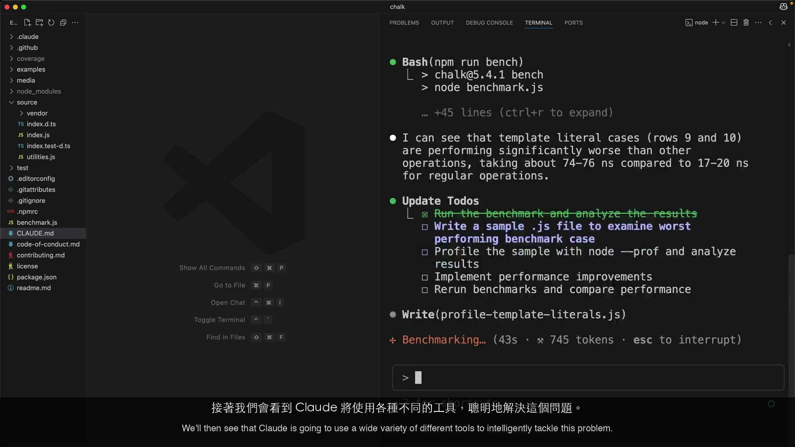

> **EN:** We'll then see that Claude is going to use a wide variety of different tools to intelligently tackle this problem.
>
> **ZH:** 接著我們會看到 Claude 將使用各種不同的工具，聰明地解決這個問題。

---

### [00:01:51] 第 29 段

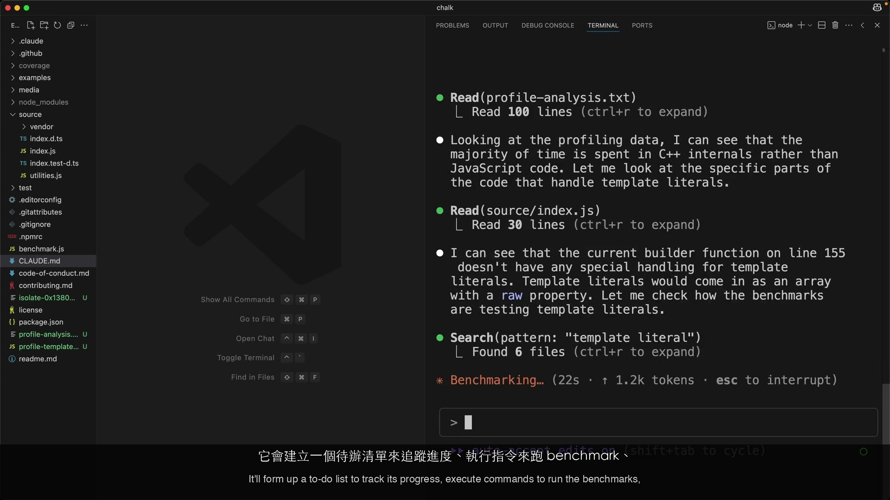

> **EN:** It'll form up a to-do list to track its progress, execute commands to run the benchmarks,
>
> **ZH:** 它會建立一個待辦清單來追蹤進度、執行指令來跑 benchmark、

---

### [00:01:56] 第 30 段

> **EN:** write a file to better zoom in on one particular case,
>
> **ZH:** 寫入一個檔案來更仔細地聚焦在某個特定案例上，

---

### [00:02:00] 第 31 段

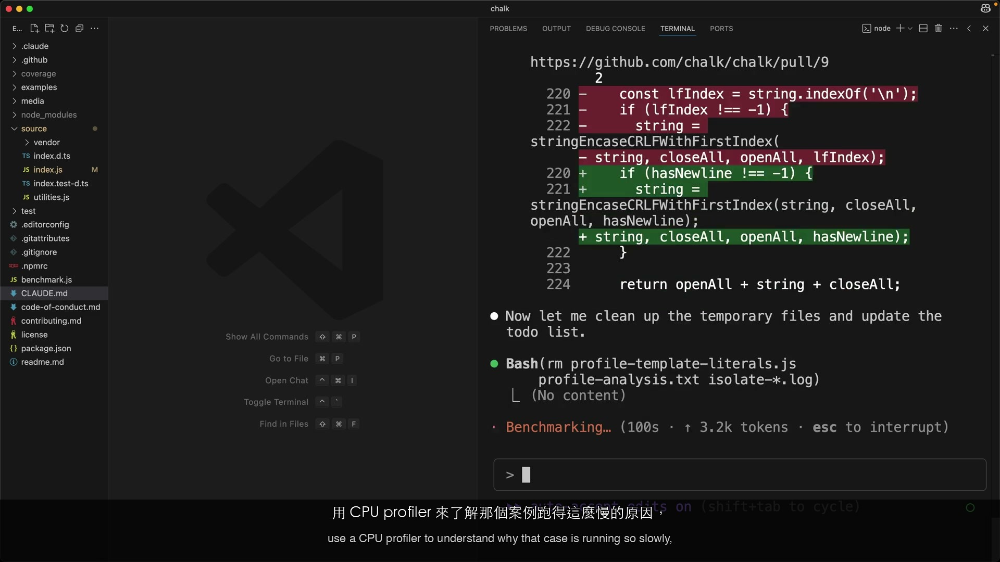

> **EN:** use a CPU profiler to understand why that case is running so slowly,
>
> **ZH:** 用 CPU profiler 來了解那個案例跑得這麼慢的原因，

---

### [00:02:04] 第 32 段

> **EN:** and then implement some improvements.
>
> **ZH:** 然後實作一些改善。

---

### [00:02:05] 第 33 段

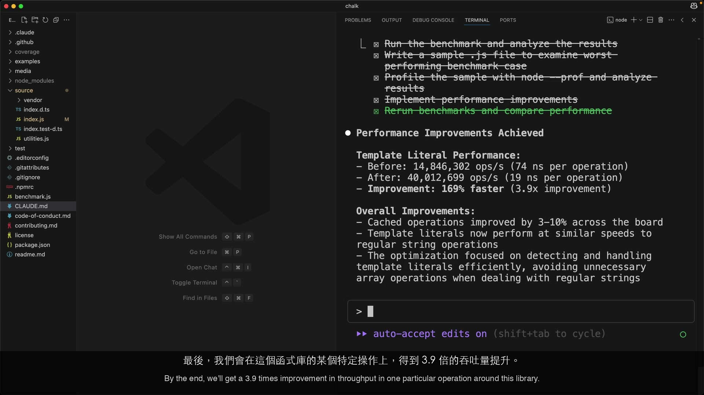

> **EN:** By the end, we'll get a 3.9 times improvement in throughput in one particular operation around this library.
>
> **ZH:** 最後，我們會在這個函式庫的某個特定操作上，得到 3.9 倍的吞吐量提升。

---

### [00:02:12] 第 34 段

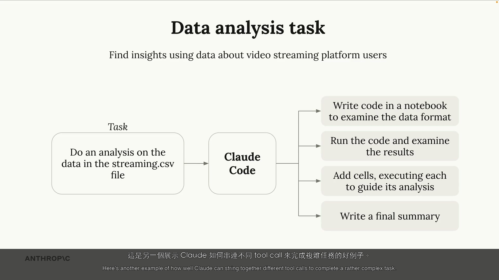

> **EN:** Here's another example of how well Claude can string together different tool calls to complete a rather complex task.
>
> **ZH:** 這是另一個展示 Claude 如何串連不同 tool call 來完成複雜任務的好例子。

---

### [00:02:18] 第 35 段

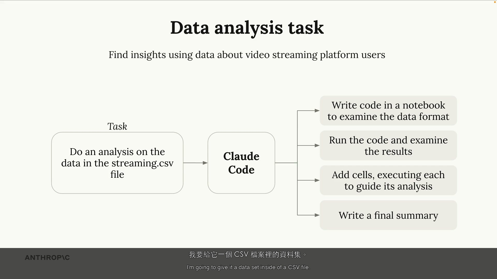

> **EN:** I'm going to give it a data set inside of a CSV file.
>
> **ZH:** 我要給它一個 CSV 檔案裡的資料集。

---

### [00:02:21] 第 36 段

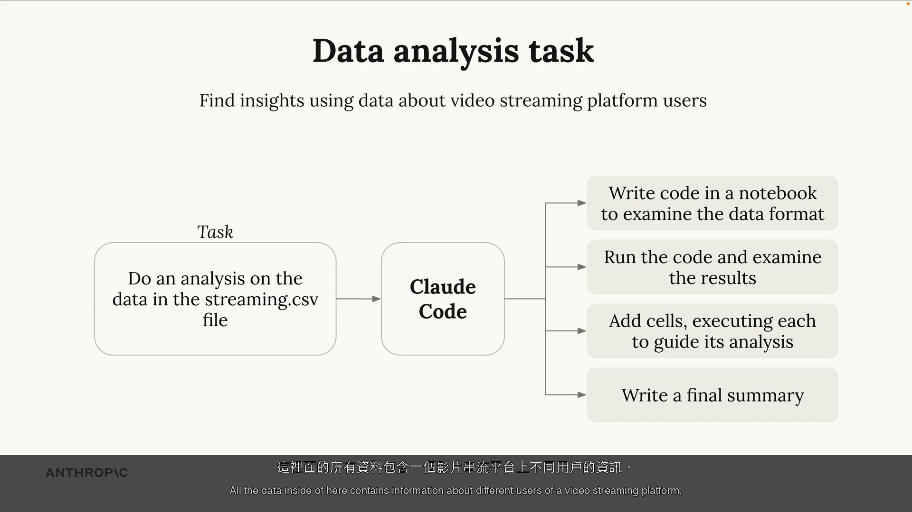

> **EN:** All the data inside of here contains information about different users of a video streaming platform,
>
> **ZH:** 這裡面的所有資料包含一個影片串流平台上不同用戶的資訊，

---

### [00:02:25] 第 37 段

> **EN:** and I'm going to ask it to just do a general analysis,
>
> **ZH:** 我要請它做一個通用的分析，

---

### [00:02:28] 第 38 段

> **EN:** maybe identify some causes of churn on the platform.
>
> **ZH:** 也許找出平台上用戶流失的一些原因。

---

### [00:02:31] 第 39 段

> **EN:** And I want all this analysis to be done inside of a Jupyter notebook.
>
> **ZH:** 而且我希望所有分析都在 Jupyter notebook 裡完成。

---

### [00:02:35] 第 40 段

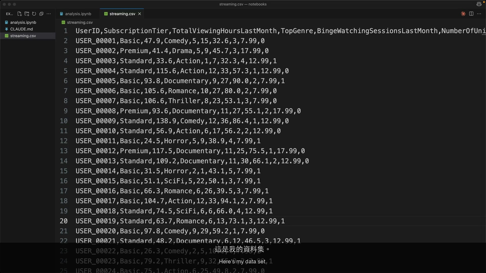

> **EN:** Here's my data set.
>
> **ZH:** 這是我的資料集。

---

### [00:02:36] 第 41 段

> **EN:** I'm then going to ask Claude to run the analysis, and let's see how it does.
>
> **ZH:** 然後我要請 Claude 跑這個分析，看看它表現如何。

---

### [00:02:40] 第 42 段

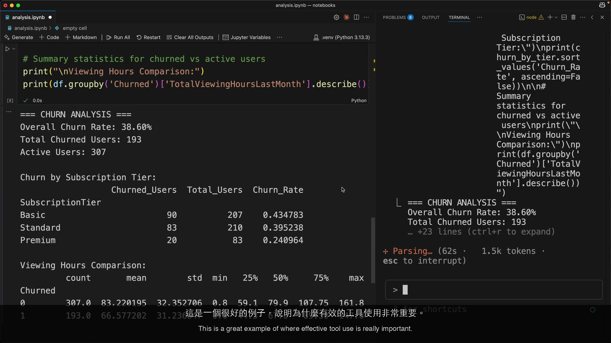

> **EN:** This is a great example of where effective tool use is really important.
>
> **ZH:** 這是一個很好的例子，說明為什麼有效的工具使用非常重要。

---

### [00:02:44] 第 43 段

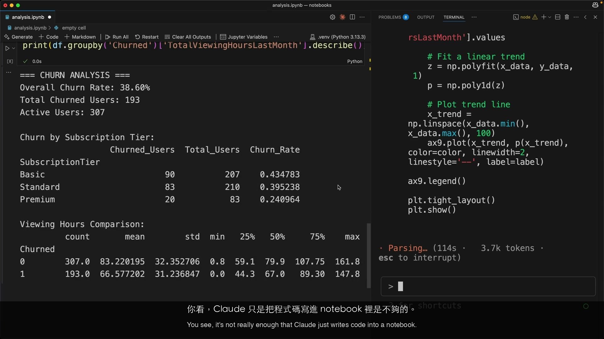

> **EN:** You see, it's not really enough that Claude just writes code into a notebook.
>
> **ZH:** 你看，Claude 只是把程式碼寫進 notebook 裡是不夠的。

---

### [00:02:48] 第 44 段

> **EN:** Claude can also execute code in different cells and view the results of those executions.
>
> **ZH:** Claude 還可以在不同的 cell 裡執行程式碼，並查看執行結果。

---

### [00:02:53] 第 45 段

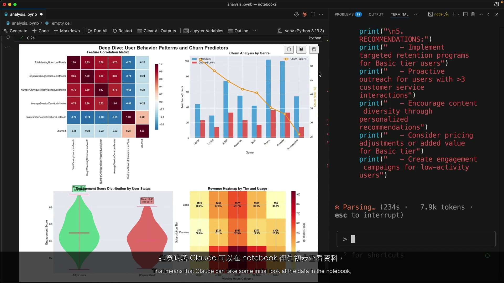

> **EN:** That means that Claude can take some initial look at the data in the notebook,
>
> **ZH:** 這意味著 Claude 可以在 notebook 裡先初步查看資料，

---

### [00:02:57] 第 46 段

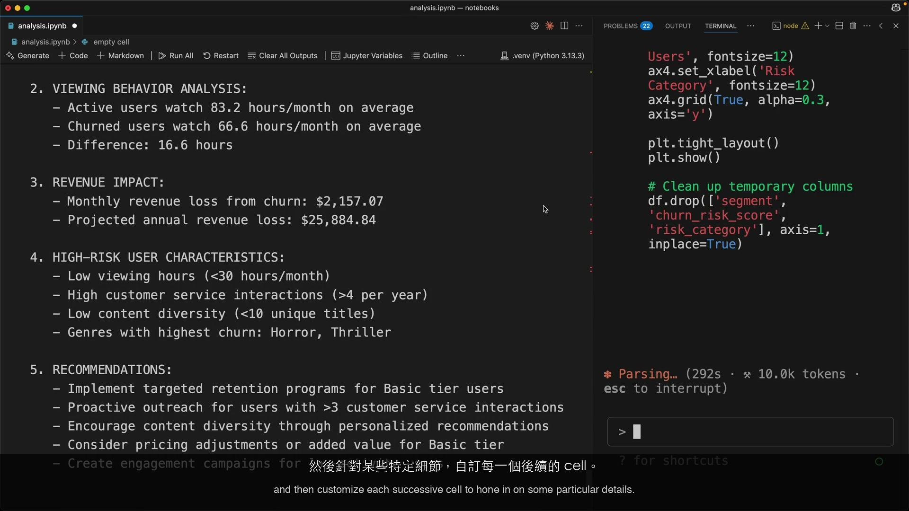

> **EN:** and then customize each successive cell to hone in on some particular details.
>
> **ZH:** 然後針對某些特定細節，自訂每一個後續的 cell。

---

### [00:03:02] 第 47 段

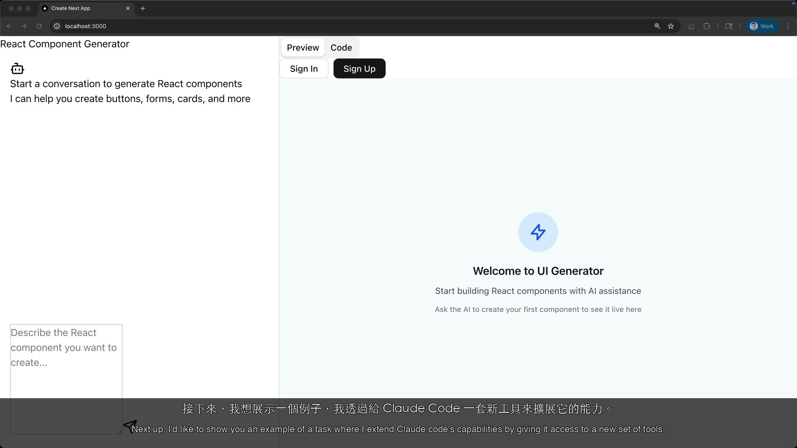

> **EN:** Next up, I'd like to show you an example of a task where I extend Claude code's capabilities by giving it access to a new set of tools.
>
> **ZH:** 接下來，我想展示一個例子，我透過給 Claude Code 一套新工具來擴展它的能力。

---

### [00:03:10] 第 48 段

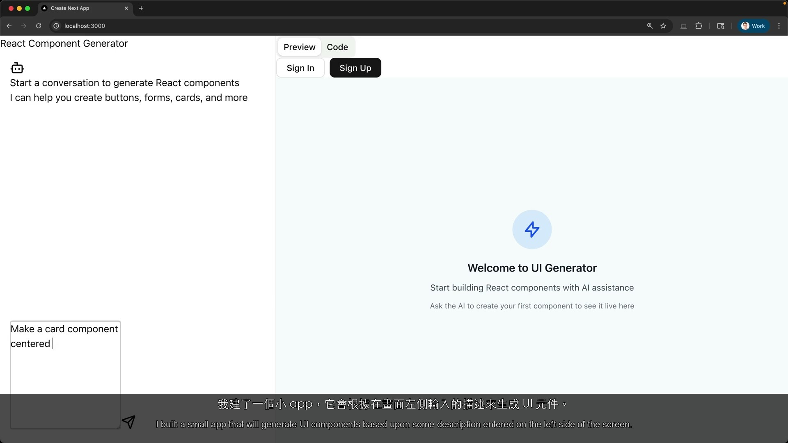

> **EN:** I built a small app that will generate UI components based upon some description entered on the left side of the screen.
>
> **ZH:** 我建了一個小 app，它會根據在畫面左側輸入的描述來生成 UI 元件。

---

### [00:03:16] 第 49 段

> **EN:** The generated component is then displayed on the right side.
>
> **ZH:** 生成的元件會顯示在右側。

---

### [00:03:18] 第 50 段

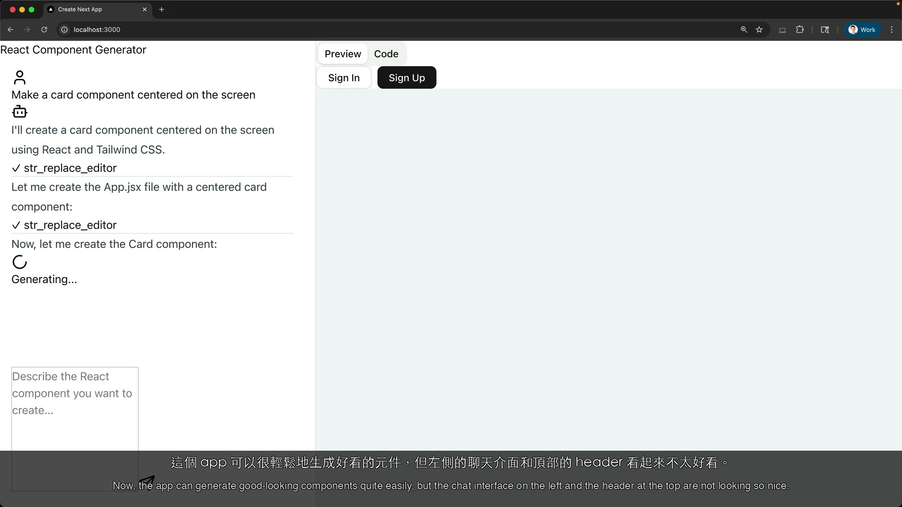

> **EN:** Now, the app can generate good-looking components quite easily, but the chat interface on the left and the header at the top are not looking so nice.
>
> **ZH:** 這個 app 可以很輕鬆地生成好看的元件，但左側的聊天介面和頂部的 header 看起來不太好看。

---

### [00:03:28] 第 51 段

> **EN:** So I'm going to use Claude code to improve the styling.
>
> **ZH:** 所以我要用 Claude Code 來改善樣式。

---

### [00:03:30] 第 52 段

> **EN:** If I just asked it to fix the styling in the chat interface in the header, it would likely do a fine job.
>
> **ZH:** 如果我只是請它修復聊天介面和 header 的樣式，它可能會做得不錯。

---

### [00:03:35] 第 53 段

> **EN:** But remember, my goal here is to show you how easy it is to add additional functionality to Claude code.
>
> **ZH:** 但記住，我這裡的目標是要展示給 Claude Code 增加額外功能有多容易。

---

### [00:03:41] 第 54 段

> **EN:** So along with this styling task, I'm going to also give Claude code access to a new set of tools provided by something called the Playwright MCP server, which I'll tell you more about later on.
>
> **ZH:** 所以除了這個樣式任務之外，我還要給 Claude Code 存取一套新工具，這套工具由一個叫做 Playwright MCP server 的東西提供，我稍後會詳細介紹。

---

### [00:03:51] 第 55 段

> **EN:** These tools allow Claude to directly open and control a browser.
>
> **ZH:** 這些工具讓 Claude 可以直接開啟並控制瀏覽器。

---

### [00:03:55] 第 56 段

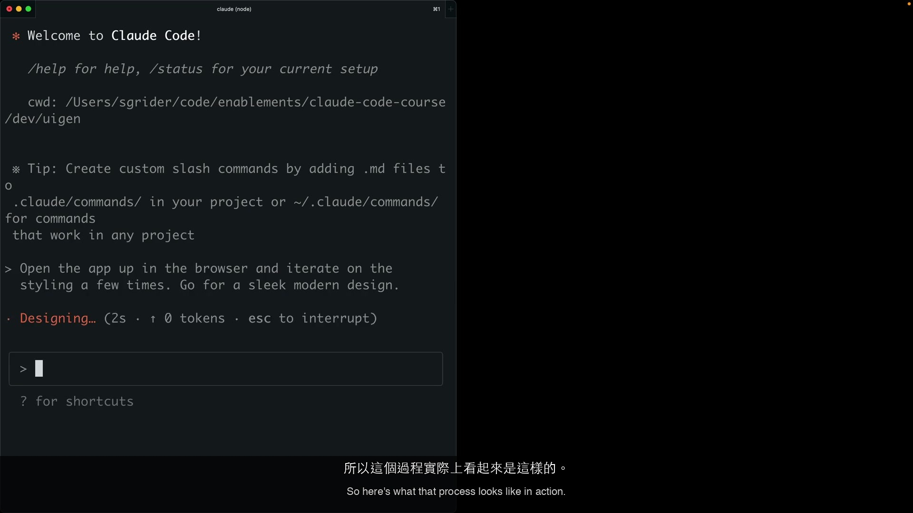

> **EN:** So here's what that process looks like in action.
>
> **ZH:** 所以這個過程實際上看起來是這樣的。

---

### [00:03:58] 第 57 段

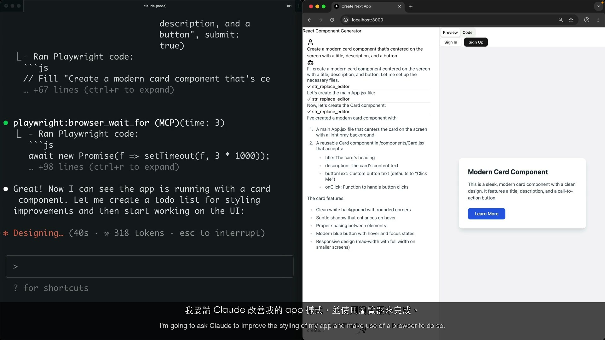

> **EN:** I'm going to ask Claude to improve the styling of my app and make use of a browser to do so.
>
> **ZH:** 我要請 Claude 改善我的 app 樣式，並使用瀏覽器來完成。

---

### [00:04:02] 第 58 段

> **EN:** It'll then open a browser on the right-hand side of the screen, navigate to my app.
>
> **ZH:** 它會在畫面右側開啟一個瀏覽器，然後導航到我的 app。

---

### [00:04:07] 第 59 段

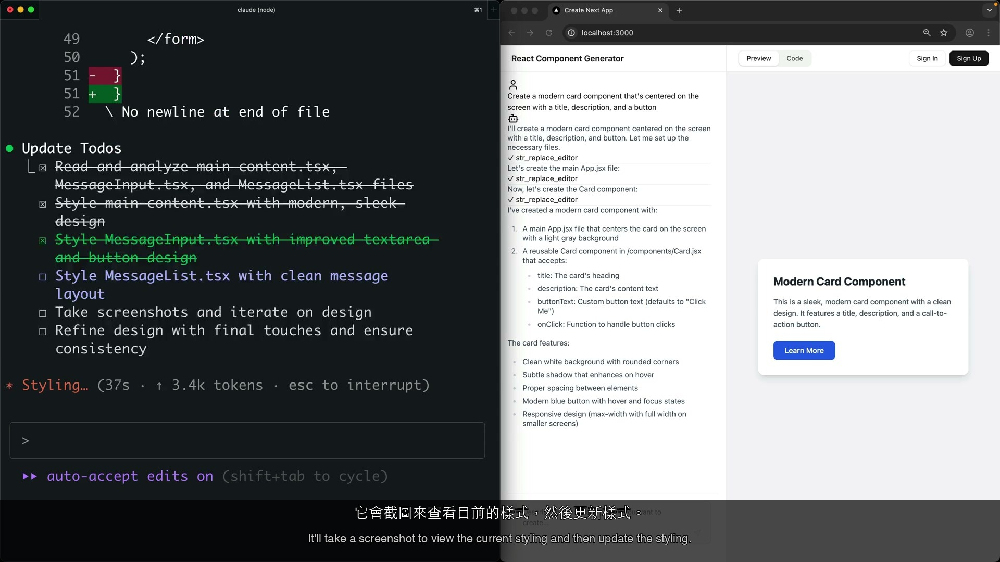

> **EN:** It'll take a screenshot to view the current styling and then update the styling.
>
> **ZH:** 它會截圖來查看目前的樣式，然後更新樣式。

---

### [00:04:11] 第 60 段

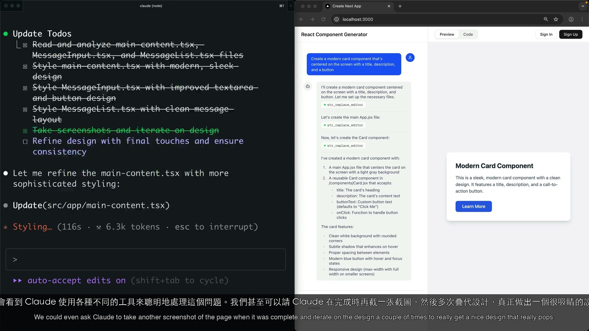

> **EN:** We could even ask Claude to take another screenshot of the page when it was complete and iterate on the design a couple of times to really get a nice design that really pops.
>
> **ZH:** 我們會看到 Claude 使用各種不同的工具來聰明地處理這個問題。我們甚至可以請 Claude 在完成時再截一張截圖，然後多次疊代設計，真正做出一個很吸睛的設計。

---

### [00:04:21] 第 61 段

> **EN:** And before long, we've got something that actually looks pretty reasonable.
>
> **ZH:** 沒多久，我們就得到了一個看起來相當不錯的結果。

---

### [00:04:25] 第 62 段

> **EN:** There's one last set of demonstrations that I'd like to give you.
>
> **ZH:** 我還有最後一組示範想給你看。

---

### [00:04:27] 第 63 段

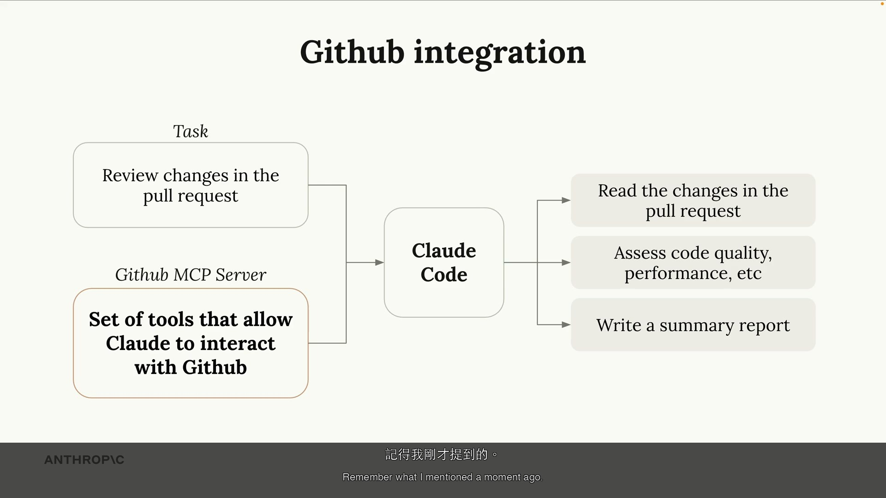

> **EN:** Remember what I mentioned a moment ago.
>
> **ZH:** 記得我剛才提到的。

---

### [00:04:30] 第 64 段

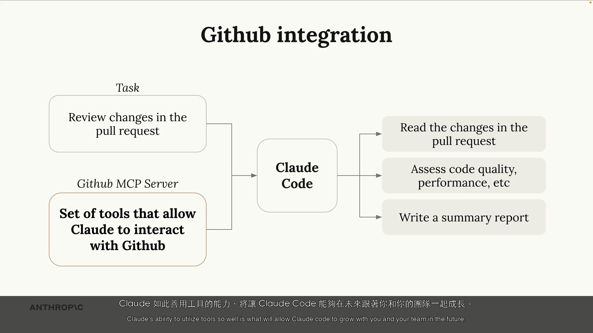

> **EN:** Claude's ability to utilize tools so well is what will allow Claude code to grow with you and your team in the future.
>
> **ZH:** Claude 如此善用工具的能力，將讓 Claude Code 能夠在未來跟著你和你的團隊一起成長。

---

### [00:04:36] 第 65 段

> **EN:** Let me show you an example of that right away.
>
> **ZH:** 讓我馬上給你看一個例子。

---

### [00:04:38] 第 66 段

> **EN:** Claude code has a very close integration with GitHub.
>
> **ZH:** Claude Code 與 GitHub 有非常緊密的整合。

---

### [00:04:41] 第 67 段

> **EN:** You can set up Claude code to run inside of a GitHub action, where it will be executed automatically based upon certain events, like creating a pull request or when directly mentioned inside of an issue.
>
> **ZH:** 你可以設定 Claude Code 在 GitHub Action 裡運行，它會根據特定事件自動執行，比如建立 pull request，或是在 issue 裡被直接 @ 到。

---

### [00:04:52] 第 68 段

> **EN:** When Claude code runs on GitHub, it not only gets to view and run your code, but it also gets to access a new set of tools for interacting with GitHub, like the ability to create comments or create commits or pull requests and so on.
>
> **ZH:** Claude Code 在 GitHub 上運行時，不只能查看和執行你的程式碼，還能存取一套與 GitHub 互動的新工具，像是建立留言、建立 commit 或 pull request 等等。

---

### [00:05:05] 第 69 段

> **EN:** You can use this integration to automatically review pull requests.
>
> **ZH:** 你可以利用這個整合來自動審查 pull request。

---

### [00:05:09] 第 70 段

> **EN:** Let me show you an example.
>
> **ZH:** 讓我給你看一個例子。

---

### [00:05:11] 第 71 段

> **EN:** Let me first set up a little scenario for you.
>
> **ZH:** 先讓我為你設定一個小情境。

---

### [00:05:13] 第 72 段

> **EN:** Let's imagine that we are building out some infrastructure on AWS and all of our infrastructure is defined inside of a set of Terraform files, which are committed and stored on GitHub.
>
> **ZH:** 假設我們正在 AWS 上建置一些基礎設施，所有的基礎設施都定義在一組 Terraform 檔案裡，這些檔案被 commit 並儲存在 GitHub 上。

---

### [00:05:22] 第 73 段

> **EN:** Because all of our infrastructure is defined inside of Terraform files, Claude code has a really good idea of how information is flowing through our infrastructure.
>
> **ZH:** 因為我們所有的基礎設施都定義在 Terraform 檔案裡，Claude Code 對資訊如何在我們的基礎設施中流動有很好的了解。

---

### [00:05:31] 第 74 段

> **EN:** Now, let's imagine that in the SAP, I have a DynamoDB table.
>
> **ZH:** 現在，假設在這個架構裡，我有一個 DynamoDB 資料表。

---

### [00:05:35] 第 75 段

> **EN:** If you're not familiar with those, it's kind of like a normal database table.
>
> **ZH:** 如果你不熟悉的話，它有點像是一般的資料庫表格。

---

### [00:05:38] 第 76 段

> **EN:** Inside there, I'm storing some different information about users, including maybe plans viewed and a registration date.
>
> **ZH:** 裡面我儲存了一些關於用戶的不同資訊，包括也許看過的方案和註冊日期。

---

### [00:05:44] 第 77 段

> **EN:** And for maybe some reason, we want to share just that plans viewed and registration date information with some internal marketing team, but also some external marketing team as well.
>
> **ZH:** 也許因為某些原因，我們想要把只有看過的方案和註冊日期這些資訊，分享給一個內部行銷團隊，但也要分享給一個外部行銷團隊。

---

### [00:05:55] 第 78 段

> **EN:** So some other company has access to the data that we are writing in this bucket.
>
> **ZH:** 所以另一家公司可以存取我們寫入這個 bucket 的資料。

---

### [00:05:59] 第 79 段

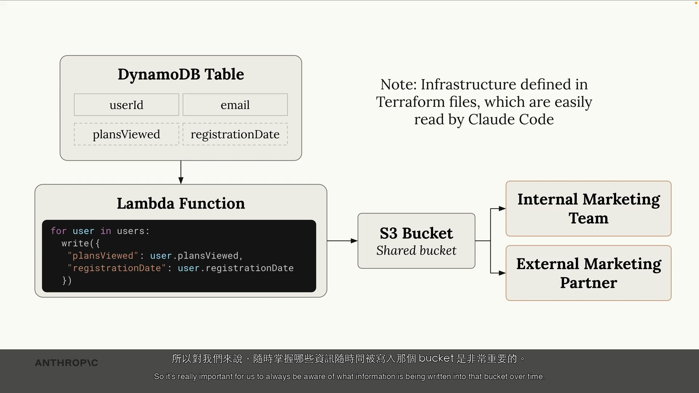

> **EN:** So it's really important for us to always be aware of what information is being written into that bucket over time.
>
> **ZH:** 所以對我們來說，隨時掌握哪些資訊隨時間被寫入那個 bucket 是非常重要的。

---

### [00:06:05] 第 80 段

> **EN:** Nightly, we might have a Lambda function, pull out all the different users that have been added into that table,
>
> **ZH:** 每晚，我們可能有一個 Lambda function，把所有加入那張資料表的不同用戶拉出來，

---

### [00:06:10] 第 81 段

> **EN:** and then extract just plans viewed and the registration date and store that in the S3 bucket.
>
> **ZH:** 然後只提取看過的方案和註冊日期，並儲存到 S3 bucket 裡。

---

### [00:06:16] 第 82 段

> **EN:** So these two marketing teams can access that information.
>
> **ZH:** 這樣這兩個行銷團隊就可以存取那些資訊。

---

### [00:06:19] 第 83 段

> **EN:** Now, let's imagine that months later on, the internal marketing team asks us to also store the email inside of this S3 bucket as well.
>
> **ZH:** 現在，假設幾個月後，內部行銷團隊要求我們也把 email 儲存到這個 S3 bucket 裡。

---

### [00:06:28] 第 84 段

> **EN:** So we might go into the Lambda function and add in just one single line of code that takes the user's email and stores it inside the bucket.
>
> **ZH:** 所以我們可能會去到 Lambda function，加入一行程式碼，取得用戶的 email 並儲存到 bucket 裡。

---

### [00:06:34] 第 85 段

> **EN:** And because this is months later on, we might have completely forgotten that this S3 bucket is shared with a external marketing partner.
>
> **ZH:** 因為這是幾個月後的事，我們可能已經完全忘記這個 S3 bucket 是和一個外部行銷合作夥伴共享的。

---

### [00:06:42] 第 86 段

> **EN:** So now at this point in time, we are putting personally identifiable information into this bucket, which is accessible by a separate company.
>
> **ZH:** 所以現在到了這個時間點，我們正在把個人識別資訊放進這個 bucket，而這個 bucket 是另一家公司可以存取的。

---

### [00:06:49] 第 87 段

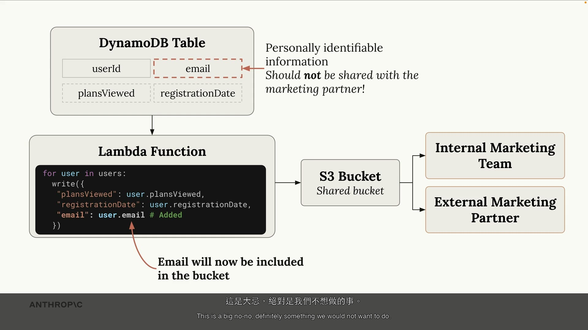

> **EN:** This is a big no-no, definitely something we would not want to do.
>
> **ZH:** 這是大忌，絕對是我們不想做的事。

---

### [00:06:53] 第 88 段

> **EN:** But at the same time, this is a error that does occur.
>
> **ZH:** 但同時，這種錯誤確實會發生。

---

### [00:06:56] 第 89 段

> **EN:** And it's kind of hard to catch if we don't have a good idea of exactly what's going on with this S3 bucket.
>
> **ZH:** 而且如果我們對這個 S3 bucket 的情況沒有很清楚的了解，是很難察覺的。

---

### [00:07:01] 第 90 段

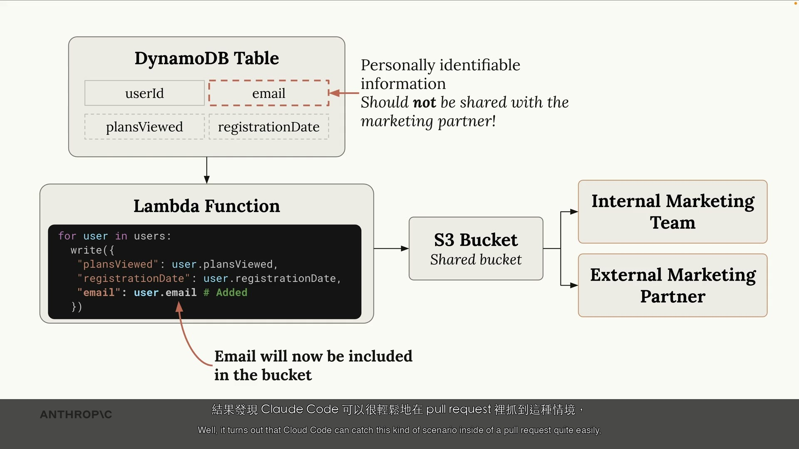

> **EN:** Well, it turns out that Cloud Code can catch this kind of scenario inside of a pull request quite easily,
>
> **ZH:** 結果發現 Claude Code 可以很輕鬆地在 pull request 裡抓到這種情境，

---

### [00:07:07] 第 91 段

> **EN:** specifically because all of our infrastructure is defined inside of those Terraform files.
>
> **ZH:** 特別是因為我們所有的基礎設施都定義在那些 Terraform 檔案裡。

---

### [00:07:12] 第 92 段

> **EN:** So here's a quick example.
>
> **ZH:** 所以這裡有個快速的例子。

---

### [00:07:13] 第 93 段

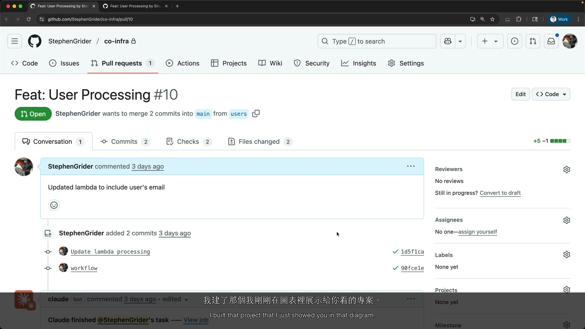

> **EN:** I built that project that I just showed you in that diagram.
>
> **ZH:** 我建了那個我剛剛在圖表裡展示給你看的專案。

---

### [00:07:17] 第 94 段

> **EN:** I created a pull request to add in the user's email inside of the Lambda function.
>
> **ZH:** 我建立了一個 pull request，在 Lambda function 裡加入用戶的 email。

---

### [00:07:22] 第 95 段

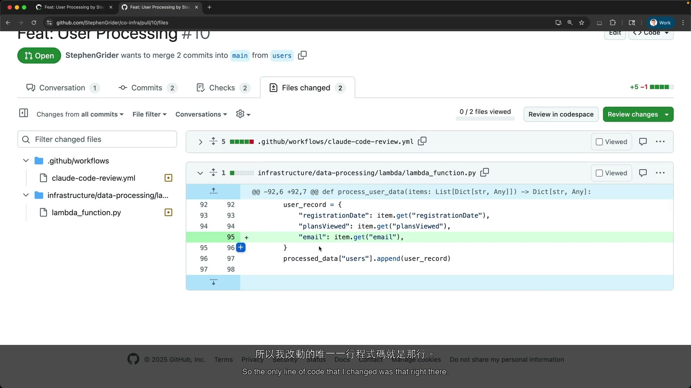

> **EN:** So the only line of code that I changed was that right there.
>
> **ZH:** 所以我改動的唯一一行程式碼就是那行。

---

### [00:07:24] 第 96 段

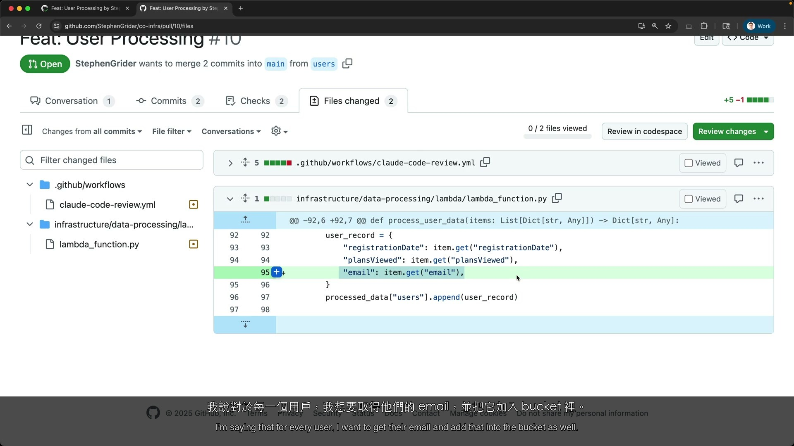

> **EN:** I'm saying that for every user, I want to get their email and add that into the bucket as well.
>
> **ZH:** 我說對於每一個用戶，我想要取得他們的 email，並把它加入 bucket 裡。

---

### [00:07:29] 第 97 段

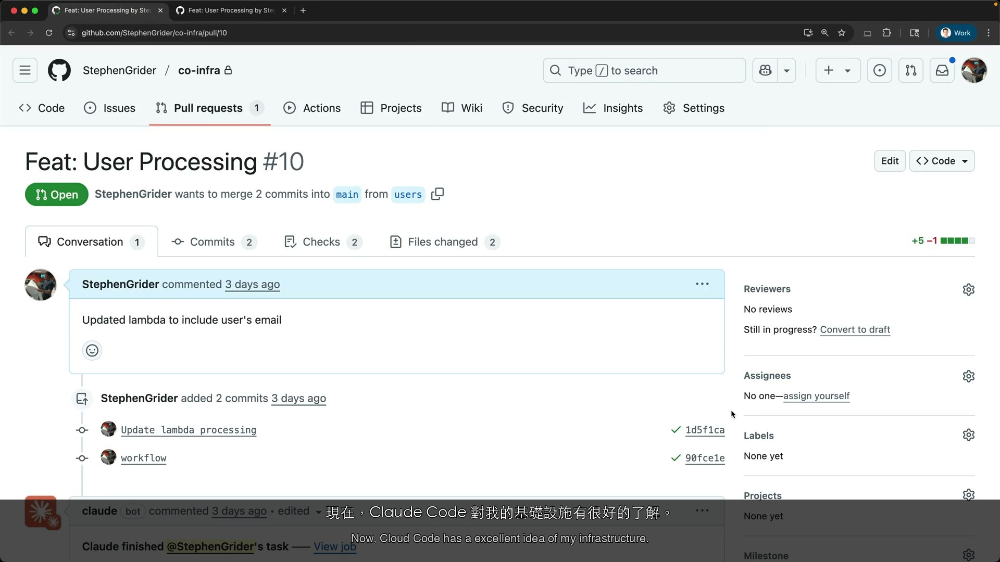

> **EN:** Now, Cloud Code has a excellent idea of my infrastructure.
>
> **ZH:** 現在，Claude Code 對我的基礎設施有很好的了解。

---

### [00:07:33] 第 98 段

> **EN:** So it was able inside of a automated review, as we're seeing right here, to take a look at all the changes I made inside this pull request.
>
> **ZH:** 所以它能夠在一個自動化審查裡，就像我們現在看到的，查看我在這個 pull request 裡做的所有改動。

---

### [00:07:39] 第 99 段

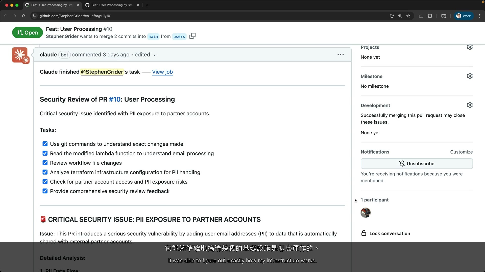

> **EN:** It was able to figure out exactly how my infrastructure works.
>
> **ZH:** 它能夠準確地搞清楚我的基礎設施是怎麼運作的。

---

### [00:07:43] 第 100 段

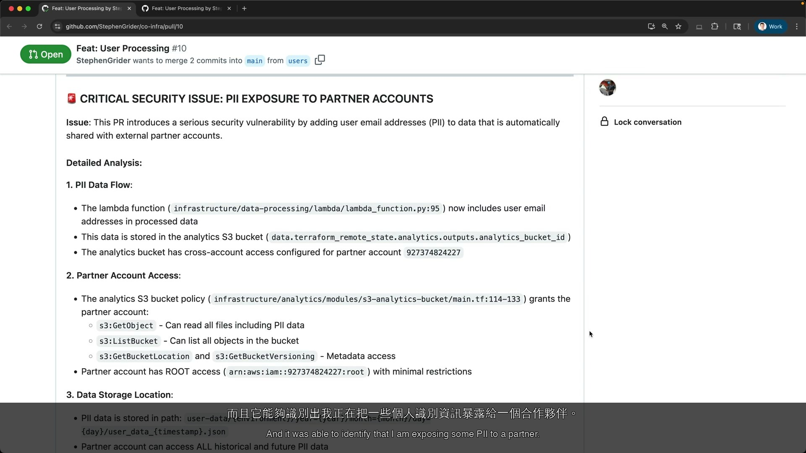

> **EN:** And it was able to identify that I am exposing some PII to a partner.
>
> **ZH:** 而且它能夠識別出我正在把一些個人識別資訊暴露給一個合作夥伴。

---

### [00:07:47] 第 101 段

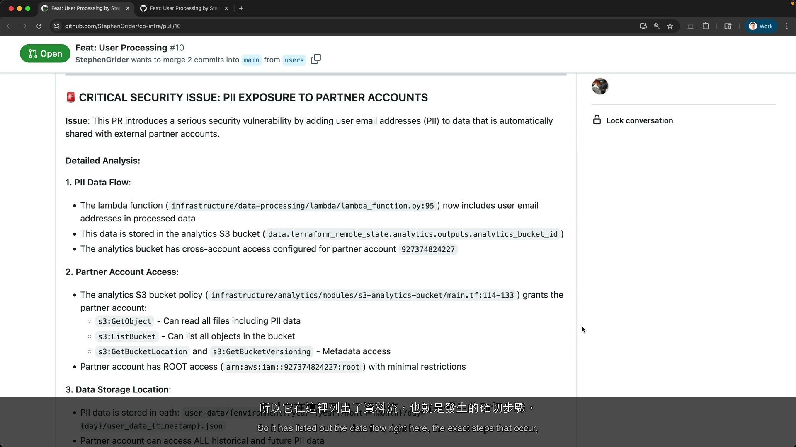

> **EN:** So it has listed out the data flow right here, the exact steps that occur,
>
> **ZH:** 所以它在這裡列出了資料流，也就是發生的確切步驟，

---

### [00:07:51] 第 102 段

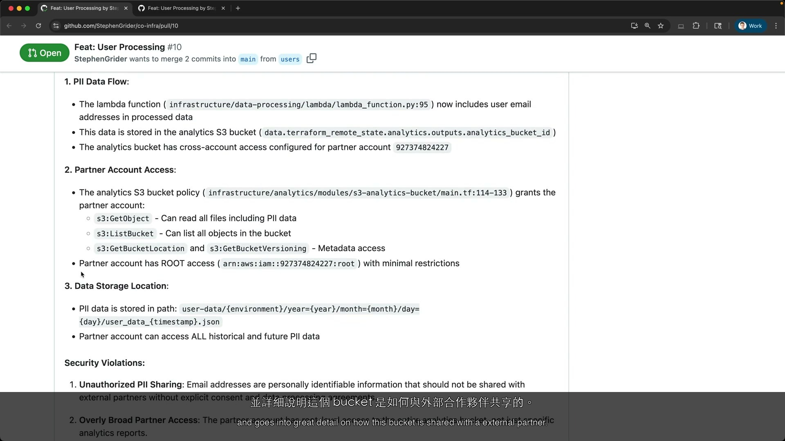

> **EN:** and goes into great detail on how this bucket is shared with a external partner.
>
> **ZH:** 並詳細說明這個 bucket 是如何與外部合作夥伴共享的。

---

### [00:07:57] 第 103 段

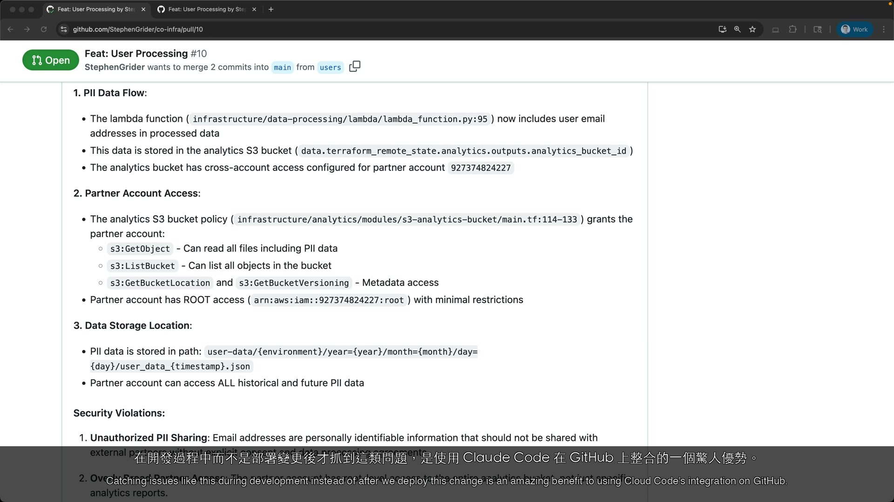

> **EN:** Catching issues like this during development instead of after we deploy this change is an amazing benefit to using Cloud Code's integration on GitHub.
>
> **ZH:** 在開發過程中而不是部署變更後才抓到這類問題，是使用 Claude Code 在 GitHub 上整合的一個驚人優勢。

---

### [00:08:05] 第 104 段

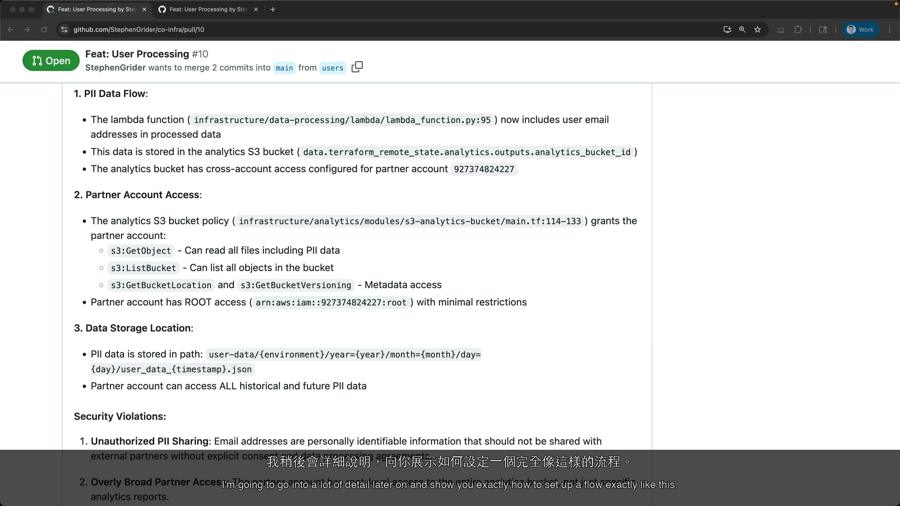

> **EN:** I'm going to go into a lot of detail later on and show you exactly how to set up a flow exactly like this.
>
> **ZH:** 我稍後會詳細說明，向你展示如何設定一個完全像這樣的流程。

---

### [00:08:10] 第 105 段

> **EN:** I think that we've now got a good idea of what Cloud Code can do thanks to its excellent ability to make use of tools.
>
> **ZH:** 我想我們現在已經對 Claude Code 能做什麼有了很好的了解，這要感謝它出色的工具使用能力。

---

### [00:08:17] 第 106 段

> **EN:** Remember, you really want to think of Cloud Code as a flexible assistant that can be customized, grow, and change over time to meet the needs of your team.
>
> **ZH:** 記住，你真的應該把 Claude Code 想成一個靈活的助手，它可以被客製化、成長，並隨著時間改變，以滿足你的團隊需求。

---
