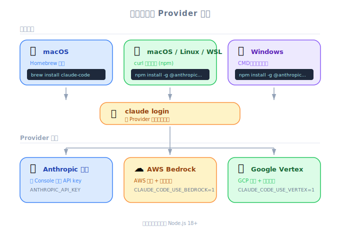

# Claude Code Setup — 工程深度筆記

| 項目 | 細節 |
|------|--------|
| 考試領域 | D3 — Effective Claude Code Usage (30%) |
| Task Statements | 3.1 (CLAUDE.md hierarchy — awareness level) |
| 來源 | claude-code-in-action / 02-getting-started / Lesson 05（純文字課程） |

---

*圖：各平台安裝方式。*

## 一句話總結

Claude Code 透過單一 CLI 指令即可安裝於 macOS、Linux 或 Windows/WSL，並可選擇性設定 AWS Bedrock 和 Google Cloud Vertex 作為 API provider。

---

## 安裝方式

Claude Code 依作業系統提供多種安裝路徑：

| 平台 | 指令 |
|----------|---------|
| macOS (Homebrew) | `brew install --cask claude-code` |
| macOS / Linux / WSL | `curl -fsSL https://claude.ai/install.sh \| bash` |
| Windows CMD | `curl -fsSL https://claude.ai/install.cmd -o install.cmd && install.cmd && del install.cmd` |

安裝完成後，在終端機執行 `claude`。首次啟動會觸發驗證提示。

> 💡 **關鍵洞察**
>
> Claude Code 完全在終端機中運行 — 沒有 GUI 應用程式。這是刻意設計：它在開發者已經工作的地方（shell）運作。

---

## Cloud Provider 設定（選用）

如果你的組織透過雲端供應商路由 API 呼叫，而非直接使用 Anthropic API：

| Provider | 設定指南 |
|----------|-------------|
| AWS Bedrock | [code.claude.com/docs/en/amazon-bedrock](https://code.claude.com/docs/en/amazon-bedrock) |
| Google Cloud Vertex | [code.claude.com/docs/en/google-vertex-ai](https://code.claude.com/docs/en/google-vertex-ai) |

這些適用於有既有雲端合約或資料駐留需求的企業環境。

---

## 考試重點

| 考試概念 | 本課教了什麼 |
|-------------|-------------------------|
| **CLAUDE.md hierarchy (3.1)** | 認識 Claude Code 是一個 CLI 工具，具有 project-level 設定（CLAUDE.md 在此介紹，Lesson 07 詳述） |

---

## 反模式

| 反模式 | 為何失敗 |
|-------------|-------------|
| 安裝 Claude Code 後期待有 GUI | Claude Code 設計上就是 CLI-only；它整合進終端機工作流 |
| 首次執行時跳過驗證 | `claude` 指令在驗證前無法使用任何功能 |
| 在企業環境忽略 cloud provider 設定 | 如果組織使用 Bedrock/Vertex，直接 API 呼叫可能被阻擋或不合規 |
