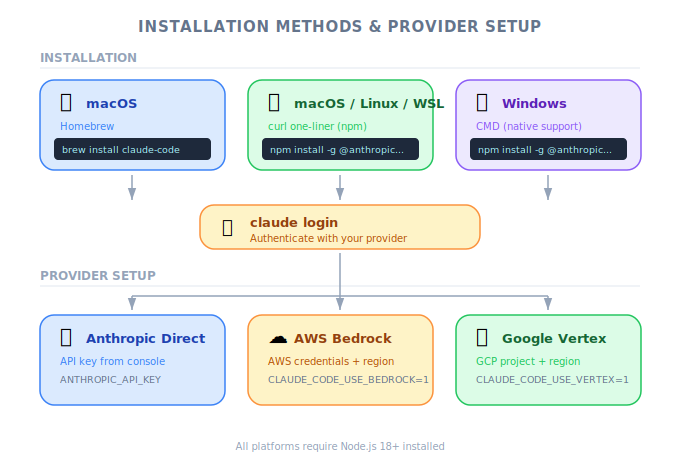

# Claude Code Setup — Engineering Deep Dive

| Item | Detail |
|------|--------|
| Exam Domain | D3 — Effective Claude Code Usage (30%) |
| Task Statements | 3.1 (CLAUDE.md hierarchy — awareness level) |
| Source | claude-code-in-action / 02-getting-started / Lesson 05 (text-only) |

---

## One-Liner

Claude Code installs via a single CLI command on macOS, Linux, or Windows/WSL, with optional provider configuration for AWS Bedrock and Google Cloud Vertex.

---

## Installation Methods

*Figure: Installation methods across platforms.*

Claude Code supports multiple installation paths depending on your OS:

| Platform | Command |
|----------|---------|
| macOS (Homebrew) | `brew install --cask claude-code` |
| macOS / Linux / WSL | `curl -fsSL https://claude.ai/install.sh \| bash` |
| Windows CMD | `curl -fsSL https://claude.ai/install.cmd -o install.cmd && install.cmd && del install.cmd` |

After installation, run `claude` in your terminal. The first launch triggers an authentication prompt.

> [!TIP]
> **Key Insight**
>
> Claude Code runs entirely in your terminal — there is no GUI application. This is intentional: it operates where developers already work, inside the shell.

---

## Cloud Provider Setup (Optional)

If your organization routes API calls through a managed cloud provider instead of direct Anthropic API:

| Provider | Setup Guide |
|----------|-------------|
| AWS Bedrock | [code.claude.com/docs/en/amazon-bedrock](https://code.claude.com/docs/en/amazon-bedrock) |
| Google Cloud Vertex | [code.claude.com/docs/en/google-vertex-ai](https://code.claude.com/docs/en/google-vertex-ai) |

These are relevant for enterprise environments with existing cloud commitments or data residency requirements.

---

## Exam Focus

| Exam Concept | What This Lesson Teaches |
|-------------|-------------------------|
| **CLAUDE.md hierarchy (3.1)** | Awareness that Claude Code is a CLI tool with project-level configuration (CLAUDE.md introduced here, detailed in Lesson 07) |

---

## Anti-Patterns

| Anti-Pattern | Why It Fails |
|-------------|-------------|
| Installing Claude Code and expecting a GUI | Claude Code is CLI-only by design; it integrates into terminal workflows |
| Skipping authentication on first run | The `claude` command requires auth before any functionality works |
| Ignoring cloud provider setup in enterprise | If your org uses Bedrock/Vertex, direct API calls may be blocked or non-compliant |
