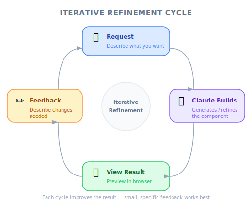

# Project Setup — Engineering Deep Dive

| Item | Detail |
|------|--------|
| Exam Domain | D2 — Tool Design & MCP Integration (18%), D3 — Effective Claude Code Usage (30%) |
| Task Statements | 2.5 (built-in tools — awareness), 3.5 (iterative refinement — intro) |
| Source | claude-code-in-action / 02-getting-started / Lesson 06 (text-only) |

---

## One-Liner

The course demo project is a Node.js UI generation app backed by the Anthropic API and SQLite — a practical sandbox for exploring Claude Code's built-in tools and iterative workflow.

---

## Project Architecture

The demo project (`uigen`) generates UI components using Claude through the Anthropic API:

```
uigen/
├── package.json          # Node.js project config
├── .env                  # Anthropic API key (optional)
├── prisma/
│   └── schema.prisma     # SQLite database schema
├── src/
│   ├── server/           # Backend API routes
│   └── client/           # Frontend UI
└── node_modules/         # Dependencies (after npm run setup)
```

**Key setup steps:**
1. Install Node.js
2. Extract `uigen.zip` and run `npm run setup` (installs deps + creates SQLite DB)
3. Optionally add Anthropic API key to `.env`
4. Start with `npm run dev`

> 💡 **Key Insight**
>
> The API key is optional. Without it, the app generates static fake code instead of calling Claude. This means you can follow the course even without an Anthropic API key.

---

## Built-in Tools Preview (Task 2.5)

This project setup introduces the context where Claude Code's built-in tools operate. In upcoming lessons, you will use:

| Tool | What It Does in This Project |
|------|------------------------------|
| **Read** | Examine `schema.prisma`, `package.json`, route files |
| **Write / Edit** | Modify UI components, add API routes |
| **Bash** | Run `npm run dev`, `npm run setup`, execute tests |
| **Glob / Grep** | Search across `src/` for specific patterns |

Claude Code selects the appropriate tool automatically based on your request. You do not manually invoke tools.

---

## Iterative Refinement Preview (Task 3.5)



*Figure: The iterative refinement cycle — request, build, view, feedback.*

The project is designed to demonstrate iterative development with Claude Code:

1. Ask Claude to generate a UI component
2. View the result in the browser
3. Provide feedback (screenshot, text description, or both)
4. Claude refines the implementation

This introduce-iterate-refine cycle is the foundation of productive Claude Code usage, covered in depth in Lessons 07 and 08.

---

## Exam Focus

| Exam Concept | What This Lesson Teaches |
|-------------|-------------------------|
| **Built-in tool selection (2.5)** | Awareness that Claude Code has Read, Write, Bash, Glob, Grep tools that it selects automatically |
| **Iterative refinement (3.5)** | Introduction to the generate-review-refine cycle |

---

## Anti-Patterns

| Anti-Pattern | Why It Fails |
|-------------|-------------|
| Skipping `npm run setup` | The SQLite database will not exist, causing runtime errors |
| Committing `.env` with API key to source control | Security risk — `.env` should be in `.gitignore` |
| Thinking the API key is required | The app works without it using static fallback data |
