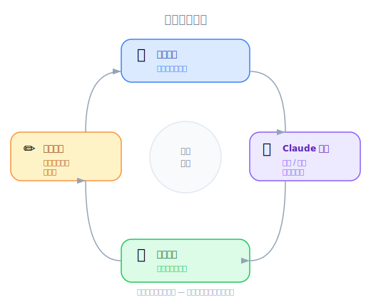

# Project Setup — PM 视角

| 项目 | 细节 |
|------|---------|
| 考试涵盖 | D2 — Tool Design & MCP Integration (18%), D3 — Effective Claude Code Usage (30%) |
| Task Statements | 2.5 (built-in tools — awareness), 3.5 (iterative refinement — intro) |
| 课程来源 | claude-code-in-action / 02-getting-started / Lesson 06（纯文字课程） |

---

*圖：迭代精煉循環 — 請求、建構、檢視、回饋。*

## TL;DR

课程使用一个小型 Node.js 应用，通过 Claude API 生成 UI 组件。PM 应理解：(1) 该项目展示 Claude Code 如何与真实代码库协作，(2) API key 是可选的 — 表示工具在没有外部 API 访问时也能运作，(3) 它引入的迭代式 generate-review-refine 工作流，是团队实际使用 Claude Code 的方式。

---

## 为什么 PM 该关注

1. **产品 demo 素养** — 理解演示项目有助于跟上课程，并向利益相关方沟通 Claude Code 的功能
2. **迭代工作流介绍** — generate-review-refine 循环是工程团队采用 Claude Code 的方式；这是你会推销的生产力故事
3. **API key 可选性** — 展示优雅降级，一个值得注意的产品设计模式

---

## 商业类比

| 概念 | 商业类比 |
|---------|-----------------|
| 含可选 API 的演示项目 | 像 freemium SaaS — 核心功能无需付费即可使用，高级功能需要 key |
| `npm run setup` 一次性初始化 | 像企业工具的入职设置 — 执行一次，然后开始工作 |
| 迭代式 UI 生成 | 像设计冲刺 — 展示原型、获取反馈、改进、重复 |

---

## 场景演练：向利益相关方解释 Claude Code

你的工程副总问：「Claude Code 实际上对我们的代码做什么？」

以演示项目为参考：

| 步骤 | 发生什么 | 商业影响 |
|------|-------------|----------------|
| 1. 开发者请 Claude 构建功能 | Claude 读取项目结构和相关文件 | 无需预索引；第一天就能在任何代码库上工作 |
| 2. Claude 生成实现 | 代码直接写入项目文件 | 不需要从另一个聊天窗口复制粘贴 |
| 3. 开发者在浏览器中查看 | 应用程序立即反映变更 | 反馈循环是秒级，不是小时级 |
| 4. 开发者提供改进反馈 | Claude 迭代改进实现 | 通过对话收敛到正确的解决方案 |

---

## 练习题

### 场景：ROI 评估

你的 CFO 问团队是否需要为每个开发者准备 Anthropic API key 才能使用 Claude Code。根据本课内容，正确答案是什么？

- A. 是 — Claude Code 需要 API key 才能运作
- B. 否 — Claude Code 本身不需要 Anthropic API key；演示项目可选地使用一个来驱动自己的功能
- C. API key 只在首次设置时需要，之后可以移除
- D. 一个共享的 API key 对整个团队就够了

答案

**B** — Claude Code 通过自己的机制进行认证（Lesson 05）。本课的 Anthropic API key 是给演示项目的 UI 生成功能用的，不是给 Claude Code 本身用的。演示项目在没有它的情况下使用静态备用数据正常运作。

**PM 重点**：不要将演示项目的 API key 与 Claude Code 的认证混为一谈。这是两个不同的系统。Claude Code 的成本是通过自己的订阅/使用模式，而不是项目 `.env` 文件中的 API key。

