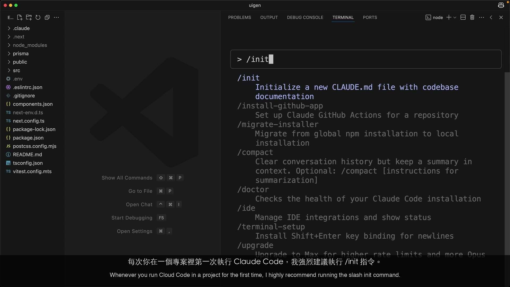
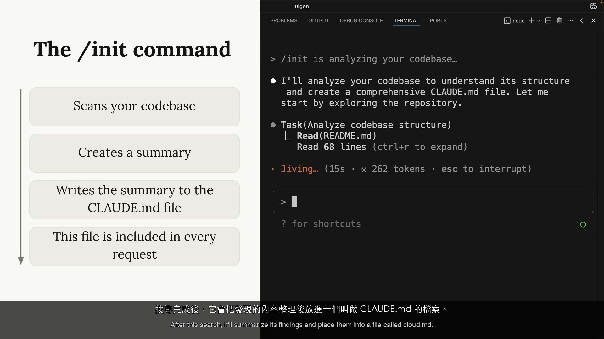
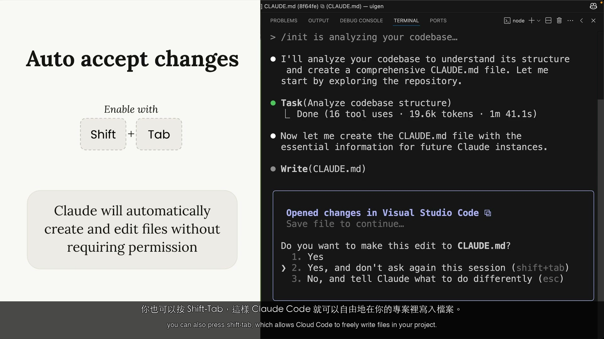
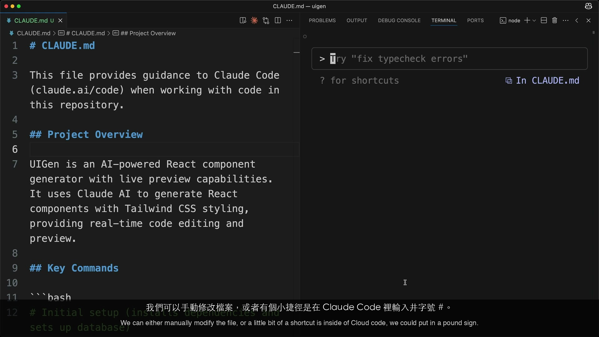
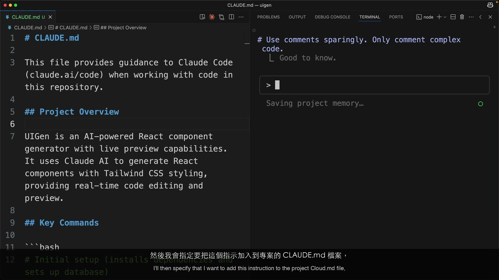
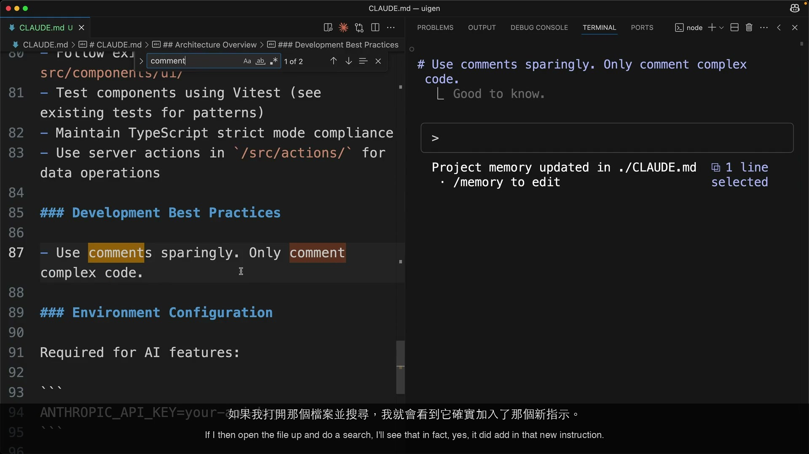
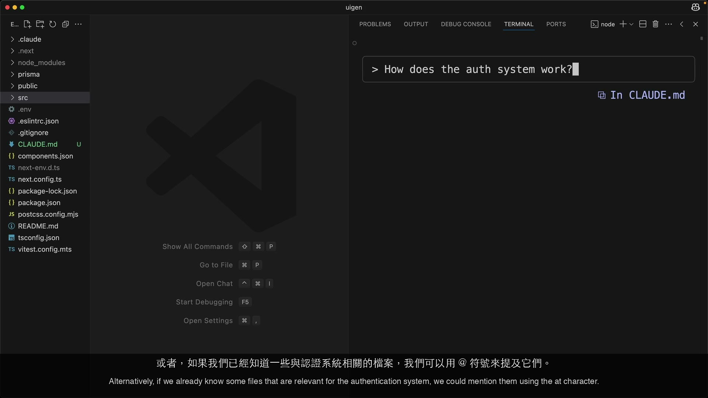
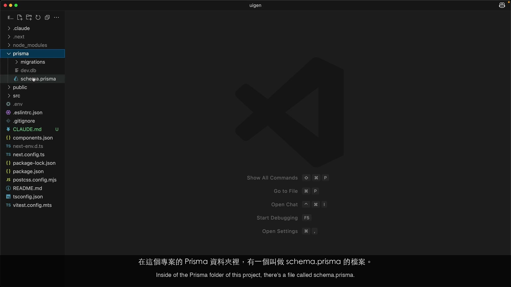
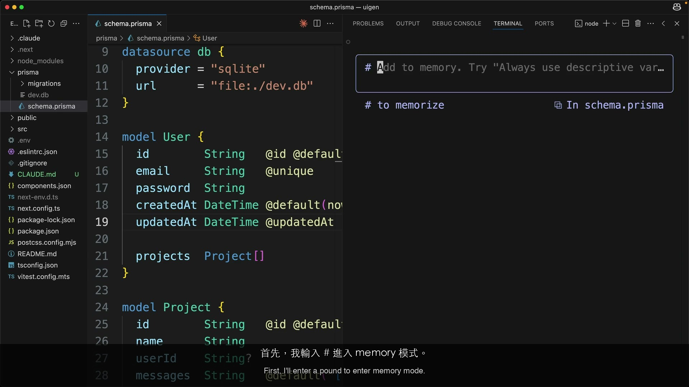
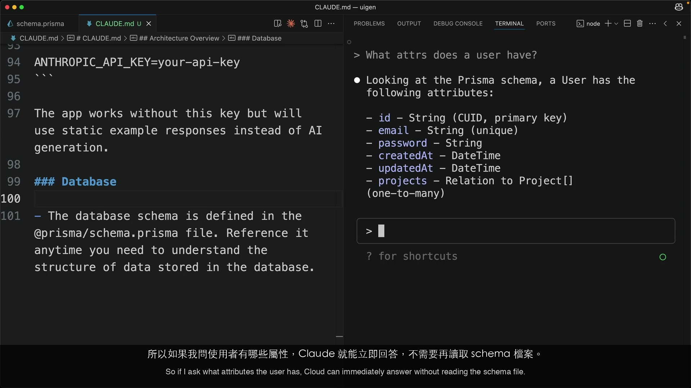

# Adding Context — PM Perspective

| Item | Detail |
|------|--------|
| Exam Domain | D3: Claude Code Configuration & Workflows, D5: Context Management |
| Task Statements | 3.1 (CLAUDE.md hierarchy), 5.1 (context preservation), 5.4 (large codebase context) |
| Source | Anthropic Skilljar — Claude Code in Action |

---

# PART 1: Official Course Content

> [!NOTE]
> 本節所有內容均直接來自官方課程教材。

## One-Liner / TL;DR

CLAUDE.md 是你團隊為 AI 助手準備的 onboarding 文件 — `/init` 產生它，三層階層在組織中強制執行標準，`@` 檔案引用控制 AI 永遠了解你專案的哪些內容。

## Core Concepts

### Context 管理原則

把 Claude Code 想像成加入你專案的新約聘人員。如果你把公司裡每份文件都堆在他桌上，他會不知所措且表現不佳。如果你只給關鍵的架構文件、程式碼標準，並指引他找到正確的檔案，他就能快速上手。

課程明確指出：太多不相關的 context 會降低 Claude Code 的效能。一般專案有數十甚至數百個檔案。理想是給 Claude 恰好足以完成任務的資訊 — 不多不少。這直接影響開發者生產力和 AI 輸出品質。

### /init 指令 — 自動化專案 Onboarding

首次在新專案中執行 Claude Code 時，`/init` 指令就像執行一次自動化 onboarding。Claude 會：

1. **閱讀整個 codebase** — 理解專案目的、架構和模式
2. **識別重要內容** — 關鍵指令、重要檔案、專案結構
3. **建立 onboarding 文件** — 產生 CLAUDE.md 檔案，摘要其發現

開發者批准檔案建立（Enter 接受，Shift+Tab 為自動接受模式）。這是每個專案的一次性設定。

**PM 重點：** `/init` 消除了「AI 不了解我們專案」的問題。一個指令，每位開發者的 AI 助手就理解專案架構。

### CLAUDE.md 檔案 — 持久的團隊設定

CLAUDE.md 有兩個用途：

1. **AI 的專案知識庫** — 架構、指令、程式碼風格（像 AI 真的會讀的內部 wiki）
2. **自訂行為指示** — AI 在每次互動中遵循的規則

內容包含在每個對 Claude 的請求中 — 它是持久的 system prompt。把它想成塑造專案上所有 AI 行為的設定檔。

### CLAUDE.md 檔案位置 — 三層政策系統

Claude Code 在三個層級識別 CLAUDE.md 檔案，運作方式如同企業政策階層：

| 層級 | 檔案 | 是否共享？ | PM 類比 |
|------|------|-----------|---------|
| 專案 | `./CLAUDE.md` | 是 — 提交至版本控制，與團隊共享 | **部門政策** — 適用於專案上的每個人。由 `/init` 產生，在 Git 中版本控制。 |
| 本地 | `./CLAUDE.local.md` | 否 — 不提交至版本控制 | **個人例外** — 此專案的個人指示。其他團隊成員看不到。 |
| 全域 | `~/.claude/CLAUDE.md` | 否 — 機器專屬 | **全公司政策** — 適用於此開發者機器上的所有專案。個人跨專案偏好。 |

> [!IMPORTANT]
> **團隊標準化：** 專案 CLAUDE.md 是你的槓桿。它提交至版本控制，意味著每位 clone repo 的開發者都繼承相同的 AI 設定。這就是你在不依賴個人紀律的情況下，在團隊中強制執行一致程式碼標準的方式。

### 使用 # Memory Mode 新增自訂指令 — 更新團隊 Wiki

Claude Code 中的 `#` 指令進入「memory mode」— 不需手動開啟 CLAUDE.md 檔案就能更新的捷徑。開發者輸入指示，選擇要加入哪個 CLAUDE.md 檔案，Claude 智慧合併。

**範例：** Tech lead 注意到 Claude 寫太多程式碼註解。他們輸入：
```
> # Don't write comments so often
```
這被合併入專案 CLAUDE.md。現在團隊中每位開發者都受益於這條指示。

### 使用 @ 提及檔案 — 控制 AI 焦點

`@` 語法將特定檔案內容包含在對 Claude 的請求中。存在兩種使用模式：

**在聊天中（臨時，一次性）：**
```
> How does the auth system work? @auth
```
檔案內容僅包含在該請求中。適合探索性工作。

**在 CLAUDE.md 中（持久，每次請求）：**
```markdown
The database schema is defined in @prisma/schema.prisma.
```
被引用的檔案自動包含在每個請求中。Claude 可以立即回答關於資料結構的問題，無需搜尋。

> [!WARNING]
> CLAUDE.md 中的每個 `@` 引用在每次請求時都消耗 context window 空間。這是預算取捨：更多持久 context = Claude 推理的空間更少。只放關鍵的跨領域檔案。

## Demo Walkthrough：執行 /init 產生 CLAUDE.md

| 步驟 | 發生什麼 | 截圖 |
|------|---------|------|
| 1 | 開發者開啟終端機，用 `claude` 指令啟動 Claude Code | |
| 2 | 執行 `/init` — Claude 分析整個 codebase |  |
| 3 | Claude 識別專案目的、架構、指令、重要檔案 |  |
| 4 | 摘要結果並寫入 CLAUDE.md | |
| 5 | 權限提示 — Enter 接受，Shift+Tab 自動接受 |  |

## Demo Walkthrough：使用 # Memory Mode

| 步驟 | 發生什麼 | 截圖 |
|------|---------|------|
| 1 | Claude 在產生的程式碼中寫太多註解 | |
| 2 | 輸入 `#` 進入 memory mode |  |
| 3 | 輸入：「don't write comments so often」 |  |
| 4 | 選擇專案 CLAUDE.md 為目標 | |
| 5 | 指示合併至 CLAUDE.md — 現在適用於所有團隊成員 |  |
| 6 | 開啟檔案驗證指示已新增 | |

## Demo Walkthrough：使用 @ 檔案提及

| 步驟 | 發生什麼 | 截圖 |
|------|---------|------|
| 1 | 想了解認證系統 | |
| 2 | 使用 `@auth` 將認證檔案包含在請求中 |  |
| 3 | 直接將 Claude 指向相關檔案，而非讓它搜尋 | |
| 4 | 展示 CLAUDE.md 中的 `@` 語法用於持久引用 |  |
| 5 | 引用 `@prisma/schema.prisma` — 資料庫 schema 檔案 | |
| 6 | 使用 `#` 將 schema 引用永久加入 CLAUDE.md |  |
| 7 | 詢問 user 屬性 — Claude 立即回答，無需搜尋檔案 |  |

## 講師提示

- `/init` 是一次性投資，在每次後續互動中都有回報
- CLAUDE.md 是控制團隊 AI 行為最具影響力的單一設定
- `#` 捷徑讓 tech lead 不需開啟檔案就能更新全團隊 AI 行為
- 對 `@` 引用要有策略性 — 每個都是永久的 context 成本
- 定期檢視 CLAUDE.md，移除過時或低價值的指示

## Key Takeaways

1. 太多不相關的 context 會降低 AI 效能 — 少即是多
2. `/init` 透過分析整個 codebase 產生 CLAUDE.md — AI 的自動化專案 onboarding
3. CLAUDE.md 包含在每個請求中 — 它是團隊的 AI 設定檔
4. 三個層級：專案（全團隊，版本控制）、本地（個人）、全域（所有專案）
5. `#` memory mode 無需手動編輯即可更新 CLAUDE.md — 快速行為調整
6. 聊天中的 `@` = 一次性 context；CLAUDE.md 中的 `@` = 每次請求的持久 context
7. Context window 是有限預算 — 優化 `@` 引用如同優化資料庫查詢

---

# PART 2: Study Aids

> [!NOTE]
> 補充學習資料，非官方課程內容。

## Familiar Analogies

| 概念 | PM 類比 | 為何適合 |
|------|---------|---------|
| CLAUDE.md | 團隊為 AI 助手準備的 onboarding 文件 | 告訴 AI 專案的一切，每次都載入 |
| CLAUDE.md 階層 | 企業政策層級：全公司 < 部門 < 個人例外 | 更具體的覆寫更通用的；本地偏好覆寫團隊預設 |
| `/init` 指令 | 讓新員工走 onboarding 流程 — 讀完所有文件，了解組織 | 一次性設定，在每次未來互動中產生回報 |
| CLAUDE.md 中的 `@` | 定期會議中的固定議程項目 | 永遠討論，永遠存在 — 消耗時間但確保覆蓋 |
| 聊天中的 `@` | 在某次會議中提出的臨時議題 | 一次性，與情境相關 — 不消耗定期時間 |
| `#` memory 指令 | 更新團隊 wiki 或知識庫 | 持久性變更，不因人員異動而消失 |
| Context window 預算 | 會議時間預算 — 總共 60 分鐘 | 固定議程項目載入太多就沒時間討論新話題 |

## CCA Exam Connection

> [!TIP]
> 作為 PM，聚焦於以下考試角度：
>
> **團隊標準化（Task 3.1）** — 提交至版本控制的專案 CLAUDE.md = 所有開發者一致的 AI 行為。這是你的政策執行機制。
>
> **Onboarding 效率（Task 5.1）** — 新開發者透過 CLAUDE.md 自動繼承專案 context。不需手動 AI 培訓。
>
> **效能管理（Task 5.4）** — 如果開發者反映「Claude 變慢/不準確」，檢查 CLAUDE.md 中的 context 過載。太多 `@` 引用是最常見的原因。
>
> **決策規則：**「新加入的團隊成員需要這個嗎？」如果是，放入專案 CLAUDE.md。如果是個人的，用本地或全域。

## Anti-Patterns

| Anti-Pattern | 為何失敗 | 正確做法 |
|-------------|---------|---------|
| Repo 中沒有 CLAUDE.md | 每位開發者的 AI 每次 session 從零開始 | 執行 `/init`，提交 CLAUDE.md，持續維護 |
| 使用 CLAUDE.local.md 存放團隊標準 | 本地檔案被 gitignore — 團隊看不到 | 使用專案 CLAUDE.md 存放共享標準 |
| CLAUDE.md 中塞滿 `@` 引用 | Context window 飽和，效能下降 | 每季審計引用；僅保留跨領域檔案 |
| 每位開發者各自設定 AI 規則 | 造成不一致和設定漂移 | 透過版本控制集中在專案 CLAUDE.md |
| 產生後就不再檢視 CLAUDE.md | 過時的指示誤導 AI | 像對待文件一樣 — 定期檢視和更新 |
| 將個人風格偏好放入專案 CLAUDE.md | 將一個人的偏好強加給整個團隊 | 使用 CLAUDE.local.md 或 ~/.claude/CLAUDE.md 存放個人偏好 |

## Practice Questions

**Q1.** 你的 CTO 問：「如何確保所有 30 位使用 Claude Code 的開發者遵循相同的程式碼標準？」哪種方式正確？

- A) 發 email 請每位開發者設定自己的設定
- B) 將程式碼標準加入專案 CLAUDE.md 並提交至 repository
- C) 建立 CLAUDE.local.md 模板，請每位開發者複製
- D) 使用 Anthropic dashboard 設定組織級規則

> [!NOTE]
> **答案：B。** 專案 CLAUDE.md 提交至版本控制，自動套用於每位 clone repo 的開發者。不需手動設定，不會漂移。選項 C 使用錯誤的檔案類型（local 被 gitignore）。選項 D 不存在。

**Q2.** 開發者反映 Claude Code 回應自上週起變慢且不準確。調查發現他們在 CLAUDE.md 中加入了 12 個 `@` 檔案引用。你建議什麼？

- A) 升級到更高的 API 層級以獲得更多 context window
- B) 審計 `@` 引用 — 僅保留跨領域檔案，其餘移至互動式 `@` 提及
- C) 完全移除 CLAUDE.md 從頭開始
- D) 建議切換到更簡單的專案結構

> [!NOTE]
> **答案：B。** 課程明確教導過多 context 會降低效能。審計並優化 — 保留 schema 和 API contract，移除任務特定的引用。這是適度且有針對性的。

**Q3.** 新開發者加入你的團隊。他們從未使用過 Claude Code。到達高效 AI 輔助開發的最快路徑是什麼？

- A) 提供 2 小時的 prompt engineering 培訓
- B) 讓他們安裝 Claude Code 並 pull repo — 已提交的 CLAUDE.md 自動提供專案 context
- C) 請他們執行 `/init` 產生新的 CLAUDE.md
- D) 分享你個人的 CLAUDE.local.md

> [!NOTE]
> **答案：B。** 如果團隊維護了已提交的 CLAUDE.md，新開發者自動繼承所有專案 context。選項 C 會覆寫團隊現有的 CLAUDE.md。選項 D 分享的是個人、被 gitignore 的設定。

**Q4.** 開發者應該把不影響團隊的個人程式碼偏好（如「永遠使用 dark theme 範例」）放在哪裡？

- A) 專案 CLAUDE.md
- B) CLAUDE.local.md 或 ~/.claude/CLAUDE.md
- C) Codebase 中的註解
- D) 環境變數

> [!NOTE]
> **答案：B。** CLAUDE.local.md 用於個別專案的個人偏好（gitignored）。~/.claude/CLAUDE.md 用於跨專案的個人偏好（機器專屬）。兩者都不會與團隊共享。
