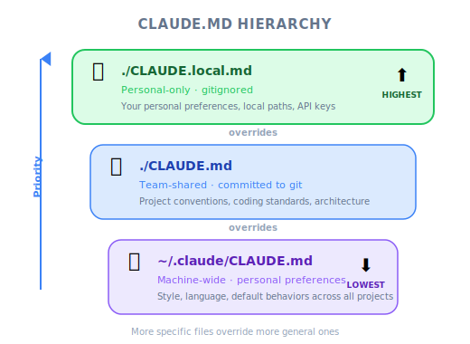
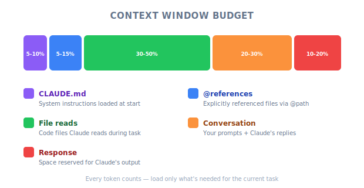

# Adding Context — Engineering Deep Dive

| Item | Detail |
|------|--------|
| Exam Domain | D3 — Effective Claude Code Usage (30%), D5 — Performance Optimization (12%) |
| Task Statements | 3.1 ★★★ (CLAUDE.md hierarchy), 5.1 ★★ (context preservation), 5.4 ★★ (large codebase context) |
| Exam Scenarios | S2 (Code Gen), S4 (Developer Productivity) |
| Source | claude-code-in-action / 02-getting-started / Lesson 07 (video + text) |

---

## One-Liner

Context management in Claude Code is a three-layer system: `/init` generates CLAUDE.md, the CLAUDE.md hierarchy provides persistent project instructions at three levels, and `@` file mentions inject specific file contents on demand.

---

## The /init Command: Bootstrap Context

When you first open Claude Code in a new project, run `/init`. This command makes Claude:

1. **Analyze the entire codebase** — project structure, architecture, patterns
2. **Generate a CLAUDE.md file** — a summary of what it found plus instructions for future sessions
3. **Ask for permission** — you approve the file write (Enter) or enable auto-accept (Shift+Tab)

```
$ claude
> /init

Claude analyzes your codebase...
→ Identifies project purpose, architecture, key files
→ Writes CLAUDE.md to project root
```

> 🎬 **Instructor insight from the video**
>
> The instructor demonstrates running `/init` on the uigen project. Claude reads through the entire codebase, identifies it as a Node.js app with Prisma/SQLite, and generates a CLAUDE.md summarizing the architecture, important commands (`npm run dev`, `npm run setup`), and coding patterns. The instructor notes that CLAUDE.md "gets included in every request" — making it a persistent system prompt.

---

## The CLAUDE.md Hierarchy (Task 3.1 ★★★)



*Figure: CLAUDE.md hierarchy — local overrides project overrides global.*

This is the most exam-critical concept in this lesson. Claude Code recognizes CLAUDE.md files at three levels:

<!-- diagram: claude-md-hierarchy — three layers with priority arrows -->

```
Priority (highest → lowest):
┌─────────────────────────────────────────────┐
│ ~/.claude/CLAUDE.md          (Global)       │
│  → Applied to ALL projects on this machine  │
│  → Personal preferences, global rules       │
├─────────────────────────────────────────────┤
│ ./CLAUDE.md                  (Project)      │
│  → Generated by /init, committed to repo    │
│  → Shared with team via source control      │
├─────────────────────────────────────────────┤
│ ./CLAUDE.local.md            (Local)        │
│  → NOT committed to source control          │
│  → Personal overrides for this project      │
└─────────────────────────────────────────────┘
```

**Critical exam rule: More local = higher priority.**

| Level | File | Shared? | Use Case |
|-------|------|---------|----------|
| Global | `~/.claude/CLAUDE.md` | No (machine-specific) | "Always use TypeScript", "Never add comments unless complex" |
| Project | `./CLAUDE.md` | Yes (committed to repo) | Project architecture, commands, coding standards |
| Local | `./CLAUDE.local.md` | No (gitignored) | Personal overrides, experimental directives |

> 💡 **Key Insight**
>
> The CLAUDE.md hierarchy follows the same override pattern as CSS specificity or environment variable precedence: the most specific (local) wins over the most general (global). If your project CLAUDE.md says "use tabs" but your local CLAUDE.local.md says "use spaces," spaces wins.

---

## The # Memory Command

To update CLAUDE.md without manually editing the file, use the `#` command:

```
> # Use comments sparingly. Only comment complex code.
```

Claude merges this instruction into your CLAUDE.md intelligently — it does not blindly append. This is called "memory mode" because it persists across sessions.

---

## @ File Mentions: Precise Context Injection (Tasks 5.1, 5.4)

When you need Claude to focus on specific files, use the `@` syntax:

```
> How does the auth system work? @auth
```

Claude shows a list of auth-related files for you to select. The selected file's contents are included in the current request.

**Two usage patterns:**

### 1. Interactive @ mentions (in chat)

Type `@` followed by a partial filename. Claude provides autocomplete suggestions. The file contents are injected into that single request.

### 2. @ mentions in CLAUDE.md (persistent)

```markdown
# CLAUDE.md
The database schema is defined in @prisma/schema.prisma.
Reference it when working with data models.
```

When `@` is used inside CLAUDE.md, the referenced file is included in **every request** automatically. This is powerful but expensive — it consumes context window on every turn.

> ⚠️ **Context Window Warning**
>
> Every `@` reference in CLAUDE.md permanently occupies context window space. Only reference files that are genuinely needed across most requests. For files needed occasionally, use interactive `@` mentions instead.

> 🎬 **Instructor insight from the video**
>
> The instructor adds `@prisma/schema.prisma` to CLAUDE.md so Claude always knows the data structure. He explains this means "Claude can answer questions about your data structure immediately without having to search for and read the schema file each time." This trades context window space for response speed.

---

## Context Management Strategy for Large Codebases (Task 5.4)

```
Context Budget Allocation:
┌────────────────────────────────────────────┐
│  CLAUDE.md (always loaded)          ~5-10% │
│  @ references in CLAUDE.md          ~5-15% │
│  Interactive @ mentions per request  ~10-20%│
│  Files Claude reads via tools        ~30-50%│
│  Conversation history                ~20-30%│
│  Claude's response                   ~10-20%│
└────────────────────────────────────────────┘
```

**Strategy:**
- Put only critical, cross-cutting files in CLAUDE.md `@` references (schema, API contracts)
- Use interactive `@` for task-specific files
- Let Claude discover files through tools (Read, Glob, Grep) for exploration
- Too much irrelevant context **decreases performance** — less is more

---

## Familiar Analogies

| Concept | Analogy | Why It Fits |
|---------|---------|-------------|
| CLAUDE.md | `.bashrc` / `.zshrc` — loaded on every session start | Persistent config that shapes all behavior |
| CLAUDE.md hierarchy | CSS specificity: inline > ID > class > element | More specific (local) overrides more general (global) |
| `/init` | `git init` + README generation | Bootstrap project with metadata |
| `@` in CLAUDE.md | `import` statement at file top | Always available, always loaded |
| Interactive `@` | Dynamic `import()` | Loaded on demand, only when needed |
| `#` memory command | `git config --global` | Persist a setting for future use |

---

## Exam Focus

| Exam Concept | What This Lesson Teaches |
|-------------|-------------------------|
| **CLAUDE.md hierarchy (3.1) ★★★** | Three levels: global > project > local. More local = higher priority. Project CLAUDE.md is shared via source control. |
| **Context preservation (5.1) ★★** | CLAUDE.md persists across sessions. `@` references in CLAUDE.md are always loaded. `#` command updates memory. |
| **Large codebase context (5.4) ★★** | Too much context hurts performance. Use `@` in CLAUDE.md for critical files only. Let Claude discover the rest via tools. |

Key distinctions the exam tests:

- **CLAUDE.md vs CLAUDE.local.md** — Shared vs personal. Both are project-level but CLAUDE.local.md is gitignored.
- **@ in CLAUDE.md vs @ in chat** — Persistent (every request) vs one-time (current request only). Persistent costs context window.
- **`/init` vs `#`** — `/init` generates the initial CLAUDE.md from codebase analysis. `#` adds specific instructions to existing CLAUDE.md.

> 🎯 **Exam note**
>
> The exam philosophy is "Architecture > Prompt." CLAUDE.md is an architectural approach to context management — it is a configuration file, not a prompt. When the exam asks about "providing consistent context across sessions," the answer is CLAUDE.md, not "write a better prompt."

---

## Practice Questions

### Q1: CLAUDE.md Priority

Your project CLAUDE.md says "use 2-space indentation." Your personal CLAUDE.local.md says "use 4-space indentation." Your global ~/.claude/CLAUDE.md says "use tabs." Which style does Claude follow?

- A. Tabs (global has highest priority)
- B. 2-space indentation (project CLAUDE.md is the standard)
- C. 4-space indentation (local overrides project and global)
- D. Claude asks you which one to use

<details><summary>Answer</summary>

**C** — In the CLAUDE.md hierarchy, more local = higher priority. CLAUDE.local.md overrides CLAUDE.md, which overrides ~/.claude/CLAUDE.md.

- A is wrong — global has the lowest priority
- B is wrong — project CLAUDE.md is overridden by CLAUDE.local.md
- D is wrong — Claude follows the hierarchy without asking

Exam philosophy: **Architecture > Prompt** — the hierarchy is a deterministic configuration system, not a negotiation.
</details>

### Q2: Context Window Management



*Figure: Context window budget allocation across different sources.*

A developer working on a large monorepo adds 15 `@` file references to their CLAUDE.md. They notice Claude's responses are getting slower and less accurate. What is the most likely cause and fix?

- A. Claude Code has a bug with many `@` references; update to the latest version
- B. The `@` references are consuming too much context window, leaving less room for Claude to reason; remove non-essential references and use interactive `@` mentions instead
- C. The files are too large; split them into smaller files
- D. CLAUDE.md has a maximum of 10 `@` references; remove the extras

<details><summary>Answer</summary>

**B** — The lesson explicitly states that too much irrelevant context decreases Claude's performance. Every `@` reference in CLAUDE.md is loaded on every request, consuming context window space. The fix is to keep only critical cross-cutting files (like schema definitions) in CLAUDE.md and use interactive `@` for task-specific files.

- A is not the issue described in the lesson
- C might help marginally but does not address the root cause
- D is a fabricated limitation — there is no stated maximum

Exam philosophy: **Proportionate response** — match the context to the task rather than loading everything.
</details>

### Q3: Team Context Sharing

Your team wants to ensure all developers using Claude Code follow the same coding standards. Which approach is correct?

- A. Each developer adds standards to their ~/.claude/CLAUDE.md
- B. Add standards to the project CLAUDE.md and commit it to source control
- C. Add standards to CLAUDE.local.md in the project
- D. Use the `#` command to set standards in each developer's session

<details><summary>Answer</summary>

**B** — The project CLAUDE.md is committed to source control and shared with all team members. This is the correct location for team-wide standards.

- A would work per-machine but is not shared or version-controlled
- C is explicitly not shared (gitignored)
- D is per-session and per-developer, not team-wide

Exam philosophy: **Architecture > Prompt** — use the built-in configuration hierarchy rather than ad-hoc per-developer setup.
</details>

---

## Anti-Patterns

| Anti-Pattern | Why It Fails | Better Approach |
|-------------|-------------|-----------------|
| Putting everything in CLAUDE.md `@` references | Consumes context window, degrades performance | Only reference cross-cutting files; use interactive `@` for the rest |
| Never running `/init` | Claude starts every session with zero project knowledge | Run `/init` once, then maintain CLAUDE.md incrementally |
| Using CLAUDE.local.md for team standards | CLAUDE.local.md is gitignored; teammates will not see it | Use project CLAUDE.md for shared standards |
| Manually editing CLAUDE.md every time | Error-prone and tedious | Use the `#` command for intelligent merging |
| Ignoring the global CLAUDE.md | Miss the opportunity for personal cross-project preferences | Set personal coding style in ~/.claude/CLAUDE.md |
