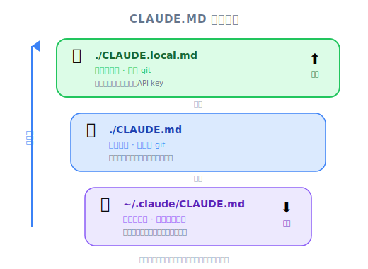
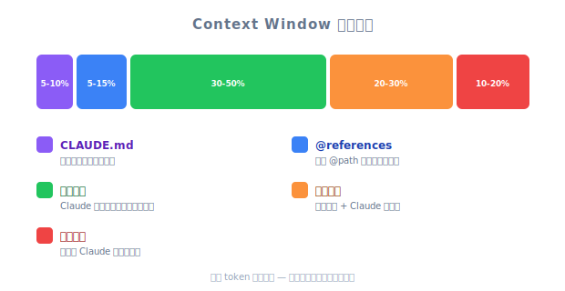

# Adding Context — 工程深度筆記

| 項目 | 細節 |
|------|--------|
| 考試領域 | D3 — Effective Claude Code Usage (30%), D5 — Performance Optimization (12%) |
| Task Statements | 3.1 ★★★ (CLAUDE.md hierarchy), 5.1 ★★ (context preservation), 5.4 ★★ (large codebase context) |
| 考試情境 | S2 (Code Gen), S4 (Developer Productivity) |
| 來源 | claude-code-in-action / 02-getting-started / Lesson 07（影片 + 文字） |

---

## 一句話總結

Claude Code 的 context 管理是三層系統：`/init` 生成 CLAUDE.md，CLAUDE.md hierarchy 在三個層級提供持久化專案指令，`@` file mention 按需注入特定檔案內容。

---

## /init 指令：引導 Context

首次在新專案中開啟 Claude Code 時，執行 `/init`。此指令讓 Claude：

1. **分析整個程式碼庫** — 專案結構、架構、模式
2. **生成 CLAUDE.md 檔案** — 摘要發現內容加上未來 session 的指令
3. **請求許可** — 你核准檔案寫入（Enter）或啟用自動接受（Shift+Tab）

```
$ claude
> /init

Claude 分析你的程式碼庫...
→ 識別專案目的、架構、關鍵檔案
→ 將 CLAUDE.md 寫入專案根目錄
```

> [!NOTE] **講師影片洞察**
>
> 講師示範在 uigen 專案上執行 `/init`。Claude 讀取整個程式碼庫，識別為使用 Prisma/SQLite 的 Node.js 應用，並生成 CLAUDE.md 摘要架構、重要指令（`npm run dev`、`npm run setup`）和編碼模式。講師強調 CLAUDE.md「被包含在每個請求中」— 使其成為持久化的 system prompt。

---

## CLAUDE.md Hierarchy（Task 3.1 ★★★）



*圖：CLAUDE.md 階層 — local 覆蓋 project 覆蓋 global。*

這是本課最重要的考試概念。Claude Code 在三個層級識別 CLAUDE.md 檔案：

```
優先級（最高 → 最低）：
┌─────────────────────────────────────────────┐
│ ~/.claude/CLAUDE.md          (Global)       │
│  → 適用於此機器上的所有專案                    │
│  → 個人偏好、全域規則                         │
├─────────────────────────────────────────────┤
│ ./CLAUDE.md                  (Project)      │
│  → 由 /init 生成，commit 到 repo             │
│  → 透過版本控制與團隊共享                      │
├─────────────────────────────────────────────┤
│ ./CLAUDE.local.md            (Local)        │
│  → 不 commit 到版本控制                       │
│  → 此專案的個人覆寫設定                        │
└─────────────────────────────────────────────┘
```

**關鍵考試規則：越 local = 越高優先級。**

| 層級 | 檔案 | 是否共享？ | 使用場景 |
|-------|------|---------|----------|
| Global | `~/.claude/CLAUDE.md` | 否（機器專屬） | 「永遠用 TypeScript」、「除非複雜否則不加註解」 |
| Project | `./CLAUDE.md` | 是（commit 到 repo） | 專案架構、指令、編碼標準 |
| Local | `./CLAUDE.local.md` | 否（gitignored） | 個人覆寫、實驗性指令 |

> [!TIP] **關鍵洞察**
>
> CLAUDE.md hierarchy 遵循與 CSS specificity 或環境變數優先級相同的覆寫模式：最具體的（local）贏過最一般的（global）。如果你的專案 CLAUDE.md 說「用 tabs」但 CLAUDE.local.md 說「用 spaces」，spaces 勝出。

---

## # Memory 指令

要更新 CLAUDE.md 而不手動編輯檔案，使用 `#` 指令：

```
> # Use comments sparingly. Only comment complex code.
```

Claude 智慧地合併此指令到你的 CLAUDE.md — 不是盲目追加。這稱為「memory mode」因為它跨 session 持續有效。

---

## @ File Mention：精確 Context 注入（Tasks 5.1, 5.4）

需要 Claude 聚焦特定檔案時，使用 `@` 語法：

```
> How does the auth system work? @auth
```

Claude 顯示 auth 相關檔案列表讓你選擇。選中檔案的內容被包含在當前請求中。

**兩種使用模式：**

### 1. 互動式 @ mention（在聊天中）

輸入 `@` 後跟部分檔名。Claude 提供自動完成建議。檔案內容注入到該單一請求。

### 2. CLAUDE.md 中的 @ mention（持久化）

```markdown
# CLAUDE.md
The database schema is defined in @prisma/schema.prisma.
Reference it when working with data models.
```

當 `@` 在 CLAUDE.md 中使用，被引用的檔案會在**每個請求**中自動包含。強大但昂貴 — 每個 turn 都消耗 context window。

> [!WARNING] **Context Window 警告**
>
> CLAUDE.md 中的每個 `@` 引用永久佔用 context window 空間。只引用真正在大多數請求中需要的檔案。偶爾需要的檔案，改用互動式 `@` mention。

> [!NOTE] **講師影片洞察**
>
> 講師將 `@prisma/schema.prisma` 加入 CLAUDE.md，讓 Claude 始終知道資料結構。他解釋這意味著「Claude 可以立即回答關於資料結構的問題，不需要每次都搜尋和讀取 schema 檔案。」這是用 context window 空間換取回應速度。

---

## 大型程式碼庫的 Context 管理策略（Task 5.4）

```
Context 預算分配：
┌────────────────────────────────────────────┐
│  CLAUDE.md（始終載入）              ~5-10%  │
│  CLAUDE.md 中的 @ 引用             ~5-15%  │
│  每次請求的互動式 @ mention         ~10-20% │
│  Claude 透過工具讀取的檔案          ~30-50% │
│  對話歷史                          ~20-30% │
│  Claude 的回應                     ~10-20% │
└────────────────────────────────────────────┘
```

**策略：**
- 只將關鍵的橫切檔案放在 CLAUDE.md `@` 引用中（schema、API 契約）
- 對任務特定的檔案使用互動式 `@`
- 讓 Claude 透過工具（Read、Glob、Grep）探索發現檔案
- 太多不相關的 context **降低效能** — 少即是多

---

## 熟悉的類比

| 概念 | 類比 | 為何合適 |
|---------|---------|-------------|
| CLAUDE.md | `.bashrc` / `.zshrc` — 每次 session 啟動時載入 | 塑造所有行為的持久化設定 |
| CLAUDE.md hierarchy | CSS specificity：inline > ID > class > element | 更具體的（local）覆寫更一般的（global） |
| `/init` | `git init` + README 生成 | 用 metadata 引導專案 |
| CLAUDE.md 中的 `@` | 檔案頂部的 `import` 語句 | 始終可用，始終載入 |
| 互動式 `@` | 動態 `import()` | 按需載入，僅在需要時 |
| `#` memory 指令 | `git config --global` | 持久化設定供未來使用 |

---

## 考試重點

| 考試概念 | 本課教了什麼 |
|-------------|-------------------------|
| **CLAUDE.md hierarchy (3.1) ★★★** | 三個層級：global > project > local。越 local = 越高優先級。Project CLAUDE.md 透過版本控制共享。 |
| **Context preservation (5.1) ★★** | CLAUDE.md 跨 session 持續有效。CLAUDE.md 中的 `@` 引用始終載入。`#` 指令更新記憶。 |
| **Large codebase context (5.4) ★★** | 太多 context 損害效能。只對關鍵檔案在 CLAUDE.md 中使用 `@`。讓 Claude 透過工具發現其餘部分。 |

> [!IMPORTANT] **考試筆記**
>
> 考試哲學是「Architecture > Prompt」。CLAUDE.md 是 context 管理的架構方法 — 它是設定檔，不是 prompt。當考試問到「跨 session 提供一致 context」時，答案是 CLAUDE.md，不是「寫更好的 prompt」。

---

## 練習題

### Q1：CLAUDE.md 優先級

你的專案 CLAUDE.md 說「用 2-space 縮排」。你的個人 CLAUDE.local.md 說「用 4-space 縮排」。你的全域 ~/.claude/CLAUDE.md 說「用 tabs」。Claude 遵循哪個風格？

- A. Tabs（global 有最高優先級）
- B. 2-space 縮排（專案 CLAUDE.md 是標準）
- C. 4-space 縮排（local 覆寫 project 和 global）
- D. Claude 問你要用哪一個

<details><summary>答案</summary>

**C** — 在 CLAUDE.md hierarchy 中，越 local = 越高優先級。CLAUDE.local.md 覆寫 CLAUDE.md，而 CLAUDE.md 覆寫 ~/.claude/CLAUDE.md。

考試哲學：**Architecture > Prompt** — hierarchy 是確定性的設定系統，不是協商。
</details>

### Q2：Context Window 管理



*圖：Context Window 預算分配。*

一位開發者在大型 monorepo 中將 15 個 `@` 檔案引用加入 CLAUDE.md。他們注意到 Claude 的回應變慢且不準確。最可能的原因和修復是什麼？

- A. Claude Code 對多個 `@` 引用有 bug；更新到最新版本
- B. `@` 引用消耗了太多 context window，留給 Claude 推理的空間更少；移除非必要引用，改用互動式 `@` mention
- C. 檔案太大；將它們拆分成更小的檔案
- D. CLAUDE.md 最多只能有 10 個 `@` 引用；移除多餘的

<details><summary>答案</summary>

**B** — 課程明確指出太多不相關的 context 降低 Claude 的效能。CLAUDE.md 中的每個 `@` 引用在每次請求中載入，消耗 context window 空間。修復方法是只保留關鍵的橫切檔案，對任務特定的檔案使用互動式 `@`。

考試哲學：**Proportionate response** — 讓 context 匹配任務，而不是載入所有東西。
</details>

### Q3：團隊 Context 共享

你的團隊想確保所有使用 Claude Code 的開發者遵循相同的編碼標準。哪個方法正確？

- A. 每個開發者將標準加入他們的 ~/.claude/CLAUDE.md
- B. 將標準加入專案 CLAUDE.md 並 commit 到版本控制
- C. 將標準加入專案中的 CLAUDE.local.md
- D. 使用 `#` 指令在每個開發者的 session 中設定標準

<details><summary>答案</summary>

**B** — 專案 CLAUDE.md commit 到版本控制，與所有團隊成員共享。這是團隊級標準的正確位置。

考試哲學：**Architecture > Prompt** — 使用內建的設定 hierarchy 而不是各開發者臨時設定。
</details>

---

## 反模式

| 反模式 | 為何失敗 | 更好的方法 |
|-------------|-------------|-----------------|
| 把所有東西都放在 CLAUDE.md `@` 引用中 | 消耗 context window，降低效能 | 只引用橫切檔案；其餘用互動式 `@` |
| 從不執行 `/init` | Claude 每次 session 都從零開始 | 執行一次 `/init`，之後逐步維護 CLAUDE.md |
| 用 CLAUDE.local.md 放團隊標準 | CLAUDE.local.md 是 gitignored；隊友看不到 | 用專案 CLAUDE.md 放共享標準 |
| 每次手動編輯 CLAUDE.md | 容易出錯且繁瑣 | 用 `#` 指令進行智慧合併 |
| 忽略全域 CLAUDE.md | 錯失個人跨專案偏好的機會 | 在 ~/.claude/CLAUDE.md 設定個人編碼風格 |
