# Adding Context — 加入 Context — 影片逐幀學習指南

| 項目 | 內容 |
|------|------|
| 課程 | claude-code-in-action / 02-getting-started / 07-adding-context |
| 影片 | Adding Context |
| 字幕數 | 68 段 |
| 格式 | 每段字幕一張截圖 + 雙語字幕（英/中） |

---

### [00:00:00] 第 1 段

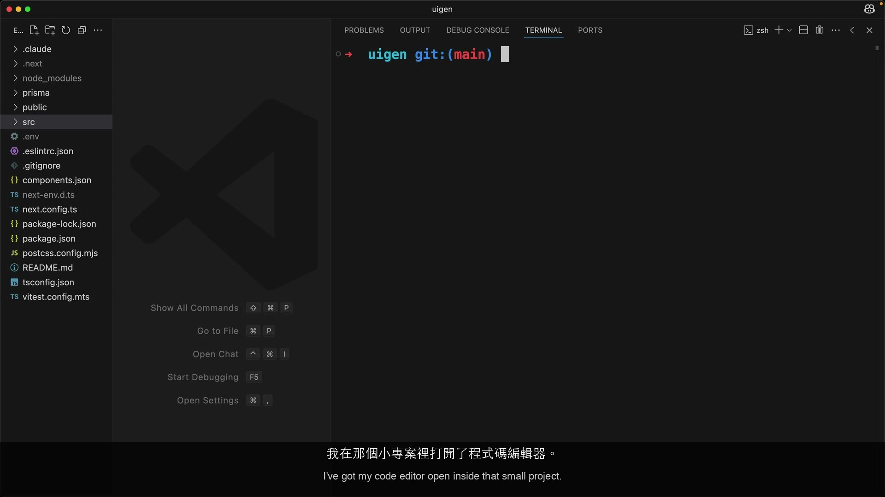

> **EN:** I've got my code editor open inside that small project.
>
> **ZH:** 我在那個小專案裡打開了程式碼編輯器。

---

### [00:00:03] 第 2 段

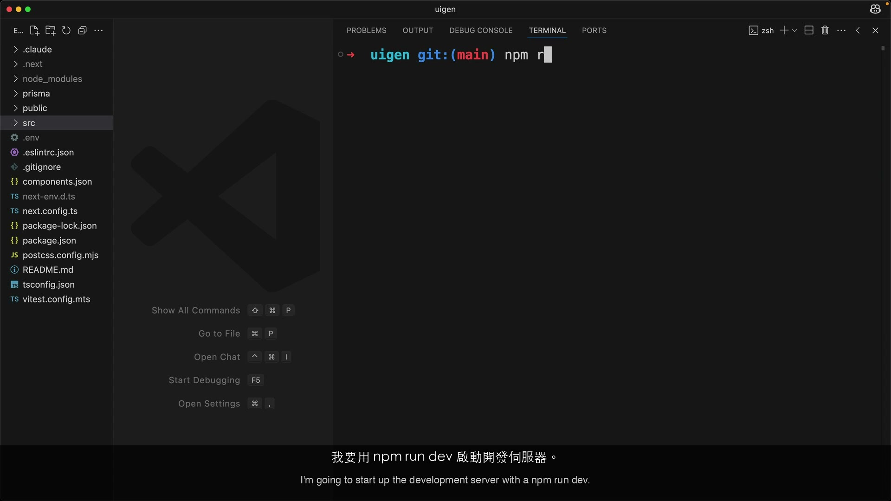

> **EN:** I'm going to start up the development server with a npm run dev.
>
> **ZH:** 我要用 npm run dev 啟動開發伺服器。

---

### [00:00:06] 第 3 段

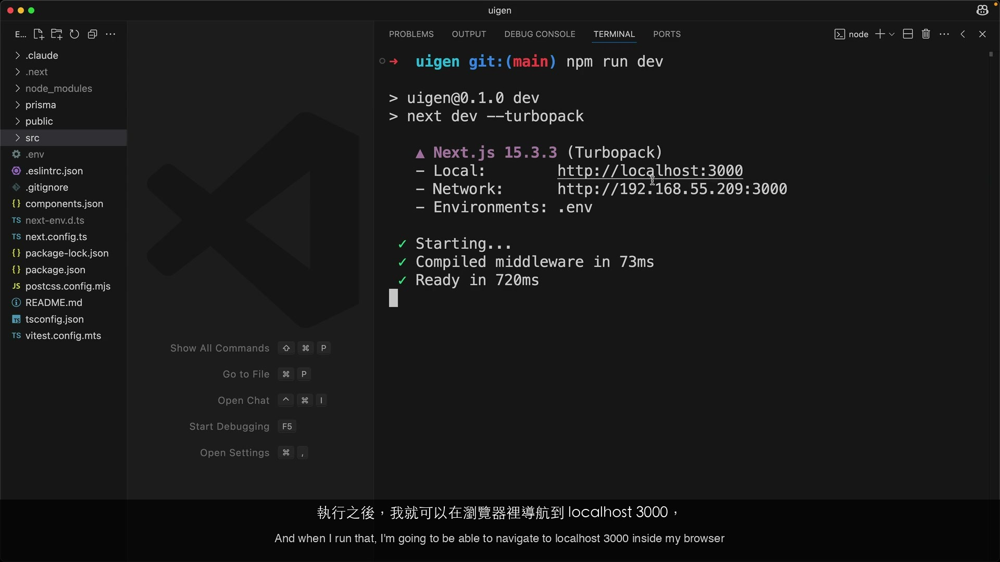

> **EN:** And when I run that, I'm going to be able to navigate to localhost 3000 inside my browser
>
> **ZH:** 執行之後，我就可以在瀏覽器裡導航到 localhost 3000，

---

### [00:00:11] 第 4 段

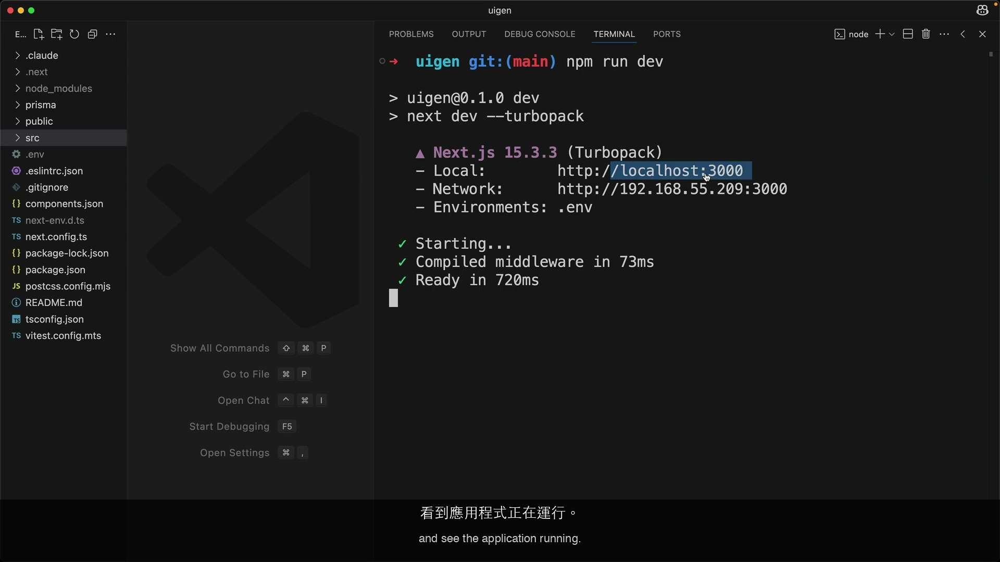

> **EN:** and see the application running.
>
> **ZH:** 看到應用程式正在運行。

---

### [00:00:12] 第 5 段

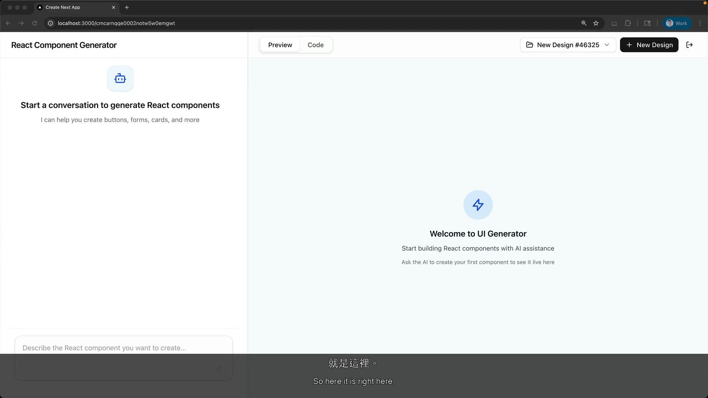

> **EN:** So here it is right here.
>
> **ZH:** 就是這裡。

---

### [00:00:14] 第 6 段

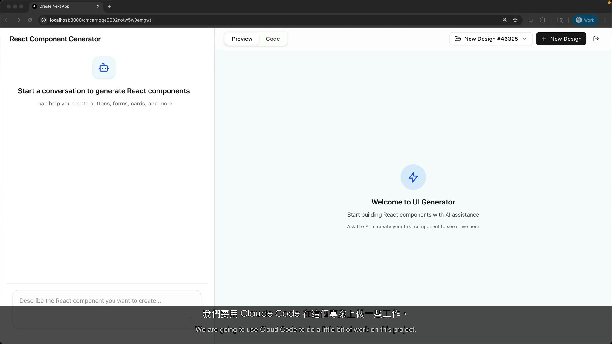

> **EN:** We are going to use Cloud Code to do a little bit of work on this project.
>
> **ZH:** 我們要用 Claude Code 在這個專案上做一些工作。

---

### [00:00:17] 第 7 段

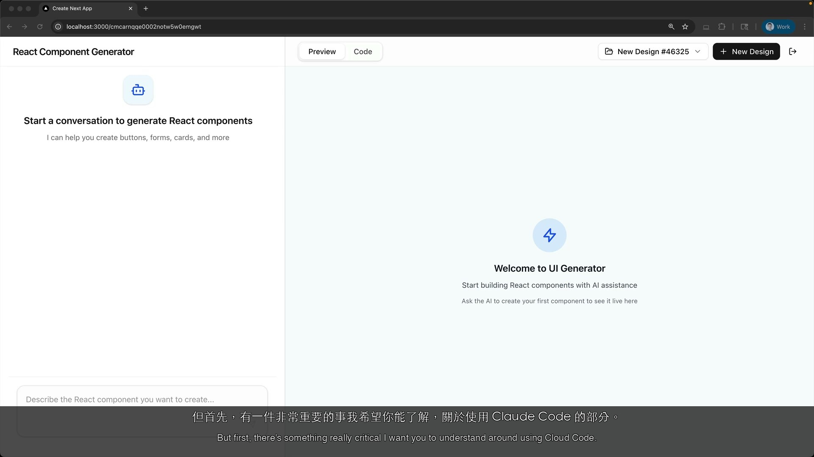

> **EN:** But first, there's something really critical I want you to understand around using Cloud Code.
>
> **ZH:** 但首先，有一件非常重要的事我希望你能了解，關於使用 Claude Code 的部分。

---

### [00:00:21] 第 8 段

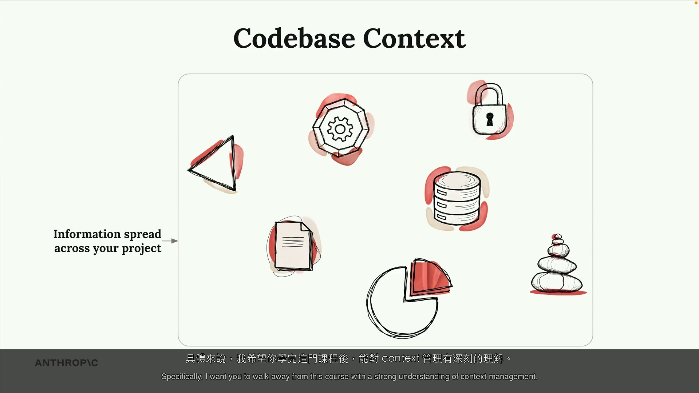

> **EN:** Specifically, I want you to walk away from this course with a strong understanding of context management.
>
> **ZH:** 具體來說，我希望你學完這門課程後，能對 context 管理有深刻的理解。

---

### [00:00:25] 第 9 段

> **EN:** You see, inside of a typical project, there might be dozens or hundreds of files.
>
> **ZH:** 你看，在一個典型的專案裡，可能有幾十甚至幾百個檔案。

---

### [00:00:30] 第 10 段

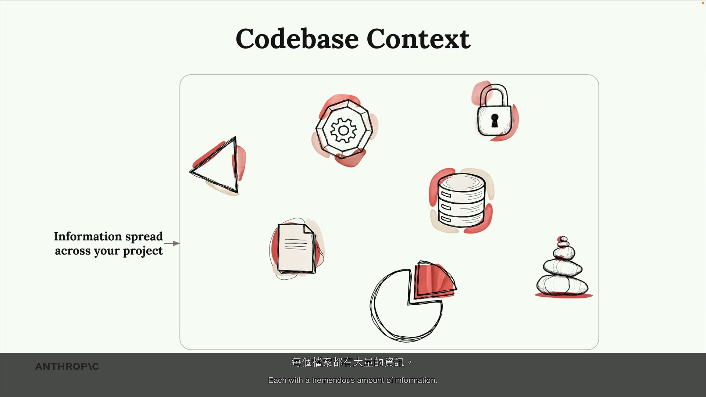

> **EN:** Each with a tremendous amount of information.
>
> **ZH:** 每個檔案都有大量的資訊。

---

### [00:00:32] 第 11 段

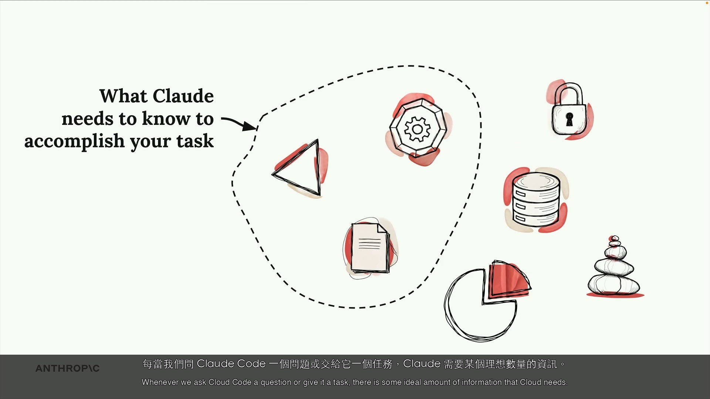

> **EN:** Whenever we ask Cloud Code a question or give it a task, there is some ideal amount of information that Cloud needs.
>
> **ZH:** 每當我們問 Claude Code 一個問題或交給它一個任務，Claude 需要某個理想數量的資訊。

---

### [00:00:38] 第 12 段

> **EN:** Just enough to help understand how to answer your question or complete your task.
>
> **ZH:** 剛好夠它理解如何回答你的問題或完成你的任務。

---

### [00:00:41] 第 13 段

> **EN:** As soon as we start adding in additional information that's not relevant, Cloud Code's effectiveness will start to decrease.
>
> **ZH:** 一旦我們開始加入不相關的額外資訊，Claude Code 的效率就會開始下降。

---

### [00:00:48] 第 14 段

> **EN:** So it is really important for us to help guide Cloud towards relevant files or documentation inside of our project.
>
> **ZH:** 所以引導 Claude 找到專案裡相關的檔案或文件，對我們來說非常重要。

---

### [00:00:54] 第 15 段

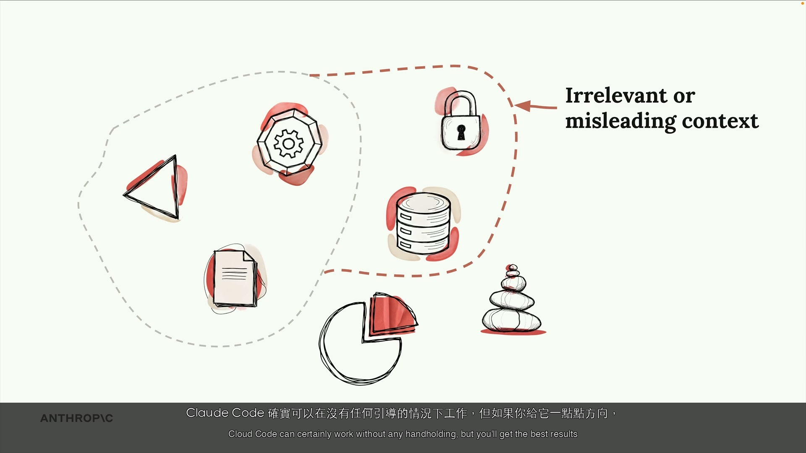

> **EN:** Cloud Code can certainly work without any handholding, but you'll get the best results
>
> **ZH:** Claude Code 確實可以在沒有任何引導的情況下工作，但如果你給它一點點方向，

---

### [00:00:58] 第 16 段

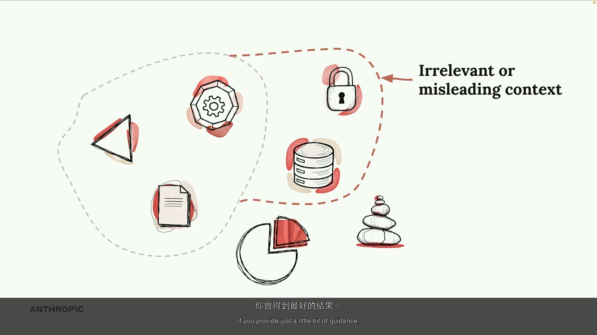

> **EN:** if you provide just a little bit of guidance.
>
> **ZH:** 你會得到最好的結果。

---

### [00:01:01] 第 17 段

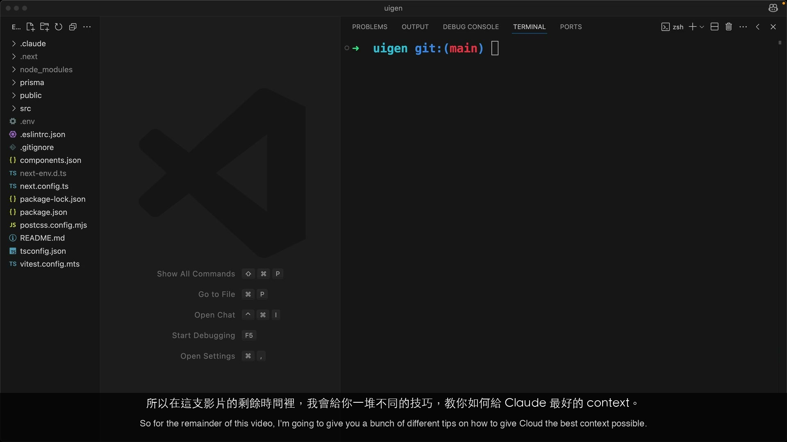

> **EN:** So for the remainder of this video, I'm going to give you a bunch of different tips on how to give Cloud the best context possible.
>
> **ZH:** 所以在這支影片的剩餘時間裡，我會給你一堆不同的技巧，教你如何給 Claude 最好的 context。

---

### [00:01:07] 第 18 段

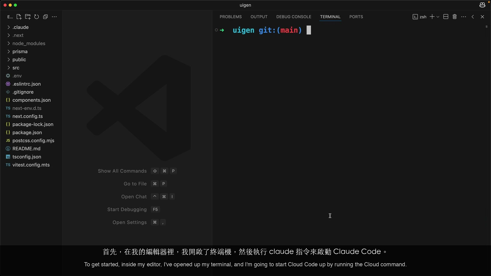

> **EN:** To get started, inside my editor, I've opened up my terminal, and I'm going to start Cloud Code up by running the Cloud command.
>
> **ZH:** 首先，在我的編輯器裡，我開啟了終端機，然後執行 claude 指令來啟動 Claude Code。

---

### [00:01:13] 第 19 段

> **EN:** Whenever you run Cloud Code in a project for the first time, I highly recommend running the slash init command.
>
> **ZH:** 每次你在一個專案裡第一次執行 Claude Code，我強烈建議執行 /init 指令。

---

### [00:01:20] 第 20 段

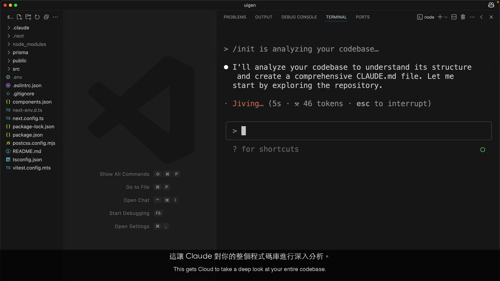

> **EN:** This gets Cloud to take a deep look at your entire codebase.
>
> **ZH:** 這讓 Claude 對你的整個程式碼庫進行深入分析。

---

### [00:01:24] 第 21 段

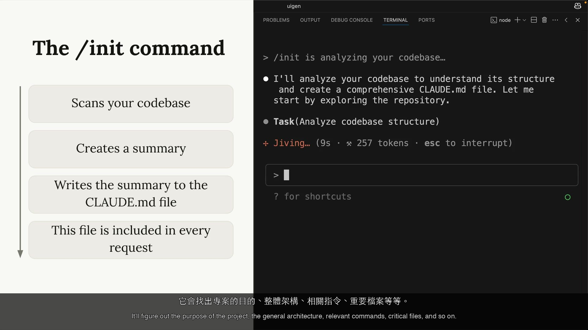

> **EN:** It'll figure out the purpose of the project, the general architecture, relevant commands, critical files, and so on.
>
> **ZH:** 它會找出專案的目的、整體架構、相關指令、重要檔案等等。

---

### [00:01:29] 第 22 段

> **EN:** After this search, it'll summarize its findings and place them into a file called cloud.md.
>
> **ZH:** 搜尋完成後，它會把發現的內容整理後放進一個叫做 CLAUDE.md 的檔案。

---

### [00:01:35] 第 23 段

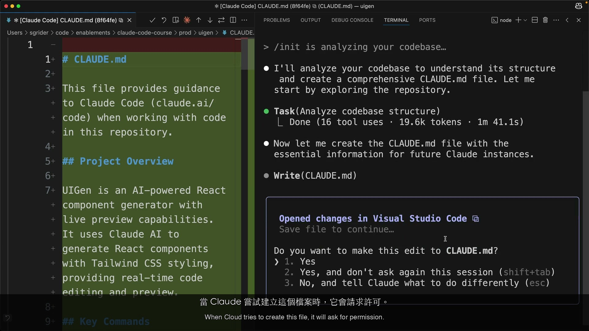

> **EN:** When Cloud tries to create this file, it will ask for permission.
>
> **ZH:** 當 Claude 嘗試建立這個檔案時，它會請求許可。

---

### [00:01:38] 第 24 段

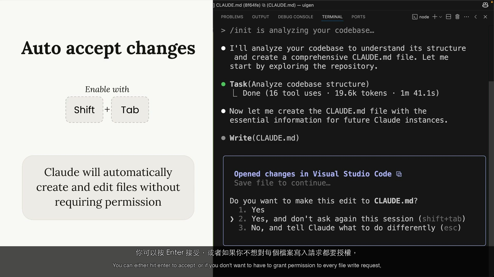

> **EN:** You can either hit enter to accept, or if you don't want to have to grant permission to every file write request,
>
> **ZH:** 你可以按 Enter 接受，或者如果你不想對每個檔案寫入請求都要授權，

---

### [00:01:44] 第 25 段

> **EN:** you can also press shift-tab, which allows Cloud Code to freely write files in your project.
>
> **ZH:** 你也可以按 Shift-Tab，這樣 Claude Code 就可以自由地在你的專案裡寫入檔案。

---

### [00:01:50] 第 26 段

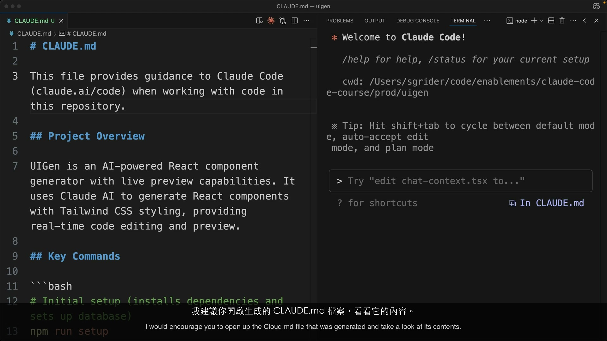

> **EN:** I would encourage you to open up the Cloud.md file that was generated and take a look at its contents.
>
> **ZH:** 我建議你開啟生成的 CLAUDE.md 檔案，看看它的內容。

---

### [00:01:55] 第 27 段

> **EN:** As I mentioned, the contents of this file are included in every request we make off to Cloud.
>
> **ZH:** 如我所說，這個檔案的內容會被包含在我們每次傳給 Claude 的請求裡。

---

### [00:01:59] 第 28 段

> **EN:** This file really has two different purposes.
>
> **ZH:** 這個檔案有兩個不同的目的。

---

### [00:02:01] 第 29 段

> **EN:** First, it helps Cloud better understand your codebase so it can find relevant code more quickly.
>
> **ZH:** 第一，它幫助 Claude 更好地了解你的程式碼庫，讓它能更快找到相關程式碼。

---

### [00:02:05] 第 30 段

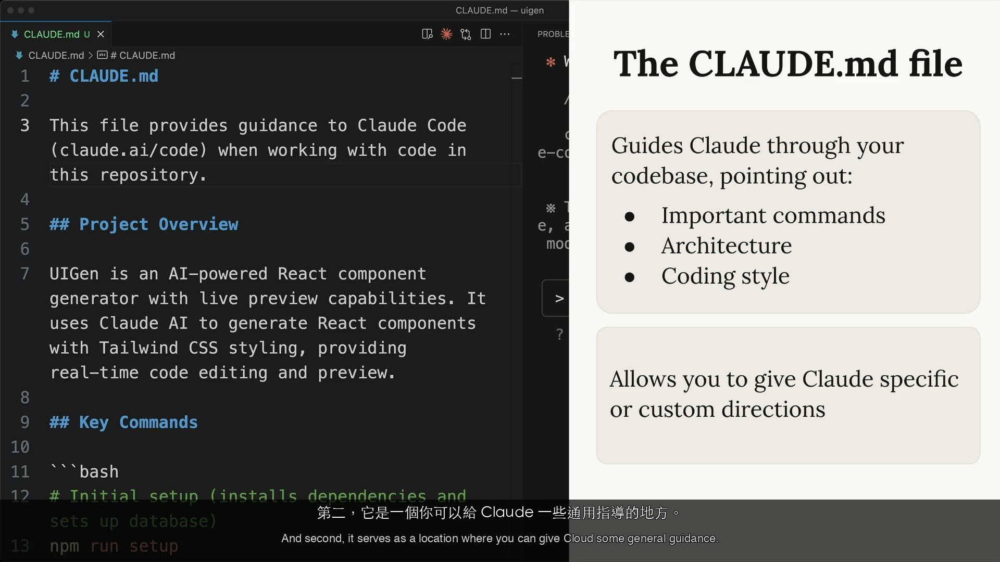

> **EN:** And second, it serves as a location where you can give Cloud some general guidance.
>
> **ZH:** 第二，它是一個你可以給 Claude 一些通用指導的地方。

---

### [00:02:10] 第 31 段

> **EN:** Just so you know, there are multiple Cloud.md files that Cloud Code will make use of.
>
> **ZH:** 讓你知道，Claude Code 會使用多個 CLAUDE.md 檔案。

---

### [00:02:14] 第 32 段

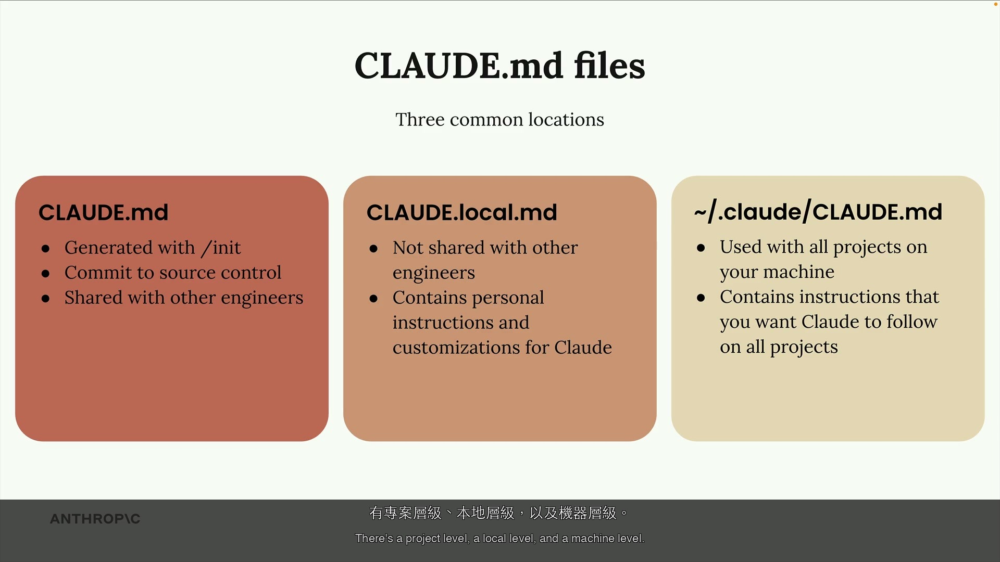

> **EN:** There's a project level, a local level, and a machine level.
>
> **ZH:** 有專案層級、本地層級，以及機器層級。

---

### [00:02:18] 第 33 段

> **EN:** The project level is what we just generated by running the slash init command.
>
> **ZH:** 專案層級就是我們剛才執行 /init 指令生成的那個。

---

### [00:02:22] 第 34 段

> **EN:** We are generally going to commit this file to source control, like Git.
>
> **ZH:** 我們通常會把這個檔案提交到版本控制，像是 Git。

---

### [00:02:25] 第 35 段

> **EN:** We're going to share this file with other engineers, and it's going to have some project-specific directions that we want to hand off to Cloud.
>
> **ZH:** 我們會把這個檔案分享給其他工程師，它會包含一些我們想傳達給 Claude 的專案特定指示。

---

### [00:02:31] 第 36 段

> **EN:** Optionally, we can also create a Cloud.local.md file.
>
> **ZH:** 選擇性地，我們也可以建立一個 CLAUDE.local.md 檔案。

---

### [00:02:34] 第 37 段

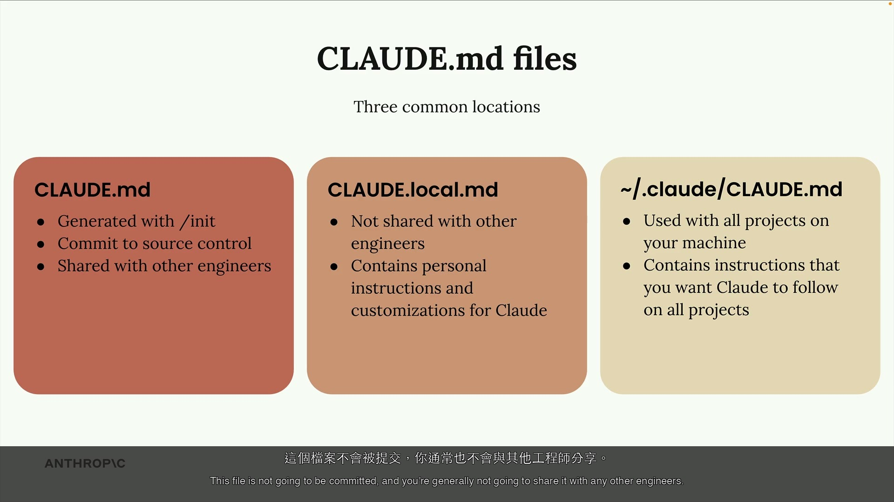

> **EN:** This file is not going to be committed, and you're generally not going to share it with any other engineers.
>
> **ZH:** 這個檔案不會被提交，你通常也不會與其他工程師分享。

---

### [00:02:39] 第 38 段

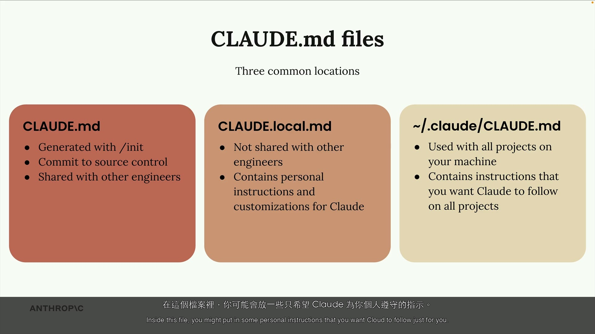

> **EN:** Inside this file, you might put in some personal instructions that you want Cloud to follow just for you.
>
> **ZH:** 在這個檔案裡，你可能會放一些只希望 Claude 為你個人遵守的指示。

---

### [00:02:46] 第 39 段

> **EN:** Finally, you can have a global Cloud.md file on your machine.
>
> **ZH:** 最後，你可以在你的電腦上有一個全域的 CLAUDE.md 檔案。

---

### [00:02:50] 第 40 段

> **EN:** This file will contain instructions that will be applied to all projects that you run locally.
>
> **ZH:** 這個檔案會包含要應用於你在本地執行的所有專案的指示。

---

### [00:02:55] 第 41 段

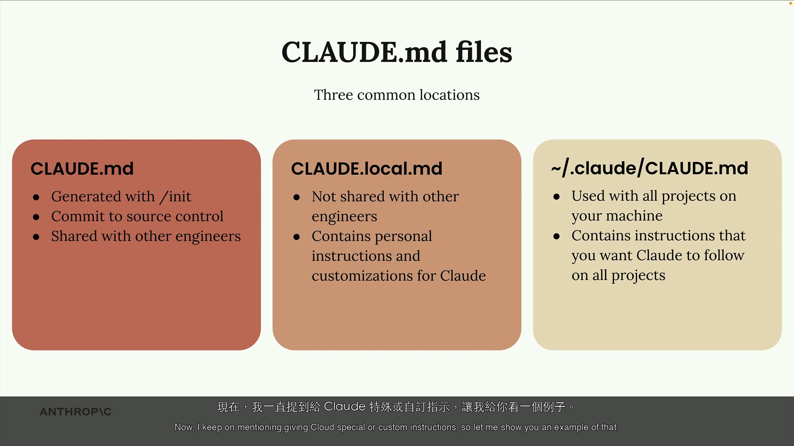

> **EN:** Now, I keep on mentioning giving Cloud special or custom instructions, so let me show you an example of that.
>
> **ZH:** 現在，我一直提到給 Claude 特殊或自訂指示，讓我給你看一個例子。

---

### [00:03:00] 第 42 段

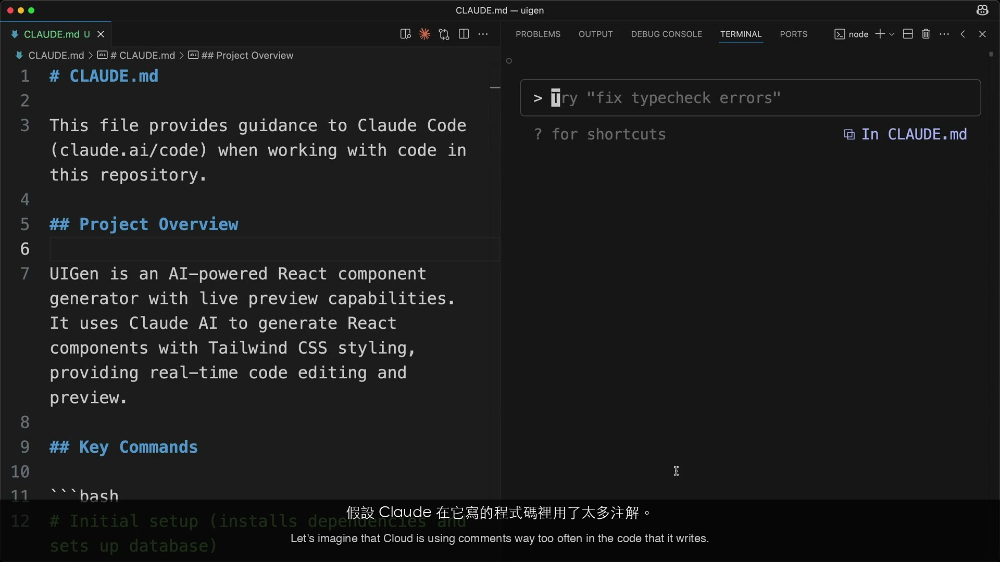

> **EN:** Let's imagine that Cloud is using comments way too often in the code that it writes.
>
> **ZH:** 假設 Claude 在它寫的程式碼裡用了太多注解。

---

### [00:03:04] 第 43 段

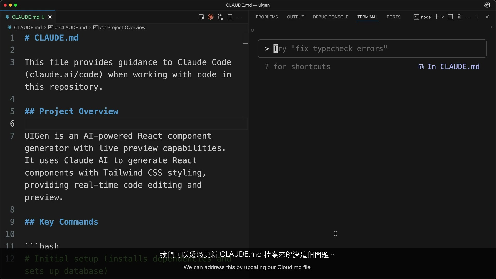

> **EN:** We can address this by updating our Cloud.md file.
>
> **ZH:** 我們可以透過更新 CLAUDE.md 檔案來解決這個問題。

---

### [00:03:07] 第 44 段

> **EN:** We can either manually modify the file, or a little bit of a shortcut is inside of Cloud code, we could put in a pound sign.
>
> **ZH:** 我們可以手動修改檔案，或者有個小捷徑是在 Claude Code 裡輸入井字號 #。

---

### [00:03:15] 第 45 段

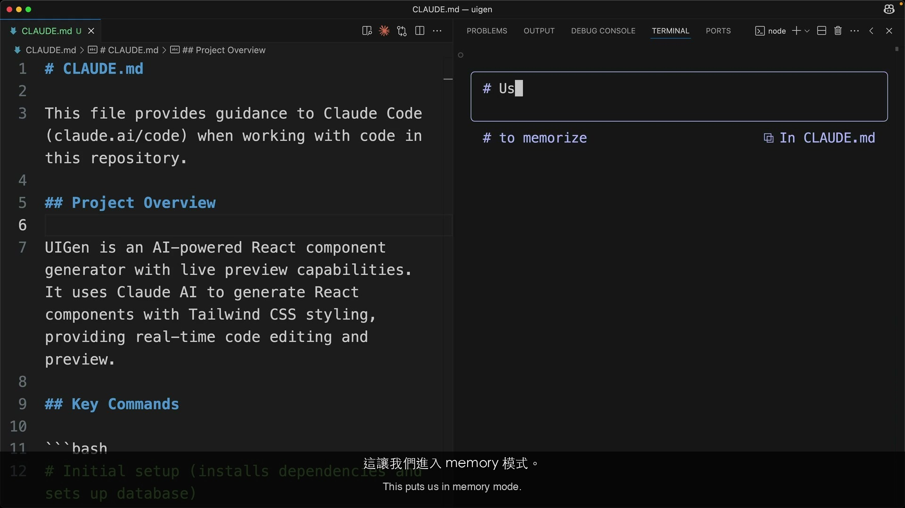

> **EN:** This puts us in memory mode.
>
> **ZH:** 這讓我們進入 memory 模式。

---

### [00:03:16] 第 46 段

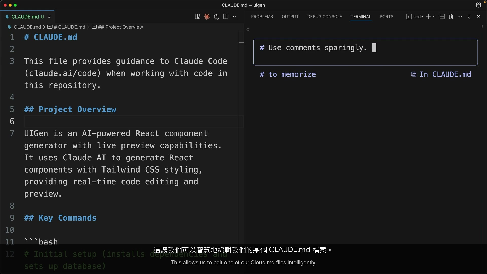

> **EN:** This allows us to edit one of our Cloud.md files intelligently.
>
> **ZH:** 這讓我們可以智慧地編輯我們的某個 CLAUDE.md 檔案。

---

### [00:03:20] 第 47 段

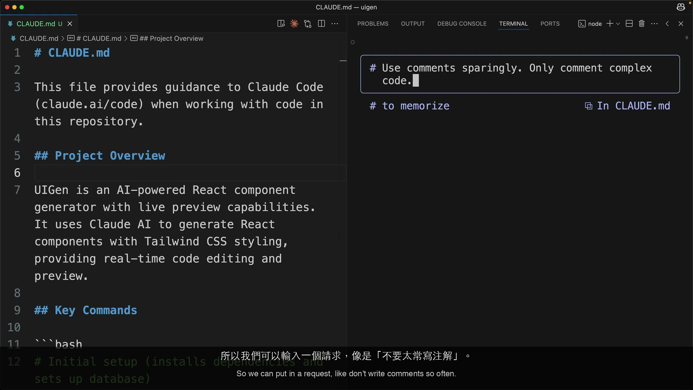

> **EN:** So we can put in a request, like don't write comments so often.
>
> **ZH:** 所以我們可以輸入一個請求，像是「不要太常寫注解」。

---

### [00:03:23] 第 48 段

> **EN:** I'll then specify that I want to add this instruction to the project Cloud.md file,
>
> **ZH:** 然後我會指定要把這個指示加入到專案的 CLAUDE.md 檔案，

---

### [00:03:28] 第 49 段

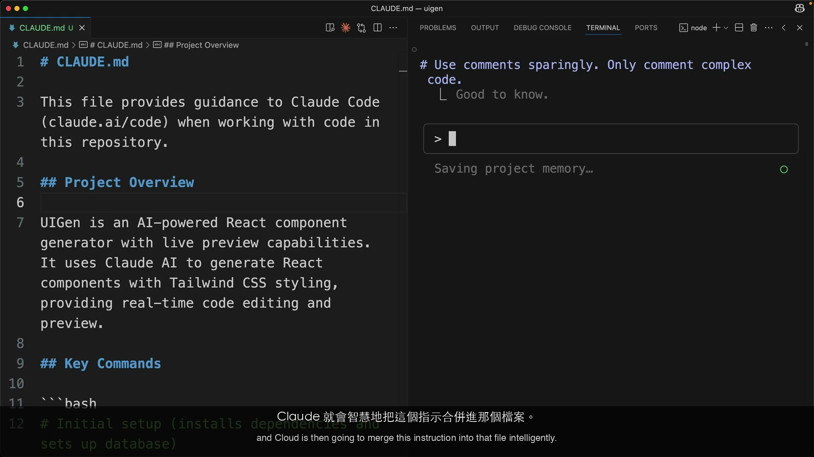

> **EN:** and Cloud is then going to merge this instruction into that file intelligently.
>
> **ZH:** Claude 就會智慧地把這個指示合併進那個檔案。

---

### [00:03:32] 第 50 段

> **EN:** If I then open the file up and do a search, I'll see that in fact, yes, it did add in that new instruction.
>
> **ZH:** 如果我打開那個檔案並搜尋，我就會看到它確實加入了那個新指示。

---

### [00:03:38] 第 51 段

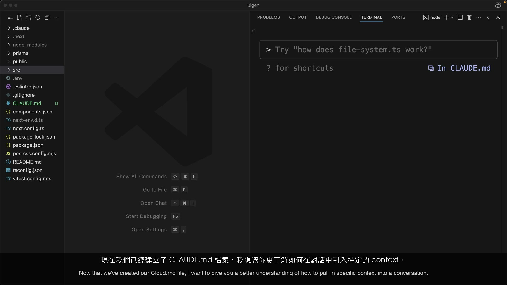

> **EN:** Now that we've created our Cloud.md file, I want to give you a better understanding of how to pull in specific context into a conversation.
>
> **ZH:** 現在我們已經建立了 CLAUDE.md 檔案，我想讓你更了解如何在對話中引入特定的 context。

---

### [00:03:44] 第 52 段

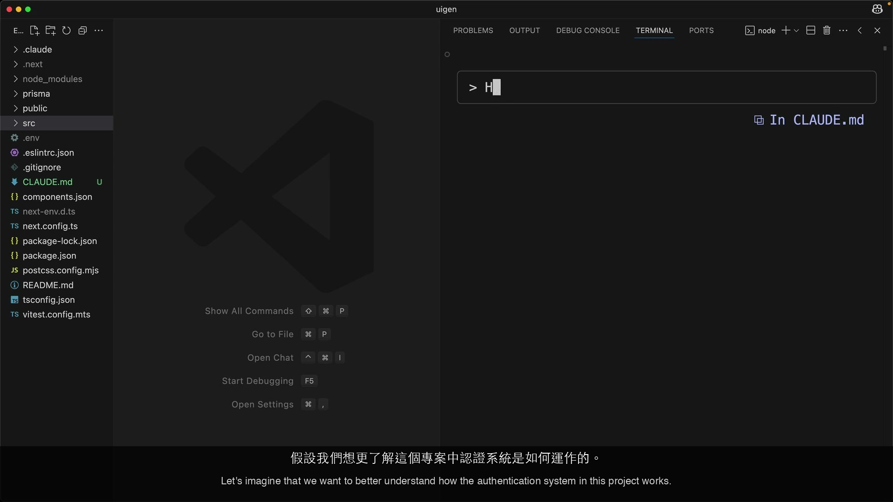

> **EN:** Let's imagine that we want to better understand how the authentication system in this project works.
>
> **ZH:** 假設我們想更了解這個專案中認證系統是如何運作的。

---

### [00:03:49] 第 53 段

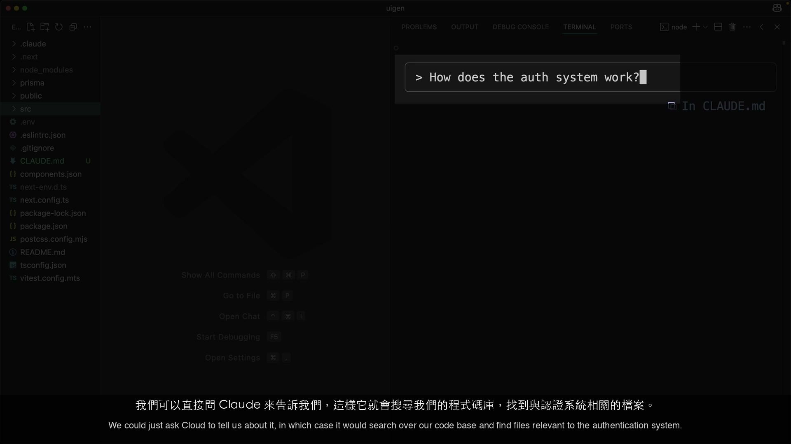

> **EN:** We could just ask Cloud to tell us about it, in which case it would search over our code base and find files relevant to the authentication system.
>
> **ZH:** 我們可以直接問 Claude 來告訴我們，這樣它就會搜尋我們的程式碼庫，找到與認證系統相關的檔案。

---

### [00:03:56] 第 54 段

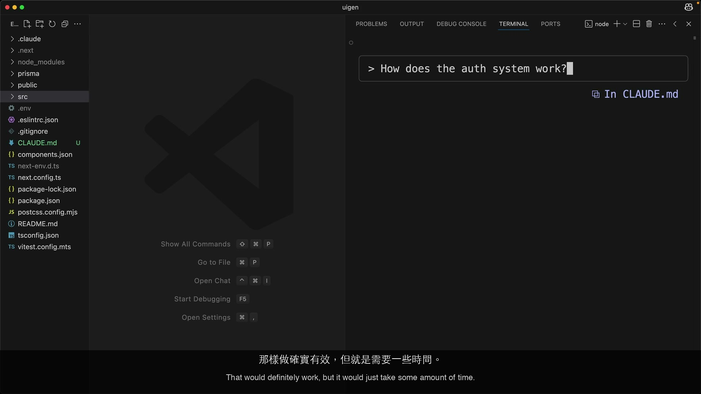

> **EN:** That would definitely work, but it would just take some amount of time.
>
> **ZH:** 那樣做確實有效，但就是需要一些時間。

---

### [00:03:59] 第 55 段

> **EN:** Alternatively, if we already know some files that are relevant for the authentication system, we could mention them using the at character.
>
> **ZH:** 或者，如果我們已經知道一些與認證系統相關的檔案，我們可以用 @ 符號來提及它們。

---

### [00:04:07] 第 56 段

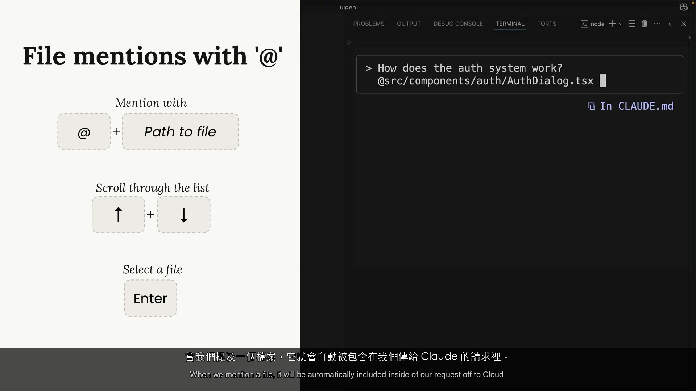

> **EN:** When we mention a file, it will be automatically included inside of our request off to Cloud.
>
> **ZH:** 當我們提及一個檔案，它就會自動被包含在我們傳給 Claude 的請求裡。

---

### [00:04:11] 第 57 段

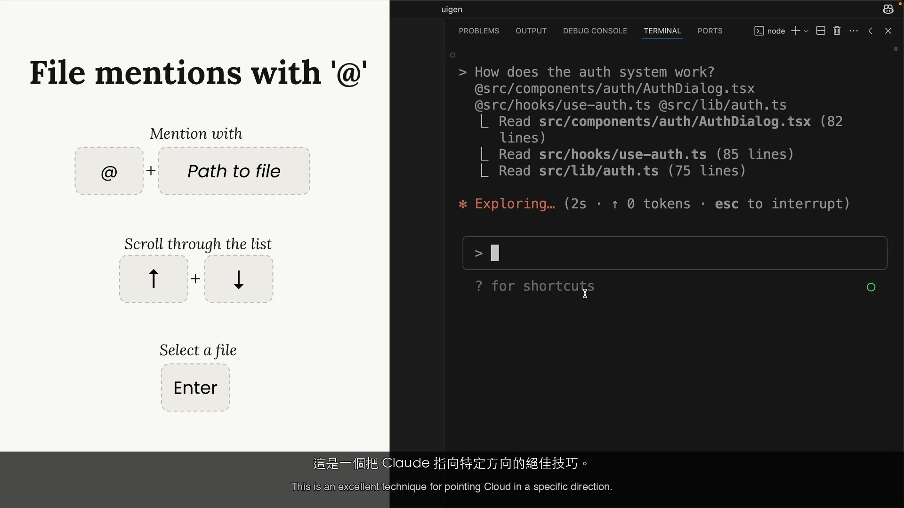

> **EN:** This is an excellent technique for pointing Cloud in a specific direction.
>
> **ZH:** 這是一個把 Claude 指向特定方向的絕佳技巧。

---

### [00:04:16] 第 58 段

> **EN:** You can use the same syntax to also mention files inside of Cloud.md.
>
> **ZH:** 你可以在 CLAUDE.md 裡用相同的語法來提及檔案。

---

### [00:04:20] 第 59 段

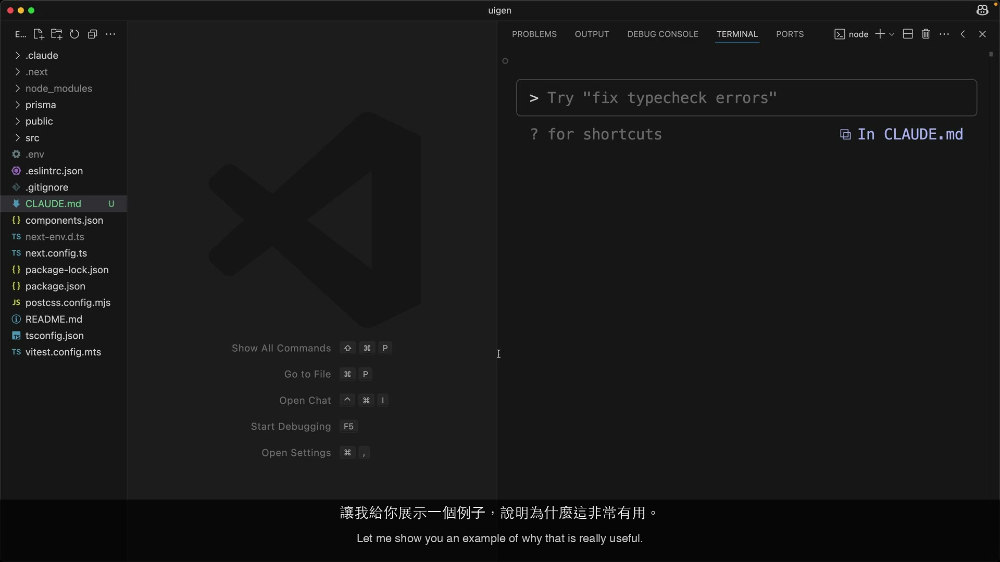

> **EN:** Let me show you an example of why that is really useful.
>
> **ZH:** 讓我給你展示一個例子，說明為什麼這非常有用。

---

### [00:04:23] 第 60 段

> **EN:** Inside of the Prisma folder of this project, there's a file called schema.prisma.
>
> **ZH:** 在這個專案的 Prisma 資料夾裡，有一個叫做 schema.prisma 的檔案。

---

### [00:04:28] 第 61 段

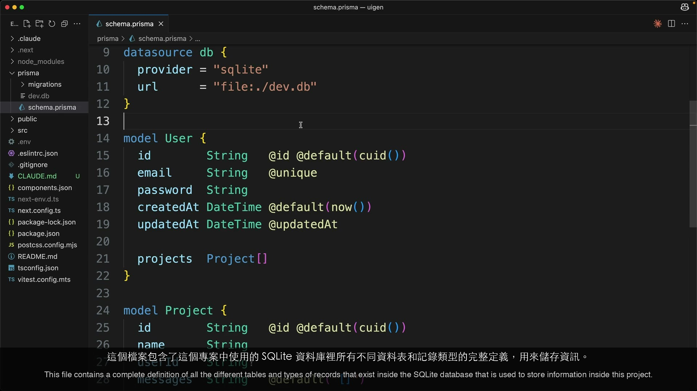

> **EN:** This file contains a complete definition of all the different tables and types of records that exist inside the SQLite database that is used to store information inside this project.
>
> **ZH:** 這個檔案包含了這個專案中使用的 SQLite 資料庫裡所有不同資料表和記錄類型的完整定義，用來儲存資訊。

---

### [00:04:37] 第 62 段

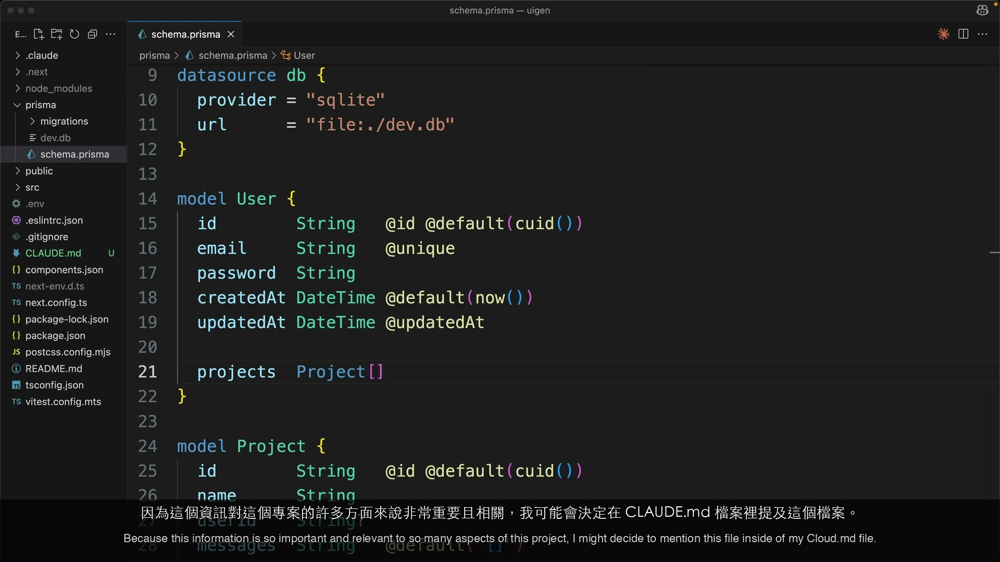

> **EN:** Because this information is so important and relevant to so many aspects of this project, I might decide to mention this file inside of my Cloud.md file.
>
> **ZH:** 因為這個資訊對這個專案的許多方面來說非常重要且相關，我可能會決定在 CLAUDE.md 檔案裡提及這個檔案。

---

### [00:04:46] 第 63 段

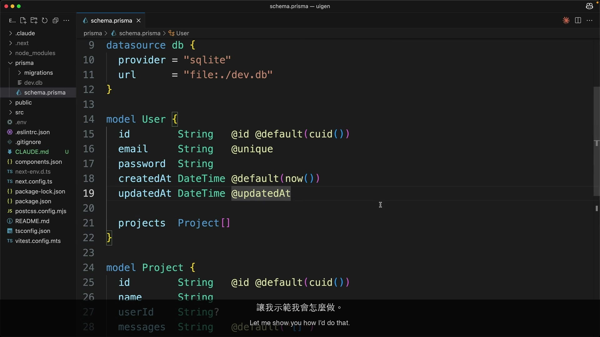

> **EN:** Let me show you how I'd do that.
>
> **ZH:** 讓我示範我會怎麼做。

---

### [00:04:48] 第 64 段

> **EN:** First, I'll enter a pound to enter memory mode.
>
> **ZH:** 首先，我輸入 # 進入 memory 模式。

---

### [00:04:50] 第 65 段

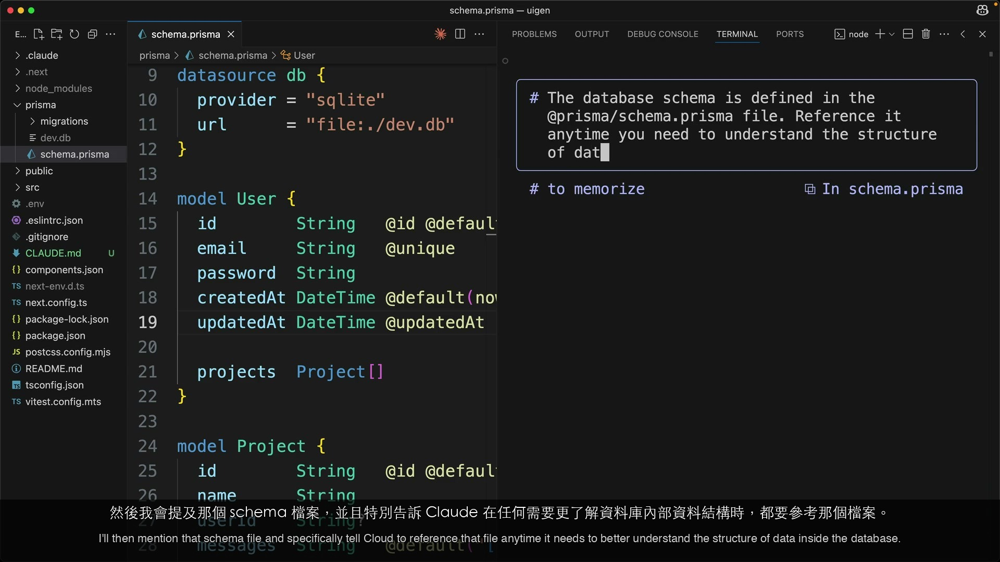

> **EN:** I'll then mention that schema file and specifically tell Cloud to reference that file anytime it needs to better understand the structure of data inside the database.
>
> **ZH:** 然後我會提及那個 schema 檔案，並且特別告訴 Claude 在任何需要更了解資料庫內部資料結構時，都要參考那個檔案。

---

### [00:04:58] 第 66 段

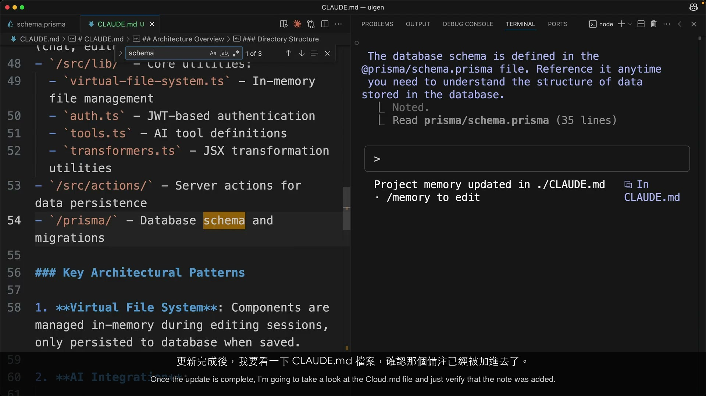

> **EN:** Once the update is complete, I'm going to take a look at the Cloud.md file and just verify that the note was added.
>
> **ZH:** 更新完成後，我要看一下 CLAUDE.md 檔案，確認那個備注已經被加進去了。

---

### [00:05:04] 第 67 段

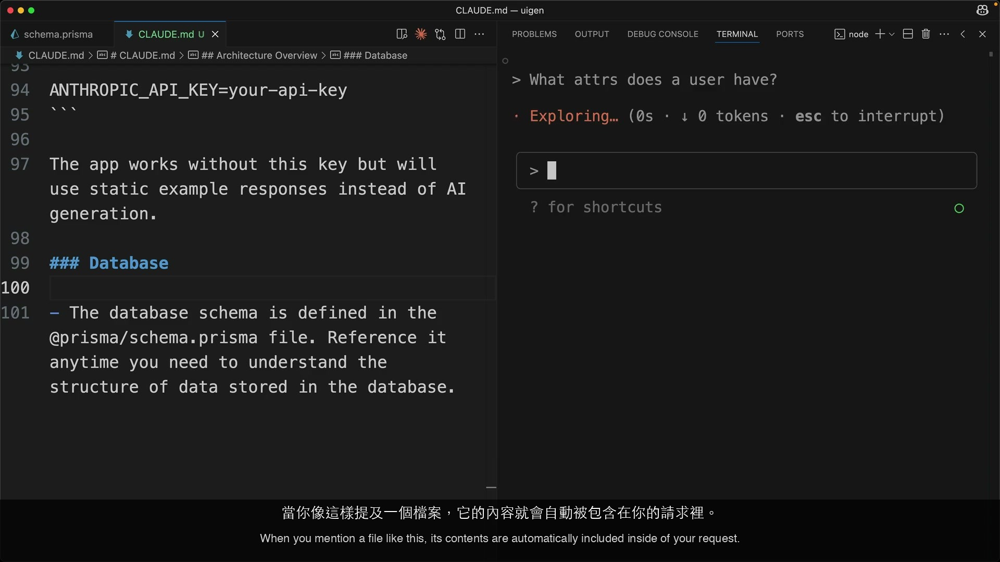

> **EN:** When you mention a file like this, its contents are automatically included inside of your request.
>
> **ZH:** 當你像這樣提及一個檔案，它的內容就會自動被包含在你的請求裡。

---

### [00:05:08] 第 68 段

> **EN:** So if I ask what attributes the user has, Cloud can immediately answer without reading the schema file.
>
> **ZH:** 所以如果我問使用者有哪些屬性，Claude 就能立即回答，不需要再讀取 schema 檔案。

---
