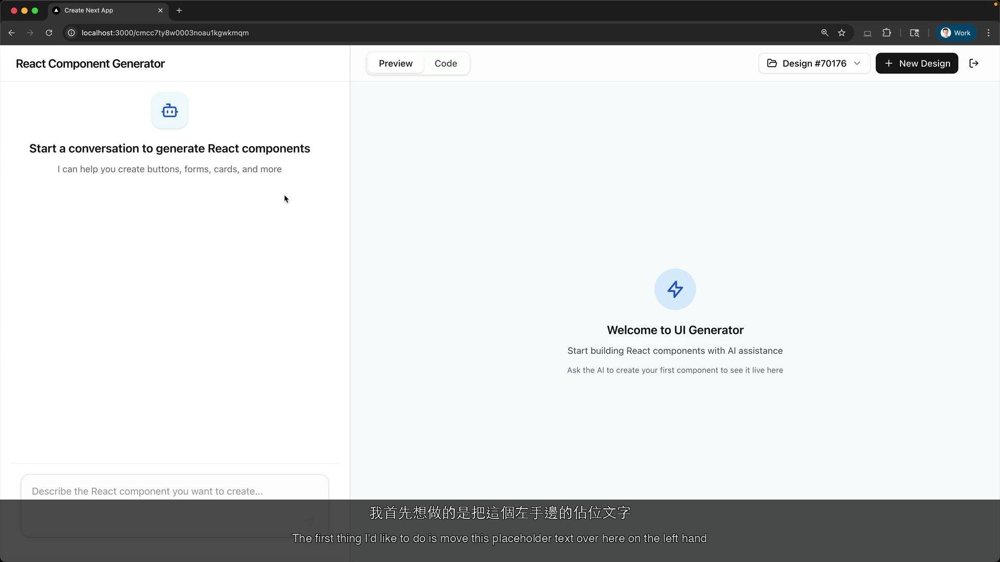
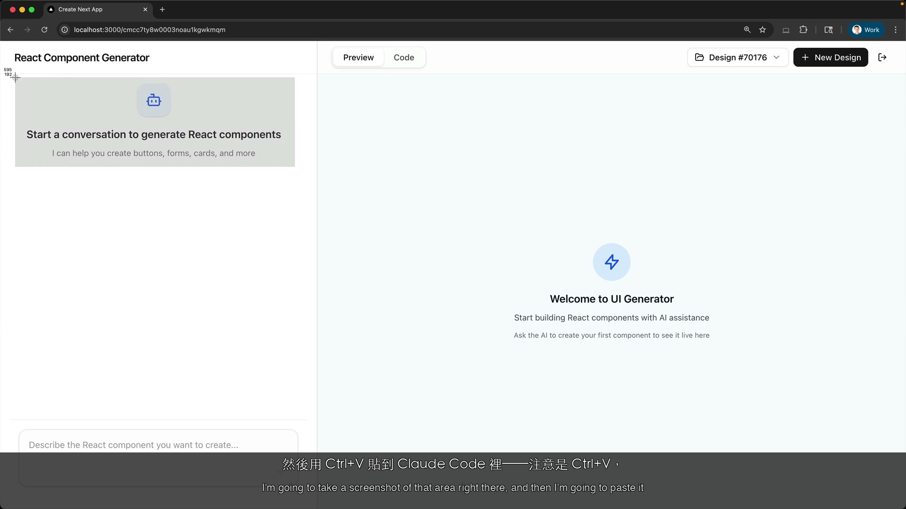
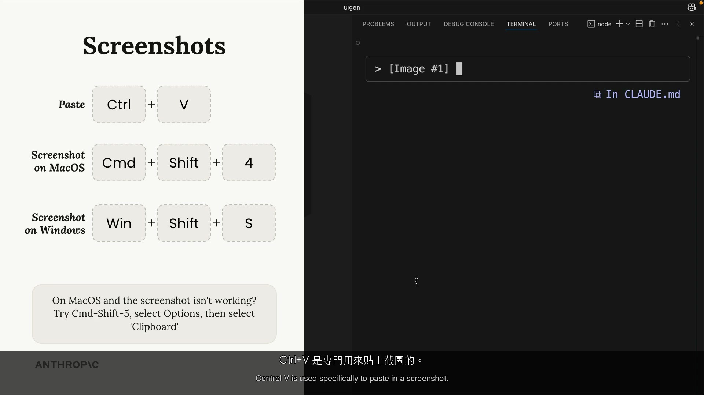
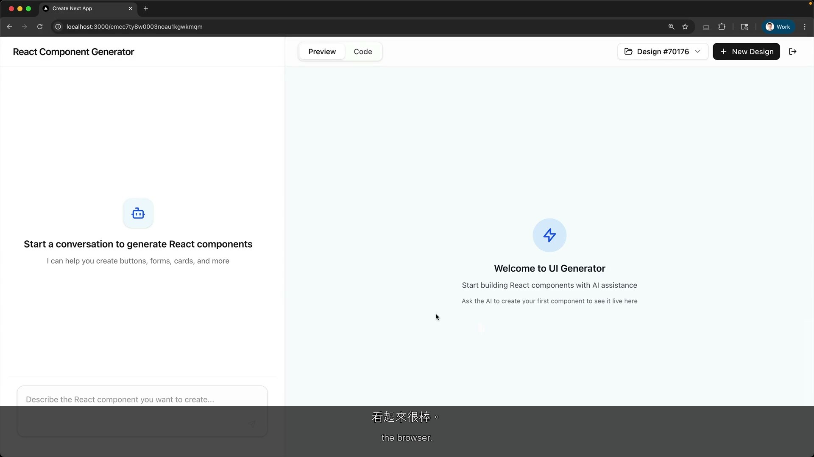
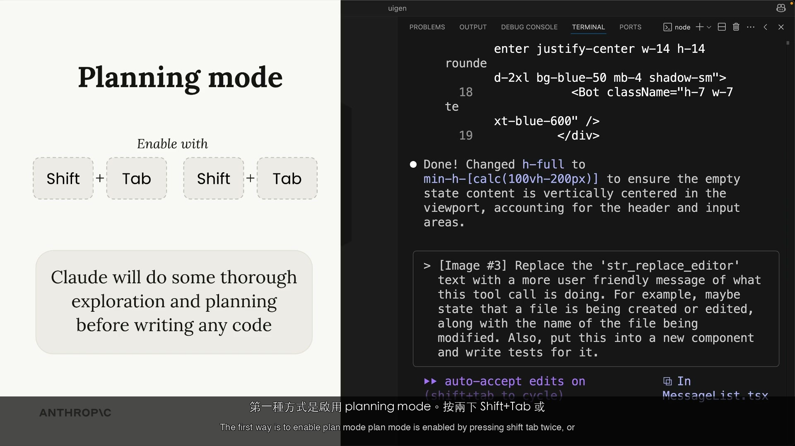
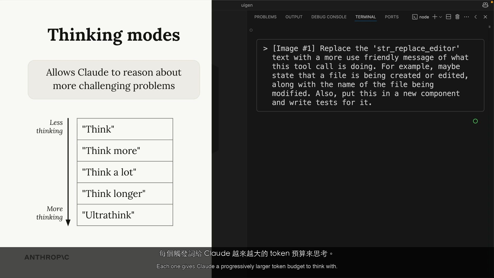
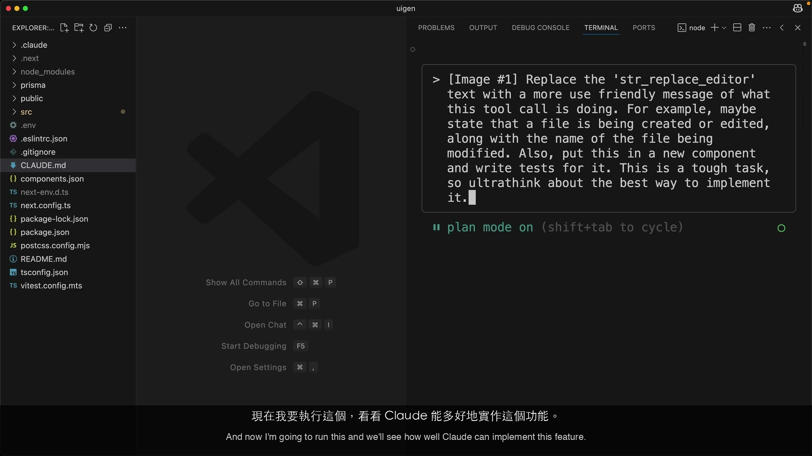
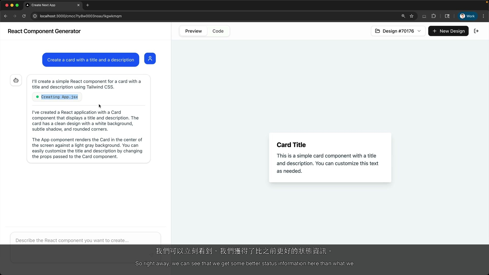
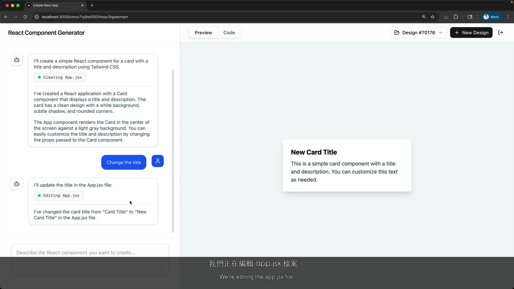

# Making Changes — PM Perspective

| Item | Detail |
|------|--------|
| Exam Domain | D3: Claude Code Configuration & Workflows |
| Task Statements | 3.4 (plan mode vs direct), 3.5 (iterative refinement) |
| Source | Anthropic Skilljar — Claude Code in Action |

---

# PART 1: Official Course Content

> All content in this section comes directly from official course materials.

## One-Liner / TL;DR

Claude Code has two power features beyond basic chat — Planning Mode (broad research before acting) and Thinking Modes (deeper reasoning for harder problems) — plus screenshot-based visual input that changes how design-to-development handoffs work.

## Core Concepts

### Screenshots for Precise Communication

Developers can paste screenshots directly into Claude Code to communicate UI changes visually:

1. Take a screenshot of the element to modify
2. Paste with **Ctrl+V** (not Cmd+V on macOS)
3. Describe the desired change

**PM takeaway:** This changes the design-to-development handoff. Designers and PMs can provide annotated screenshots — "change this specific element" — instead of writing detailed specifications. Visual communication is now a first-class input method for AI-assisted development.

### Planning Mode

Planning Mode is like asking your assistant to research and propose before acting — similar to a junior developer writing a design doc before coding.

**How to enable:** Press **Shift+Tab twice** (once if already auto-accepting edits).

In Planning Mode, Claude will:

1. **Read more files** — researches the codebase broadly, like a developer familiarizing themselves with a new repo before making changes
2. **Create a detailed implementation plan** — presents a step-by-step proposal
3. **Show what it intends to do** — full transparency before any code changes
4. **Wait for approval** — the developer reviews and can redirect, just like reviewing a design doc before sprint commitment

This is not just "slower execution." It is a fundamentally different workflow that gathers more context, catches dependencies, and reduces the risk of incomplete changes across multiple files.

### Thinking Modes

Thinking modes give Claude progressively more reasoning time — like giving a consultant extra days for a deeper analysis instead of a quick opinion.

| Mode | Reasoning Depth | Business Analogy |
|------|----------------|-----------------|
| "Think" | Basic extended | Quick 30-minute analysis |
| "Think more" | Extended | Half-day deep dive |
| "Think a lot" | Comprehensive | Full-day strategy session |
| "Think longer" | Extended time | Multi-day research project |
| "Ultrathink" | Maximum | Week-long comprehensive audit |

Each level gives Claude progressively more tokens for deeper analysis. Developers activate these by including the keyword in their prompt.

### Planning vs Thinking — Breadth vs Depth

These address different types of complexity:

| Dimension | Planning Mode | Thinking Mode |
|-----------|--------------|---------------|
| **What it does** | Researches the codebase broadly | Reasons more deeply about the problem |
| **Business analogy** | Project kickoff — survey all stakeholders and systems before committing | Strategy deep-dive — thorough analysis of a specific decision |
| **Type of complexity** | Breadth — many files, many components | Depth — complex logic, ambiguous requirements |
| **Activation** | Shift+Tab twice (toggle) | Keyword in prompt ("think", "ultrathink") |
| **Cost driver** | More file reads (tool calls) | More reasoning tokens |

**PM decision framework:**
- **Simple task** (fix a typo, change a color) → Direct execution. Fast, cheap.
- **Multi-file task** (rename across 15 files, add feature touching multiple modules) → Planning Mode. More tokens but catches dependencies.
- **Complex logic** (design caching algorithm, debug race condition) → Thinking Mode. More reasoning tokens.
- **Both broad and deep** (new billing module from scratch) → Planning Mode + Thinking. Highest token cost but best quality for complex work.

Both features consume additional tokens — this is the cost-quality trade-off PMs should monitor.

### Git Integration

Claude Code also serves as a Git assistant — developers can ask it to stage changes and create commits with descriptive messages without leaving the terminal. This streamlines the development-to-commit workflow, especially after iterative changes.

## Demo Walkthrough: Screenshot Paste — Centering a Placeholder

| Step | What Happens | Frame |
|------|-------------|-------|
| 1. Start dev server | Instructor runs `npm run dev` and opens the app at localhost:3000 |  |
| 2. Identify the problem | Placeholder text sits on the left panel but is not centered |  |
| 3. Screenshot + paste | Takes a screenshot of the placeholder, pastes into Claude Code with Ctrl+V |  |
| 4. Result | Claude searches the codebase, updates styling — placeholder is now centered |  |

**PM takeaway:** The entire fix — from "I see a problem" to "it is resolved" — took under a minute. No Jira ticket, no design spec, no CSS file name needed. The developer showed Claude the problem with a screenshot and described the fix in one sentence.

## Demo Walkthrough: Plan Mode + Thinking — Complex Feature Implementation

| Step | What Happens | Frame |
|------|-------------|-------|
| 1. Discover the problem | After generating a card component, the instructor notices "String Replace Editor" — a technical tool name visible to users |  |
| 2. Screenshot the issue | Takes a screenshot of the technical text and pastes into Claude Code |  |
| 3. Enable Plan Mode | Presses Shift+Tab twice to enable Planning Mode — Claude will research and plan before acting |  |
| 4. Add ultrathink | Includes "ultrathink" for maximum reasoning depth; explains breadth (planning) vs depth (thinking) |  |
| 5. Combined execution | Plan Mode + ultrathink working together — broad codebase exploration with deep reasoning |  |
| 6. Feature complete | Technical tool names replaced with user-friendly messages: "Creating file:" and "Editing file:" |  |
| 7. Verification | Follow-up edit confirms the feature works — shows "Editing app.jsx" instead of tool names |  |

**PM takeaway:** This was a UX improvement that touched multiple files and required understanding how the app renders tool interactions. With Planning Mode + ultrathink, the developer completed it in about two minutes. Without AI assistance, this would involve: (1) finding where tool names are rendered, (2) tracing the data flow, (3) modifying the display logic, (4) testing both create and edit paths. Easily a 1-2 hour task compressed to minutes.

## Instructor Tips

- **Ctrl+V** for screenshots, not Cmd+V — this is a common stumbling block for macOS users
- Planning Mode is ideal for tasks where the developer does not know the full scope upfront
- Ultrathink is for the hardest problems — it is the maximum reasoning capability
- Both features have token costs — teams should develop guidelines for proportionate usage
- Claude Code also handles Git staging and commits — one less context switch for developers

## Key Takeaways

1. Screenshots enable visual communication — PMs and designers can provide annotated images instead of written specs
2. Planning Mode (Shift+Tab twice) = asking Claude to research and propose before acting — reduces risk on complex tasks
3. Thinking Modes (think / think more / think a lot / think longer / ultrathink) = giving Claude more reasoning time for harder problems
4. Planning and Thinking can be combined — breadth + depth for the most complex tasks
5. Both features increase token costs — PMs should monitor usage and set proportionate guidelines
6. Claude Code handles Git operations too — staging and committing with descriptive messages

---

# PART 2: Study Aids

> Supplementary learning materials, not from official course.

## Familiar Analogies

- **Screenshot paste** — Like a designer circling an element in a mockup and writing "change this." The visual context eliminates back-and-forth about which element is being discussed.
- **Planning Mode** — Like asking a junior developer to write a design doc before coding. They research the codebase, identify all the files they need to touch, and present a plan for review before committing any code.
- **Thinking Modes** — Like giving a consultant extra time for analysis. A quick opinion takes 30 minutes; a thorough analysis takes a week. Each thinking level is a different time budget for reasoning.
- **Ultrathink** — Like commissioning a comprehensive audit instead of a spot check. Maximum analysis resources for maximum confidence in the result.
- **Planning + Thinking combined** — Like a project kickoff (survey all teams and systems) followed by a deep technical design session (solve the hardest architectural question). Complex projects need both.
- **Direct execution for simple tasks** — Like a quick Slack message: "fix the typo on line 42." No meeting needed, no planning doc, just do it.

## CCA Exam Connection

> [!TIP]
> As a PM, you need to know:
> - **Planning Mode vs Thinking Mode** — Breadth vs depth. This is the single most testable distinction. Planning reads more files; Thinking reasons more deeply.
> - **Cost implications** — Both features increase token consumption. Expect questions about when the cost is justified vs wasteful.
> - **Activation methods** — Shift+Tab twice for Planning Mode; keyword in prompt for Thinking Modes.
> - **Screenshot input** — Ctrl+V (not Cmd+V) for pasting images. Changes the design-to-dev handoff.
> - **Combining modes** — Know that both can be used simultaneously and when that is appropriate.
> - **Proportionate usage** — The exam tests whether you understand matching tool power to task complexity.

## Anti-Patterns

| Anti-Pattern | Why It Fails | Correct Approach |
|-------------|-------------|-----------------|
| Requiring Planning Mode for all tasks | Wastes tokens and slows developers on simple changes | Create guidelines: Planning Mode for multi-file tasks, direct execution for simple edits |
| Ignoring token cost of power features | Budget overruns when entire team uses ultrathink by default | Set team guidelines — match mode to task complexity |
| Writing detailed text specs when screenshots would suffice | Slower and more ambiguous than visual communication | Encourage screenshot-based communication for UI changes |
| Banning ultrathink to cut costs | Removes a valuable tool for genuinely complex tasks | Reserve it for complex tasks; ban indiscriminate use, not the feature itself |
| Not reviewing Planning Mode output | Defeats the purpose of the review-approve cycle | Ensure developers always review plans before approving |
| Assuming Claude Code only writes code | Misses the Git integration for staging and committing | Include Git workflow in team's Claude Code usage patterns |

## Practice Questions

**Q1.** Your engineering team's Claude Code token usage has doubled this month. Investigation reveals developers are using "ultrathink" for most tasks, including simple ones. What is the appropriate PM response?

- A) Ban ultrathink entirely
- B) Create guidelines: reserve ultrathink for complex reasoning tasks, use direct execution for simple changes, and use Planning Mode for multi-file work
- C) Accept the higher costs as the price of better quality
- D) Ask developers to use Claude Code less frequently

> [!NOTE]
> **Answer: B.** The issue is indiscriminate use, not the feature itself. Creating usage guidelines that match mode to task complexity optimizes both quality and cost. This is the proportionate response.

**Q2.** Your design team asks: "Can we send screenshots to developers for Claude to implement?" Based on this lesson, what is the correct answer?

- A) No, Claude Code does not support image input
- B) Yes, developers can paste screenshots directly into Claude Code with Ctrl+V, and Claude uses visual context to implement or modify UI elements
- C) Only if screenshots are converted to text descriptions first
- D) Screenshots only work for bug reports, not new designs

> [!NOTE]
> **Answer: B.** Screenshot-based communication is a primary input method. Designers provide screenshots, developers paste with Ctrl+V, and Claude uses multimodal understanding to implement changes. This changes the design-to-development handoff.

**Q3.** You are estimating sprint velocity for a mix of tasks. Which mode mapping is correct?

- A) Simple bug fix → Planning Mode; Complex refactor → Direct execution
- B) Simple bug fix → Direct execution; Multi-file refactor → Planning Mode; Complex algorithm → Thinking Mode; Complex new module → Planning Mode + Thinking
- C) All tasks → Ultrathink for best quality
- D) All tasks → Planning Mode for safety

> [!NOTE]
> **Answer: B.** Match the mode to the task complexity. Simple tasks need direct execution (fast, cheap). Multi-file tasks need Planning Mode (breadth). Complex reasoning needs Thinking Mode (depth). Tasks with both need the combination. Using the most powerful mode for every task wastes tokens without proportionate benefit.

**Q4.** How is Planning Mode activated in Claude Code?

- A) Type "plan" in the prompt
- B) Press Shift+Tab twice (or once if already auto-accepting)
- C) Use the `--plan` command-line flag
- D) Enable it in project settings

> [!NOTE]
> **Answer: B.** Planning Mode is toggled with the Shift+Tab keyboard shortcut. This is distinct from Thinking Modes, which are activated by keywords in the prompt (think, ultrathink, etc.).
