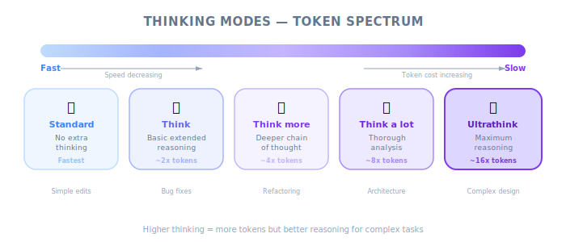
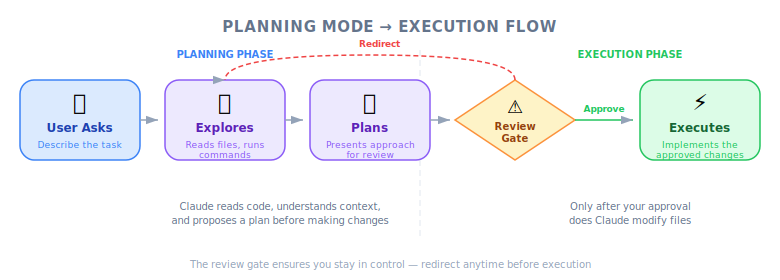
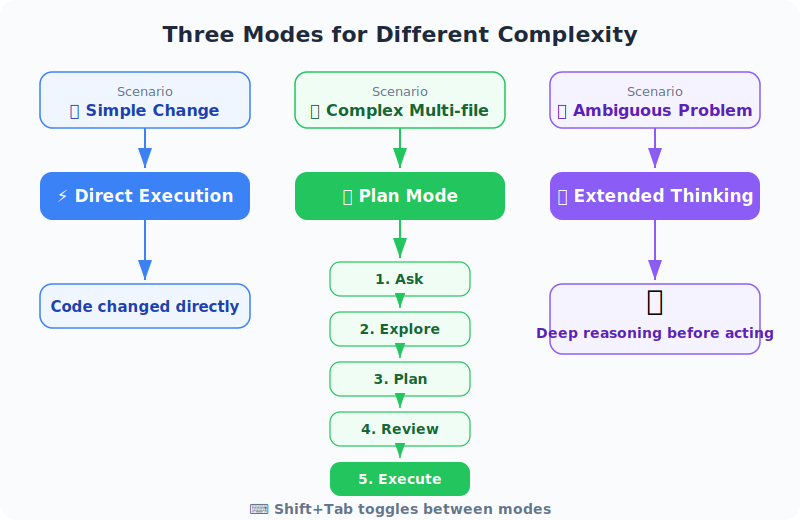

# Making Changes — PM Perspective

| Item | Details |
|------|---------|
| Exam Coverage | D1 — Agentic Coding Fundamentals (22%), D3 — Effective Claude Code Usage (30%) |
| Task Statements | 3.4 ★★★ (plan mode vs direct), 3.5 ★★★ (iterative refinement), 1.1 ★ (agentic loops) |
| Exam Scenarios | S2 (Code Gen), S4 (Developer Productivity) |
| Course Source | claude-code-in-action / 02-getting-started / Lesson 08 (video + text) |

---



*Figure: Thinking modes spectrum — from standard to ultrathink.*

## TL;DR

Claude Code has two power features beyond basic chat: Planning Mode (for complex multi-file tasks) and Thinking Modes (for deep reasoning on hard problems). PMs should understand these because they affect developer productivity, token costs, and the types of tasks that can be reliably automated. The iterative refinement workflow — ask, implement, review, feedback, refine — is how teams actually use Claude Code day-to-day.

---

## Why PMs Must Understand This

1. **Productivity estimation** — Knowing when developers should use Planning Mode vs direct execution helps you estimate task completion times
2. **Cost management** — Both Planning Mode and Thinking Modes increase token consumption; PMs need to understand the trade-off between quality and cost
3. **Task scoping** — Understanding what Planning Mode can handle helps you scope tickets appropriately for AI-assisted development
4. **Visual communication** — Screenshot-based workflows change how designers and PMs can communicate changes to developers using Claude Code

---

## Business Analogies

| Concept | Business Analogy |
|---------|-----------------|
| Direct execution | Quick Slack message to fix a typo — no meeting needed |
| Planning Mode | Project kickoff meeting before a multi-week sprint — align scope before building |
| Thinking modes | Giving the strategy team an extra week for deep analysis on a complex market decision |
| Iterative refinement | Design sprint — show prototype, get stakeholder feedback, iterate, ship |
| Screenshot input | Annotated mockup from a designer — "change this specific button" with a red circle around it |
| Planning + Thinking | Annual planning + deep-dive research — both scope and depth |

---

## Decision Framework: Which Mode for Which Task?



*Figure: Planning mode execution flow — explore, plan, review, execute.*



*Figure: Three operational modes for different complexity levels.*

| Task Type | Recommended Mode | Token Cost | Developer Time |
|-----------|-----------------|------------|---------------|
| Fix a typo, add a log statement | Direct execution | Low | Minutes |
| Implement a new API endpoint | Direct or Planning | Medium | 10-30 min |
| Refactor authentication across 10 files | Planning Mode | High | 30-60 min |
| Design optimal caching algorithm | Thinking Mode (ultrathink) | High | 15-30 min |
| Full-stack feature across multiple modules | Planning + Thinking | Highest | 1-2 hours |

> [!NOTE] **Instructor insight from the video**
>
> The instructor notes that "both features consume additional tokens, so there's a cost consideration." This is the key PM insight: more powerful modes produce better results on complex tasks but cost more. The goal is proportionate usage — match the tool to the task.

---

## Scenario Walkthrough: Sprint Planning with Claude Code

Your team is planning a sprint with a mix of task complexities:

| Ticket | Complexity | Recommended Claude Code Mode | Rationale |
|--------|-----------|------------------------------|-----------|
| Fix button color on settings page | Low | Direct execution | Single file, clear change |
| Add dark mode to the entire app | High (breadth) | Planning Mode | Touches CSS, components, state management across many files |
| Optimize database query performance | High (depth) | Thinking Mode (ultrathink) | Requires deep analysis of query patterns and indexing strategies |
| Build new billing module from scratch | High (both) | Planning Mode + Thinking | New architecture (breadth) with complex business logic (depth) |

> [!TIP] **PM Decision Rule**
>
> When estimating sprint velocity with Claude Code, simple tasks get 2-3x speedup from direct execution. Complex tasks get 1.5-2x speedup from Planning Mode but consume more tokens. Factor this into cost projections.

---

## The Iterative Refinement Cycle for PMs

This is the workflow you will see developers using daily:

```
PM provides requirement
        │
        ▼
Developer asks Claude ──→ Claude implements ──→ Developer reviews
        ▲                                              │
        │                                              ▼
        └────── Developer provides feedback ◄── Needs changes?
                (screenshot + description)         │
                                                   ▼ (No)
                                              Ship / PR
```

**What this means for PMs:**
- Feedback cycles are faster (minutes, not days)
- Visual feedback (screenshots) is now a first-class communication method
- PMs can participate by providing screenshots of desired UI states
- More iterations = better result, but each iteration has a token cost

---

## Practice Questions

### Q1: Sprint Velocity Estimation

Your engineering team is adopting Claude Code. The CTO asks you to estimate the impact on sprint velocity. Based on this lesson, which answer is most nuanced?

- A. All tasks will be completed 3x faster
- B. Simple tasks will see significant speedup from direct execution; complex multi-file tasks will see moderate speedup from Planning Mode but with higher token costs; the net effect depends on the task mix
- C. There will be no measurable impact because developers still need to review code
- D. Claude Code only helps with new features, not bug fixes

<details><summary>Answer</summary>

**B** — The proportionate response. Different modes have different speed/cost profiles. Simple tasks get the biggest relative speedup. Complex tasks get quality improvements from Planning Mode but consume more tokens. The net sprint impact depends on the mix of task types.

**PM Takeaway**: Do not promise uniform speedup. Analyze your sprint's task mix and estimate per-task impact based on complexity.
</details>

### Q2: Cost Optimization

Your team's Claude Code token usage has doubled this month. Investigation reveals developers are using "ultrathink" for most tasks. What is the appropriate PM response?

- A. Ban ultrathink entirely to reduce costs
- B. Create guidelines: reserve ultrathink for complex reasoning tasks, use direct execution for simple changes, and use Planning Mode for multi-file work
- C. Accept the higher costs as the price of better quality
- D. Ask developers to use Claude Code less frequently

<details><summary>Answer</summary>

**B** — This is the proportionate response. The issue is not ultrathink itself but its indiscriminate use. Creating usage guidelines that match mode to task complexity optimizes both quality and cost.

**PM Takeaway**: Token cost optimization is about matching the right mode to the right task, not about restricting powerful features. Create a simple decision matrix that developers can reference.
</details>

### Q3: Design-Development Workflow

Your design team wants to use Claude Code to accelerate UI implementation. They ask: "Can we just send screenshots to the developers for Claude to implement?" Based on this lesson, what is the correct answer?

- A. No, Claude Code does not support image input
- B. Yes, developers can paste screenshots directly into Claude Code with Ctrl+V, and Claude can use the visual context to implement or modify UI elements
- C. Only if the screenshots are converted to text descriptions first
- D. Screenshots only work for identifying bugs, not for implementing new designs

<details><summary>Answer</summary>

**B** — The lesson explicitly teaches screenshot-based communication as a primary input method. Designers can provide annotated screenshots, developers paste them into Claude Code, and Claude uses multimodal understanding to implement the changes.

**PM Takeaway**: This changes the design-to-development handoff. Designers can communicate changes visually, reducing the need for detailed written specifications for UI modifications. Consider updating your team's workflow to leverage this.
</details>
