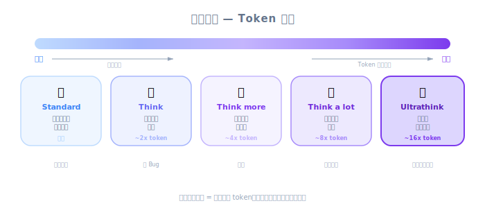
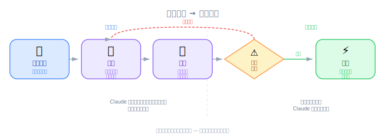
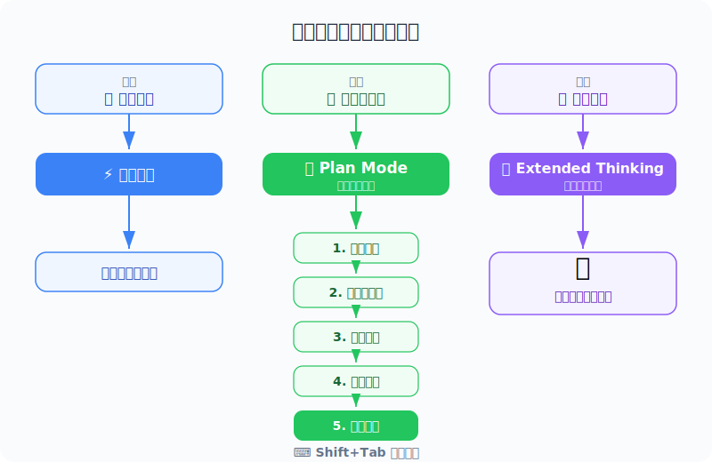

# Making Changes — PM 视角

| 项目 | 细节 |
|------|---------|
| 考试涵盖 | D1 — Agentic Coding Fundamentals (22%), D3 — Effective Claude Code Usage (30%) |
| Task Statements | 3.4 ★★★ (plan mode vs direct), 3.5 ★★★ (iterative refinement), 1.1 ★ (agentic loops) |
| 考试场景 | S2 (Code Gen), S4 (Developer Productivity) |
| 课程来源 | claude-code-in-action / 02-getting-started / Lesson 08（视频 + 文字） |

---



*圖：Thinking Mode 頻譜 — 從 standard 到 ultrathink。*



*圖：Plan Mode 執行流程 — 探索、規劃、審查、執行。*



*圖：三種模式對應不同複雜度。*

## TL;DR

Claude Code 有两个超越基本聊天的强大功能：Planning Mode（用于复杂多文件任务）和 Thinking Modes（用于困难问题的深度推理）。PM 应理解这些，因为它们影响开发者生产力、token 成本，以及可以可靠自动化的任务类型。迭代改进工作流 — 提问、实现、审核、反馈、改进 — 是团队日常实际使用 Claude Code 的方式。

---

## 为什么 PM 必须理解这个

1. **生产力估算** — 知道开发者何时该用 Planning Mode vs 直接执行，有助于估算任务完成时间
2. **成本管理** — Planning Mode 和 Thinking Modes 都增加 token 消耗；PM 需要理解质量与成本的权衡
3. **任务范围界定** — 理解 Planning Mode 能处理什么，有助于为 AI 辅助开发适当界定 ticket 范围
4. **视觉沟通** — 基于截图的工作流改变了设计师和 PM 如何向使用 Claude Code 的开发者沟通变更

---

## 商业类比

| 概念 | 商业类比 |
|---------|-----------------|
| 直接执行 | 在 Slack 上快速发消息修一个 typo — 不需要开会 |
| Planning Mode | 多周 sprint 前的项目启动会议 — 建造前先对齐范围 |
| Thinking modes | 给策略团队额外一周深入分析复杂的市场决策 |
| 迭代改进 | 设计冲刺 — 展示原型、获取利益相关方反馈、迭代、上线 |
| 截图输入 | 设计师的标注 mockup — 「改这个特定按钮」并用红圈圈起来 |

---

## 决策框架：哪个模式用于哪种任务？

| 任务类型 | 建议模式 | Token 成本 | 开发者时间 |
|-----------|-----------------|------------|---------------|
| 修 typo、加 log 语句 | 直接执行 | 低 | 几分钟 |
| 实现新 API endpoint | 直接或 Planning | 中 | 10-30 分钟 |
| 跨 10 个文件重构认证 | Planning Mode | 高 | 30-60 分钟 |
| 设计最佳缓存算法 | Thinking Mode (ultrathink) | 高 | 15-30 分钟 |
| 跨多模块的全栈功能 | Planning + Thinking | 最高 | 1-2 小时 |

> [!NOTE] **讲师视频洞察**
>
> 讲师提到「两个功能都消耗额外 token，所以有成本考量。」这是关键的 PM 洞察：更强大的模式在复杂任务上产生更好的结果，但成本更高。目标是适当使用 — 让工具匹配任务。

---

## 场景演练：与 Claude Code 的 Sprint 规划

你的团队正在规划包含不同复杂度任务的 sprint：

| Ticket | 复杂度 | 建议 Claude Code 模式 | 理由 |
|--------|-----------|------------------------------|-----------|
| 修正设置页面按钮颜色 | 低 | 直接执行 | 单一文件，明确的变更 |
| 为整个应用加入深色模式 | 高（广度） | Planning Mode | 触及 CSS、组件、多文件的状态管理 |
| 优化数据库查询性能 | 高（深度） | Thinking Mode (ultrathink) | 需要深入分析查询模式和索引策略 |
| 从零开始构建新的账务模块 | 高（两者） | Planning Mode + Thinking | 新架构（广度）配合复杂的业务逻辑（深度） |

> [!TIP] **PM 决策规则**
>
> 估算使用 Claude Code 的 sprint 速度时，简单任务从直接执行获得 2-3 倍加速。复杂任务从 Planning Mode 获得 1.5-2 倍加速但消耗更多 token。将此纳入成本预测。

---

## PM 的迭代改进循环

这是你会看到开发者每天使用的工作流：

```
PM 提供需求
        │
        ▼
开发者询问 Claude ──→ Claude 实现 ──→ 开发者审核
        ▲                                    │
        │                                    ▼
        └─── 开发者提供反馈 ◄── 需要变更？
             （截图 + 描述）           │
                                      ▼（否）
                                  提交 / PR
```

**这对 PM 意味着什么：**
- 反馈循环更快（分钟级，不是天级）
- 视觉反馈（截图）现在是一等公民的沟通方式
- PM 可以通过提供期望 UI 状态的截图来参与
- 更多迭代 = 更好的结果，但每次迭代都有 token 成本

---

## 练习题

### Q1：Sprint 速度估算

你的工程团队正在采用 Claude Code。CTO 要你估算对 sprint 速度的影响。根据本课内容，哪个答案最有见地？

- A. 所有任务都会快 3 倍完成
- B. 简单任务通过直接执行获得显著加速；复杂多文件任务通过 Planning Mode 获得适度加速但 token 成本更高；净效果取决于任务组合
- C. 不会有可衡量的影响因为开发者仍需审核代码
- D. Claude Code 只帮助新功能，不帮助 bug fix

<details><summary>答案</summary>

**B** — 适当的回应。不同模式有不同的速度/成本特性。简单任务获得最大的相对加速。复杂任务从 Planning Mode 获得质量提升但消耗更多 token。Sprint 的净影响取决于任务类型的组合。

**PM 重点**：不要承诺统一的加速。分析你的 sprint 任务组合，根据复杂度估算每个任务的影响。
</details>

### Q2：成本优化

你团队这个月的 Claude Code token 使用量翻倍了。调查发现开发者对大多数任务都使用 "ultrathink"。适当的 PM 回应是什么？

- A. 完全禁止 ultrathink 以降低成本
- B. 创建指南：将 ultrathink 保留给复杂推理任务，简单变更用直接执行，多文件工作用 Planning Mode
- C. 接受更高的成本作为更好质量的代价
- D. 要求开发者少用 Claude Code

<details><summary>答案</summary>

**B** — 这是适当的回应。问题不是 ultrathink 本身而是不加区分的使用。创建让模式匹配任务复杂度的使用指南同时优化质量和成本。

**PM 重点**：Token 成本优化是关于让正确的模式匹配正确的任务，而不是限制强大的功能。创建开发者可以参考的简单决策矩阵。
</details>

### Q3：设计-开发工作流

你的设计团队想用 Claude Code 加速 UI 实现。他们问：「我们可以直接发截图给开发者让 Claude 来实现吗？」根据本课内容，正确答案是什么？

- A. 不行，Claude Code 不支持图片输入
- B. 可以，开发者可以用 Ctrl+V 直接粘贴截图到 Claude Code，Claude 可以用视觉 context 来实现或修改 UI 元素
- C. 只有先将截图转换成文字描述才行
- D. 截图只能用来识别 bug，不能用来实现新设计

<details><summary>答案</summary>

**B** — 课程明确教授基于截图的沟通作为主要输入方式。设计师可以提供标注截图，开发者粘贴到 Claude Code，Claude 用多模态理解来实现变更。

**PM 重点**：这改变了设计到开发的交接流程。设计师可以视觉化沟通变更，减少 UI 修改对详细书面规格的需求。考虑更新团队工作流来利用这一点。
</details>
