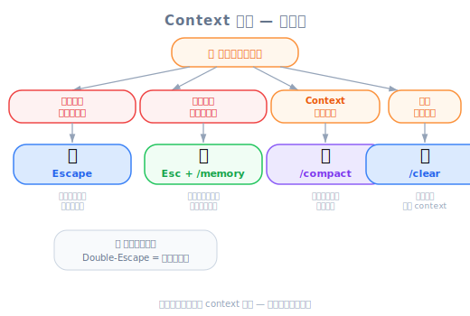

# Controlling Context — 工程師視角

*圖：選擇上下文控制工具的決策樹。*

| 項目 | 內容 |
|------|------|
| 考試對應 | D5 — Reliability & Performance（15%）、D3 — Claude Code Configuration & Workflows（20%） |
| Task Statements | 5.1 ★★★（context preservation）、5.4 ★★（large codebase context）、3.5 ★★（iterative refinement） |
| 課程來源 | claude-code-in-action / 03-context-and-commands / Lesson 10 |

---

## 一句話理解

Context 是有限資源 — Escape 中斷產出、雙擊 Escape 倒帶對話歷史、`/compact` 摘要保留已學知識、`/clear` 完全重來。選對工具就能讓 Claude 保持專注、節省 tokens。

---

## 為什麼 Context 管理很重要

Claude Code 在一個固定大小的 **context window** 裡運作。你發的每一條訊息、Claude 讀的每一個檔案、每一次 debug 的來回，全部都消耗 tokens。當 window 滿了，Claude 會丟失早期的資訊，導致：

- **重複犯錯** — Claude 忘了你之前給的修正
- **注意力漂移** — 不相關的 debug 歷史干擾當前任務
- **Token 浪費** — 在噪音上花錢，不是在訊號上

管理 context 不只是方便 — 它直接影響輸出品質。

---

## 四種 Context 控制工具

### 1. Escape（按一次）— 中斷

停止 Claude 正在產出的內容。適用於：
- Claude 正往錯誤方向走
- 你想在它浪費 tokens 之前重新導向
- 你需要在 Claude 完成前提供額外指引

> [!TIP]
> **Escape + Memory = 永久修正**
>
> 當 Claude 重複犯同一個錯（例如試圖讀取一個不存在的 config 檔），立刻按 Escape，然後用 `#` 快捷鍵儲存一條 memory，記錄正確行為。這可以防止未來 session 再犯同樣的錯 — 不只是當前對話。

### 2. 雙擊 Escape — 倒帶對話

按兩次 Escape 可以看到你所有的訊息歷史，跳回任何一個之前的時間點。這會**丟棄選定點之後的所有訊息**，等於倒帶對話。

最適合用在：
- Debug 的來回污染了 context
- 你想從一個已知正確的狀態重新嘗試
- Claude 順利完成了 Task A，但在 Task B 撞到問題，你想回到 Task A 完成後的狀態

> [!NOTE]
> **影片補充**
>
> 講師示範在 `auth.ts` 裡寫四個函式的測試。在為 `createSession` debug 一個缺少 package 的問題後，他倒帶到 debug 之前，把 prompt 改成「寫 getSession 的測試」。這保留了有用的 context（Claude 已經讀過 `auth.ts`），同時丟掉了噪音（package debug 歷史）。

### 3. `/compact` — 摘要後繼續

把整個對話壓縮成摘要，然後從摘要繼續。核心區別：Claude **保留已學的知識**，但以壓縮的形式。

最適合用在：
- Claude 在這個 session 中已經累積了對 codebase 的深入理解
- 你在相關子任務之間切換（例如完成函式 2 的測試後開始函式 3）
- Context window 快滿了但累積的知識很寶貴

### 4. `/clear` — 全新開始

清除整個對話歷史。Claude 從零開始（除了 CLAUDE.md 和 memories）。

最適合用在：
- 你要切換到完全不相關的任務
- 當前對話已經太混亂，搶救 context 反而有害
- 開始一個新的 coding session 做不同的 feature

---

## 決策框架：什麼時候用什麼工具？

| 情境 | 工具 | 原因 |
|------|------|------|
| Claude 正在產出爛東西 | **Escape** | 立刻止血 |
| Claude 又犯了同樣的錯 | **Escape + Memory** | 永久修正 |
| Debug 的來回污染了 context | **雙擊 Escape** | 倒帶到乾淨狀態，保留之前有用的 context |
| Context 滿了但知識很寶貴 | **`/compact`** | 壓縮，不丟棄 |
| 切換到完全不同的任務 | **`/clear`** | 全新開始，不帶包袱 |
| 長 session，漸漸失去連貫性 | **`/compact`** | 摘要以回收 window 空間 |

> [!IMPORTANT]
> **考試重點**
>
> 考試會測你是否理解 context preservation 和 context pollution 之間的取捨。核心洞察：**更多 context 不一定更好**。不相關的 context（debug 噪音、失敗的嘗試）會主動降低輸出品質。

---

## 工程師類比

| 概念 | 類比 |
|------|------|
| Context window | RAM — 有限，所有執行中的 process 共享 |
| Escape（中斷） | Terminal 裡的 `Ctrl+C` — 殺掉當前 process |
| 雙擊 Escape（倒帶） | `git reset --soft HEAD~3` — 撤銷最近的 commits，保留 working tree |
| `/compact` | `git squash` — 把多個 commits 壓成一個，保留淨結果 |
| `/clear` | 在新目錄 `git init` — 從零開始 |
| Context pollution | Memory leaks — 每次 debug 都留下殘留物，降低效能 |

---

## 反面模式

| 反面模式 | 問題 | 更好的做法 |
|---------|------|-----------|
| 長 session 從不用 `/compact` | Context window 滿了，Claude 忘記早期指令 | 每完成一個邏輯子任務就 compact |
| 用 `/clear` 但其實 `/compact` 就夠了 | 丟掉了寶貴的已學 context | 只在切換到不相關工作時才 `/clear` |
| 讓 Claude 無止境 debug 不中斷 | 浪費 tokens，用失敗的嘗試污染 context | 早按 Escape，提供指引，必要時倒帶 |
| 不為重複犯的錯存 memory | 同樣的錯在每個新 session 出現 | Escape + `#` memory 快捷鍵永久修正 |
| 開始新任務不做任何 context 管理 | 前一個任務的噪音干擾新任務 | `/compact`（相關任務）或 `/clear`（不相關任務） |

---

## 考試聚焦：Context Window 是一種資源

*圖：Context Window 是有限資源 — 類比。*

這直接對應 Task Statement 5.1（context preservation）和 5.4（large codebase context）：

| 考試情境 | 測什麼 |
|---------|--------|
| S2（Code Gen） | 產生新模組的 code 前，應該 compact 還是 clear？ |
| S4（Developer Productivity） | 如何在多步驟 coding session 中維持專注？ |

核心考試哲學：
- **Context 是有限資源** — 把它當記憶體配置來管理，不是無限日誌
- **Signal > Noise** — 主動管理 window 裡留什麼
- **Iterative refinement**（Task 3.5）— Escape + 重新導向比讓 Claude 完成一個壞方向更快

---

## 模擬考題

### 第一題：Code Generation 情境

你已經和 Claude Code pair-programming 30 分鐘了。Claude 讀了你的資料庫 schema、理解了你的 ORM patterns，也成功實作了三個 API endpoints。你現在需要實作第四個 endpoint，pattern 一樣。但是 context window 因為第二個 endpoint 的 debug 輸出快滿了。你該怎麼做？

- A. 用 `/clear` 重新開始做第四個 endpoint
- B. 用 `/compact` 摘要這個 session，然後要求做第四個 endpoint
- C. 不做任何 context 管理，希望 Claude 還記得那些 patterns
- D. 完全關掉 Claude Code，開一個新 session

答案與解析

**B** — `/compact` 保留 Claude 對你的 schema、ORM patterns 和 endpoint 慣例的理解，同時壓縮 debug 噪音。這正是 `/compact` 設計的使用場景。

- A 不必要地丟掉了 30 分鐘的已學 context
- C 有 context window 溢出的風險，Claude 會丟失早期指令
- D 等同於 A 但多了額外步驟

> [!IMPORTANT]
> 核心洞察：Claude 有**寶貴的累積知識**（schema、patterns）— 不要丟棄它，壓縮它。

### 第二題：Developer Productivity 情境

你叫 Claude 重構一個 utility 檔案，但它開始改錯檔案了。Claude 在對話早期已經讀過正確的檔案。最快回到正軌的方式是什麼？

- A. 用 `/clear` 從頭開始
- B. 按一次 Escape 中斷，然後重新指定正確的檔案
- C. 讓 Claude 完成，然後叫它 undo 它的改動
- D. 按兩次 Escape 倒帶到錯誤重構開始前

答案與解析

**D** — 雙擊 Escape 倒帶到錯誤之前，保留了 Claude 之前讀正確檔案的 context。你可以更新 prompt 更具體地指示。

- A 丟失所有 context，包括 Claude 對正確檔案的了解
- B 停止了產出但錯誤的輸出留在 context 裡，可能在後續嘗試中造成混淆
- C 浪費 tokens 並加更多噪音到 context

> [!IMPORTANT]
> 考試哲學：**Context preservation** — 倒帶到乾淨狀態，而不是在錯誤上疊加修正。

### 第三題：Iterative Refinement 情境

Claude 一直嘗試從 `utils/test-helpers.ts` import test helper，但你的專案裡這個檔案其實在 `test/helpers.ts`。這是跨不同 session 第三次犯這個錯了。最有效的長期修正是什麼？

- A. 每次都按 Escape 然後告訴 Claude 正確路徑
- B. 按 Escape，然後用 `#` 快捷鍵儲存一條 memory 記錄正確路徑
- C. 把正確路徑加到 CLAUDE.md
- D. B 和 C 都是有效的方法，但 B 在立即生效上更快

答案與解析

**D** — Memory（B）和 CLAUDE.md（C）都能解決問題，但影片特別示範了 Escape + `#` memory 模式作為重複犯錯的快速修正。CLAUDE.md 是更重量級的方案，需要修改檔案，而且會影響整個團隊。

- A 是暫時修正，不會跨 session 持久化
- B 提供即時、永久的個人層級修正
- C 可行但對單一檔案路徑的修正來說太重了，而且影響整個團隊

> [!IMPORTANT]
> 考試哲學：**Iterative refinement** — 在正確的持久化層級修正重複的錯誤。

