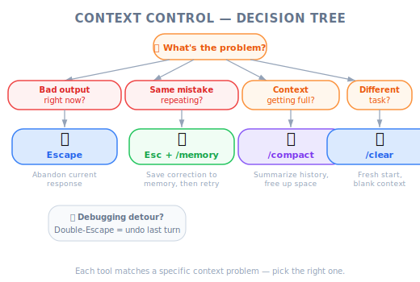

# Controlling Context — PM Perspective

*Figure: Context window as a finite resource — analogy.*

*Figure: Decision tree for choosing context control tools.*

| Item | Details |
|------|---------|
| Exam Coverage | D5 — Reliability & Performance (15%), D3 — Claude Code Configuration & Workflows (20%) |
| Task Statements | 5.1 ★★★ (context preservation), 5.4 ★★ (large codebase context), 3.5 ★★ (iterative refinement) |
| Course Source | claude-code-in-action / 03-context-and-commands / Lesson 10 |

---

## TL;DR

Claude Code has a limited "working memory" (context window). Just like a meeting that goes too long, the conversation accumulates noise and Claude loses focus. Four tools manage this: **Escape** (interrupt), **Double-Escape** (rewind), **`/compact`** (summarize and continue), and **`/clear`** (fresh start). PMs need to understand this because context management directly affects developer productivity and AI output quality — which impacts sprint velocity and product timelines.

---

## Why PMs Need to Know This

You do not need to manage context yourself, but you need to understand:

1. **Why "just ask Claude again" is not free** — every interaction costs tokens and context space
2. **Why long coding sessions produce worse results** — context pollution is a real engineering constraint
3. **How to set realistic expectations** — a 2-hour Claude session is not linearly productive

This knowledge helps you plan sprints, estimate effort, and communicate with engineering about AI-assisted development.

---

## Mental Model: The Meeting Room Whiteboard

| Tool | Whiteboard Analogy | When to Use |
|------|-------------------|-------------|
| **Escape** | "Wait, stop writing — let me clarify" | Someone is going the wrong direction |
| **Double-Escape** | Erase the last 3 items and restart from a good point | A tangent derailed the meeting |
| **`/compact`** | Take a photo of the whiteboard, erase it, paste the photo as a small reference | Whiteboard is full but insights are valuable |
| **`/clear`** | Wipe the board completely for a new topic | Switching to an entirely different meeting agenda |

> [!TIP]
> **PM Decision Framework**
>
> Ask yourself: "Does the AI still need what it learned, or is it starting something unrelated?"
> - Needs prior knowledge → **`/compact`**
> - Clean slate is better → **`/clear`**

---

## Product Scenario Walkthrough

### Scenario: Sprint Planning for AI-Assisted Development

Your engineering team uses Claude Code daily. A senior engineer reports: "Claude works great for the first 20 minutes, then starts making weird mistakes." Here is what is happening and what you can recommend:

| Symptom | Root Cause | Recommendation |
|---------|-----------|----------------|
| Claude repeats fixed bugs | Debugging noise filled the context window | Use `/compact` between subtasks |
| Claude forgets project conventions | Earlier instructions fell out of the context | Save conventions as memories or in CLAUDE.md |
| Claude modifies wrong files | Irrelevant context from a previous task | Use `/clear` when switching features |
| Claude's output quality degrades over time | Context window is saturated with low-signal content | Train team to use Escape + rewind proactively |

> [!IMPORTANT]
> **PM Takeaway**
>
> Context management is a **developer skill** that should be part of your team's AI onboarding. Teams that actively manage context report significantly better results from AI coding assistants.

---

## The Four Tools — What PMs Need to Know

### Escape — "Stop and Redirect"

When Claude is heading in the wrong direction, the developer presses Escape to stop it mid-output. This saves tokens and prevents bad output from polluting the context.

**PM relevance**: This is why "Claude went off on a tangent for 10 minutes" is a training issue, not a Claude issue. Developers should be interrupting early.

### Double-Escape — "Undo the Last Few Steps"

Pressing Escape twice lets the developer rewind the conversation to any previous message. Everything after that point is discarded.

**PM relevance**: This is the equivalent of "let's go back to what was working and try a different approach." It preserves useful context while removing the failed attempt.

### `/compact` — "Summarize and Continue"

Compresses the entire conversation into a summary. Claude retains what it learned but in condensed form.

**PM relevance**: This is the tool that enables long productive sessions. Without it, sessions degrade after 20-30 minutes. With it, developers can maintain productive AI sessions for hours.

### `/clear` — "Start Fresh"

Wipes everything. Claude begins with zero context.

**PM relevance**: Essential when switching between unrelated tasks. Using leftover context from one feature while working on another causes cross-contamination.

---

## Instructor Insights (From the Video)

Key points PMs should note from the video demonstration:

1. **Context management is proactive, not reactive** — The instructor uses these tools _before_ Claude shows problems, not after. This is a best practice the team should adopt.
2. **The Escape + Memory combo** — When Claude makes a recurring mistake, the instructor presses Escape and saves a memory. This is a permanent fix, not a per-session workaround. Encourage your team to build up memories over time.
3. **"Conversation control shortcuts seem like convenience, but they really improve Claude's ability to work effectively"** — The instructor's own words. These are not nice-to-haves; they are essential workflow tools.

---

## Practice Questions

### Question 1: Developer Productivity Scenario

Your team has been using Claude Code for two months. During a retro, engineers report that Claude works well for small tasks but struggles during longer feature implementation sessions (1+ hours). Several engineers mention that Claude "forgets" earlier decisions and starts contradicting itself. What team-level recommendation would improve this?

- A. Switch to a model with a larger context window
- B. Train the team to use `/compact` between subtasks and `/clear` when switching features
- C. Limit Claude Code sessions to 15 minutes maximum
- D. Add all project documentation to CLAUDE.md so Claude never forgets

Answer and Explanation

**B** — The root cause is context pollution during long sessions. Teaching the team proper context management tools addresses the actual problem. This is an exam-tested concept under Task 5.1 (context preservation).

- A might help but does not address the fundamental issue of context pollution — a larger window still fills up with noise
- C is overly restrictive and reduces productivity
- D would make CLAUDE.md too large, itself consuming context window space

> [!IMPORTANT]
> **PM Key Takeaway**: Context management is a learnable skill. Include it in your team's AI tooling onboarding.

### Question 2: Code Generation Scenario

A developer has spent 25 minutes with Claude building a complex data pipeline. Claude now understands the schema, transformation rules, and error handling patterns. The developer needs to add a new transformation step but the context window is nearly full. What should they do?

- A. Use `/clear` and re-explain the entire pipeline
- B. Use `/compact` to compress the session, then add the new transformation
- C. Start a new Claude Code session and paste the pipeline code
- D. Continue without context management

Answer and Explanation

**B** — `/compact` preserves Claude's understanding of the pipeline architecture while freeing context space. The accumulated knowledge (schema, transformation patterns, error handling) is exactly the kind of context worth preserving.

- A wastes 25 minutes of accumulated understanding
- C loses context and requires manual re-explanation
- D risks context overflow where Claude loses critical early information

> [!IMPORTANT]
> **PM Key Takeaway**: When a developer says "I had to re-explain everything to Claude," ask if they tried `/compact` first.

