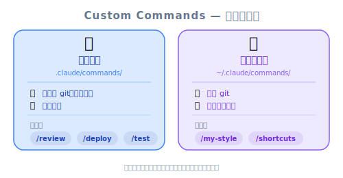
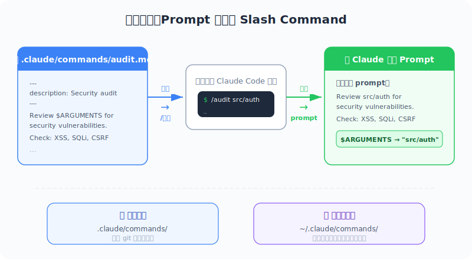
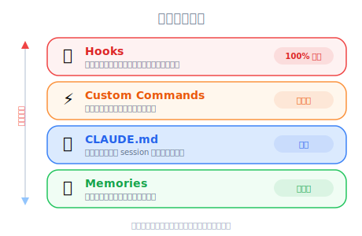

# Custom Commands — 工程师视角



*圖：自訂指令範圍 — 專案 vs 使用者層級。*



*圖：自訂指令 — Markdown 檔案變成 Slash Command。*

| 项目 | 内容 |
|------|------|
| 考试对应 | D3 — Claude Code Configuration & Workflows（占 20%） |
| Task Statements | 3.2 ★★★（custom commands & skills）、3.1 ★★（CLAUDE.md config） |
| 课程来源 | claude-code-in-action / 03-context-and-commands / Lesson 11 |

---

## 一句话理解

Custom commands 就是把可重复使用的 prompt 模板存成 `.claude/commands/` 里的 markdown 文件。用 `$ARGUMENTS` 当动态输入的注入点，让你把常做的工作流程变成一行 slash command。

---

## Custom Commands 怎么运作

Custom commands 用你自己的项目专用快捷方式来扩充 Claude Code 内建的 `/` 命令。机制很简单：

1. 在 `.claude/commands/` 里创建一个 `.md` 文件
2. 文件名就是命令名称（例如 `audit.md` → `/audit`）
3. 文件内容就是送给 Claude 的 prompt
4. 在文件任何地方用 `$ARGUMENTS` 作为运行时输入的 placeholder
5. 重启 Claude Code 才能加载新命令

> 💡 **核心心智模型**
>
> Custom commands 是**有触发器的保存 prompt**，不是脚本。它们不会直接执行代码 — 它们指示 Claude 该做什么。把它们想成 prompt 模板，不是 shell scripts。

---

## 创建你的第一个 Command

### 示例一：Dependency Audit

```
# 文件：.claude/commands/audit.md



*圖：Claude Code 設定階層。*

Review all dependencies installed in this project.
Check for known vulnerabilities and outdated packages.
If any vulnerabilities are found, update the affected packages.
After updating, run the test suite to verify nothing broke.
```

使用方式：`/audit`

### 示例二：Write Tests（带参数）

```
# 文件：.claude/commands/write_tests.md

Write comprehensive tests for $ARGUMENTS.
Follow the existing test patterns in this project.
Run the tests after writing them to make sure they pass.
```

使用方式：`/write_tests src/auth.ts` 或 `/write_tests the validation utilities in src/utils/`

> 🎬 **视频补充**
>
> 讲师特别强调，`$ARGUMENTS` 不限于文件路径。你可以传入任何字符串 — 描述、feature 名称、甚至自然语言指示。Placeholder 就是纯粹的文字替换。

---

## Command 的作用域：Project vs User

| 作用域 | 路径 | 谁看得到 | 是否 commit 到 Git |
|-------|------|---------|-------------------|
| 项目 | `.claude/commands/` | 整个团队 | **是**（committed） |
| 个人 | `~/.claude/commands/` | 只有你自己 | 否 |

> 🎯 **考试重点**
>
> 项目范围的 `.claude/commands/` 是考试关注的重点。它代表**把团队惯例编码为命令** — 这是 D3 的核心考试概念。这遵循 **Architecture > Prompt** 的考试哲学 — 与其告诉每个开发者如何 audit dependencies，不如创建一个编码了流程的 command。

---

## 实用 Command 点子

| 命令 | 用途 | 有参数？ |
|------|------|---------|
| `/audit` | 检查 dependencies 漏洞、更新、跑测试 | 否 |
| `/write_tests` | 为特定文件或模块生成测试 | 是 — 文件路径或描述 |
| `/review` | 检查代码变更的常见问题 | 是 — 文件路径或 PR 号码 |
| `/doc` | 为一个模块生成文档 | 是 — 模块名称 |
| `/migrate` | 为 schema 变更创建数据库 migration | 是 — 变更描述 |
| `/refactor` | 按照项目惯例重构文件 | 是 — 文件路径 |

---

## 工程师类比

| 概念 | 类比 |
|------|------|
| Custom commands | Shell aliases 或 Makefile targets — 常用工作流程的快捷方式 |
| `.claude/commands/` 目录 | `.github/workflows/` — 项目级别的自动化设置 |
| `$ARGUMENTS` | Bash 脚本里的 `$1` — positional parameter 替换 |
| 项目范围的 commands | 提交到 repo 的 ESLint config — 团队共用的惯例 |
| 新增后重启 Claude Code | `source ~/.zshrc` — 重新加载设置以应用变更 |

---

## 反面模式

| 反面模式 | 问题 | 更好的做法 |
|---------|------|-----------|
| 在 commands 里放复杂逻辑 | Commands 是 prompts 不是脚本 — Claude 可能理解有歧义 | 保持 commands 聚焦；用 hooks 处理 deterministic 逻辑 |
| 不把 commands commit 到 repo | 团队成员无法受益于共享的工作流程 | 存在 `.claude/commands/` 并 commit |
| 在 commands 里写死文件路径 | 项目结构变了就坏了 | 用 `$ARGUMENTS` 处理动态路径 |
| 为一次性任务创建 commands | 增加杂乱但没有复用价值 | Commands 是给**可重复**的工作流程用的 |
| 忘记重启 Claude Code | 新 commands 在重启前不会被加载 | 新增/修改 commands 后一定要重启 |

---

## 考试聚焦：Commands vs Hooks vs CLAUDE.md

这是 D3 常考的区分题：

| 机制 | 做什么 | 什么时候用 |
|------|-------|-----------|
| **Custom Commands** | 用 `/name` 触发的可重复 prompt 模板 | 可重复的工作流程（audit、test、review） |
| **CLAUDE.md** | 永远加载的项目指示 | 持久性惯例（coding style、项目结构） |
| **Hooks** | 工具执行的程序化 middleware | Deterministic 强制执行（阻挡写入、自动格式化） |
| **Memories** | 个人的持久笔记 | 个人偏好和修正 |

> 💡 **判断口诀**
>
> - 「每次做 X，我都打同样的长 prompt」→ **Custom command**
> - 「Claude 应该永远知道这个项目的 Y」→ **CLAUDE.md**
> - 「Z 绝对不能发生 / 必须永远发生」→ **Hook**
> - 「Claude 一直对我个人搞错 W」→ **Memory**

核心考试哲学：**Architecture > Prompt** — custom commands 把团队工作流程编码到项目结构中，让它们可发现、可版本控制、一致。

---

## 模拟考题

### 第一题：Code Generation 情境

你的团队经常要求 Claude Code 生成 API endpoint 的 boilerplate。每个开发者打的 prompt 略有不同，导致代码 patterns 不一致。标准化这个工作流程的最佳方式是什么？

- A. 把 boilerplate 指示加到 CLAUDE.md
- B. 在 `.claude/commands/endpoint.md` 创建 custom command，用 `$ARGUMENTS` 带入 endpoint 名称
- C. 创建 PreToolUse hook 来强制 boilerplate 结构
- D. 分享一个文本文件，里面放建议的 prompt 让所有开发者复制粘贴

<details><summary>答案与解析</summary>

**B** — Custom command 在团队之间标准化了 prompt，同时允许通过 `$ARGUMENTS` 做动态输入。因为它在 `.claude/commands/` 里，它会被 commit 到 repo，团队所有成员都能用。

- A 对永远开启的惯例可行，但对按需触发的工作流程来说太重了
- C 是用来做 deterministic 强制执行的，不是 prompt 模板化
- D 是手动的而且容易出错 — 开发者会随时间修改它

考试哲学：**Architecture > Prompt** — 把工作流程编码在项目结构里，不要靠口耳相传的知识。
</details>

### 第二题：Developer Productivity 情境

你创建了一个新的 custom command 文件在 `.claude/commands/lint_fix.md`，但在 Claude Code 里打 `/lint_fix` 时，命令没有出现。最可能的原因是什么？

- A. 文件必须命名为 `lint-fix.md`，用连字符而不是下划线
- B. 你需要重启 Claude Code 才能加载新命令
- C. Custom commands 只有在用 `$ARGUMENTS` 时才能运行
- D. 文件必须放在 `~/.claude/commands/` 而不是项目目录

<details><summary>答案与解析</summary>

**B** — Custom commands 在启动时加载。创建或修改 command 文件后，你必须重启 Claude Code 才会出现在命令列表里。

- A 不正确 — 下划线在 command 名称中可以正常使用
- C 不正确 — `$ARGUMENTS` 是可选的
- D 不正确 — `.claude/commands/`（项目范围）是有效的，而且是团队共享 commands 的建议位置

这是一个实务知识题 — 视频明确提到了重启的需求。
</details>
