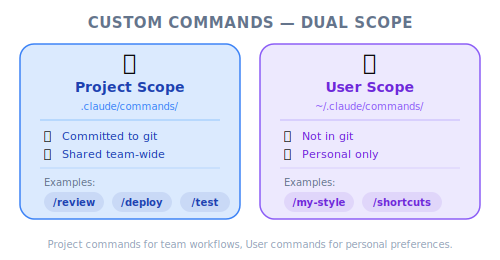
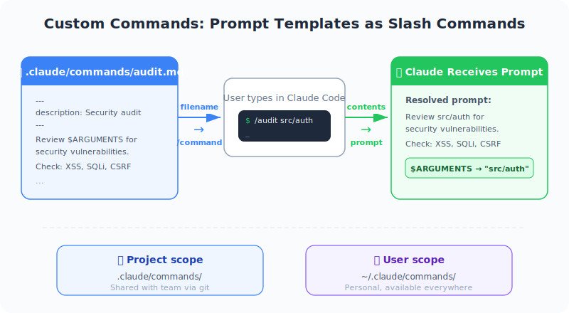
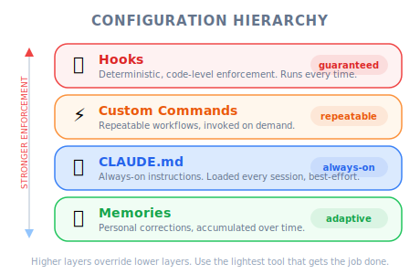

# Custom Commands — PM Perspective

*Figure: Custom commands scope — project vs user level.*

*Figure: Custom commands — markdown files become slash commands.*

| Item | Details |
|------|---------|
| Exam Coverage | D3 — Claude Code Configuration & Workflows (20% of exam) |
| Task Statements | 3.2 ★★★ (custom commands & skills), 3.1 ★★ (CLAUDE.md config) |
| Course Source | claude-code-in-action / 03-context-and-commands / Lesson 11 |

---

## TL;DR

Custom commands are reusable workflow templates that your engineering team can create and share. Instead of each developer writing their own prompt for common tasks (auditing dependencies, writing tests, reviewing code), the team defines a command once in `.claude/commands/` and everyone uses it the same way. PMs should care because this is how you standardize AI-assisted workflows across a team — reducing inconsistency and onboarding friction.

---

## Why PMs Need to Know This

1. **Consistency** — When every developer uses `/audit` instead of their own version of "check my dependencies," the output is predictable
2. **Onboarding** — New team members can type `/` to see all available workflows without reading documentation
3. **Process codification** — Your team's best practices become executable, not just documented
4. **Discoverability** — Commands are visible to the whole team when committed to the repo

---

## Mental Model: Team Playbook

Think of custom commands as a **team playbook** — a shared set of standard operating procedures.

| Without Commands | With Commands |
|-----------------|--------------|
| "How does our team audit dependencies?" — ask a senior dev | Type `/audit` — everyone follows the same process |
| "What's our test-writing convention?" — read documentation | Type `/write_tests src/auth.ts` — convention is built in |
| Each developer's output is slightly different | Standardized output across the team |
| Knowledge lives in people's heads | Knowledge lives in the codebase |

> [!TIP]
> **PM Takeaway**
>
> Custom commands are how you turn tribal knowledge into shared infrastructure. If you hear "only Alice knows how to do X," that workflow should become a command.

---

## How It Works (Non-Technical Summary)

1. A developer creates a markdown file in the project's `.claude/commands/` folder
2. The filename becomes a slash command (e.g., `audit.md` → `/audit`)
3. The file contains instructions for Claude — what to check, what to do, how to respond
4. The special placeholder `$ARGUMENTS` lets users pass in specific details when running the command
5. The file is committed to the repo, so the whole team has access

**Example**: `/write_tests src/auth.ts` tells Claude: "Write tests for `src/auth.ts` following our project's test patterns."

---

## Product Scenario Walkthrough

### Scenario: Standardizing Code Quality Across a Growing Team

*Figure: Claude Code configuration hierarchy.*

Your team grew from 3 to 8 engineers in two months. You notice:
- Code review comments are repetitive ("you forgot to add tests," "wrong import pattern")
- New engineers take a week to learn project conventions
- AI-generated code quality varies widely between developers

| Problem | Command Solution | Impact |
|---------|-----------------|--------|
| Inconsistent test patterns | `/write_tests $ARGUMENTS` — encodes test conventions | All AI-generated tests follow the same structure |
| Forgotten dependency audits | `/audit` — runs full audit + fix + test cycle | One-click compliance check |
| Varying code review quality | `/review $ARGUMENTS` — standardized review checklist | Consistent review output |
| Slow onboarding | New devs type `/` to see all team workflows | Self-service discoverability |

> [!IMPORTANT]
> **PM Takeaway**
>
> When planning AI-assisted development workflows, ask engineering: "Which repetitive tasks should become custom commands?" This is a low-effort, high-impact improvement.

---

## Commands vs Other Configuration

PMs often confuse when to use which tool. Here is the practical distinction:

| Tool | Analogy | When PM Should Request It |
|------|---------|--------------------------|
| **Custom Commands** | SOP playbook | "Every developer should follow the same process for X" |
| **CLAUDE.md** | Project README for Claude | "Claude should always know Y about our project" |
| **Hooks** | Automated compliance check | "Z must never happen — we need a guarantee" |
| **Memories** | Personal sticky notes | Individual preference — PM does not manage this |

---

## Instructor Insights (From the Video)

1. **Commands are markdown files** — No programming required. A PM could draft a command template and hand it to engineering for review.
2. **`$ARGUMENTS` accepts any text** — Not just file paths. You could create `/estimate $ARGUMENTS` where the argument is a feature description.
3. **Restart required** — After adding new commands, Claude Code must be restarted. Factor this into workflow documentation.

---

## Practice Questions

### Question 1: Developer Productivity Scenario

Your engineering team uses Claude Code but each developer writes their own prompt for common tasks. This leads to inconsistent code quality. As a PM, which recommendation would have the most impact on standardization?

- A. Write detailed CLAUDE.md instructions covering every workflow
- B. Create a set of custom commands in `.claude/commands/` for the most common workflows and commit them to the repo
- C. Send a team email with recommended prompts for each workflow
- D. Configure hooks to enforce code quality standards

Answer and Explanation

**B** — Custom commands codify team workflows into the project structure, making them discoverable, consistent, and versionable. They specifically address the "each developer writes their own prompt" problem.

- A is for persistent project knowledge, not on-demand workflows
- C is manual and will drift over time as people modify prompts
- D is for deterministic enforcement, not workflow standardization

> [!IMPORTANT]
> **PM Key Takeaway**: Commands are the right tool when you want everyone to follow the same process. Hooks are the right tool when you need guarantees.

### Question 2: Code Generation Scenario

A new engineer joins your team and asks "how do I know what AI workflows are available?" What feature of custom commands addresses this?

- A. Custom commands are documented in CLAUDE.md automatically
- B. Typing `/` in Claude Code lists all available commands, including team-defined custom commands
- C. Custom commands send notifications when they are created
- D. Custom commands are only available to the developer who created them

Answer and Explanation

**B** — Custom commands appear in the `/` command menu alongside built-in commands. This makes team workflows self-documenting and discoverable without reading external documentation.

- A is not automatic — CLAUDE.md is a separate file
- C is not a feature of commands
- D is incorrect — project-scoped commands in `.claude/commands/` are available to all team members

> [!IMPORTANT]
> **PM Key Takeaway**: Discoverability is a key benefit of custom commands over shared documents or tribal knowledge.

