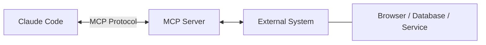
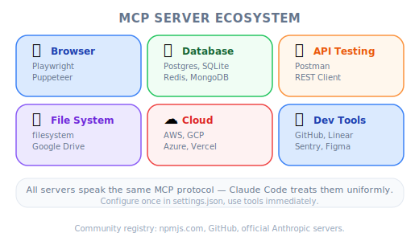
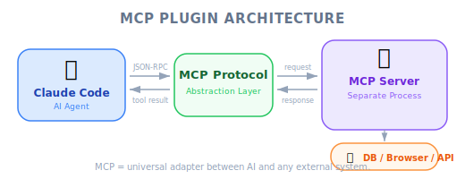
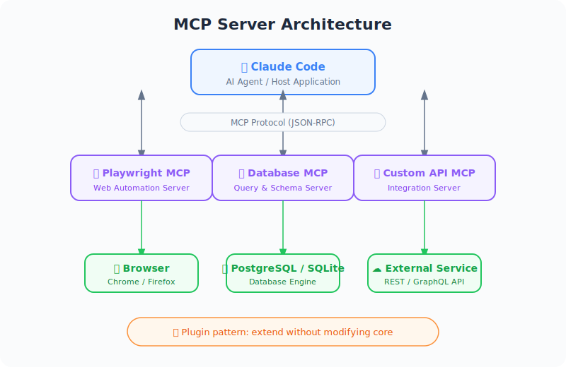

# MCP Servers with Claude Code — Engineering Deep Dive

| Item | Detail |
|------|--------|
| Exam Domain | D2 — Tool Use & Integration (18%) |
| Task Statements | 2.4 ★★★ (MCP integration), 2.1 ★★ (tool interfaces), 2.3 ★★ (tool distribution) |
| Source | claude-code-in-action / 04-integrations / Lesson 12 |

---

## One-Liner

MCP (Model Context Protocol) servers are Claude Code's extensibility mechanism — they add new tools without modifying the core, following the same plugin architecture pattern as VS Code extensions or Chrome DevTools Protocol.

---

## How MCP Servers Work

MCP servers run either **remotely** or **locally** on your machine. They expose tools that Claude Code can discover and invoke at runtime.



Key insight: MCP servers extend Claude's capabilities **without modifying Claude Code itself**. This is the plugin pattern — the same philosophy behind VS Code extensions, Webpack plugins, or Kubernetes operators.

---

## Familiar Analogies

| Technology | MCP Server Equivalent | Why It Fits |
|-----------|----------------------|-------------|
| VS Code extensions | MCP servers | Add capabilities without forking the editor |
| Express middleware | MCP tool handlers | Process requests through a standardized interface |
| Chrome DevTools Protocol | Playwright MCP | Control a browser programmatically |
| Kubernetes operators | MCP servers | Extend platform capabilities via a standard API |
| npm packages | MCP server packages | Install via CLI, configure, use |

---

## Installing an MCP Server

The Playwright MCP server is the canonical example from the course. Install it from your terminal (**not** inside Claude Code):

```bash
claude mcp add playwright npx @playwright/mcp@latest
```

This command does two things:
1. **Names** the MCP server `playwright`
2. **Registers** the startup command (`npx @playwright/mcp@latest`) that runs locally

> [!TIP]
> **Key detail**
>
> `claude mcp add` is run in your **terminal**, not inside a Claude Code session. This registers the server in your project's MCP configuration.

---

## Permission Management

When Claude first uses an MCP tool, it asks for permission each time. To pre-approve all tools from a server, edit `.claude/settings.local.json`:

```json
{
  "permissions": {
    "allow": ["mcp__playwright"],
    "deny": []
  }
}
```

> [!WARNING]
> **Double underscores**
>
> The format is `mcp__<server_name>` — note the **two** underscores. This is a frequently tested detail.

The `allow` array accepts glob-like patterns:
- `mcp__playwright` — allow **all** tools from the Playwright server
- `mcp__playwright__browser_click` — allow only a **specific** tool

> [!IMPORTANT]
> **Exam note**
>
> The exam tests the trade-off between blanket `mcp__<server>` allows (convenient but less secure) vs. individual tool permissions (verbose but follows least-privilege). In CI/CD contexts, **explicit per-tool permissions are required** — there is no shortcut (covered in Unit 13).

---

## Practical Example: Visual Feedback Loop

The course demonstrates a powerful use case — using Playwright to create a **visual feedback loop** for UI component generation:

1. Claude opens a browser via Playwright and navigates to `localhost:3000`
2. Claude generates a test component through the app
3. Claude **visually inspects** the result (not just the code)
4. Claude identifies styling issues (e.g., "generic purple-to-blue gradient")
5. Claude updates the generation prompt at `@src/lib/prompts/generation.tsx`
6. Claude generates a new component with the improved prompt
7. Result: significantly better visual output

> [!NOTE]
> **Instructor insight from the video**
>
> The instructor was genuinely surprised by the quality improvement. The key advantage is that Claude can see the **actual visual output**, not just the code. This closes the feedback loop between code generation and visual evaluation — something that was previously only possible with human review.

---

## MCP Server Ecosystem



*Figure: MCP server ecosystem taxonomy.*

Playwright is just one example. The ecosystem includes servers for:

| Category | Examples | Use Case |
|----------|----------|----------|
| Browser automation | Playwright | Visual testing, UI interaction |
| Database | SQLite, PostgreSQL | Query and inspect data |
| API testing | REST clients | Test endpoints programmatically |
| File system | Extended file ops | Advanced file manipulation |
| Cloud services | AWS, GCP integrations | Manage infrastructure |
| Development tools | Linters, formatters | Automated code quality |

---

## Exam Focus: Architecture > Prompt



*Figure: MCP plugin architecture flow.*



*Figure: MCP server architecture — Claude Code ↔ Protocol ↔ Servers ↔ External Systems.*

MCP servers embody the **Architecture > Prompt** exam philosophy:

| Approach | Example | Reliability |
|----------|---------|-------------|
| Prompt: "Please check the browser" | Tell Claude to verify visually | Unreliable — Claude cannot actually see |
| Architecture: Playwright MCP | Give Claude browser tools | Reliable — Claude can interact with real UI |
| Prompt: "Query the database" | Hope Claude has access | Fails if no DB tool exists |
| Architecture: DB MCP server | Provide actual DB tools | Works — Claude has real database access |

> [!TIP]
> **Decision rule**
>
> When the exam asks about extending Claude Code's capabilities, the answer is almost always **MCP server** (architectural extension) over prompt instruction (hoping Claude can do something it structurally cannot).

---

## Anti-Patterns

| Anti-Pattern | Why It Is Wrong | Correct Approach |
|-------------|----------------|-----------------|
| Installing MCP inside a Claude Code session | Must be done from terminal | Use `claude mcp add` in your shell |
| Using `mcp_playwright` (single underscore) | Wrong naming convention | Use `mcp__playwright` (double underscore) |
| Allowing all MCP tools in CI/CD | Security risk, violates least-privilege | List each tool explicitly in `allowed_tools` |
| Relying on prompts for capabilities Claude lacks | Cannot do what it has no tools for | Add an MCP server that provides the capability |

---

## Practice Questions

### Q1: Developer Productivity Scenario

You are building a web application and want Claude Code to be able to visually verify UI changes. Which approach is most effective?

- A. Add instructions to CLAUDE.md asking Claude to imagine what the UI looks like based on the code
- B. Install the Playwright MCP server and configure Claude to navigate to the running application
- C. Take screenshots manually and paste them into the Claude Code conversation
- D. Write detailed CSS comments explaining the intended visual appearance

<details><summary>Answer</summary>

**B** — The Playwright MCP server gives Claude actual browser interaction capabilities. Claude can navigate, take screenshots, and evaluate visual output directly.

- A is impossible — Claude cannot "imagine" UI from code with any reliability
- C works but is manual and breaks the automation loop
- D does not give Claude visual access

> [!IMPORTANT]
> Exam philosophy: **Architecture > Prompt** — give Claude the tool, don't ask it to imagine.

</details>

### Q2: Code Generation Scenario

Your team uses Claude Code to generate React components. The generated components consistently have poor styling. What is the best approach to improve quality?

- A. Add more styling examples to the system prompt
- B. Install an MCP server that gives Claude browser access, have it evaluate generated output visually, and update the generation prompt based on actual results
- C. Write a PostToolUse hook that runs a CSS linter after every file write
- D. Create a detailed style guide document and reference it in CLAUDE.md

<details><summary>Answer</summary>

**B** — This creates a visual feedback loop where Claude can see actual results and iteratively improve. This is exactly the workflow demonstrated in the course video.

- A may help but lacks visual verification
- C catches syntax issues but not aesthetic quality
- D provides guidelines but no verification mechanism

> [!IMPORTANT]
> Exam philosophy: **Architecture > Prompt** — structural feedback loops over instructional guidance.

</details>

### Q3: Permission Management Scenario

A developer adds the Playwright MCP server to their project. They want to allow all Playwright tools without permission prompts during local development. Which configuration in `.claude/settings.local.json` is correct?

- A. `"allow": ["playwright"]`
- B. `"allow": ["mcp_playwright"]`
- C. `"allow": ["mcp__playwright"]`
- D. `"allow": ["mcp__playwright__*"]`

<details><summary>Answer</summary>

**C** — The correct format uses double underscores: `mcp__playwright`. This allows all tools from the Playwright server.

- A is missing the `mcp__` prefix
- B uses a single underscore (incorrect)
- D is overly specific — `mcp__playwright` already allows all tools from that server

Key detail: The double underscore convention is a frequently tested exam topic.
</details>
