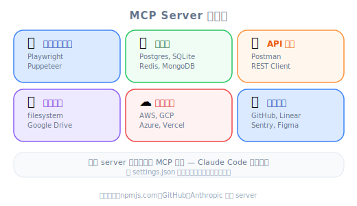
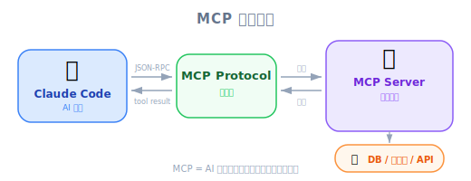
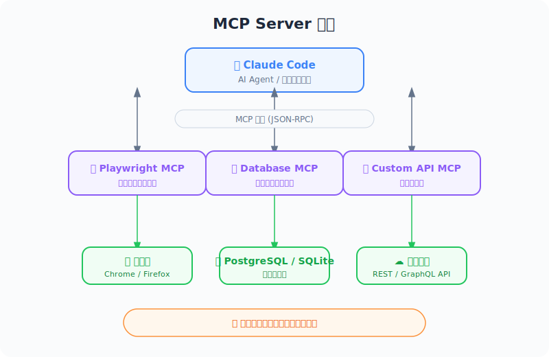

# MCP Servers with Claude Code — 工程师视角



*圖：MCP Server 生態分類。*

| 项目 | 内容 |
|------|------|
| 考试对应 | D2 — Tool Use & Integration（占 18%） |
| Task Statements | 2.4 ★★★（MCP integration）、2.1 ★★（tool interfaces）、2.3 ★★（tool distribution） |
| 课程来源 | claude-code-in-action / 04-integrations / Lesson 12 |

---

## 一句话理解

MCP (Model Context Protocol) server 就是 Claude Code 的 **plugin 架构** — 不改核心就能加新工具，跟 VS Code extension 或 Chrome DevTools Protocol 是同一套思路。

---

## MCP Server 怎么运作

MCP server 可以跑在**远端**或**本地**。它们通过标准化的 protocol 把工具暴露给 Claude Code，让 Claude 在 runtime 动态发现和调用。


重点：MCP server 扩展 Claude 能力的方式是**不修改 Claude Code 本身**。这就是 plugin pattern — VS Code extension、Webpack plugin、Kubernetes operator 都是这套哲学。

---

## 你已经熟悉的类比

| 你用过的技术 | MCP Server 对应 | 为什么像 |
|------------|----------------|---------|
| VS Code extension | MCP server | 不 fork editor 就能加功能 |
| Express middleware | MCP tool handler | 通过标准化接口处理请求 |
| Chrome DevTools Protocol | Playwright MCP | 程序化控制浏览器 |
| Kubernetes operator | MCP server | 通过标准 API 扩展平台能力 |
| npm package | MCP server package | CLI 安装、设置、使用 |

---

## 安装 MCP Server

课程用 Playwright MCP server 做示范。在你的 **terminal** 执行（不是在 Claude Code 里面）：

```bash
claude mcp add playwright npx @playwright/mcp@latest
```

这个命令做两件事：
1. **命名** MCP server 为 `playwright`
2. **注册** 启动命令（`npx @playwright/mcp@latest`），在本地执行

> [!TIP]
> **重要细节**
>
> `claude mcp add` 是在你的 **terminal** 执行，不是在 Claude Code session 里面。这会把 server 注册到项目的 MCP 设置中。

---

## 权限管理

Claude 第一次使用 MCP 工具时，每次都会问你要不要允许。如果觉得烦，可以在 `.claude/settings.local.json` 里预先授权：

```json
{
  "permissions": {
    "allow": ["mcp__playwright"],
    "deny": []
  }
}
```

> [!WARNING]
> **双下划线**
>
> 格式是 `mcp__<server_name>` — 注意是**两个**下划线。这是考试常考的细节。

`allow` 数组支持不同粒度：
- `mcp__playwright` — 允许 Playwright server 的**所有**工具
- `mcp__playwright__browser_click` — 只允许**特定**工具

> [!IMPORTANT]
> **考试重点**
>
> 考试会考 blanket `mcp__<server>` allow（方便但安全性低）vs 逐一列出工具权限（啰嗦但符合 least-privilege）的取舍。在 CI/CD 环境中，**必须逐一列出每个工具** — 没有捷径（Unit 13 会详细讲）。

---

## 实际案例：视觉反馈回路

课程展示了一个强大的用法 — 用 Playwright 建立 UI component 生成的**视觉反馈回路**：

1. Claude 通过 Playwright 打开浏览器，导航到 `localhost:3000`
2. Claude 通过 app 生成一个测试 component
3. Claude **实际看到**视觉结果（不只是看代码）
4. Claude 发现 styling 问题（例如「generic 的紫到蓝渐变」）
5. Claude 更新 `@src/lib/prompts/generation.tsx` 里的生成 prompt
6. Claude 用改善后的 prompt 生成新 component
7. 结果：视觉品质显著提升

> [!NOTE]
> **视频补充**
>
> 讲师对品质提升的程度感到惊讶。关键优势是 Claude 能看到**真实的视觉输出**，不只是代码。这把「代码生成」和「视觉评估」之间的 feedback loop 闭合了 — 以前只有人工 review 才能做到。

---

## MCP Server 生态系

Playwright 只是冰山一角。生态系包括：

| 类别 | 示例 | 用途 |
|------|------|------|
| 浏览器自动化 | Playwright | 视觉测试、UI 交互 |
| 数据库 | SQLite、PostgreSQL | 查询和检查数据 |
| API 测试 | REST clients | 程序化测试 endpoint |
| 文件系统 | 进阶文件操作 | 进阶文件处理 |
| 云端服务 | AWS、GCP 集成 | 管理基础设施 |
| 开发工具 | Linter、formatter | 自动化代码品质 |

---

## 考试必记：Architecture > Prompt



*圖：MCP 外掛架構流程。*



*圖：MCP Server 架構 — Claude Code ↔ 協定 ↔ Server ↔ 外部系統。*

MCP server 体现了 **Architecture > Prompt** 的考试哲学：

| 做法 | 示例 | 可靠性 |
|------|------|--------|
| Prompt: 「请检查浏览器」 | 叫 Claude 去做视觉验证 | 不可靠 — Claude 实际上看不到 |
| Architecture: Playwright MCP | 给 Claude 浏览器工具 | 可靠 — Claude 能跟真实 UI 交互 |
| Prompt: 「查一下数据库」 | 期望 Claude 有 DB 存取 | 没有 DB 工具就会失败 |
| Architecture: DB MCP server | 提供真正的 DB 工具 | 可靠 — Claude 有实际的数据库存取 |

> [!TIP]
> **判断口诀**
>
> 考试问到「如何扩展 Claude Code 的能力」，答案几乎都是 **MCP server**（架构层扩展），而不是 prompt instruction（期望 Claude 做到它结构上做不到的事）。

---

## 常见反模式

| 反模式 | 为什么错 | 正确做法 |
|--------|---------|---------|
| 在 Claude Code session 里安装 MCP | 必须在 terminal 执行 | 在 shell 里用 `claude mcp add` |
| 用 `mcp_playwright`（单下划线） | 命名规范错误 | 用 `mcp__playwright`（双下划线） |
| 在 CI/CD 里允许所有 MCP 工具 | 安全风险，违反 least-privilege | 在 `allowed_tools` 里逐一列出 |
| 靠 prompt 描述 Claude 没有的能力 | 没有工具就做不到 | 加一个有该能力的 MCP server |

---

## 模拟考题

### 第一题：开发者生产力情境

你在开发一个 web 应用，想让 Claude Code 能视觉化验证 UI 变更。最有效的做法是什么？

- A. 在 CLAUDE.md 加指示，请 Claude 根据代码想象 UI 长什么样子
- B. 安装 Playwright MCP server，设置 Claude 导航到正在运行的应用
- C. 手动截图后贴到 Claude Code 对话中
- D. 写详细的 CSS 注释说明预期的视觉效果

<details><summary>答案与解析</summary>

**B** — Playwright MCP server 让 Claude 有实际的浏览器交互能力。Claude 可以导航、截图、直接评估视觉输出。

- A 不可能 — Claude 无法从代码「想象」UI
- C 可行但是手动流程，打破了自动化回路
- D 不能让 Claude 实际看到视觉结果

> [!IMPORTANT]
> 考试哲学：**Architecture > Prompt** — 给 Claude 工具，不要叫它想象。

</details>

### 第二题：Code Generation 情境

你的团队用 Claude Code 生成 React component。生成出来的 component 一直 styling 很差。最佳改善方式是什么？

- A. 在 system prompt 加更多 styling 示例
- B. 安装 MCP server 让 Claude 有浏览器存取，让它视觉化评估生成结果，并根据实际结果更新生成 prompt
- C. 写一个 PostToolUse hook，每次写文件后跑 CSS linter
- D. 建立一份详细的 style guide 文件，在 CLAUDE.md 里引用

<details><summary>答案与解析</summary>

**B** — 这建立了一个视觉反馈回路，Claude 可以看到实际结果并迭代改善。这正是课程视频展示的 workflow。

- A 可能有帮助，但缺乏视觉验证
- C 抓得到语法问题，但抓不到美学品质
- D 提供方针，但没有验证机制

> [!IMPORTANT]
> 考试哲学：**Architecture > Prompt** — 结构化的 feedback loop 胜过指导性的说明。

</details>

### 第三题：权限管理情境

一个开发者在项目里加了 Playwright MCP server。他想在本地开发时允许所有 Playwright 工具，不要每次都问。在 `.claude/settings.local.json` 里正确的设置是哪个？

- A. `"allow": ["playwright"]`
- B. `"allow": ["mcp_playwright"]`
- C. `"allow": ["mcp__playwright"]`
- D. `"allow": ["mcp__playwright__*"]`

<details><summary>答案与解析</summary>

**C** — 正确格式是双下划线：`mcp__playwright`。这会允许 Playwright server 的所有工具。

- A 少了 `mcp__` 前缀
- B 用了单下划线（不正确）
- D 太过具体 — `mcp__playwright` 本身就已经允许该 server 的所有工具

重要细节：双下划线惯例是考试常考的知识点。
</details>
