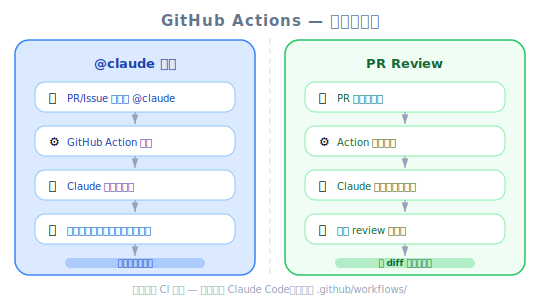
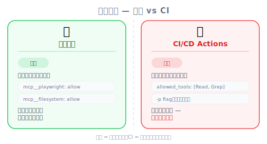

# GitHub Integration — 工程师视角



*圖：GitHub 工作流 — @claude 提及 + PR 審查。*

| 项目 | 内容 |
|------|------|
| 考试对应 | D3 — Claude Code Configuration & Workflows（占 20%） |
| Task Statements | 3.6 ★★★（CI/CD integration）、2.4 ★★（MCP integration）、1.1 ★（agentic loops） |
| 课程来源 | claude-code-in-action / 04-integrations / Lesson 13 |

---



*圖：權限模型 — 本地互動 vs CI 非互動。*

## 一句话理解

Claude Code 的 GitHub 集成提供两个自动化 workflow：`@claude` 提及触发交互式任务（issues/PRs），以及自动 PR review。两者都用 `-p` flag 以非交互模式运行，搭配明确的 `allowed_tools` 权限清单。

---

## 两个预设 Workflow

集成安装后会在 `.github/workflows/` 放两个 workflow 文件：

<!-- diagram: github-integration-workflows — /install-github-app → PR 带 2 个 workflow 文件 → Merge → (1) @claude Mention Action / (2) PR Review Action -->
> 📎 流程图由 nanobanana 产出

### 1. Mention Action（`@claude`）

在 issue 或 PR 留言中提到 `@claude` 就会触发。

| 步骤 | 发生什么事 |
|------|-----------|
| 1. 使用者提及 `@claude` | 「修好 toggle button」附上截图 |
| 2. GitHub Action 启动 | Workflow 启动，建立环境 |
| 3. Claude 分析 | 建立 task checklist，规划方法 |
| 4. Claude 执行 | 存取 codebase、跑工具、测试 app |
| 5. Claude 回报 | 直接在 issue/PR 里贴出结果 |

### 2. PR Review Action

PR 建立时自动触发。

| 步骤 | 发生什么事 |
|------|-----------|
| 1. PR 被开启 | 开发者推送变更 |
| 2. GitHub Action 启动 | Workflow 自动运行 |
| 3. Claude review | 分析变更、检查问题 |
| 4. Claude 回报 | 在 PR 上贴出详细 review |

> 🎬 **视频补充**
>
> 讲师在 demo 中建了一个假的 bug report 附截图，提及 `@claude`，Claude 自动通过 Playwright 导航到 app、测试按钮、确认功能正常、并贴出结果。Claude 执行前先建了一份 step-by-step checklist — 这就是 **agentic loop** 模式（plan → execute → observe → report）。

---

## 设置流程

```bash
# 在 Claude Code 里执行：
/install-github-app
```

三个步骤：
1. 在 GitHub 上安装 Claude Code app
2. 加入 API key
3. 自动生成一个 PR，包含 workflow 文件

Merge 这个 PR 后，`.github/workflows/` 里就会出现两个 workflow 文件。

---

## 自定 Workflow

### 加入项目设置步骤

Claude 运行前可以先准备环境：

```yaml
- name: Project Setup
  run: |
    npm run setup
    npm run dev:daemon
```

### Custom Instructions

提供 Claude 环境的 context：

```yaml
custom_instructions: |
  The project is already set up with all dependencies installed.
  The server is already running at localhost:3000. Logs from it
  are being written to logs.txt. If needed, you can query the
  db with the 'sqlite3' cli. If needed, use the mcp__playwright
  set of tools to launch a browser and interact with the app.
```

> 💡 **重要细节**
>
> Custom instructions 告诉 Claude CI 环境里有什么。因为 Claude 是以非交互模式运行（`-p` flag），它无法自行探索，所以这些指示至关重要。

### MCP Server 设置

在 GitHub Actions 环境设置 MCP server：

```yaml
mcp_config: |
  {
    "mcpServers": {
      "playwright": {
        "command": "npx",
        "args": [
          "@playwright/mcp@latest",
          "--allowed-origins",
          "localhost:3000;cdn.tailwindcss.com;esm.sh"
        ]
      }
    }
  }
```

---

## 工具权限：`-p` Flag 和 `allowed_tools`

这是本单元**最重要的考试概念**。

Claude 在 GitHub Actions 里以 `-p` flag（非交互 / print 模式）运行。这个模式没有人可以核准权限，所以**每个工具都必须明确列出**：

```yaml
allowed_tools: "Bash(npm:*),Bash(sqlite3:*),mcp__playwright__browser_snapshot,mcp__playwright__browser_click,..."
```

> ⚠️ **考试关键细节**
>
> 跟本地开发不同，在 GitHub Actions 里**不能用** `mcp__playwright` 来允许一个 server 的所有工具。每个 MCP 工具都必须逐一列出。讲师原话：「There is no shortcut for permissions like we saw previously.」

| 环境 | 权限方式 | 示例 |
|------|---------|------|
| 本地开发 | 整个 server 允许 | `"allow": ["mcp__playwright"]` |
| GitHub Actions (CI) | 逐一列出工具 | `allowed_tools: "mcp__playwright__browser_click,mcp__playwright__browser_snapshot,..."` |

> 🎯 **考试重点**
>
> `-p` flag 是 Claude 在非交互 CI 模式运行的关键指标。CI/CD 情境题（S5）通常会包含这个 flag。看到 `-p` 就要想到：明确权限、无人核准、需要 `allowed_tools`。

---

## CI 中的 Agentic Loop

Claude 通过 `@claude` 提及运行时，展现了 agentic loop 模式：

1. **Plan** — Claude 建立步骤 checklist（在 GitHub 留言中可见）
2. **Execute** — Claude 执行工具（Bash、Playwright、Read、Write）
3. **Observe** — Claude 评估结果
4. **Report** — Claude 在 issue/PR 回报结果

这是 Task Statement 1.1（agentic loops）在 CI/CD 环境的应用。回路是自主的——步骤之间不需要人工介入。

---

## 你已经熟悉的类比

| 你用过的技术 | GitHub 集成对应 | 行为 |
|------------|----------------|------|
| CI/CD bots（Dependabot、Renovate） | PR Review Action | 自动化 PR 分析 |
| ChatOps（Slack 里的 `/deploy`） | `@claude` mention | 从留言触发 agent |
| Jenkins pipeline agent | GitHub Actions 里的 Claude | 非交互工具执行 |
| 代码品质工具（SonarQube） | PR Review Action | 自动化品质关卡 |

---

## 设置层级

| 层级 | 设置什么 | 在哪里 |
|------|---------|--------|
| Workflow YAML | Claude 何时运行、环境设置 | `.github/workflows/*.yml` |
| `custom_instructions` | Claude 对环境的认知 | Workflow YAML 里面 |
| `mcp_config` | Claude 能存取什么工具 | Workflow YAML 里面 |
| `allowed_tools` | Claude 被允许使用什么 | Workflow YAML 里面 |
| `CLAUDE.md` | 项目层级的指示 | 项目根目录 |

---

## 常见反模式

| 反模式 | 为什么错 | 正确做法 |
|--------|---------|---------|
| 在 CI 里不逐一列出 MCP 工具 | Claude 无法使用未明确允许的工具 | 在 `allowed_tools` 逐一列出 |
| 忘记在 Claude 运行前设置环境 | Claude 找不到正在运行的服务 | 在 Claude action 前加 setup 步骤 |
| 没提供 CI 环境的 `custom_instructions` | Claude 浪费 token 探索有什么可用 | 告诉 Claude 什么已经在运行 |
| 在 CI 里用交互模式 | CI 没有人可以核准权限 | 用 `-p` flag 切非交互模式 |

---

## 模拟考题

### 第一题：CI/CD Pipeline 情境

你的团队想在 GitHub Actions 里加 Claude Code 做自动化 PR review。Claude 需要存取 PostgreSQL 数据库来验证 migration 文件。正确的设置是哪个？

- A. 在 `.claude/settings.local.json` 的 allow list 加 `mcp__postgresql`
- B. 在 workflow YAML 的 `mcp_config` 设置 PostgreSQL MCP server，并在 `allowed_tools` 逐一列出每个 PostgreSQL 工具
- C. 在 `custom_instructions` 写「你可以存取 PostgreSQL」但不设置 MCP server
- D. 在 `mcp_config` 设置 PostgreSQL MCP server，在 `allowed_tools` 用 `mcp__postgresql` 允许所有工具

<details><summary>答案与解析</summary>

**B** — 在 GitHub Actions 里，你必须在 `mcp_config` 设置 MCP server 并在 `allowed_tools` 逐一列出每个工具。CI 里没有 MCP 工具权限的捷径。

- A 设置的是本地设置，不是 CI
- C 告诉 Claude 有 PostgreSQL 但没给实际存取
- D 用了 blanket permission，在 GitHub Actions 里不可用——每个工具都必须逐一列出

考试哲学：CI/CD 环境中 **Explicit Permissions > Blanket Access**。
</details>

### 第二题：开发者生产力情境

开发者想在 GitHub issue 里提及 Claude 时，让 Claude 自动测试 UI 变更。App 跑在 `localhost:3000`。Workflow 设置需要哪些步骤？

- A. 只要加 `@claude` mention 支持——Claude 会自己搞定
- B. 加 setup 步骤启动 dev server、在 `mcp_config` 设置 Playwright MCP、在 `allowed_tools` 列出 Playwright 工具、在 `custom_instructions` 说明已运行的 server
- C. 把 Playwright MCP 加到 `.claude/settings.json` 然后把 app 部署到公开 URL
- D. 在 `custom_instructions` 告诉 Claude 用 `curl` 测试 app

<details><summary>答案与解析</summary>

**B** — 四个组件都需要：环境设置（启动 server）、MCP 设置（给 Claude 浏览器工具）、明确权限（列出每个 Playwright 工具）、custom instructions（告诉 Claude 什么已在运行）。

- A 不够——Claude 在 CI 里需要明确设置
- C 混淆了本地和 CI 设置方式
- D 没有给 Claude 实际的浏览器交互能力

考试哲学：**Architecture > Prompt** — 给 Claude 工具和环境，不要期望它靠 `curl` 搞定。
</details>

### 第三题：CI/CD 自动化情境

你的团队在 GitHub Actions 设置了 Claude Code 做 PR review。工程师发现 Claude 没有使用 Playwright MCP server，尽管已在 `mcp_config` 设置好了。最可能的问题是什么？

- A. Playwright MCP server 跟 GitHub Actions 不兼容
- B. 个别的 Playwright 工具没有在 `allowed_tools` 列出
- C. MCP 设置变更后需要重启 Claude
- D. `custom_instructions` 没有提到 Playwright

<details><summary>答案与解析</summary>

**B** — 在 GitHub Actions 里，在 `mcp_config` 设置 MCP server 不够。该 server 的每个工具都必须在 `allowed_tools` 逐一列出。这是最常见的设置错误。

- A 不正确——Playwright 可以在 GitHub Actions 里使用
- C 不正确——Claude 每次 action 运行都是全新启动
- D 可能有帮助但不是 root cause——工具需要明确权限，不只是指示

考试关键词：`allowed_tools` 是 CI/CD 模式的权限闸门。
</details>
