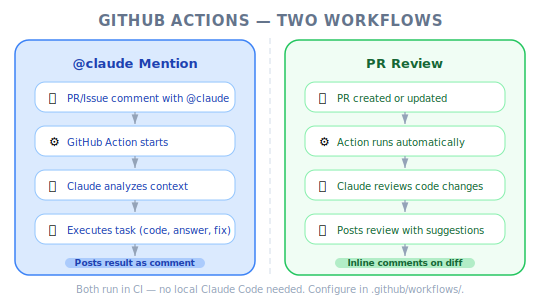
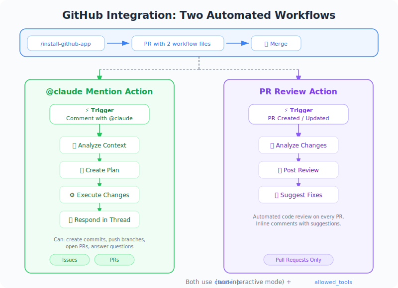
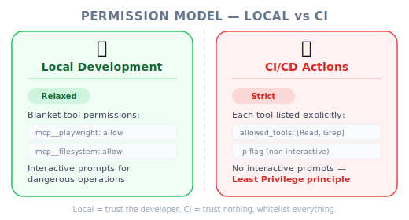

# GitHub Integration — PM Perspective

*Figure: GitHub workflows — @claude mention + PR review.*

*Figure: GitHub integration — two automated workflows.*

| Item | Details |
|------|---------|
| Exam Coverage | D3 — Claude Code Configuration & Workflows (20% of exam) |
| Task Statements | 3.6 ★★★ (CI/CD integration), 2.4 ★★ (MCP integration), 1.1 ★ (agentic loops) |
| Course Source | claude-code-in-action / 04-integrations / Lesson 13 |

---

## TL;DR

Claude Code's GitHub integration turns Claude into an automated team member that lives inside your GitHub workflow. Two capabilities: (1) `@claude` mention in issues/PRs for interactive task execution, (2) automatic PR review on every pull request. PMs need to understand this because it defines how AI fits into code review and CI/CD processes — and what governance is required around permissions.

---

## Why PMs Need to Understand GitHub Integration

1. **Process automation decisions** — knowing where Claude can replace manual work in code review and issue triage
2. **Quality gate design** — automated PR reviews create a structural quality layer
3. **Permission governance** — CI/CD requires explicit tool permissions (no blanket access)
4. **Team workflow impact** — `@claude` mentions change how developers interact with issues and PRs

---

## Mental Model: Automated Team Member

*Figure: Permission model — local interactive vs CI non-interactive.*

| Role | Human Equivalent | Claude GitHub Integration |
|------|-----------------|--------------------------|
| PR Reviewer | Senior engineer reviewing code | PR Review Action — automatic, consistent |
| Issue Responder | On-call engineer triaging bugs | `@claude` mention — instant, autonomous |
| QA Tester | Manual test before merge | Claude + Playwright — automated visual testing |
| Scribe | Engineer documenting findings | Claude posts detailed reports in issues/PRs |

> [!IMPORTANT]
> **Core Exam Philosophy (PMs must remember)**
>
> - **Automated code review catches issues structurally** — it runs every time, not just when someone remembers
> - **`-p` flag = non-interactive mode** — Claude runs without human approval, so permissions must be explicit
> - **Architecture > Prompt** — structural CI integration over asking developers to remember to review

---

## Two Workflows: What They Do

### 1. `@claude` Mention — Interactive Task Execution

Anyone can mention `@claude` in an issue or PR comment to trigger Claude. Claude will:
- Analyze the request
- Create a step-by-step plan (visible in the comment)
- Execute the plan (run code, test the app, read files)
- Report results back in the issue/PR

**PM Use Case**: Bug triage — a QA engineer screenshots a bug, mentions `@claude`, and Claude investigates, tests, and reports findings without developer involvement.

### 2. PR Review — Automatic Code Review

Every PR automatically triggers Claude to review the changes. Claude:
- Analyzes the diff
- Checks for potential issues
- Posts a structured review

**PM Use Case**: Quality gate — every PR gets a baseline review regardless of team availability. This catches structural issues that humans might miss under time pressure.

> [!TIP]
> **PM Decision Framework**
>
> Think of these as two different product capabilities:
> - `@claude` mention = **on-demand AI agent** (reactive, user-triggered)
> - PR review = **automated quality gate** (proactive, always-on)

---

## Configuration That PMs Should Understand

You do not need to write YAML, but you should understand what each configuration layer controls:

| Config Layer | What It Does | PM's Concern |
|-------------|-------------|--------------|
| `custom_instructions` | Tells Claude about the CI environment | Ensure Claude knows about your test infrastructure |
| `mcp_config` | Gives Claude access to tools (e.g., Playwright) | Determines what Claude **can** do |
| `allowed_tools` | Controls which tools Claude may use | **Security governance** — each tool explicitly listed |
| Setup steps | Prepares the environment before Claude runs | Ensure the app is running for Claude to test |

> [!TIP]
> **PM Takeaway**
>
> The `allowed_tools` configuration is the permission boundary. In CI/CD, every single tool must be individually listed — there is no "allow all" option. This is a deliberate security design. If your team adds new MCP tools, the `allowed_tools` list must be updated.

---

## Business Impact

| Area | Before GitHub Integration | After GitHub Integration |
|------|--------------------------|-------------------------|
| PR Review Coverage | Depends on reviewer availability | 100% — every PR gets reviewed |
| Bug Triage Response | Hours (wait for dev to investigate) | Minutes (Claude investigates immediately) |
| Code Quality Consistency | Varies by reviewer | Standardized — Claude checks every PR the same way |
| Developer Context Switching | Frequent (review requests interrupt flow) | Reduced — Claude handles first-pass review |

---

## Instructor Insights (From the Video)

1. **Claude creates a visible plan before executing** — When triggered via `@claude`, Claude posts a checklist of steps it will take. This transparency is important for team trust.
2. **End-to-end testing in CI** — The instructor configured Claude to start the app, open a browser via Playwright, and test UI functionality — all within a GitHub Action. This is a complete testing loop.
3. **Explicit permissions are non-negotiable** — The instructor emphasized that in GitHub Actions, every MCP tool must be individually listed. There is no shortcut. This is the most important configuration detail for CI/CD.

---

## Practice Questions

### Question 1: CI/CD Pipeline Scenario

Your team wants to add automated PR reviews using Claude Code in GitHub Actions. Engineers ask whether they can use the same permission configuration as local development (`mcp__playwright` in `.claude/settings.local.json`). What do you tell them?

- A. Yes, the same configuration works in CI
- B. No — in GitHub Actions, each tool must be individually listed in `allowed_tools`. The blanket server-level permission is not available in CI mode
- C. No — MCP servers cannot be used in GitHub Actions
- D. Yes, but they need to add `mcp__playwright` to `.claude/settings.json` (project shared) instead

Answer and Explanation

**B** — In GitHub Actions (non-interactive mode with `-p` flag), each MCP tool must be individually listed in `allowed_tools`. The blanket `mcp__playwright` permission from local `.claude/settings.local.json` does not apply.

- A incorrectly assumes CI and local use the same permission model
- C is wrong — MCP servers work in CI, just with stricter permissions
- D confuses settings file scope with CI permission requirements

> [!IMPORTANT]
> **PM Key Takeaway**: When planning CI/CD integration, factor in the explicit permission requirement. Each new MCP tool added to the workflow requires an update to `allowed_tools`.

### Question 2: Developer Productivity Scenario

Your QA team reports bugs by creating GitHub issues with screenshots. Currently, a developer must manually investigate each bug. How can Claude Code's GitHub integration help?

- A. Add `@claude` mention support so QA can trigger Claude to investigate bugs directly from the issue, complete with browser testing via Playwright
- B. Set up automatic PR review to catch bugs before they reach QA
- C. Add Claude's findings to CLAUDE.md so developers know about common bugs
- D. Configure a PreToolUse hook to prevent bugs from being introduced

Answer and Explanation

**A** — The `@claude` mention workflow is designed exactly for this use case. QA can post a screenshot, mention `@claude`, and Claude will investigate — navigating to the app, testing functionality, and reporting findings directly in the issue.

- B is preventive but does not address existing bug triage
- C is documentation, not automation
- D is a development-time control, not a QA workflow

> [!IMPORTANT]
> **PM Key Takeaway**: `@claude` mention transforms bug triage from a developer-blocking activity into an AI-automated workflow. QA gets faster responses, developers get fewer interruptions.

### Question 3: Code Quality Scenario

Your team has set up Claude Code PR reviews in GitHub Actions. Engineers want Claude to also access Playwright to visually verify UI changes during review. What configuration changes are needed?

- A. Add Playwright to `mcp_config` — Claude will automatically have access
- B. Add Playwright to `mcp_config`, add a setup step to start the dev server, list each Playwright tool in `allowed_tools`, and add `custom_instructions` explaining the running environment
- C. Install Playwright MCP locally on the CI runner and add `mcp__playwright` to the allow list
- D. Add "please use Playwright to test UI changes" to `custom_instructions`

Answer and Explanation

**B** — All four configuration layers are required: MCP config (server definition), setup steps (start the app), `allowed_tools` (explicit per-tool permissions), and `custom_instructions` (tell Claude what is available).

- A is incomplete — tools must also be listed in `allowed_tools`
- C mixes local installation with CI — wrong approach
- D gives instructions without actual tool access

> [!IMPORTANT]
> **PM Key Takeaway**: CI/CD integration requires all four configuration layers working together. Missing any one will cause Claude to either lack access or waste tokens trying to discover what is available.

