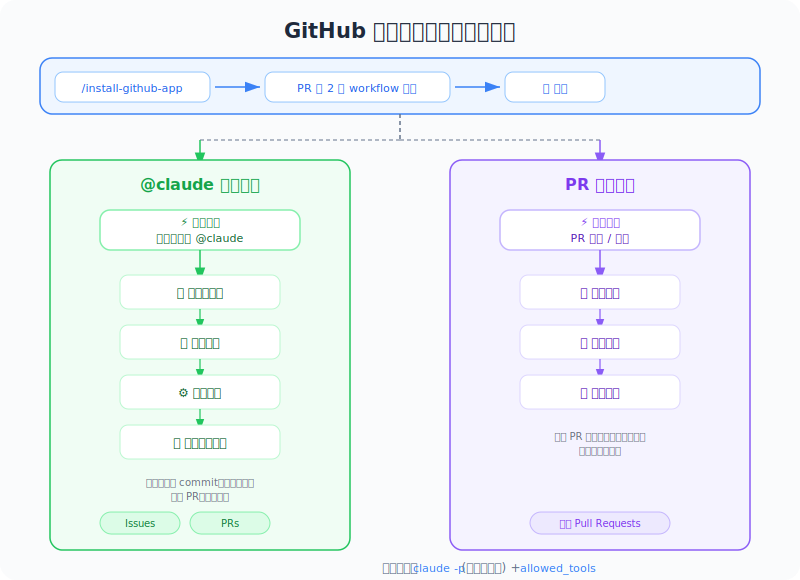

# GitHub Integration — PM 視角

*圖：GitHub 工作流 — @claude 提及 + PR 審查。*

*圖：GitHub 整合 — 兩個自動化工作流。*

| 項目 | 內容 |
|------|------|
| 考試對應 | D3 — Claude Code Configuration & Workflows（佔 20%） |
| Task Statements | 3.6 ★★★（CI/CD integration）、2.4 ★★（MCP integration）、1.1 ★（agentic loops） |
| 課程來源 | claude-code-in-action / 04-integrations / Lesson 13 |

---

## TL;DR

Claude Code 的 GitHub 整合把 Claude 變成住在你 GitHub workflow 裡的自動化團隊成員。兩個能力：(1) 在 issue/PR 裡 `@claude` 提及觸發互動式任務執行，(2) 每個 PR 自動 review。PM 需要理解這個，因為它定義了 AI 如何融入 code review 和 CI/CD 流程 — 以及權限治理該怎麼做。

---

## Mental Model: 自動化團隊成員

*圖：權限模型 — 本地互動 vs CI 非互動。*

| 角色 | 人類對應 | Claude GitHub 整合 |
|------|---------|-------------------|
| PR Reviewer | 資深工程師 review 程式碼 | PR Review Action — 自動、一致 |
| Issue Responder | On-call 工程師 triage bug | `@claude` mention — 即時、自主 |
| QA Tester | Merge 前手動測試 | Claude + Playwright — 自動化視覺測試 |
| 記錄者 | 工程師記錄調查結果 | Claude 在 issue/PR 貼出詳細報告 |

> [!IMPORTANT]
> **考試核心哲學（PM 必記）**
>
> - **自動化 code review 是結構性地抓問題** — 每次都跑，不是靠人記得
> - **`-p` flag = 非互動模式** — Claude 不需人工核准就運行，所以權限必須明確
> - **Architecture > Prompt** — 結構化的 CI 整合勝過叫開發者記得去 review

---

## 兩個 Workflow：做什麼

### 1. `@claude` Mention — 互動式任務執行

任何人都可以在 issue 或 PR 留言中提及 `@claude` 來觸發 Claude。

**PM 應用場景**：Bug triage — QA 工程師截圖一個 bug，提及 `@claude`，Claude 調查、測試、回報，不需要開發者介入。

### 2. PR Review — 自動 Code Review

每個 PR 自動觸發 Claude review 變更。

**PM 應用場景**：品質關卡 — 不管團隊忙不忙，每個 PR 都有基本 review。

> [!TIP]
> **PM 決策框架**
>
> 把這兩個想成不同的產品能力：
> - `@claude` mention = **隨需 AI agent**（reactive，使用者觸發）
> - PR review = **自動化品質關卡**（proactive，always-on）

---

## PM 該理解的設定

| 設定層 | 做什麼 | PM 該關心的 |
|--------|--------|-----------|
| `custom_instructions` | 告訴 Claude CI 環境的資訊 | 確保 Claude 知道你的測試基礎設施 |
| `mcp_config` | 給 Claude 存取工具（例如 Playwright） | 決定 Claude **能做什麼** |
| `allowed_tools` | 控制 Claude 可以使用哪些工具 | **安全治理** — 每個工具明確列出 |
| Setup 步驟 | 在 Claude 運行前準備環境 | 確保 app 已啟動讓 Claude 測試 |

> [!TIP]
> **PM Takeaway**
>
> `allowed_tools` 設定是權限邊界。在 CI/CD 裡，每個工具都必須逐一列出——沒有「允許全部」的選項。這是刻意的安全設計。

---

## 商業影響

| 面向 | GitHub 整合前 | GitHub 整合後 |
|------|-------------|-------------|
| PR Review 覆蓋率 | 取決於 reviewer 是否有空 | 100% — 每個 PR 都被 review |
| Bug Triage 回應時間 | 數小時（等開發者調查） | 數分鐘（Claude 立即調查） |
| 程式碼品質一致性 | 因 reviewer 而異 | 標準化 — Claude 用同樣方式檢查每個 PR |
| 開發者 context switching | 頻繁（review 請求打斷 flow） | 減少 — Claude 處理第一輪 review |

---

## Instructor Insights（影片補充）

1. **Claude 執行前先建立可見的計畫** — 透過 `@claude` 觸發時，Claude 會在留言中貼出步驟 checklist。這個透明度對建立團隊信任很重要。
2. **CI 裡的端到端測試** — 講師設定 Claude 啟動 app、透過 Playwright 打開瀏覽器、測試 UI 功能——全在 GitHub Action 裡完成。
3. **明確權限是不可妥協的** — 講師強調在 GitHub Actions 裡，每個 MCP 工具都必須逐一列出。沒有捷徑。

---

## Practice Questions

### 第一題：CI/CD Pipeline 情境

你的團隊想在 GitHub Actions 加自動化 PR review。工程師問能不能用跟本地開發一樣的權限設定（`.claude/settings.local.json` 裡的 `mcp__playwright`）。你怎麼回答？

- A. 可以，CI 用同樣的設定
- B. 不行 — 在 GitHub Actions 裡，每個工具必須在 `allowed_tools` 逐一列出。CI 模式沒有 blanket server-level permission
- C. 不行 — MCP server 不能在 GitHub Actions 裡使用
- D. 可以，但要把 `mcp__playwright` 加到 `.claude/settings.json`（project shared）而不是 local

答案與解析

**B** — 在 GitHub Actions（用 `-p` flag 的非互動模式）裡，每個 MCP 工具都必須在 `allowed_tools` 逐一列出。

- A 錯誤假設 CI 和本地用同一套權限模型
- C 錯誤 — MCP server 可以在 CI 裡用，只是權限更嚴格
- D 混淆了 settings 檔案 scope 和 CI 權限需求

> [!IMPORTANT]
> **PM 重點**：規劃 CI/CD 整合時，要考慮明確權限的需求。每加一個新的 MCP 工具到 workflow，`allowed_tools` 都需要更新。

### 第二題：開發者生產力情境

QA 團隊透過建 GitHub issue 附截圖來回報 bug。目前每個 bug 都需要開發者手動調查。Claude Code 的 GitHub 整合怎麼幫忙？

- A. 加 `@claude` mention 支援，讓 QA 可以直接在 issue 裡觸發 Claude 調查 bug，包含透過 Playwright 做瀏覽器測試
- B. 設定自動 PR review 在 bug 到 QA 之前就抓住
- C. 把 Claude 的調查結果加到 CLAUDE.md 讓開發者知道常見 bug
- D. 設定 PreToolUse hook 防止 bug 被引入

答案與解析

**A** — `@claude` mention workflow 正好就是為這個場景設計的。

- B 是預防性的，但沒有解決現有的 bug triage
- C 是文件化，不是自動化
- D 是開發期的控制，不是 QA workflow

> [!IMPORTANT]
> **PM 重點**：`@claude` mention 把 bug triage 從「需要開發者介入的阻塞活動」變成「AI 自動化的 workflow」。

