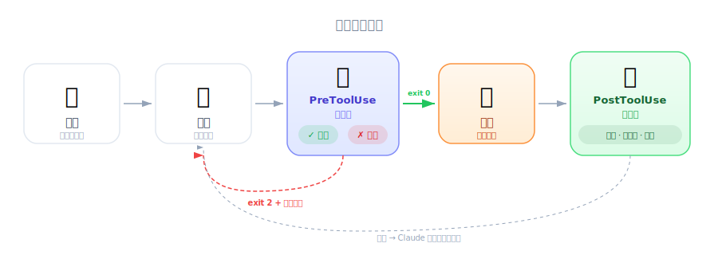
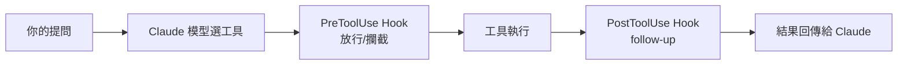
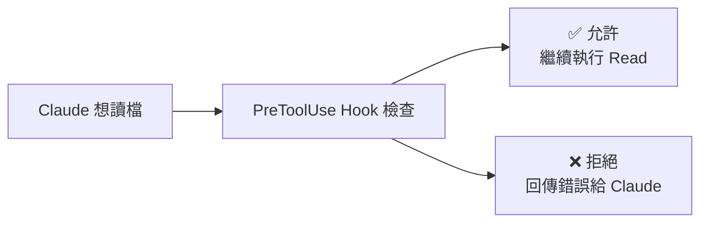
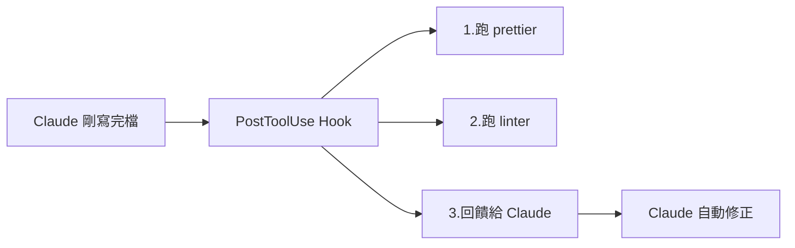

# Introducing Hooks — 工程師視角

| 項目 | 內容 |
|------|------|
| 考試對應 | D3 — Claude Code Configuration & Workflows（佔 20%） |
| Task Statements | 3.2（custom commands & hooks）、1.5（Agent SDK hooks） |
| 課程來源 | claude-code-in-action / 05-hooks / Lesson 14 |

---

## 一句話理解

Hooks 就是 Claude Code 工具執行 pipeline 上的 **middleware**。你寫過 iOS 的 `URLProtocol` 攔截器嗎？或者用過 Express 的 middleware？Hook 就是同一件事——在 tool 執行前後插入你自己的邏輯。

---

## 工具執行流程



*圖：Claude Code 如何處理工具呼叫 — 模型提出請求，系統透過 Hook 攔截，再執行。*

當你對 Claude Code 說話，背後發生的事情如下：



> [!NOTE]
> 流程圖由 nanobanana 產出

重點：Hook 插在**工具執行的前後**，不是插在 Claude 思考的前後。

---

## 你已經熟悉的類比

| 你用過的技術 | 對應的 Hook 概念 | 行為 |
|------------|----------------|------|
| iOS `URLProtocol` 攔截 request | PreToolUse Hook | 檢查 request，決定放行或攔截 |
| Express `app.use()` middleware | PreToolUse Hook | 在 handler 之前執行驗證邏輯 |
| iOS `URLSession` delegate `didReceive` | PostToolUse Hook | response 回來後做後處理 |
| Git `pre-commit` hook | PreToolUse Hook | commit 前跑 lint，不過就擋下 |
| Git `post-commit` hook | PostToolUse Hook | commit 後觸發 CI/通知 |
| Muse 的 `workflow-gate` | PreToolUse 概念 | 寫 code 前先檢查 issue/branch |

如果你理解 Git hooks，那 Claude Code hooks 就是同一套概念搬到 AI 工具上。

---

## 兩種 Hook

### 1. PreToolUse — 事前攔截器


*圖：.env 檔案守衛資料流 — PreToolUse 攔截 Read 呼叫，阻擋敏感檔案存取。*

工具執行**之前**觸發。**可以阻止操作**。



> [!NOTE]
> 流程圖由 nanobanana 產出

設定方式：

```json
"PreToolUse": [
  {
    "matcher": "Read",
    "hooks": [
      {
        "type": "command",
        "command": "node /home/hooks/read_hook.ts"
      }
    ]
  }
]
```

`matcher` 就是 pattern matching — 指定要攔截哪個工具。這裡是只攔截 `Read`。

> [!TIP]
> **什麼時候該用 PreToolUse？**
>
> 當操作**絕對不能發生**的時候。比如：
> - 禁止 Claude 讀取 `.env` 或 credentials 文件
> - 禁止修改 `migrations/` 目錄
> - 退款超過 $500 必須轉人工
>
> 考試的核心思維是：**需要 100% 保證的事，用 hook（deterministic）；「盡量」就好的事，用 prompt（probabilistic）**。

### 2. PostToolUse — 事後處理器


*圖：自我修正回饋迴路 — Claude 嘗試、Hook 攔截並說明原因、Claude 自動調整做法。*

工具執行**之後**觸發。**不能阻止**（已經發生了），但可以：



> [!NOTE]
> 流程圖由 nanobanana 產出

設定方式：

```json
"PostToolUse": [
  {
    "matcher": "Write|Edit|MultiEdit",
    "hooks": [
      {
        "type": "command",
        "command": "node /home/hooks/edit_hook.ts"
      }
    ]
  }
]
```

注意 matcher 可以用 `|` 匹配多個工具，就像 regex 的 OR。

> [!NOTE]
> **影片補充**
>
> 講師特別強調，PostToolUse hook 回傳的訊息會**直接進入 Claude 的 context**。也就是說，如果你的 hook 跑 linter 然後回報 "Line 42: unused variable"，Claude 會在下一輪自動修正那個 variable。這是一個 **self-correcting feedback loop**，不需要人介入。

---

## 設定檔的層級

Hook 定義在 Claude 的 settings 文件裡，有三層：

| 層級 | 路徑 | 適用範圍 | 是否 commit 到 Git |
|------|------|----------|-------------------|
| 全域 | `~/.claude/settings.json` | 這台電腦所有專案 | 否 |
| 專案（共用） | `.claude/settings.json` | 整個團隊 | **是** |
| 專案（個人） | `.claude/settings.local.json` | 只有你自己 | 否（gitignore） |

你也可以用 `/hooks` 指令在 Claude Code 裡面互動式設定，不用手動改 JSON。

> [!IMPORTANT]
> **考試重點**
>
> Settings hierarchy 的優先順序是考試常考題。記住跟 Git config 一樣的邏輯——越 local 的優先級越高。

---

## 實際應用場景

| 場景 | Hook 類型 | 做什麼 |
|------|----------|--------|
| 自動格式化 | PostToolUse on Write/Edit | 寫完檔案後跑 `prettier` |
| 自動跑測試 | PostToolUse on Write/Edit | 編輯後跑 `npm test` |
| 存取控制 | PreToolUse on Read | 禁止讀取敏感檔案 |
| 程式碼品質 | PostToolUse on Write/Edit | 跑 linter → 回饋給 Claude → 自動修正 |
| 操作日誌 | PostToolUse on all | 記錄 Claude 存取/修改了哪些檔案 |
| 命名規範 | PostToolUse on Write | 檢查新檔案是否符合命名慣例 |

---

## 考試必記：Hook vs Prompt 的選擇

這是考試最愛出的 trade-off 題型，跨 D1 和 D3：

| 情境 | 用 Hook | 用 Prompt | 判斷依據 |
|------|---------|----------|---------|
| 退款超過 $500 必須轉人工 | ✅ | ❌ | 「必須」= deterministic |
| 回覆語氣要友善 | ❌ | ✅ | 偏好 = probabilistic OK |
| 身份驗證後才能做財務操作 | ✅ | ❌ | 合規需求 = 不能有例外 |
| 盡量寫簡短的回覆 | ❌ | ✅ | 「盡量」= best effort |
| 每次編輯後自動格式化 | ✅ | ❌ | 一致性 = 不能漏 |

> [!TIP]
> **判斷口訣**
>
> 題目出現「must / always / guaranteed / compliance」→ Hook。出現「prefer / usually / best practice」→ Prompt。

---

## 模擬考題

### 第一題：CI/CD Pipeline 情境

你的團隊用 Claude Code 做 CI 自動化 PR review。你需要確保 Claude **絕對不會**修改 `migrations/` 目錄裡的檔案。最可靠的方式是什麼？

- A. 在 system prompt 加上指示：「不要修改 migrations 目錄的檔案」
- B. 設定 PreToolUse hook，攔截所有對 `migrations/` 路徑的 Write/Edit 操作
- C. 把 `migrations/` 目錄設成作業系統層級的唯讀權限
- D. 設定 PostToolUse hook，在 Claude 修改 migration 檔案後自動 revert

<details><summary>答案與解析</summary>

**B** — PreToolUse hook 在操作發生前 deterministic 地阻止。

- A 是 prompt-based，有非零失敗率（題目已經暗示「有時候會改到」）
- C 在 OS 層級擋住了，但 Claude 還是會嘗試寫入、浪費 token，而且錯誤訊息對 Claude 不夠明確
- D 是事後補救——damage 已經造成，revert 的複雜度也高於直接 block

考試哲學：**Deterministic > Probabilistic**、**Validation > Trust**
</details>

### 第二題：開發者生產力情境

你希望 Claude Code 每次建立或編輯檔案後，自動跑 `prettier` 格式化。正確的設定是哪個？

- A. PreToolUse hook，matcher 設為 `Write|Edit`，執行 prettier
- B. PostToolUse hook，matcher 設為 `Write|Edit|MultiEdit`，執行 prettier
- C. PostToolUse hook，matcher 設為 `Read`，執行 prettier
- D. PreToolUse hook，matcher 設為 `Bash`，執行 prettier

<details><summary>答案與解析</summary>

**B** — 格式化應該在檔案寫入/編輯**之後**執行（PostToolUse），而且要涵蓋所有編輯類工具（包含 MultiEdit）。

- A 在檔案還沒寫入前跑 formatter，沒東西可以 format
- C 對錯了工具——Read 是讀取，不是編輯
- D 跟檔案編輯無關
</details>

### 第三題：Customer Support Agent 情境

一個 Agent SDK 應用處理客戶退款。公司政策規定：超過 $500 的退款必須轉交給人工客服。該怎麼 enforce 這個規則？

- A. 在 agent 的 system prompt 裡說明 $500 的上限
- B. 用 PostToolUse hook 在退款處理後檢查金額
- C. 用 tool call interception hook 攔截超過 $500 的 `process_refund` 呼叫，改為觸發 `escalate_to_human`
- D. 用 few-shot examples 示範 $500 門檻的正確行為

<details><summary>答案與解析</summary>

**C** — PreToolUse interception 提供 deterministic 的合規保證。

- A 是 probabilistic（prompt 有失敗率）
- B 太遲了——退款已經處理完畢
- D 也不能保證合規

考試哲學：**Deterministic > Probabilistic**、**Architecture > Prompt**
</details>
