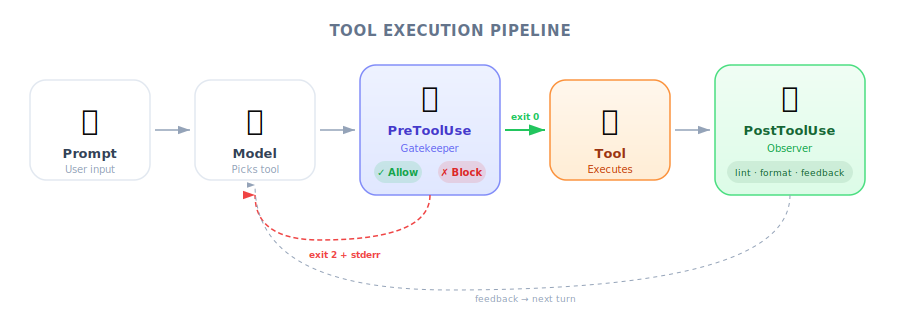

# Introducing Hooks — PM Perspective

| Item | Details |
|------|---------|
| Exam Coverage | D3 — Claude Code Configuration & Workflows (20% of exam) |
| Task Statements | 3.2 (custom commands & hooks), 1.5 (Agent SDK hooks) |
| Course Source | claude-code-in-action / 05-hooks / Lesson 14 |

---

## TL;DR

*Figure: How Claude Code processes tool calls — the model proposes, the system intercepts via hooks, then executes.*

Hooks are Claude Code's "quality control checkpoints" and "automated triggers." Think of them as a business rule engine inside your product: before an AI action, you can intercept and review it (Pre); after an action, you can trigger quality checks (Post). PMs need to understand this mechanism because it determines what AI behaviors can be **guaranteed** vs. what is merely **best-effort**.

---

## Why PMs Need to Understand Hooks

As a PM, you don't need to write hooks yourself, but you do need to know:

1. **What behaviors can be 100% guaranteed** — what hooks can enforce
2. **What behaviors are only best-effort** — what prompt instructions can do
3. **How to communicate requirements to engineers** — knowing when to ask for a hook

This directly affects the acceptance criteria and risk assessments you write in PRDs.

---

## Mental Model: Airport Security vs. In-Flight Announcements

| | PreToolUse Hook | PostToolUse Hook | Prompt Instruction |
|--|----------------|-----------------|-------------------|
| Analogy | Airport security — fail the check, you don't board | Customs on arrival — already landed, but can be inspected | In-flight announcement: "Please fasten your seatbelt" |
| Guarantee Level | **100% certain** to execute | **100% certain** to execute | 95–99% (AI may ignore) |
| Can it block the action? | Yes, can prevent the action | No (already happened), but can clean up | Cannot be guaranteed |
| Use Cases | Compliance, security, access control | Quality checks, formatting, notifications | Style preferences, tone suggestions |

> [!IMPORTANT]
> **Core Exam Philosophy (PMs must remember)**
>
> - **Architecture > Prompt** — If structure can solve it, don't rely on prompting
> - **Deterministic > Probabilistic** — If code can guarantee it, don't rely on AI self-discipline

---

## Product Scenario Walkthrough

### Scenario: Customer Support Agent

You are planning an AI customer support system with the following requirements:

| Requirement | Implementation | Why |
|-------------|---------------|-----|
| Refunds > $500 must go to human review | **PreToolUse hook** — intercept `process_refund`, block and escalate if amount exceeds threshold | Compliance requirement — zero tolerance for slipping through |
| Replies should have a friendly tone | **Prompt instruction** | Preference-based requirement — occasional deviation is acceptable |
| Log every reply to CRM | **PostToolUse hook** — automatically write to CRM after each reply | Process automation — guaranteed to run every time |
| Prioritize self-service options | **Prompt instruction** | Strategic preference — flexibility is acceptable |

> [!TIP]
> **PM Decision Framework**
>
> When writing a PRD, ask yourself: "If the AI gets this behavior wrong 1 out of 100 times, what are the consequences?"
> - Severe consequences (financial loss, compliance violation) → **must use a hook**
> - Minor consequences (slightly off tone, inconsistent formatting) → **prompt instruction is sufficient**

---

## Configuration: Who Controls What

Hooks have three configuration levels — this matters to PMs because it determines **team governance**:

| Level | Who Manages It | Typical Use | PM's Concern |
|-------|---------------|-------------|--------------|
| Global (`~/.claude/settings.json`) | Individual developer | Personal preferences (auto-format) | Cannot control — varies per person |
| Project shared (`.claude/settings.json`) | Tech Lead / Team | Team standards (lint, tests) | **Can require team-wide consistency** |
| Project local (`.claude/settings.local.json`) | Individual | Personal overrides | Cannot enforce |

> [!TIP]
> **PM Takeaway**
>
> If your acceptance criteria requires a hook to be active, make sure it lives at the **Project shared** level — not a personal setting.

---

## Hooks in the Bigger Picture

Hooks appear across multiple exam domains:

| Domain | How Hooks Are Tested |
|--------|---------------------|
| **D1 Agentic Architecture (27%)** | Agent SDK hook mechanism — PostToolUse for data normalization, PreToolUse for policy enforcement |
| **D3 Claude Code Config (20%)** | Settings hierarchy, `/hooks` command, matcher syntax |
| **D5 Reliability (15%)** | Hook as a validation gate to ensure quality between pipeline steps |

---

## Instructor Insights (From the Video)

A few nuances from the instructor's video that PMs should note:

1. **Hooks receive complete tool call details** — Not just "Claude wants to write a file," but "Claude wants to use the Write tool to write `/src/auth.ts` with the following content..." This means hooks can make very granular decisions.
2. **PostToolUse feedback loop** — After receiving hook feedback, Claude automatically self-corrects. No human intervention needed — this is a **self-healing** design.
3. **Instructor's own words: "Wrapping your head around hooks can be really challenging"** — If your engineers need time to understand this concept, that is completely normal.

---

## Practice Questions

### Question 1: Customer Support Scenario

Your AI customer support agent handles returns and refunds. Company policy requires identity verification before any financial operation. This rule is currently enforced through system prompt instructions. A customer has reported receiving a refund without being asked to verify their identity. What is the recommended fix?

- A. Strengthen the system prompt with more forceful language requiring verification
- B. Add few-shot examples demonstrating the correct verification flow
- C. Implement a PreToolUse hook that blocks `process_refund` until `get_customer` returns a verified status
- D. Add a PostToolUse hook that checks whether identity verification occurred after the refund is processed

Answer and Explanation

**C** — Identity verification before a financial operation is a compliance requirement. Prompt-based solutions (A, B) have a non-zero failure rate — the customer report already proves this. PostToolUse (D) is too late — the refund has already been processed. A PreToolUse hook's prerequisite gate is deterministic.

> [!IMPORTANT]
> Exam philosophy: **Deterministic > Probabilistic**, **Validation > Trust**

**PM Key Takeaway**: This is why writing "must verify identity" in a PRD is not enough — you need to specify that the enforcement mechanism is a hook, not a prompt.

### Question 2: Code Review CI Scenario

Your team has integrated Claude Code into a CI pipeline for automated PR review. Engineers have reported that Claude sometimes modifies migration files, causing deployment issues. What would you recommend?

- A. Add "do not modify migration files" to CLAUDE.md
- B. Configure a PreToolUse hook to block Write/Edit operations on the `migrations/` directory
- C. Configure a PostToolUse hook to revert changes after Claude modifies a migration file
- D. Create a separate review pipeline that excludes migration files from Claude's view

Answer and Explanation

**B** — A PreToolUse hook deterministically prevents the problem before it occurs. A is prompt-based (unreliable for high-severity scenarios). C is after-the-fact remediation that adds complexity. D removes valuable context that Claude may need to review migration-related code.

**PM Key Takeaway**: "Sometimes" = you need a deterministic solution. Tone occasionally off → prompt is fine; modifying migrations causing deployment issues → severe consequence → use a hook.

### Question 3: Multi-Agent Research Scenario

A coordinator agent distributes research tasks to multiple subagents. Different backend APIs return dates in different formats (Unix timestamp, ISO 8601, locale-specific string). The synthesis subagent frequently misinterprets dates. What is the best approach?

- A. Add date format instructions to the synthesis subagent's prompt
- B. Implement a PostToolUse hook on each backend tool to normalize all dates to ISO 8601 before the agent processes the results
- C. Have the coordinator agent convert dates before passing results to the synthesis subagent
- D. Use few-shot examples to demonstrate the different date formats

Answer and Explanation

**B** — PostToolUse hooks perform data normalization at the tool boundary, making this the most reliable and maintainable solution. A and D are probabilistic. C increases the coordinator's complexity and requires it to understand all possible date formats.

> [!IMPORTANT]
> Exam philosophy: **Architecture > Prompt**, **Deterministic > Probabilistic**

**PM Key Takeaway**: Data normalization is an infrastructure-level concern — it should not depend on AI "understanding" different formats. Just as you would not rely on the frontend to convert date formats in a data pipeline, don't rely on AI to do it here.

