# Introducing Hooks — 介紹 Hooks — 影片逐幀學習指南

| 項目 | 內容 |
|------|------|
| 課程 | claude-code-in-action / 05-hooks / Lesson 14 |
| 影片 | Introducing Hooks |
| 字幕數 | 58 段 |
| 格式 | 每段字幕一張截圖 + 雙語字幕（英/中） |

---

### [00:00:00] 第 1 段

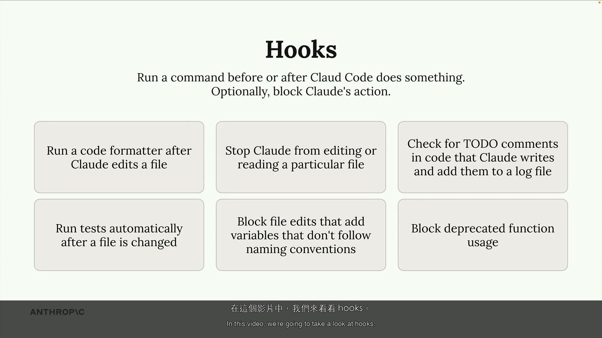

> **EN:** In this video, we're going to take a look at hooks.
>
> **ZH:** 在這個影片中，我們來看看 hooks。

---

### [00:00:03] 第 2 段

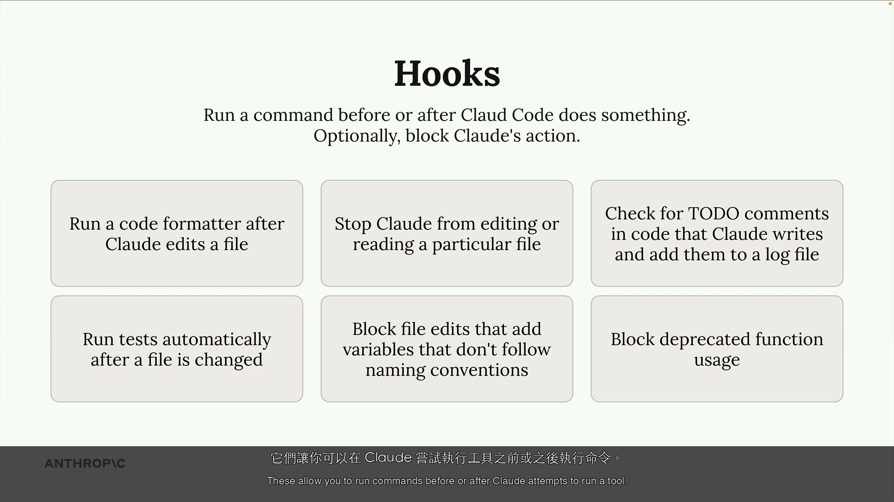

> **EN:** These allow you to run commands before or after Claude attempts to run a tool.
>
> **ZH:** 它們讓你可以在 Claude 嘗試執行工具之前或之後執行命令。

---

### [00:00:08] 第 3 段

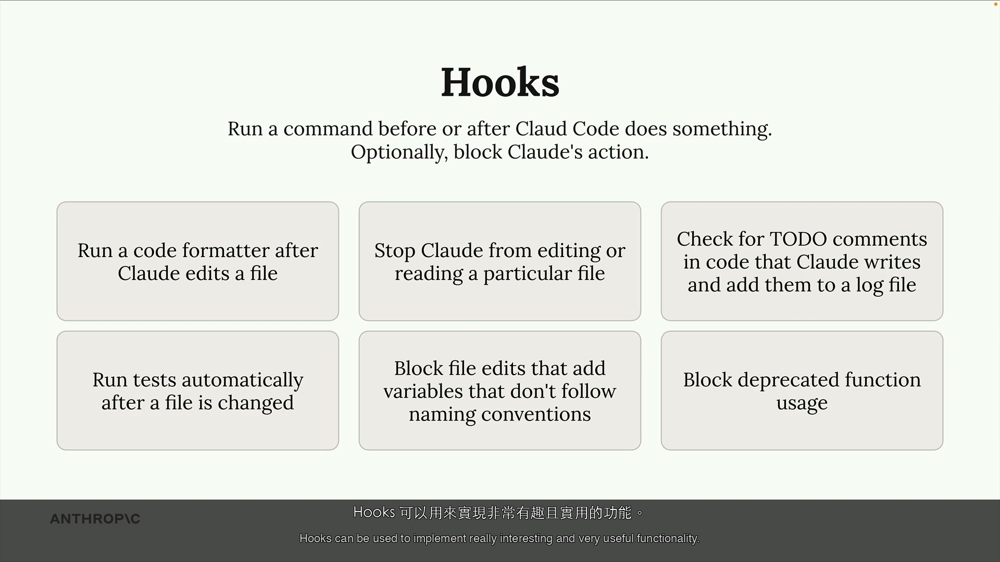

> **EN:** Hooks can be used to implement really interesting and very useful functionality.
>
> **ZH:** Hooks 可以用來實現非常有趣且實用的功能。

---

### [00:00:12] 第 4 段

> **EN:** For example, after Claude decides to write a file, you can automatically run a code formatter
>
> **ZH:** 例如，在 Claude 決定寫入檔案後，你可以自動執行程式碼格式化工具

---

### [00:00:17] 第 5 段

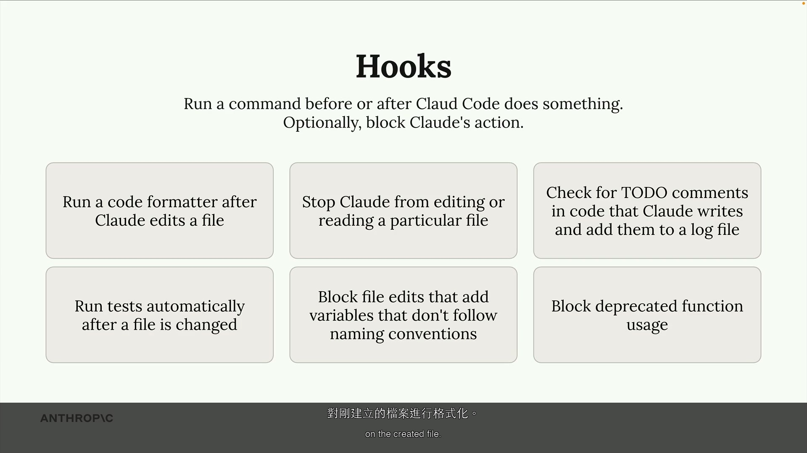

> **EN:** on the created file.
>
> **ZH:** 對剛建立的檔案進行格式化。

---

### [00:00:19] 第 6 段

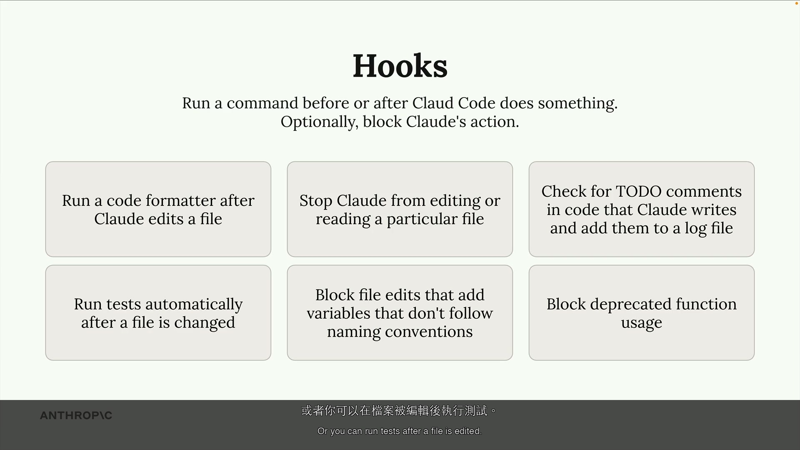

> **EN:** Or you can run tests after a file is edited.
>
> **ZH:** 或者你可以在檔案被編輯後執行測試。

---

### [00:00:22] 第 7 段

> **EN:** Or you can block Claude from reading particular files.
>
> **ZH:** 或者你可以阻止 Claude 讀取特定檔案。

---

### [00:00:25] 第 8 段

> **EN:** The possibilities are really endless, and I've got a couple of good examples lined up
>
> **ZH:** 可能性真的是無窮的，我準備了幾個好例子

---

### [00:00:29] 第 9 段

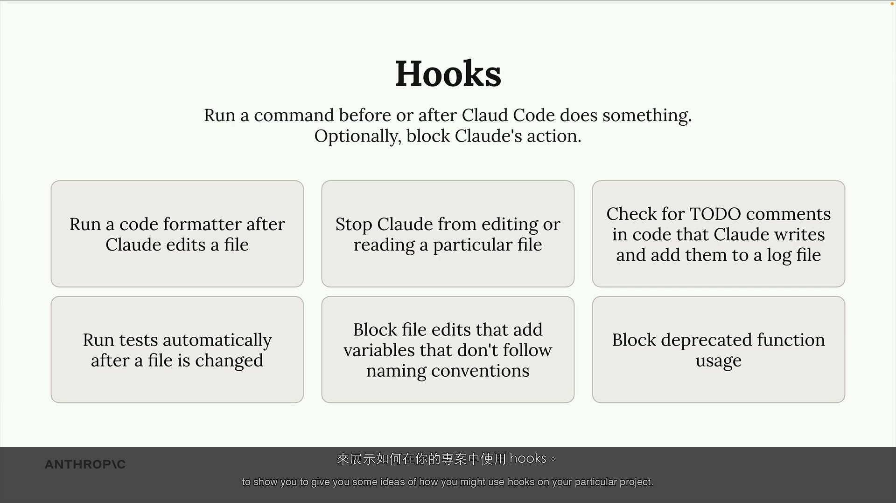

> **EN:** to show you to give you some ideas of how you might use hooks on your particular project.
>
> **ZH:** 來展示如何在你的專案中使用 hooks。

---

### [00:00:34] 第 10 段

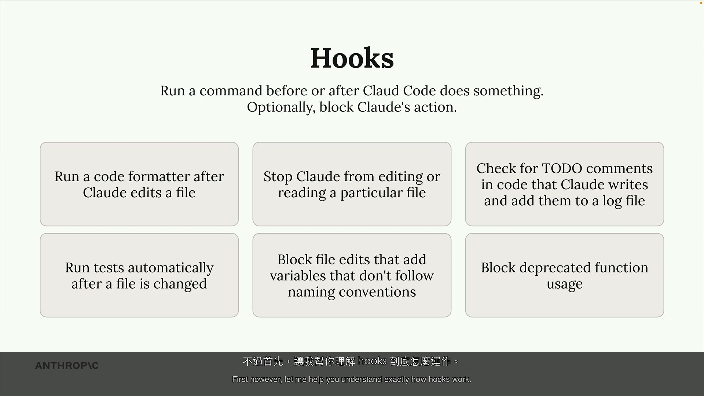

> **EN:** First however, let me help you understand exactly how hooks work.
>
> **ZH:** 不過首先，讓我幫你理解 hooks 到底怎麼運作。

---

### [00:00:38] 第 11 段

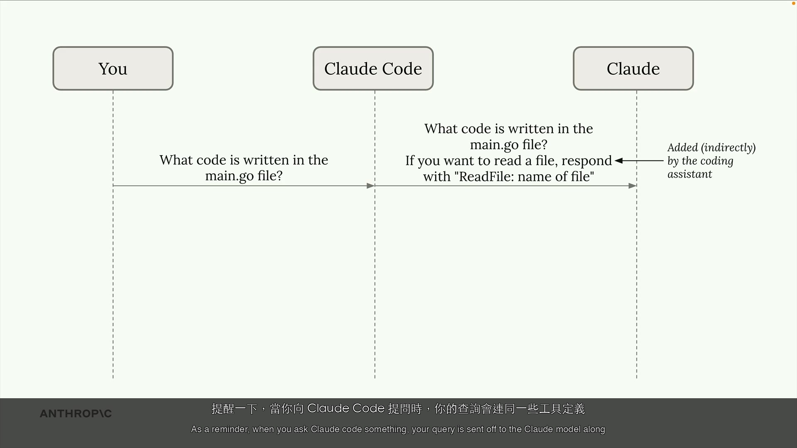

> **EN:** As a reminder, when you ask Claude code something, your query is sent off to the Claude model along
>
> **ZH:** 提醒一下，當你向 Claude Code 提問時，你的查詢會連同一些工具定義

---

### [00:00:42] 第 12 段

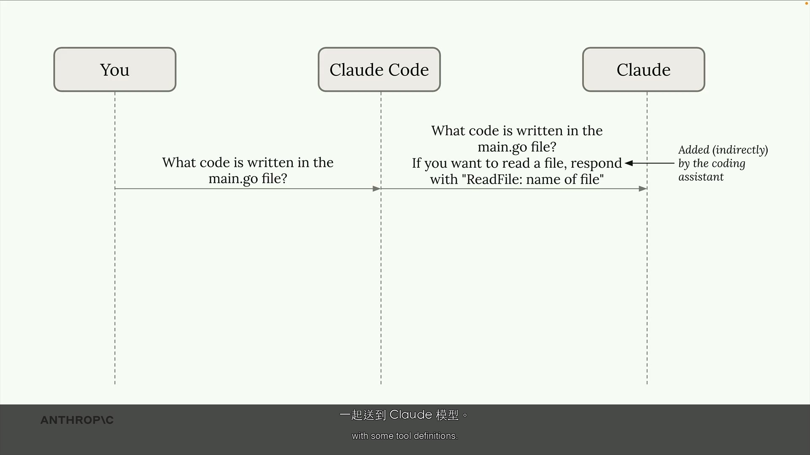

> **EN:** with some tool definitions.
>
> **ZH:** 一起送到 Claude 模型。

---

### [00:00:44] 第 13 段

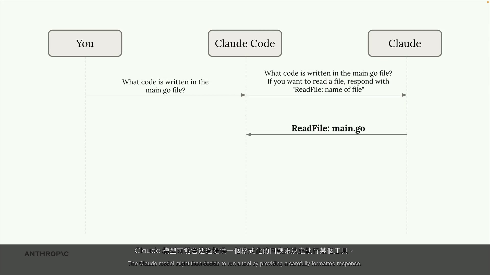

> **EN:** The Claude model might then decide to run a tool by providing a carefully formatted response.
>
> **ZH:** Claude 模型可能會透過提供一個格式化的回應來決定執行某個工具。

---

### [00:00:49] 第 14 段

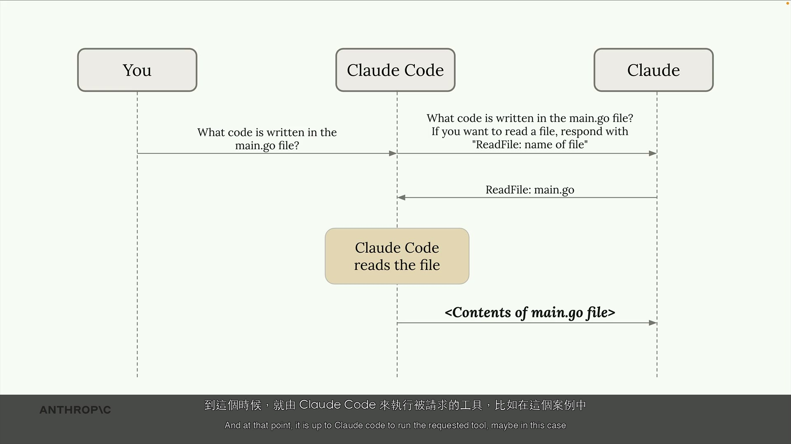

> **EN:** And at that point, it is up to Claude code to run the requested tool, maybe in this case
>
> **ZH:** 到這個時候，就由 Claude Code 來執行被請求的工具，比如在這個案例中

---

### [00:00:54] 第 15 段

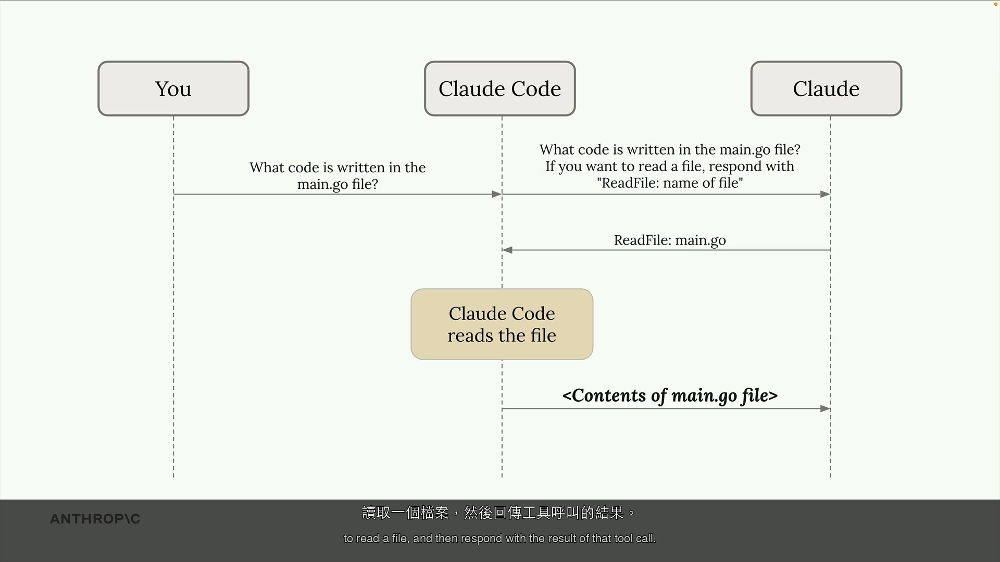

> **EN:** to read a file, and then respond with the result of that tool call.
>
> **ZH:** 讀取一個檔案，然後回傳工具呼叫的結果。

---

### [00:00:58] 第 16 段

> **EN:** Now hooks give us the ability to execute code just before or just after the tool execution.
>
> **ZH:** 現在 hooks 讓我們有能力在工具執行之前或之後執行程式碼。

---

### [00:01:06] 第 17 段

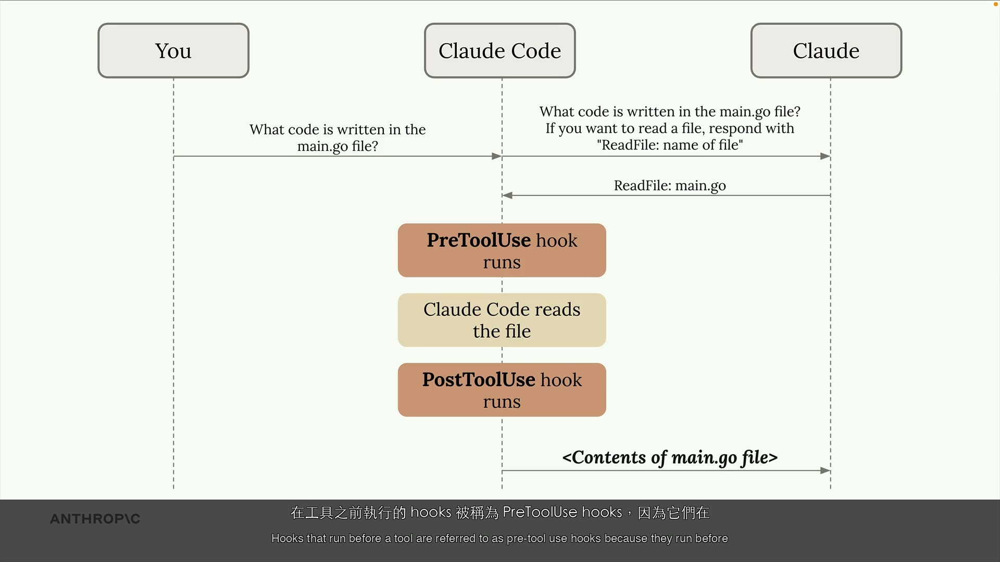

> **EN:** Hooks that run before a tool are referred to as pre-tool use hooks because they run before
>
> **ZH:** 在工具之前執行的 hooks 被稱為 PreToolUse hooks，因為它們在

---

### [00:01:11] 第 18 段

> **EN:** the tool.
>
> **ZH:** 工具之前執行。

---

### [00:01:12] 第 19 段

> **EN:** And hooks that run after the tool are referred to as post-tool use for the same reason.
>
> **ZH:** 在工具之後執行的 hooks 被稱為 PostToolUse，原因相同。

---

### [00:01:17] 第 20 段

> **EN:** To define hooks, we add configuration to the Claude settings file.
>
> **ZH:** 要定義 hooks，我們在 Claude 設定檔中加入設定。

---

### [00:01:21] 第 21 段

> **EN:** Remember that there are several different settings files.
>
> **ZH:** 記住有幾個不同的設定檔。

---

### [00:01:23] 第 22 段

> **EN:** One for global use across all projects on your machine.
>
> **ZH:** 一個是你機器上所有專案的全域設定。

---

### [00:01:26] 第 23 段

> **EN:** One for your particular project that gets shared with other engineers and one for just you on
>
> **ZH:** 一個是你特定專案的設定，會與其他工程師共用；另一個是只屬於你的

---

### [00:01:31] 第 24 段

> **EN:** a particular project.
>
> **ZH:** 特定專案設定。

---

### [00:01:33] 第 25 段

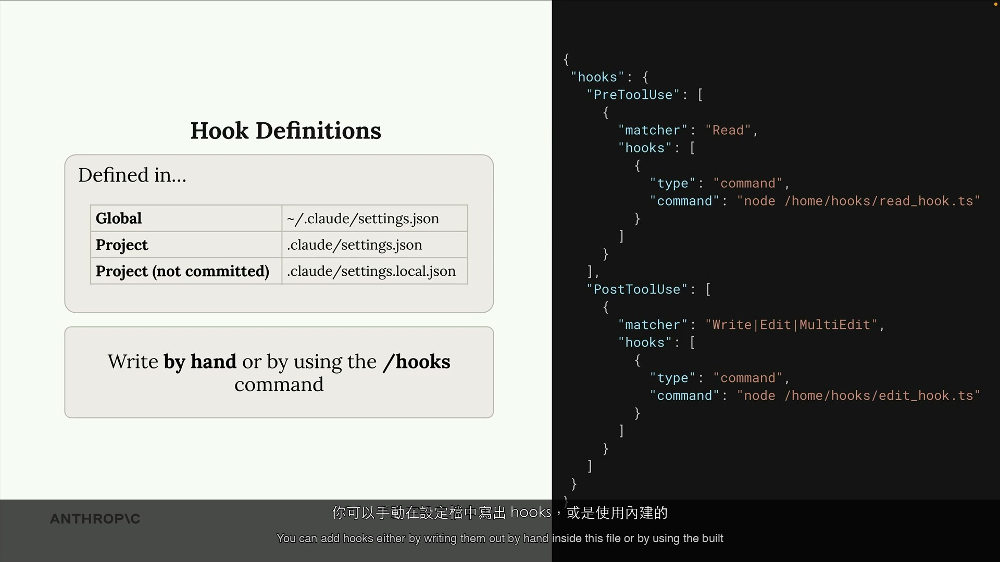

> **EN:** You can add hooks either by writing them out by hand inside this file or by using the built
>
> **ZH:** 你可以手動在設定檔中寫出 hooks，或是使用內建的

---

### [00:01:38] 第 26 段

> **EN:** in slash hooks command inside of Claude code itself.
>
> **ZH:** Claude Code 的 /hooks 指令。

---

### [00:01:41] 第 27 段

> **EN:** The configuration itself looks like what you see on the right hand side of the screen.
>
> **ZH:** 設定本身看起來就像你在螢幕右側看到的樣子。

---

### [00:01:45] 第 28 段

> **EN:** Let me walk you through this example file just to give you a better idea of what's going on.
>
> **ZH:** 讓我帶你看看這個範例檔案，讓你更了解是怎麼回事。

---

### [00:01:50] 第 29 段

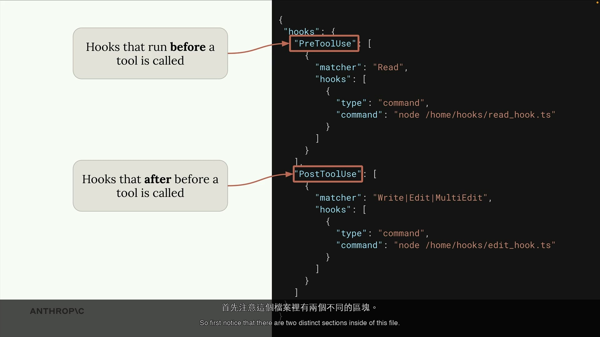

> **EN:** So first notice that there are two distinct sections inside of this file.
>
> **ZH:** 首先注意這個檔案裡有兩個不同的區塊。

---

### [00:01:54] 第 30 段

> **EN:** One section lists out all the commands that should be executed before a tool use.
>
> **ZH:** 一個區塊列出了所有在工具使用之前應該執行的命令。

---

### [00:01:59] 第 31 段

> **EN:** Remember those are referred to as pre-tool use hooks.
>
> **ZH:** 記住那些被稱為 PreToolUse hooks。

---

### [00:02:02] 第 32 段

> **EN:** The other section lists out all the different commands that should be executed after a tool
>
> **ZH:** 另一個區塊列出了所有在工具使用之後應該執行的

---

### [00:02:06] 第 33 段

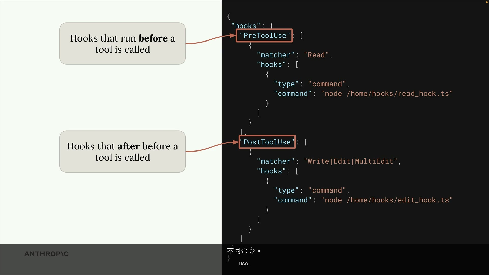

> **EN:** use.
>
> **ZH:** 不同命令。

---

### [00:02:07] 第 34 段

> **EN:** And again, those are post-tool use hooks.
>
> **ZH:** 同樣的，那些是 PostToolUse hooks。

---

### [00:02:10] 第 35 段

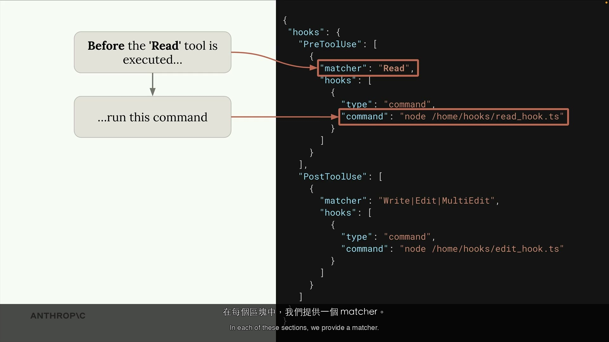

> **EN:** In each of these sections, we provide a matcher.
>
> **ZH:** 在每個區塊中，我們提供一個 matcher。

---

### [00:02:13] 第 36 段

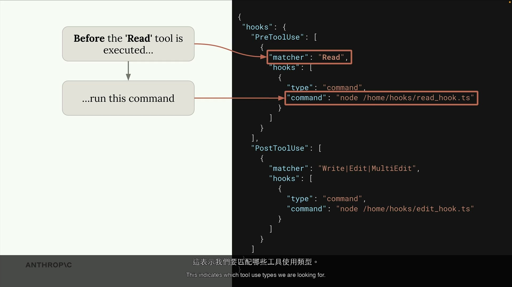

> **EN:** This indicates which tool use types we are looking for.
>
> **ZH:** 這表示我們要匹配哪些工具使用類型。

---

### [00:02:16] 第 37 段

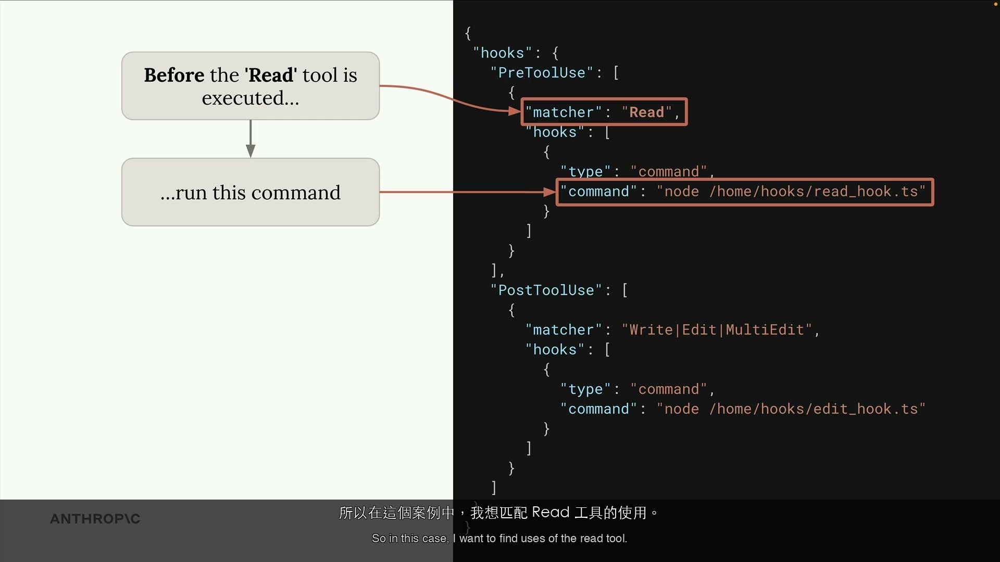

> **EN:** So in this case, I want to find uses of the read tool.
>
> **ZH:** 所以在這個案例中，我想匹配 Read 工具的使用。

---

### [00:02:20] 第 38 段

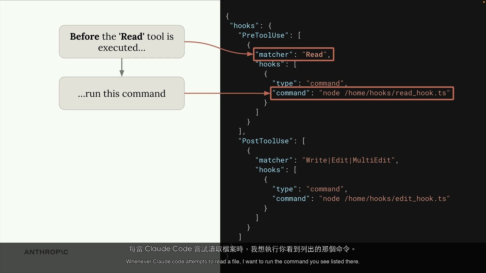

> **EN:** Whenever Claude code attempts to read a file, I want to run the command you see listed there.
>
> **ZH:** 每當 Claude Code 嘗試讀取檔案時，我想執行你看到列出的那個命令。

---

### [00:02:26] 第 39 段

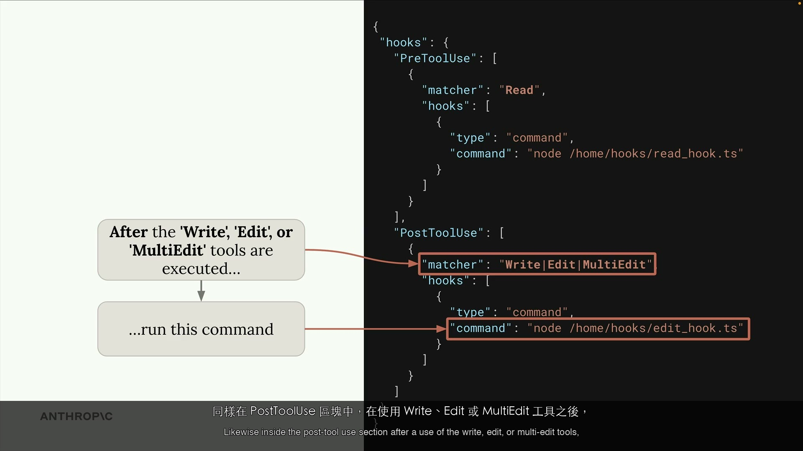

> **EN:** Likewise inside the post-tool use section after a use of the write, edit, or multi-edit tools,
>
> **ZH:** 同樣在 PostToolUse 區塊中，在使用 Write、Edit 或 MultiEdit 工具之後，

---

### [00:02:33] 第 40 段

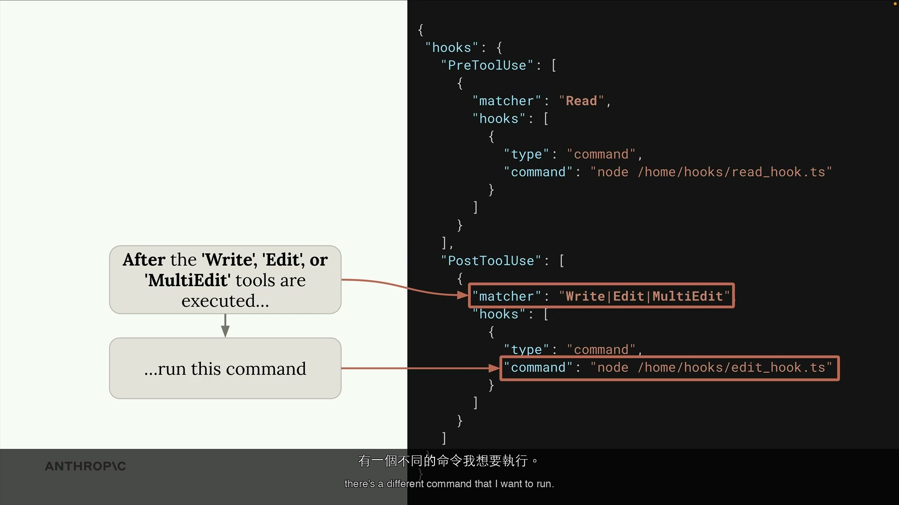

> **EN:** there's a different command that I want to run.
>
> **ZH:** 有一個不同的命令我想要執行。

---

### [00:02:35] 第 41 段

> **EN:** Now here's the important part.
>
> **ZH:** 現在重點來了。

---

### [00:02:37] 第 42 段

> **EN:** Here's what hooks are really intended to do.
>
> **ZH:** 這就是 hooks 真正的用途。

---

### [00:02:39] 第 43 段

> **EN:** Those commands you saw will be given details about the tool call that Claude wants to run.
>
> **ZH:** 你看到的那些命令會收到 Claude 想要執行的工具呼叫的詳細資訊。

---

### [00:02:44] 第 44 段

> **EN:** In the case of a pre-tool use hook, you can inspect what Claude wants to do.
>
> **ZH:** 在 PreToolUse hook 的情況下，你可以檢查 Claude 想做什麼。

---

### [00:02:49] 第 45 段

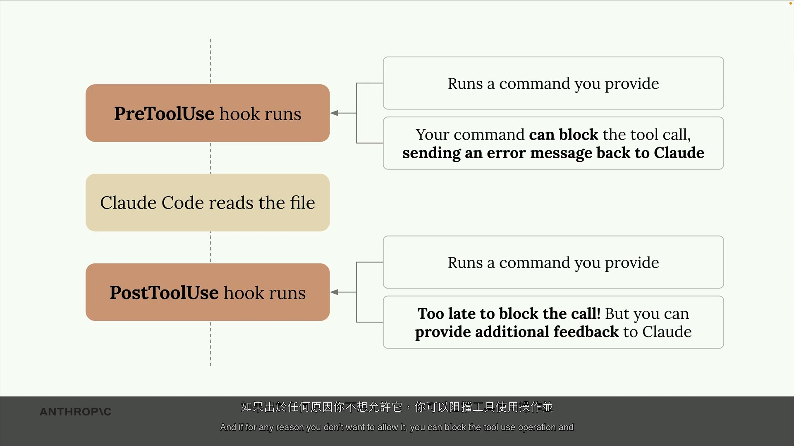

> **EN:** And if for any reason you don't want to allow it, you can block the tool use operation and
>
> **ZH:** 如果出於任何原因你不想允許它，你可以阻擋工具使用操作並

---

### [00:02:53] 第 46 段

> **EN:** send an error message back to Claude.
>
> **ZH:** 把錯誤訊息送回給 Claude。

---

### [00:02:56] 第 47 段

> **EN:** In the case of a post-tool use hook, the tool call has already occurred, so it's too late
>
> **ZH:** 在 PostToolUse hook 的情況下，工具呼叫已經發生了，所以阻擋

---

### [00:03:00] 第 48 段

> **EN:** to block it.
>
> **ZH:** 已經太遲了。

---

### [00:03:01] 第 49 段

> **EN:** So you can do some follow-up operation based upon the tool call, like maybe format a file
>
> **ZH:** 所以你可以基於工具呼叫做一些後續操作，比如格式化一個

---

### [00:03:06] 第 50 段

> **EN:** that was just edited.
>
> **ZH:** 剛被編輯的檔案。

---

### [00:03:07] 第 51 段

> **EN:** You can also provide some message back to Claude about that tool use.
>
> **ZH:** 你也可以向 Claude 回傳一些關於該工具使用的訊息。

---

### [00:03:11] 第 52 段

> **EN:** For example, you might decide to run a separate program to check the code quality of the edit,
>
> **ZH:** 例如，你可能決定執行一個獨立的程式來檢查編輯的程式碼品質，

---

### [00:03:16] 第 53 段

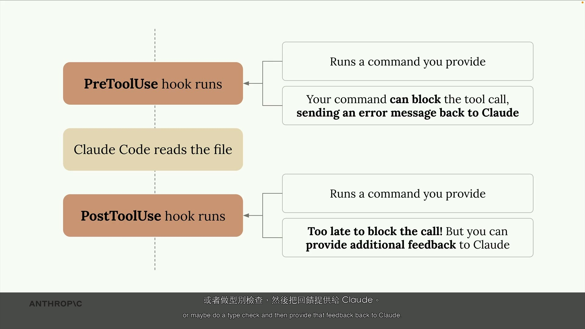

> **EN:** or maybe do a type check and then provide that feedback back to Claude.
>
> **ZH:** 或者做型別檢查，然後把回饋提供給 Claude。

---

### [00:03:21] 第 54 段

> **EN:** Claude might then take that feedback and make an update to the file that it just wrote to.
>
> **ZH:** Claude 可能會根據回饋去更新它剛寫入的檔案。

---

### [00:03:26] 第 55 段

> **EN:** If you're still confused about hooks or what they are intended to do, that is absolutely
>
> **ZH:** 如果你仍然對 hooks 或它們的用途感到困惑，那完全

---

### [00:03:30] 第 56 段

> **EN:** okay.
>
> **ZH:** 沒問題。

---

### [00:03:31] 第 57 段

> **EN:** Wrapping your head around hooks can be really challenging.
>
> **ZH:** 理解 hooks 確實可能很有挑戰性。

---

### [00:03:33] 第 58 段

> **EN:** So let's come back in a moment and work on a sample project with hooks.
>
> **ZH:** 所以讓我們等一下回來，用一個範例專案來練習 hooks。

---
