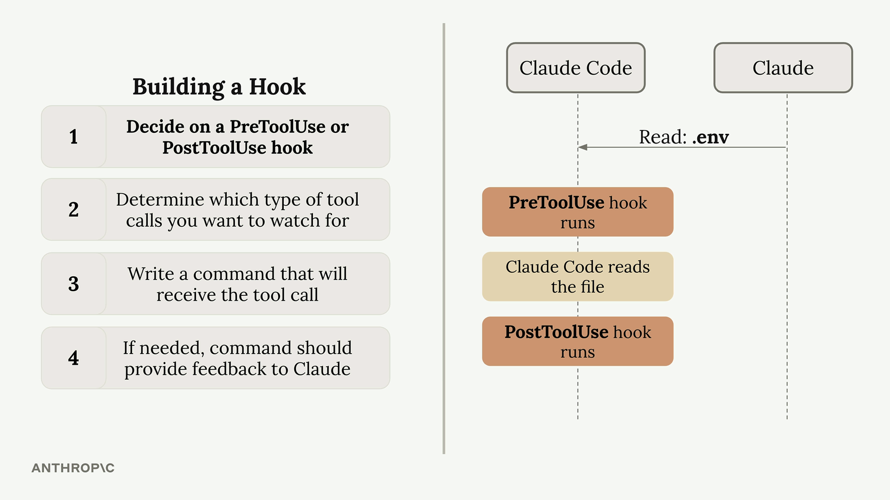
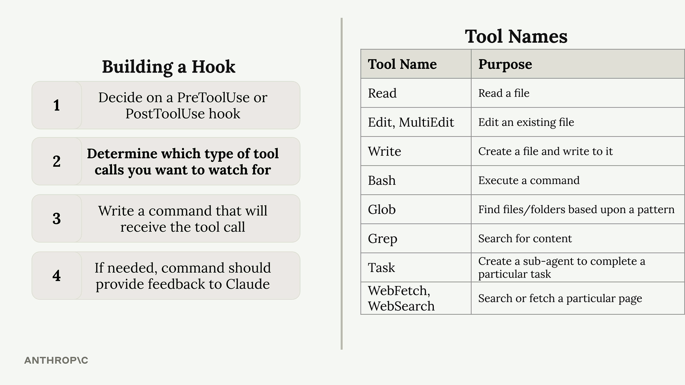
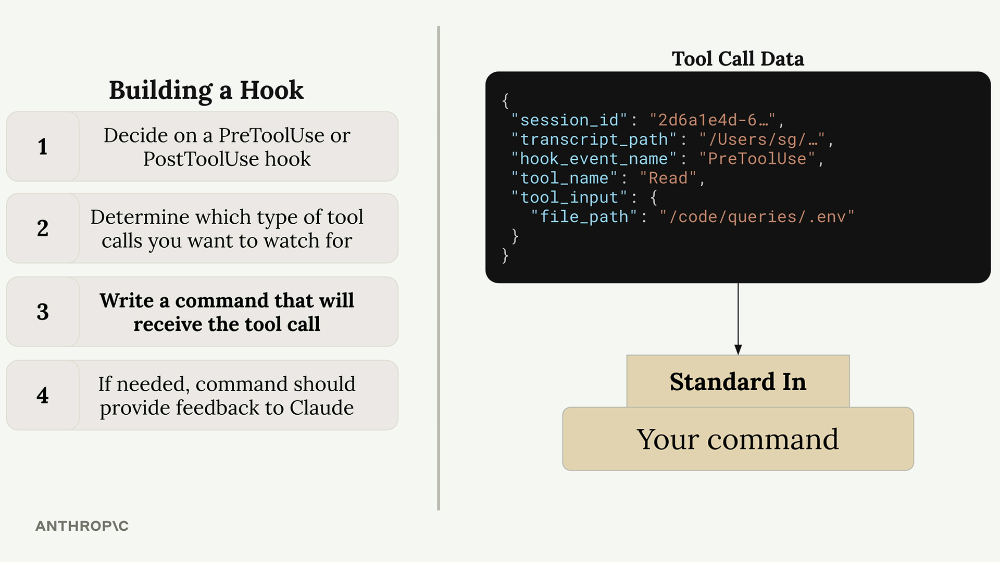
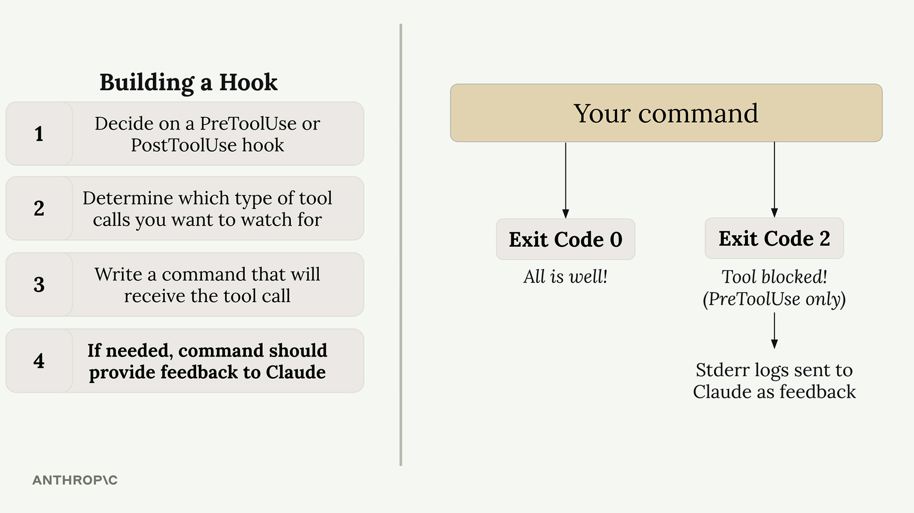

# Defining hooks

> Source: https://anthropic.skilljar.com/claude-code-in-action/312002

#### Summary


                            
                                

Hooks in Claude Code allow you to intercept and control tool calls before or after they execute. This gives you fine-grained control over what Claude can and cannot do in your development environment.


## Building a Hook


Creating a hook involves four main steps:





1. **Decide on a PreToolUse or PostToolUse hook** - PreToolUse hooks can prevent tool calls from executing, while PostToolUse hooks run after the tool has already been used

1. **Determine which type of tool calls you want to watch for** - You need to specify exactly which tools should trigger your hook

1. **Write a command that will receive the tool call** - This command gets JSON data about the proposed tool call via standard input

1. **If needed, command should provide feedback to Claude** - Your command's exit code tells Claude whether to allow or block the operation


## Available Tools


Claude Code provides several built-in tools that you can monitor with hooks:





To see exactly which tools are available in your current setup, you can ask Claude directly for a list. This is especially useful since the available tools can change when you add custom MCP servers.


## Tool Call Data Structure


When your hook command executes, Claude sends JSON data through standard input containing details about the proposed tool call:





```
{
  "session_id": "2d6a1e4d-6...",
  "transcript_path": "/Users/sg/...",
  "hook_event_name": "PreToolUse",
  "tool_name": "Read",
  "tool_input": {
    "file_path": "/code/queries/.env"
  }
}
```


Your command reads this JSON from standard input, parses it, and then decides whether to allow or block the operation based on the tool name and input parameters.


## Exit Codes and Control Flow


Your hook command communicates back to Claude through exit codes:





- **Exit Code 0** - Everything is fine, allow the tool call to proceed

- **Exit Code 2** - Block the tool call (PreToolUse hooks only)


When you exit with code 2 in a PreToolUse hook, any error messages you write to standard error will be sent to Claude as feedback, explaining why the operation was blocked.


## Example Use Case


A common use case is preventing Claude from reading sensitive files like `.env` files. Since both the `Read` and `Grep` tools can access file contents, you'd want to monitor both tool types and check if they're trying to access restricted file paths.


This approach gives you complete control over Claude's file system access while providing clear feedback about why certain operations are restricted.


                            
                        
                    

                    
                        
                            

#### Downloads


                            


                                
                                    
                                        - [**queries.zip](https://cc.sj-cdn.net/instructor/4hdejjwplbrm-anthropic/assets/1773097175/queries.zip?response-content-disposition=attachment&Expires=1774881780&Signature=P8U4Qw6ah5RQfxhS4-1w~pwvLmDnK~x75H-E3acxWIPIYKdAh~8-QdtYLV2ew0oeDcpwx6Gl07wRoQuSzHVKBwdotfCxPYk~jzeGo0-3UrgjAbBx3BGpr1ZdztJ1cTLqK57hEcz3pYcosX44L1YpzYfTT-aZd81OyMQCiPQBLK6FHu0YNyQ7lotr~XEwbKuEYrCfNsXoOlDBhKnnG9Bo8DGqfxQ1w-O7jt2f8qJKbEYU-49HR1waqFaXQsg7SWaflCwXmvmbxd-BEiD7jnEtKYzeP-gxgAPKtVnhbEFE8xpglUGKu1XVebLRyHMMJQzBUC3JOoqjzKLp2MuYSW~uqA__&Key-Pair-Id=APKAI3B7HFD2VYJQK4MQ)

                                    
                                
                                    
                                        - [**queries_COMPLETED.zip](https://cc.sj-cdn.net/instructor/4hdejjwplbrm-anthropic/assets/1773097185/queries_COMPLETED.zip?response-content-disposition=attachment&Expires=1774881780&Signature=Iy8h4Yy4Botpc-Upj5ONCU-vlFADSgF6aL3E-AZLhX2ux77FLphUqwV~Pxw7aWCkWcD-arcm4Lqxpq4G51U-vMMQMql9W7juF4U21e1SLAfeLyACgsLYxL2eG39XlXQEFtS0ID5rK2cSHJJfQmsKurGBVs~-IAtQdXMTiBRVhj3iGxl0dnsXYZ3iJLyRZ4GlfOsFOxG-yJ5lEhOD~HMULA1bYymI-dpoaq5SqJyVGzGgyT92Bc2SNOgqEe-LjD8tXx2lLF3c-pNHlaH5Hp22oIa-B5ZM4Hwm9vjW7AhmChWRJjcGSfhI4HCj2fkaO-AovIYDKoPu8yp8SdOvWDr5CQ__&Key-Pair-Id=APKAI3B7HFD2VYJQK4MQ)