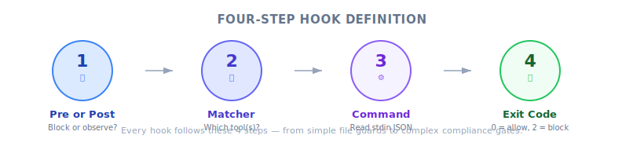
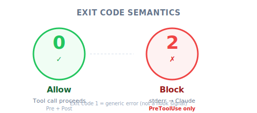

# Defining Hooks — Engineering Deep Dive

| Item | Detail |
|------|--------|
| Exam Domain | D3 — Claude Code Configuration & Workflows (20%) |
| Task Statements | 3.2 (custom commands & hooks), 1.5 (Agent SDK hooks for tool call interception) |
| Source | claude-code-in-action / 05-hooks / Lesson 15 |

---

## One-Liner

Defining a hook is a four-step process: choose PreToolUse or PostToolUse, select the tool(s) to intercept via a `matcher`, write a command that reads tool call JSON from stdin, and return an exit code (0 = allow, 2 = block).

---

## Context: Where This Fits

In the previous lesson you learned *what* hooks are. This lesson focuses on *how to define one* — the four-step mental model that applies whether you are building a simple file guard or a complex compliance gate.

> 💡 **iOS/Swift analogy**
>
> Defining a hook is like registering a `URLProtocol` subclass: you declare *which* requests to intercept (`canInit(with:)`), write the handling logic, and return a result. The system calls you automatically at the right moment.

---



*Figure: The four-step process for defining a hook — Event → Matcher → Command → Exit Code.*

## The Four-Step Hook Definition Process

### Step 1 — Choose Pre or Post

| Decision | PreToolUse | PostToolUse |
|----------|-----------|-------------|
| When does it run? | **Before** tool execution | **After** tool execution |
| Can it block? | Yes (exit code 2) | No (already happened) |
| Analogy | `URLProtocol.canInit(with:)` — reject before loading | `URLSessionTaskDelegate.didFinishCollecting` — inspect after completion |

> ⚠️ **Critical decision point**
>
> If your goal is to **prevent** an action, you **must** use PreToolUse. A PostToolUse hook cannot undo what already happened — the tool has already executed.

### Step 2 — Select Tools to Watch (Matcher)

The `matcher` field uses regex-like syntax to specify which tools trigger the hook:

```json
"matcher": "Read"          // single tool
"matcher": "Read|Grep"     // multiple tools (OR)
"matcher": ".*"            // all tools (wildcard)
```

Built-in tools you can match against:

| Tool | Purpose |
|------|---------|
| `Read` | Read file contents |
| `Write` | Create or overwrite files |
| `Edit` | Modify existing files |
| `MultiEdit` | Multiple edits in one call |
| `Bash` | Execute shell commands |
| `Grep` | Search file contents |
| `Glob` | Find files by pattern |
| `WebFetch` | Fetch URL content |

> 💡 **Discovering available tools**
>
> Ask Claude directly: "List all tool names you have access to." This is especially useful when MCP servers add custom tools beyond the built-ins.

### Step 3 — Write the Command (stdin JSON)

Your hook command receives a JSON object on standard input:

```json
{
  "session_id": "2d6a1e4d-6...",
  "transcript_path": "/Users/sg/...",
  "hook_event_name": "PreToolUse",
  "tool_name": "Read",
  "tool_input": {
    "file_path": "/code/queries/.env"
  }
}
```

Key fields your command should inspect:

| Field | Purpose |
|-------|---------|
| `tool_name` | Which tool Claude is calling |
| `tool_input` | The arguments Claude passed (file paths, commands, etc.) |
| `hook_event_name` | Confirms whether this is PreToolUse or PostToolUse |
| `session_id` | Identifies the current session (useful for logging) |

> 📝 **Implementation note**
>
> Your command can be anything executable: a Node.js script, a shell script, a Python script, or even a compiled binary. Claude does not care about the language — only the exit code matters.



*Figure: Exit code semantics — 0 means allow (tool proceeds), 2 means block (stderr fed back to Claude).*

### Step 4 — Return an Exit Code

| Exit Code | Meaning | Applies To |
|-----------|---------|-----------|
| `0` | Allow — tool call proceeds | PreToolUse and PostToolUse |
| `2` | Block — tool call is denied | **PreToolUse only** |

When exiting with code 2:
- Any text written to **stderr** is sent to Claude as feedback
- Claude sees the rejection reason and can adjust its behavior
- This creates a feedback loop: block + explain → Claude tries a different approach

> ⚠️ **Exit code 2 is PreToolUse-only**
>
> Using exit code 2 in a PostToolUse hook has no blocking effect — the tool has already executed. The exit code is ignored for blocking purposes in PostToolUse.

---

## Complete Configuration Example

```json
{
  "hooks": {
    "PreToolUse": [
      {
        "matcher": "Read|Grep",
        "hooks": [
          {
            "type": "command",
            "command": "node ./hooks/read_hook.js"
          }
        ]
      }
    ]
  }
}
```

This configuration says: "Before Claude calls Read or Grep, run `read_hook.js`. The script reads the tool call JSON from stdin, decides whether to allow or block, and exits with 0 or 2."

---

## Anti-Patterns (Exam Frequently Tested)

| ❌ Wrong Approach | ✅ Correct Approach | Why |
|-------------------|---------------------|-----|
| Use PostToolUse to "prevent" file reads | Use PreToolUse to block before execution | PostToolUse cannot undo a completed read |
| Add "never read .env" to system prompt | Use PreToolUse hook on Read\|Grep | Prompt instructions have non-zero failure rate |
| Match only `Read` when guarding file access | Match `Read\|Grep` (both can access file contents) | Grep can also expose file contents |
| Hardcode file paths in the matcher | Use matcher for tool selection, check paths in the command logic | Matcher selects tools, not file paths |
| Forget to handle stderr on exit code 2 | Write clear rejection reason to stderr | Claude needs feedback to understand why the operation was blocked |

---

## Exam Focus: The Four Steps as a Decision Framework

On the CCA exam, hook definition questions typically test whether you can:

1. **Choose the right hook type** — "prevent" / "must not" → PreToolUse; "after" / "transform" / "log" → PostToolUse
2. **Select the correct matcher** — know which built-in tools expose which capabilities
3. **Understand stdin data flow** — the command receives JSON, not command-line arguments
4. **Apply exit codes correctly** — 0 = allow, 2 = block (PreToolUse only)

Core exam philosophies at play:
- **Architecture > Prompt** — hooks are structural enforcement, not suggestions
- **Deterministic > Probabilistic** — exit code 2 is a guaranteed block, not a "please don't"

---

## Practice Questions

### Q1: Developer Productivity Scenario (S4)

You are building a Claude Code workflow for a team that handles sensitive customer data. The `.env` file contains API keys and database credentials. You need to ensure Claude can **never** access its contents through any tool. Which hook configuration is correct?

- A. PostToolUse hook with matcher `Read`, checking for `.env` in the file path
- B. PreToolUse hook with matcher `Read`, checking for `.env` in the file path
- C. PreToolUse hook with matcher `Read|Grep`, checking for `.env` in the file path
- D. Add "Never read .env files" to CLAUDE.md

<details><summary>Answer</summary>

**C** — PreToolUse is required to block before execution. Both `Read` and `Grep` can access file contents, so the matcher must cover both. Checking for `.env` happens inside the command logic, not the matcher.

- A uses PostToolUse — too late, file already read
- B misses `Grep` — Claude could still search `.env` contents via grep
- D is prompt-based with non-zero failure rate

> Exam philosophies: **Deterministic > Probabilistic**, **Architecture > Prompt**
</details>

### Q2: CI/CD Integration Scenario (S5)

Your CI pipeline uses Claude Code to generate documentation. You want to log every Bash command Claude executes for audit purposes, without blocking any operations. Which hook definition is appropriate?

- A. PreToolUse hook with matcher `Bash`, exit code 0 after logging
- B. PostToolUse hook with matcher `Bash`, exit code 0 after logging
- C. PreToolUse hook with matcher `Bash`, exit code 2 after logging
- D. PostToolUse hook with matcher `.*`, exit code 2 after logging

<details><summary>Answer</summary>

**B** — Audit logging should happen after the command executes (PostToolUse) so you can also capture the result. Exit code 0 allows normal operation.

- A runs before execution — you cannot log the result of a command that has not run yet
- C blocks the operation, which defeats the purpose
- D matches all tools (unnecessary) and uses exit code 2 (blocks everything)
</details>

### Q3: Multi-Agent Research Scenario (S3)

A research agent uses multiple MCP tools to query different data sources. You need to normalize all date fields returned by these tools to ISO 8601 format. Which hook approach is correct?

- A. PreToolUse hook that transforms dates before the tool executes
- B. PostToolUse hook that normalizes dates after each tool returns
- C. Add date format instructions to each tool's description
- D. PreToolUse hook that blocks tools returning non-ISO dates

<details><summary>Answer</summary>

**B** — Data normalization must happen after the tool returns data (PostToolUse). The hook processes the raw output and normalizes date formats before Claude uses them.

- A runs before the tool executes — there is no data to normalize yet
- C is prompt-based and cannot guarantee format consistency
- D cannot know what format the tool will return before it executes

> Exam philosophy: **Architecture > Prompt**, **Deterministic > Probabilistic**
</details>
